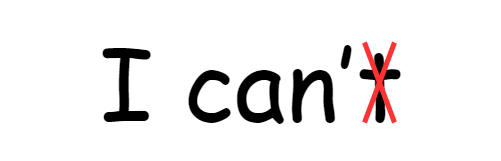
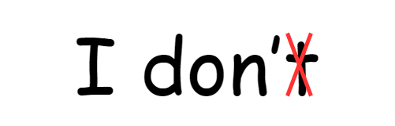
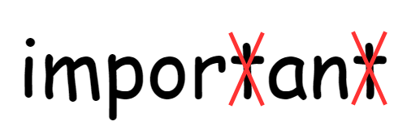
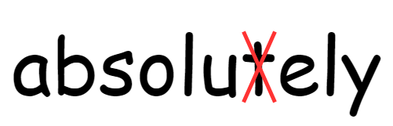

## 1 口语 t 的发音

### 1.1 n 的后面 t 省略

It's too hard. I can't do this.(kæn 第四声 表示我不能做)

I can do this. (k'n 第一声 表示我能做)

I don't kill bugs.

What school do I go to? 

Um -- the one named after that president.

Get me the president! (帮我转接总统)

Ladies and gentlemen!

### 1.2 t+元音+n t 省略

There's a half-eaten sandwich in the fridge.

Okay. Jingle number one, Written by P.J. And Emmett.

It's imoprtant business.

What's the important business?

### 1.3 t+ly t 省略

Heard any interesting phone messages lately?

From now on I'll always be completely honest with you.

You know exactly what I am talking about.

### 1.4 s+t 后面无元音 t 省略

just best last

### 1.5 n 后面的 d 省略

grandma grandpa end friend send

## 2 闪音

一般夹在元音中间，例如 t ，变快速的 d 音。（有种清辅音浊化的感觉

### 2.1 t->d water wader

I wish I could be the perfect daugh**t**er

Bu**t** I come back to the wa**t**er

no ma**tt**er how hard I try

### 2.2 k->g making maging

I remember when we broke up, the first time

### 2.3 p->b open oben

### 2.4 s + 以上 + 元音

sky speak student

## 3 H 的省略

he her 在中间的 h 直接省略

Does he have girlfriend?

where is he?

Do you like her, too?
