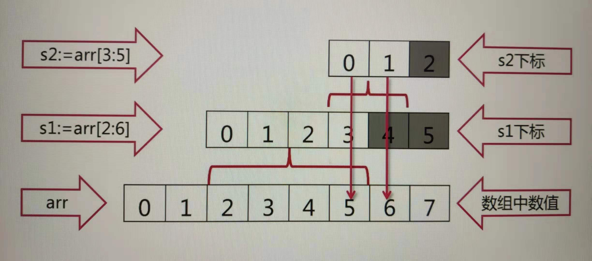
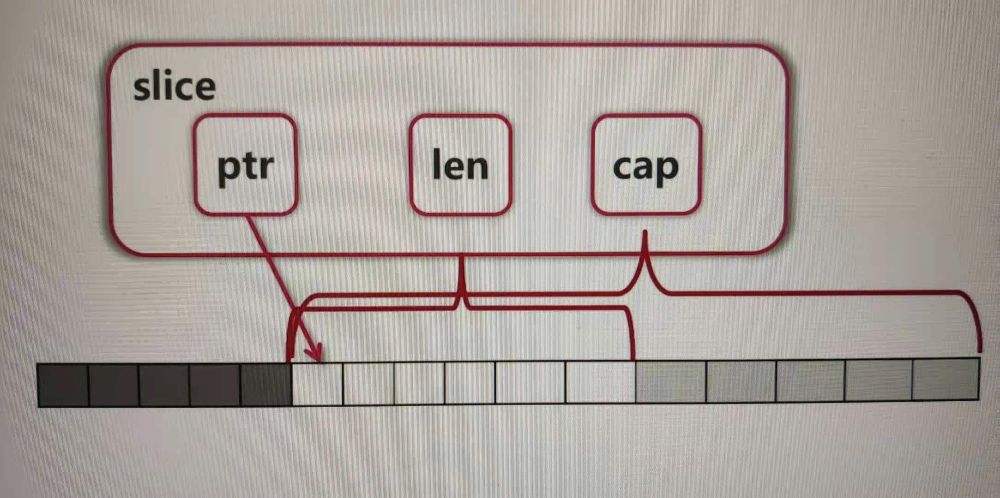

# 深度理解 Go 语言

## 环境配置

### Go 安装

- [go 语言中文网](https://studygolang.com/dl)
- [go 官网](https://golang.org/dl/)

### Go 代理配置

[goproxy.cn](https://github.com/goproxy/goproxy.cn/blob/master/README.zh-CN.md)

```bash
$ go env -w GO111MODULE=on
$ go env -w GOPROXY=https://goproxy.cn,direct

$ go env
# set GO111MODULE=on
# set GOPROXY=https://goproxy.cn,direct
```

### IDE

新建一个文件夹，使用 VSCode 打开（先在插件商城里面搜索 go 并安装），然后新建一个`hello.go`的文件，VSCode 会自动弹出一堆需要下载的，点击 install all。

```bash
$ go mod init kiyonami/learngo # 会生成 go.mod 文件

$ go run hello.go # 运行 hello.go
```

## 基础语法

### 变量定义

- 使用`var`关键字
  - `var a, b, c bool`
  - `var s1, s2 string = "hello", "world"`
  - 可放在函数内，或直接放在包内
  - **使用`var()`集中定义变量**
  - **定义的变量必须被使用，否则飘红**
- 让编译器自动决定类型
  - `var a, b, c, d = 1, "2", true, "false"`
- 使用`:=`定义变量，简化定义
  - `a, b, c, d := 1, "2", true, "false"`
  - **只能在函数内使用**（不能在包内定义）

```go
package main

import "fmt"

var aa = 3 // 不能使用 aa := 3；这不是全局变量，是包内变量

var ( // 可以括号少写 var
	bb = 3
	cc = "str"
	dd = true
)

func variableZeroValue() {
	var a int                   // int 默认值是 0
	var s string                // string 默认值是空串
	fmt.Printf("%d %q\n", a, s) // %s 空串不明显；quotation 带引号
}

func variableInitialValue() {
	var a, b int = 3, 4 // 可以一次性定义多个变量
	var s string = "abc"
	fmt.Println(a, b, s) // 在 go 中，定义的变量必须被使用，否则就会飘红
}

func variableTypeDeduction() {
	var a, b, c, s = 3, 4, true, "def" // 可以自动推断类型
	fmt.Println(a, b, c, s)
}

func variableShorter() {
	a, b, c, s := 3, 4, true, "def" // 定义变量可以更短——第一次定义的时候可以使用 : 替代 var；在函数外部只能使用 var！！！
	a = 5                           // 再次赋值不能使用 :
	fmt.Println(a, b, c, s)
}

func main() {
	variableZeroValue()
	variableInitialValue()
	variableShorter()

	fmt.Println(aa, bb, cc, dd)
}

```

### 内建变量类型

- bool, string
- (u)int, (u)int8, (u)int16, (u)int32, (u)int64, uintptr（指针）
- byte, rune（字符）
- float32, float64（有浮点误差）, complex64, complex128（复数）（`4i`连着写，go 就知道是虚部（imaginary part））

在 go 中，类型转换只有强制的，没有隐式的：

```go
func triangle() {
	var a, b int = 3, 4
	var c int
    // c = math.Sqrt(a*a + b*b) // 报错
    c = int(math.Sqrt(float64(a*a + b*b))) // 这里做了两次类型转换 int()、float64()
	fmt.Println(c)
}
```

### 常量与枚举

- `const filename = "abc.txt"`
- `const`**数值可以作为各种类型使用（即不需要变换）**
  - 举个例子，对比上面的强制类型转换
  - `const a, b = 3, 4`
  - `var c int = int(math.Sqrt(a*a + b*b))`
  - 可以看到`a*a + b*b`不需要强制类型转换就可以直接作为`float64`使用，而结果依旧需要`int()`做强制类型转换赋值给`var c`
- 使用`const`**作为枚举的关键字**

```go
func enums() {
	const (
		cpp        = 1
	 	java       = 2
		golang     = 3
		javascript = 4
	)
	// 1, 2, 3, 4

	fmt.Println(cpp, java, golang, javascript)
}
```

```go
func enums() {
	const (
		cpp = iota // 从 0 开始，自动 + 1
		_          // 可以跳一个
		java
		golang = 5
		javascript
	)
	// 0, 2, 5, 5

	fmt.Println(cpp, java, golang, javascript)
}
```

```go
func enums() {
    // 还可以更复杂使用公式
	const (
		b = 1 << (10 * iota)
		kb
		mb
		gb
		tb
		pb
	)
    // 1 1024 1048576 1073741824

	fmt.Println(b, kb, mb, gb, tb, pb)
}
```

### 条件语句

- `if`的**条件里可以赋值**，赋值的作用域在这个`if`语句中
- `switch`**会自动**`break`，除非使用`fallthrough`
- `switch`**后可以不接表达式**

```go
func main() {
	const filename = "abc.txt"
	if contents, err := ioutil.ReadFile(filename); err != nil {
		fmt.Println(err)
	} else {
		fmt.Printf("%s\n", contents)
	}
}
```

```go
func grade(score int) string {
	g := ""
	switch {
	case score < 0 || score > 100:
		panic(fmt.Sprintf("Wrong score: %d", score)) // panic 中断程序
	case score < 60:
		g = "F"
	case score < 80:
		g = "C"
	case score < 90:
		g = "B"
	case score <= 100:
		g = "A"
	}
	return g
}

func main() {
	fmt.Println(grade(82))
	fmt.Println(grade(101))
}
// B
// panic: Wrong score: 101

// goroutine 1 [running]:
// main.grade(0x65, 0xc0000cc008, 0xc0000c9f68)
//      D:/MyFiles/Code/learngo/branch.go:21 +0x10d
```

### 循环

- `for scanner.Scan() {}`省略初始条件，相当于`while`
- `for {}`无限循环（**go 中没有`while`关键字**）

```go
func convertToBin(n int) string {
    result := ""
    for ; n > 0; n /= 2 {
        lsb := n % 2
        result = strconv.Itoa(lsb) + result
	}
    return result
}

```

```go
scanner := bufio.NewScanner(file)

// 没有初始条件，没有递增条件，只有结束条件
// 相当于 while(...) {}
for scanner.Scan() {
    fmt.Println(scanner.Text())
}
```

```go
// 死循环
// 相当于 while(true) {}
for {
    fmt.Println("abc")
}
```

### 函数

- 返回值类型写在最后面
- 可返回多个值（可以起名字）
- 函数可以作为参数
- 没有默认参数（函数重载）
- 可变参数列表

```go
package main

import "fmt"

// 13 / 3 = 4 ... 1
// 函数可以返回多个值
// 相同类型可以只写一个类型定义
// 返回值可以使用变量，显而易见返回值的含义，并且可以配合编辑器的快捷键自动生成变量
func div(a, b int) (q, r int) {
	return a / b, a % b
}

func eval(a, b int, op string) (int, error) {
	switch op {
	case "+":
		return a + b, nil
	case "-":
		return a - b, nil
	case "*":
		return a * b, nil
	case "/":
		q, _ := div(a, b) // 可以使用下划线，表示不需要第二个值
		return q, nil
	default:
		return 0, fmt.Errorf("unsupported operation: %s", op)
	}
}

func main() {
	if result, err := eval(13, 3, "i"); err != nil {
		fmt.Println(err)
	} else {
		fmt.Println(result)
	}
}

```

```go
// 函数可以作为参数传入
func apply(op func(int, int) int, a, b int) int {
    return op(a, b)
}

apply(func(a int, b int) int { // 匿名函数
    return int(math.Pow(float64(a), float64(b)))
}, 3, 4)
// 81
```

```go
// 可变参数列表
func sum(numbers ...int) int {
    s := 0
    for i := range numbers {
        s += numbers[i]
    }
    return s
}
```

### 指针

- 指针不能做运算（比如 +1，取下一个地址）
- Go 只有**值传递**一种方式传递参数（都要拷贝一份到）（没有引用传递）

```go
var a int = 2
var pa *int = &a
*pa = 3
fmt.Println(a)
// 3
```

```go
func swap(a, b *int) {
    *b, *a = *a, *b
}

// swap(a, b) // 会报错
swap(&a, &b)
```

## 内建容器

### 数组

- `[10]int`和`[20]int`是不同类型
- 调用`func f(arr [10]int)`会**拷贝**数组（**只有值传递**）
- 在 go 语言中一般不直接使用数组（确定数字比较麻烦）

```go
var array1 [5]int
array2 := [3]int{1, 2, 3} // 使用 :=，就必须要要赋初值
array3 := [...]int{1, 2, 3, 4, 5} // 如果想让编译器自己感知数量，就需要 [...]
var grid [4][5]bool // 四行五列
```

```go
// 数组的遍历（range 是关键字）
sum := 0
for _, v := range numbers { // for i := range numbers {} i 取得是索引
    sum += v
}
```

### 切片（slice）

- slice 是一个“**视图**”（看数组的部分），更改 slice 部分，就会进而更改原数组
- slice 可以向后扩展，**不可能向前扩展**
  - s[i]（取数）不可以超越 len(s)，向后扩展不可以超越底层数组 cap(s)
- 添加元素（append）时**如果超越 cap**，系统会重新分配更大的底层数组
- 由于值传递的关系，必须接收`append`的返回值（`s := append(s, val)`）

```go
arr := [...]int{0, 1, 2, 3, 4, 5, 6, 7} // 新建数组

arr[2:6]
// [2, 3, 4, 5]
arr[:6]
// [0, 1, 2, 3, 4, 5]
arr[2:]
// [2, 3, 4, 5, 6, 7]
arr[:]
// [0, 1, 2, 3, 4, 5, 6, 7]

func updateArray(arr []int) { // 效果同 updateArray(arr *[6]int) 传参为 &arr
	arr[0] = 100
}

func main() {
	arr := [...]int{0, 1, 2, 3, 4, 5}
	updateArray(arr[:]) // 函数要求是一个 slice
	fmt.Println(arr) // [100, 0, 2, 3, 4, 5]
    
    // 还可以自己 reslice 自己
    s := arr[2:6]
    s = s[:3]
    s = s[1:]
}
```

```go
// slice 扩展
package main

import "fmt"

func main() {
	arr := [...]int{0, 1, 2, 3, 4, 5, 6, 7}
	s1 := arr[2:6] // 索引为 [0, 1, 2, 3, [4, 5]] = [2, 3, 4, 5, [6, 7]]
    s2 := s1[3:5]  // 索引为 [0, 1, [2]] = [5, 6, [7]]，按照 s1 的索引取值！
	fmt.Println(s1, s2)
}

// [] 中的虽然看不到，但是依旧存在
// 切片是看重头部去除！后半部分可以取到

// [2 3 4 5] [5 6]
// s1=[2 3 4 5], len(s1)=4, cap(s1)=6
```



**slice 底层原理**：ptr 为头指针，len 为可见长度，cap 是针对底层数组




### Map

### Map 立体

### 字符和字符串处理

