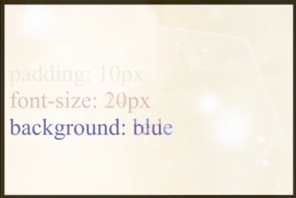
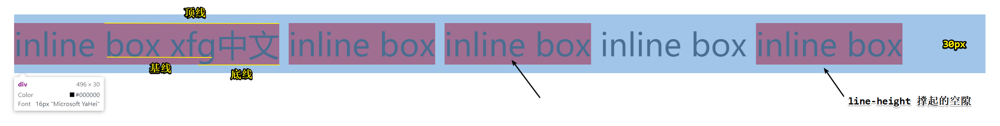
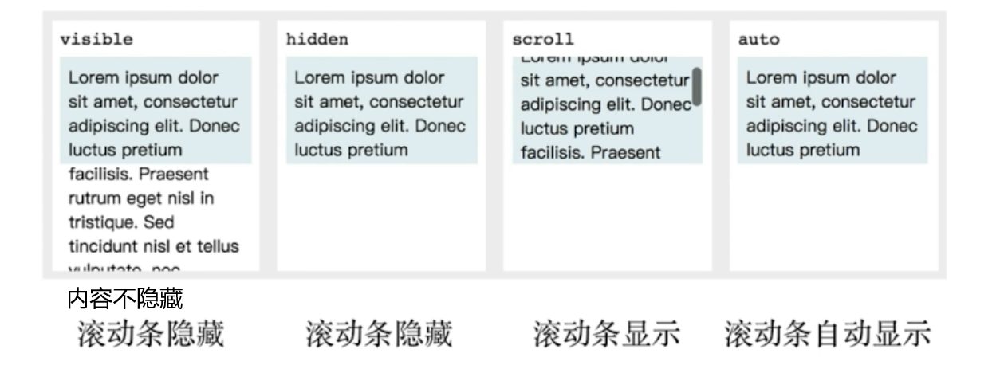
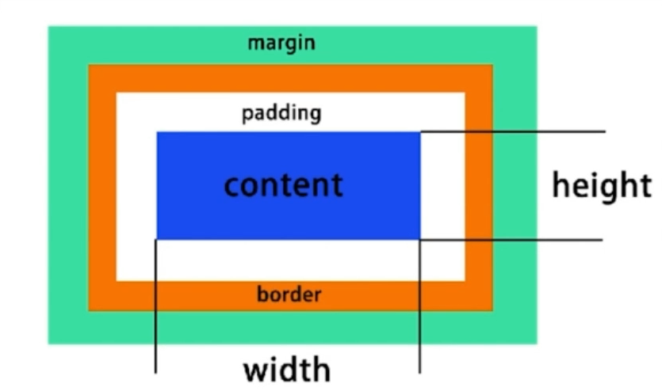

## 1 HTML 基础强化

### 1.1 HTML 元素分类

按默认样式分
- 块级 block
- 行内 inline
- inline-block

按内容分
- [W3C 元素分类](https://www.w3.org/TR/html5/dom.html#phrasing-content)

### 1.2 HTML 元素嵌套关系

查询 w3c 文档，以下为基本原则
- 块级元素可以包含行内元素
- 块级元素不一定能包含块级元素（例如 p 元素不能包含 div）
- "行内元素一般不能包含块级元素"（例如 a 元素可以包含 div）（a 的内容模型为 transparent 不参与嵌套计算）

### 1.3 HTML 面试真题

#### 1.3.1 doctype 的意义是什么

- 让浏览器以标准模式渲染
- 让浏览器知道元素的合法性

#### 1.3.2 HTML XHTML HTML5 的关系

- HTML 属于 SGML
- XHTML 属于 XML ，是 HTML 进行 XML 严格化的结果
- HTML5 不属于 SGML 或者 XML ，比 XHTML 宽松

#### 1.3.3 HTML5 有什么变化

- 新的语义化元素（例如 section footer header 还有像语义不强的 i b 就推荐使用了，推荐 em strong
- 表单增强（表单验证等
- 新的 API （离线、音视频、图形、实时通信、本地存储、设备能力
- 分类和嵌套变更

#### 1.3.4 em 和 i 有什么区别

- em 是语义化的标签，表强调
- i 是纯样式的标签，表斜体
- HTML5 中 i 不推荐使用，一般用作图标

#### 1.3.5 语义化的意义是什么

- 开发者容易理解
- 机器容易理解结构（搜索、读屏软件
- 有助于 SEO
- semantic microdata

#### 1.3.6 哪些元素可以自闭和

- 表单元素 input
- 图片 img
- br hr
- meta link

在 HTML5 中结尾是不需要加斜杠的，但是在 XHTML 是一定要加的。（最好加吧 也好看  

#### 1.3.7 HTMl 和 DOM 的关系

- HTML 是“死”的（我们只是通过换行缩进使它看起来有结构，但是它只是文本
- DOM 是由 HTML 解析而来的，是“活”的（存储在浏览器内存中的树形结构
- JS 可以维护 DOM

#### 1.3.8 attribute 和 property

分别翻译为**属性**和**特性**。

- attribute 是“死”的（直接写在 html 元素中的
- property 是“活”的（浏览器解析后，将属性的值赋给 property

```html
<input type="text" value="1"/>
```
上面写着的 `value="1"` 就是属性 value 为 1 。

在 console 底下调试
```
$0                          // 取当前选中的元素，也就是当前的 input 框。
$0.value                    // "1" 代表属性为 1 ，特性也为 1
$0.value = "2"              // 赋值改变特性，但是没有改变属性！！！（ html 代码中 value="1"
$0.getAttribute('value')    // "1"  利用 api 发现 value 仍为 1
```

#### 1.3.9 form 的作用有哪些

- 直接提交表单
- 使用 submit/reset 按钮
- 便于浏览器保存表单
- 第三方库可以整体提取值
- 第三方库可以进行表单验证

## 2 CSS 选择器

层叠样式表

Cascading Style Sheet 

美 [kæˈskeɪdɪŋ]



### 2.1 基本规则

- 用于匹配 HTML 元素
- 有不同的匹配规则
- 多个选择器可叠加


### 2.2 选择器的分类和权重

#### 2.2.1 分类

1. 元素选择器 a{}
2. 伪元素选择器 ::before{}
3. 类选择器 .link{}
4. 属性选择器 [type=radio]{}
5. 伪类选择器 :hover{}
6. ID 选择器 #id{}
7. 组合选择器 [type=checkbox] + label{}
8. 否定选择器 :not(.link){}
9. 通用选择器：*{}

#### 2.2.2 权重

- ID 选择器 #id{} + 100
- 类 属性 伪类 .link{} [type=radio]{} :hover{} + 10
- 元素 伪元素 a{} ::before{} +1
- 其他选择器 +0

**注意不进位！！！**（看例子

还有一些其他规则：
- !important 优先级最高
- 元素属性 优先级高
- 相同权重 后写的生效

#### 2.2.3 举例

[selector-priority](./example/chapter3/selector-priority.html)

### 解析方式和性能

### 值得关注的选择器

```html
<!-- 
但是浏览器是从后往前解析的，并不是逐渐缩小范围！
而是反过来判断 #hello 的父元素是否是 div 再上一层 id 是否是 app
-->
<head>
    <style>
        #app div .hello {
            color: red;
        }
    </style>
</head>
<body id="app">
    <div>
        <a class="hello">alink</a>
    </div>
</body>
```

## 3 非布局样式

- 字体、字重、颜色、大小、行高
- 背景、边框
- 滚动、换行
- 粗体、斜体、下划线
- 其他

### 3.1 字体

- 字体族
    - serif---------衬线
    - sans-serif----非衬线
    - monospace-----等宽字体
    - cursive-------连笔
    - fantasy-------花体
- 多字体 fallback---如果计算机找不到第一个字体，就使用第二字体，再找不到，第三个...一直找到能用的
- 网络字体、自定义字体
- iconfont

举例：[fonts](./example/chapter3/fonts.html)

### 3.2 行高

#### 3.2.1 行高的构成



每个盒子渲染高度还是相同的。（由字体决定

line-height 会决定上下多余的宽度 会撑起外边的盒子（line-box）。

举例：[inline](./example/chapter3/inline.html)

#### 3.2.2 行高相关的现象和方案

vertical-align 决定对齐方式，针对字体的线而言。默认是基线baseline对齐。

图片是按inline来排版，排版就会涉及到字体对齐。默认是按照基线对齐。所以 img 底下会有一点空隙。

!!!图片 3px 缝隙问题。解决办法：设置对齐方式： vertical-align: bottom

举例：[line-height](./example/chapter3/line-height.html)


### 3.3 背景

#### 3.3.1 背景颜色

- 常见颜色单词
- hsl
- hsla
- rgb
- rgba

#### 3.3.2 渐变色背景

- background: linear-gradient(90deg, red, green); 

#### 3.3.4 背景图片和属性（雪碧图）

- width: 40px;
- height: 40px;
- background: url(./test_bg.png) no-repeat;
- background-position: -338px -46px;

将所有需要的图片拼接成一张图片，减少网络请求，先通过设置 width height 设置窗口大小，再通过 position 位移图片，显示需要显示的部分。

如果还需要使用 background-sise 调整图片大小，再调整了窗口大小，那偏移也得调整相同的比例。

#### 3.3.5 base64 和性能优化

减少 http 请求，但文件的体积会增大三分之一。

一般适合小图标

#### 3.3.6 举例

[background](./example/chapter3/background.html)

[background-image](./example/chapter3/background-image.html)

### 3.4 边框

边框的属性：线形 大小 颜色

边框背景图

边框衔接（三角形）

举例：[border](./example/chapter3/border.html)

### 3.5 滚动

overflow: visible



### 3.6 文字折行

- overflow-wrap （word-wrap）通用换行控制
  - 是否保留单词
- word-break 针对多字节文字
  - 中文句子也是单词
- white-space 空白处是否断行

### 3.7 装饰性属性及其他

- 字重（粗体）font-weight
- 斜体 font-style: itatic
- 下划线 text-decoration
- 指针 cursor

### 3.8 真题

#### 3.8.1 CSS 样式（选择器）的优先级

#### 3.8.2 雪碧图的作用

#### 3.8.3 base64 的使用

#### 3.8.4 伪类和伪元素的区别？

- 伪类表状态
- 伪元素是真的有元素
- 前者单冒号，后者双冒号

#### 3.8.5 如何美化 checkbox

- label[for] 和 id
- 隐藏原生 input
- :checked + label

## 4 布局

- 早期以 table 为主（简单
- 后来以技巧性布局为主（难
- 现在有 flexbox/grid（偏简单
- 响应式布局是必备

### 4.1 常用布局方法

- table 表格布局
- float 浮动 + margin
- inline-block 布局
- flexbox 布局

### 4.2 表格布局

html 排版与表格采用一样的形式，然后使用样式`display: table` `display: table-row` `display: table-cell`控制。

举例：[table](./example/chapter4/03-table.html)

### 4.3 盒模型




### 4.4 display/position

!!!

display：确定元素的显示类型
- block：有独立宽高，会单独占据一行
- inline：表现和文本相同，不会占据一行（不能设置宽高，设置了没用
- inline-block：对内表现的像 bock ，可以有宽高；对外可以与其他元素排在同一行

举例：[display](./example/chapter4/01-display.html)

position：确定元素的位置
- static：默认布局，按照文档流正常布局
- relative：**相对于元素**本身做出偏移。不会改变它原本占据的空间（还在那占地方）（left top bottom right 控制，也适用以下三种
- absolute：就会脱离文档流，相对于 最近的 absolute 或者 relative 或者 fixed 的父元素来定位的。（一直找到 body 为止
- fixed：脱离文档流,相对于可视区域固定的。（滚动、缩放，它的相对位置不会改变

举例：[position](./example/chapter4/02-position.html)

可以通过 z-index 属性来调整覆盖（position 为 relative absolute fixed 可以使用该属性）。


### 4.5 flexbox 布局

真正现代来布局的。但是并没有大规模使用，因为兼容性问题，老 ie 不支持。

- 弹性盒子
- 盒子本来就是并列的
- 指定宽度即可

举例：[flex](./example/chapter4/07-flex.html)

主要 container 中使用 `display: flex;`，每个小块使用`flex:1`，表明占据比例。有多少个小块，就自动均分。

### 4.6 float 布局

- 元素“浮动”
- 脱离文档流（不会占据空间
- 但不脱离文本流（但是该块还是会把外边的文档给挤开的

举例：[float](./example/chapter4/04-float.html)

对具有float属性的元素自身的影响:
- 形成“块”（BFC）（即使是 span 也可以设置宽高，这是 float 给予的
- 位置尽量靠上（顶部（只要宽高足够
- 位置尽量靠左（右）

对兄弟的影响：
- 上面贴非 float 元素
- 旁边贴 float 元素
- 不影响其他块级元素位置
- 影响其他块级元素内部文本

对父级元素的影响：
- 从布局上“消失”
- 高度塌陷

### 4.7 inline-block

- 像文本一样排 block 元素
- 没有清楚浮动等问题
- 需要处理间隙（就像文字间不管怎么样，总不可能连在一起，有间隙）（设置 container 的 font-size：0）（也是两个 div 中间的空行引起的）

### 4.8 响应式设计和布局

主要方法：
- 隐藏 + 折行 + 自适应空间
- rem / viewport / media query

举例：[隐藏](./example/chapter4/09-responsive.html)
举例：[折行](./example/chapter4/10-responsive.html)
举例：[自适应空间](./example/chapter4/11-responsive.html)

## 5 CSS 效果

### 5.1 如何使用一个 div 画 XXX

- box-shadow 无限投影
- :: before
- :: after

### 5.2 如何产生不占空间的边框

- box-shadow 不给模糊值即可
- outline

### 5.3 如何使用圆形元素（头像

- border-radius: 50%

### 5.4 如何实现 ios 图标的圆角

clip-path: (svg)

### 5.5 如何实现半圆、扇形等图形

border-radius 组合：有无边框、边框粗细、圆角半径

### 5.6 如何实现背景图居中显示/不重复/改变大小

- background-position
- background-repeat
- background-size（cover/contain）

### 5.7 如何平移/放大一个元素

- transform：translateX(100px)
- transform: scale(2)

### 5.8 如何实现 3D 效果

1. perspective: 500px;
2. transform-style: preserve-3d;
3. transform: translate rotate（transform：变化；transition：过渡（动画））

## 6 CSS 动画

### 6.1 CSS 中的动画类型

- transition 补间动画
- keyframe 关键帧动画
- 逐帧动画

### 6.2 补间动画

只能计算一些线性变化，且要有 hover 之类的提供终值，触发补间动画，中间过程自动计算。

- 位置--平移（left/right/margin/transform
- 方位--旋转（transform
- 大小--缩放（transform
- 透明度（opacity
- 其他--线性变化（transform

`transition: width 1s, background 3s` 意思是：宽度发生改变时触发，动画时长一秒，背景发生改变时触发，动画时长三秒（二者时长可以不同步，即宽度变化完毕，颜色还在慢慢改变。

需要触发：
```js
.container: hover {
    width: 800px;
    background: green;
}
```

#### 6.2.1 transition-timing-function

定义动画进度和时间的关系

（ease 缓动）

[制作特殊的动画进度](https://matthewlein.com/tools/ceaser)

### 6.3 关键帧动画

在 A->C 中，添加多个其他动画，A->B1->B2->C，相当于多个补间动画。

与元素状态的变化无关。即不需要元素本身发生变化，不需要触发。（进入页面即触发

有很多有趣的属性，定义更灵活。

```
.container{
    width: 100px;
    height: 100px;
    background: red;
    animation: run 1s linear;
    /* animation-direction: reverse; */         // 反着播动画
    /* animation-fill-mode: forwards; */        // 保持最后的结果，不要变回来了 （backwards 回到最初状态
    animation-iteration-count: infinite;        // 无限循环
    /* animation-play-state: paused; */
}
@keyframes run{
    0%{
        width: 100px;
    }
    50%{
        width: 800px;
    }
    100%{
        width: 100px;
    }
}
```

举例：[keyframe](./example/chapter6/02-keyframe.html)


### 6.4 逐帧动画（特殊的关键帧动画）

- 还是 keyframes 并没有另一套 api 。
- 适用于无法补间计算的动画
- 资源较大
- 使用 steps()

举例：[猎豹 run](./example/chapter6/03-animal.html)

### 6.5 真题

#### 6.5.1 CSS 动画的实现方式有几种

- transition（过渡动画
- keyframes(animation)（关键帧动画

#### 6.5.2 过渡动画和关键帧动画的区别

- 过渡动画需要有状态的改变
- 关键帧动画不需要状态改变
- 关键帧动画能控制更加精细

#### 6.5.3 如何实现逐帧动画

- 使用关键帧动画
- 去掉补间（steps

#### 6.5.4 CSS 动画的性能

- 性能不坏
- 部分情况下优于 js
- 但 js 可以做到更好
- 部分高危属性 box-shadow 等