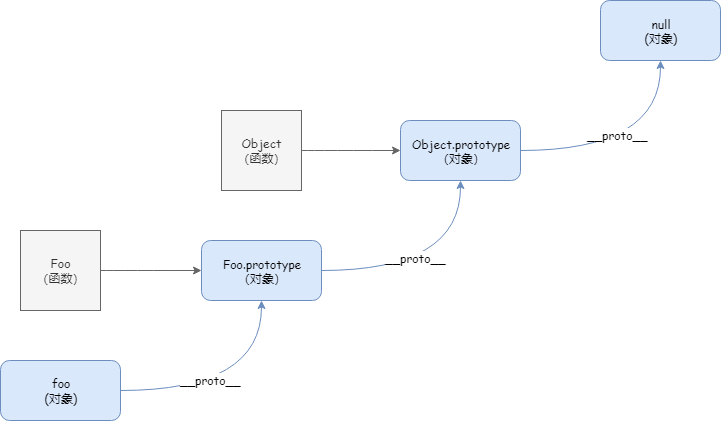

## 1 变量类型和计算

知识点：
- 变量类型
- 变量计算

### 1.1 变量类型

#### 1.1.1 值类型

```js
let a = 100
let b = a
a = 200
console.log(b)  // 100 互不影响
```

#### 1.1.2 引用类型

对象、数组、函数 都是引用类型。

```js
let a = {
    age: 100
};
let b = a;
b.age = 200
console.log(a.age)  // 两个指针 指向同一对象
```

#### 1.1.3 typeof 运算符

总共**6**种。（分1，2，3记忆。
- undefind
- object
- function
- number
- bool
- string

```js
// 值类型
typeof undefined    // "undefined"
typeof 'abc'        // "string"
typeof 123          // "number"
typeof true         // "bool"

// 引用类型
typeof {}           // "object"
typeof []           // "object"
typeof null         // "object"     // !!!null
typeof console.log  // "function"
```

### 1.2 变量计算

#### 1.2.1 强制类型转换

- 字符串拼接
- == 运算符
- if 语句
- 逻辑运算

##### 1.2.1.1 字符串拼接
```js
let a = 100 + 10    // 110
let b = 100 + '10'  // 10010
```

##### 1.2.1.2 == 运算符

慎用!!!

```js
100 == '100'        // true
0 == ''             // true
null == undefined   // true
```

##### 1.2.1.3 if 语句

```js
let a = true
if(a) {
    // ...  // 执行
}

let b = 100
if(b) {
    // ...  // 执行 
}

let c = ''
if(c) {
    // ...  // 不执行
}
```

##### 1.2.1.4 逻辑运算

```js
console.log(10 && 0)        // 0
console.log('' || 'abc')    // 'abc'
console.log(!window.abc)    // true

// 判断一个变量会被当做 true 还是 false
let a = 100
console.log(!!a)
```

### 1.3 真题

#### 1.3.1 JS 中使用 typeof 能得到的哪些类型

#### 1.3.2 何时使用 === 何时使用 ==

只推荐底下一种写法，其余全`===`：
```js
if(obj.a == null) {
    // 这里相当于 obj.a === null || obj.a ==== undefined 的简写形式
    // 这是 jQuery 源码中推荐的写法
}
```

#### 1.3.3 JS 中有哪些内置函数


```js
// 数据封装类对象
Object
Array
Boolean
Number
String
Function
Date
RegExp
Error
```

#### 1.3.4 JS 变量按照存储方式区分为哪些类型，并描述其特点

值类型和引用类型。

#### 1.3.5 如何理解 JSON 

JSON 只不过是一个 JS 对象而已
```js
JSON.stringify({a: 10, b: 20});
JSON.parse('{"a": 10, "b": 20}');
```

## 2. 原型和原型链

知识点：
- 构造函数
- 构造函数---扩展
- 原型规则和示例
- 原型链
- instanceof

### 2.1 构造函数

```js
function Foo(name, age) {
    this.name = name;
    this.age = age;
    this.class = 'class-1';
    // return this;     // 默认有这一行
}

const foo = new Foo('zhangsan', 20)
// new 一个对象的执行过程
// 1. 传入参数
// 2. this 会变成一个空对象 !!!
// 3. this 属性赋值
// 4. 使用 new 默认返回一个 this 对象，赋值给 foo !!!

// const f1 = new Foo('lisi', 22)      // 创建多个对象

```

### 2.2 构造函数---扩展

- var a = {} 其实是 var a = new Object() 的语法糖
- var a = [] 其实是 var a = new Array() 的语法糖
- function Foo() {...} 其实是 var Foo = new Function(...) 的语法糖

以上都推荐前面的方式。

- 使用 instanceof 判断一个函数是否是一个变量的构造函数 

### 2.3 原型规则和示例

共五条原型规则，原型规则是学习原型链的基础。

1. 所有的引用类型（数组、对象、函数），都具有对象特性，即自由扩展属性（除了 "null" ）

```js
let obj = {}; obj.a = 100;
let arr = []; arr.a = 100;
function fn() {}
fn.a = 100;
```

2. 所有的*引用类型*（数组、对象、函数），都有一个`__proto__`属性（*隐式原型*），属性值是一个普通对象
```js
console.log(obj.__proto__);
console.log(arr.__proto__);
console.log(fn.__proto__);
```
3. 所有的*函数*，都有一个 `prototype` 属性（*显式原型*），属性值也是一个普通的对象
```js
console.log(fn.prototype);
```
4. 所有的*引用类型*（数组、对象、函数），`__proto__` 属性值指向它的*构造函数*的 `prototype` 属性值
```js
console.log(obj.__proto__ === Object.prototype)
```
5. 当试图得到一个对象的某个属性时，如果这个对象本身没有这个属性，那么会去它的 `__proto__` （即它的构造函数的 prototype ）中寻找。
```js
// 构造函数
function Foo(name, age) {
    this.name = name;
}
Foo.prototype.alertName = function() {
    alert(this.name);
}
// 创建示例
let foo = new Foo('zhangsan');
foo.printName = function() {
    console.log(this.name);
}

// 测试
foo.printName();
foo.alertName();      // 去 foo.__proto__ （构造函数的 prototype ）中寻找
```
### 2.4 原型链

```js
foo.toString()        // 要去 foo.__proto__.__proto__ 中查找
```



### 2.5 instanceof

用于判断 **引用类型** 属于哪个 **构造函数** 的方法

```js
// foo 的 __proto__ 一层一层往上走，能否找到 Foo.prototype Object.prototype
foo instanceof Foo      //true
foo instanceof Object   // true
```

### 2.6 真题

#### 2.6.1 如何准确判断一个变量时数组类型

```js
let arr = []
arr instanceof Array    // true
typeof arr              // "Object"     // typeof 无法准确判断
```

#### 2.6.2 写一个原型链继承的例子

```js
// low 版

// 动物
function Animal() {
    this.eat = function() {
        console.log('animal eat');
    }
}

// 狗
function Dog() {
    this.bark = function() {
        console.log('dog bark');
    }
}

// !!! 原型链继承 注意是 new Animal() 一个对象，而不是 Animal 构造函数! 
Dog.prototype = new Animal();

// 哈士奇
let hashiqi = new Dog();
```

#### 2.6.3 描述 new 一个对象的过程

- 创建一个新对象
- this 指向这个新对象
- 执行代码，即对 this 赋值
- 返回 this