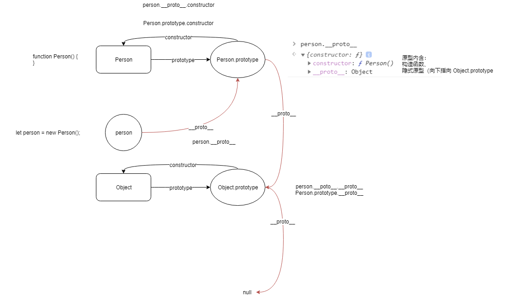

# 1 原型、原型链

## 1.1 概念

原型：每一个 JavaScript 对象（ null 除外）在创建的时候，就会和另一个对象相关联。这个对象就是我们所说的原型，每一个对象都会从原型"继承"属性。

原型链：是一种机制，指的是 JavaScript 每个对象（包括原型对象）都有一个内置的`__proto__`属性指向创建它的函数对象的原型对象（即 prototype 属性）。原型链的存在主要是为了实现对象的继承。

## 1.2 总结

- 函数拥有显式原型（`prototype`）
- 对象拥有隐式原型（`__proto__`)
- 原型是一个普通的对象，所以依旧有隐式原型（`__proto__`），指向它的构造函数的原型（`prototype`）

# 2 作用域

## 2.1 概念

作用域：是指程序源代码中定义变量的区域。确定当前执行代码对变量的访问权限。

因为 JavaScript 采用的是*词法作用域*，**函数的作用域在函数定义的时候就决定了。**