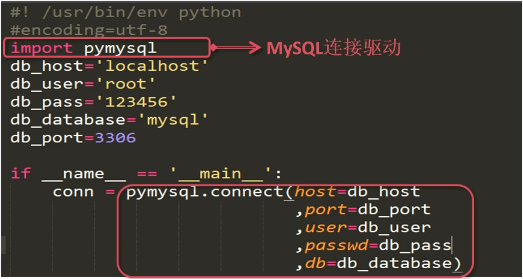

# 基础部分

## SQL VS NOSQL

### 关系数据库的特点

- 数据结构化存储在二维表中
- 支持事务的原子性（A）、一致性（C）、隔离性（I）、持久性（D）特性
- 支持使用 SQL 语言对存储数据进行操作

### 关系数据库的适用场景

- 数据之间存在着一定关系，需要关联查询数据的场景（比如一对多）
- 需要事务支持的业务场景（比如银行账户）
- 需要使用 SQL 语言灵活操作数据的场景（比如数据分析）

### 非关系数据库的特点

- 存储结构灵活，没有固定的结构
- 对事务的支持比较弱，但对数据的并发处理性能高
- 大多不使用 SQL 操作数据

### 非关系数据库的适用场景

- 数据结构不固定的场景
- 对事务要求不高，但读写并发比较大的场景（偶尔丢失一些数据也没有关系）
- 对数据的处理操作比较简单的场景

## 关系数据库选型原则

- 数据库使用的广泛性
- 数据库的可扩展性
  - MySQL 支持基于二进制日志的逻辑复制
  - MySQL 存在多种第三方数据库中间层，支持读写分离及分库分表
- 数据库的安全性和稳定性
  - MySQL 主从复制集群可达到 99% 的可用性
  - 配合主从复制高可用架构可以达到 99.99% 的可用性
  - 支持对存储在 MySQL 的数据进行分级安全控制
- 数据库所支持的系统
  - MySQL 支持 Windows、Linux 系统
- 数据库的使用成本
  - 社区版本免费
  - 使用人员众多，可以方便获得技术知识

## 访问数据库的姿势

### 管理工具访问 MySQL

- 命令行工具：mysql
- 图形化管理工具：SQLyog、Navicat

### 使用程序访问 MySQL 服务（举例 Python）

MySQL 连接驱动：Connector/ODBC（excel）、Connector/J（java）

```bash
# 下载 python 连接 mysql 的第三方库

yum install python-setuptools python-devel
curl https://bootstrap.pypa.io/get-pip.py -o get-pip.py
python get-pip.py
pip install --upgrade setuptools
pip install PyMySQL
```



### 连接异常

- 数据库无法访问的异常

- pymysql.err.OperationalError:(1045, u"Access denied for user 'root'@'192.168.1.10'(using password: YES)")

  - 确认密码是否正确
  - 确认是否有对 IP 的授权，% 不包括 localhost
  - 网络是否畅通

  

- 输入的 SQL 语句的大小超过 ’max_allowed_packet‘ 的设置（这个参数是限制 MySQL 服务器接收数据包大小的，超过这个大小就会失败）

- pymysql.err.InternalError: (1153, u"Got a packet bigger than 'max_allowed_packet' bytes")

  - 增加 max_allowed_packet 配置的大小（以字节为单位）
  - SET PERSIST max_allowed_packet = 100 * 1024 * 1024（100 M）

