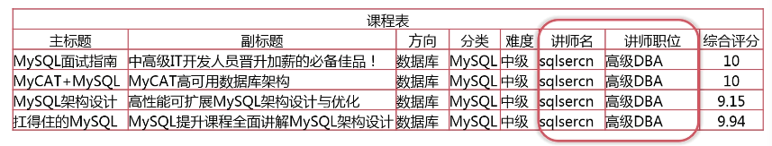
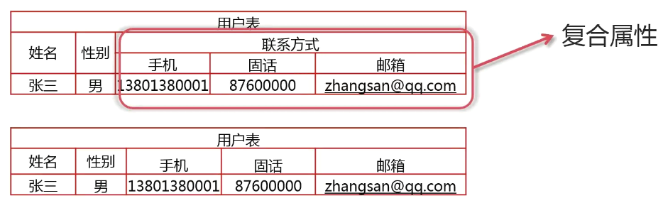
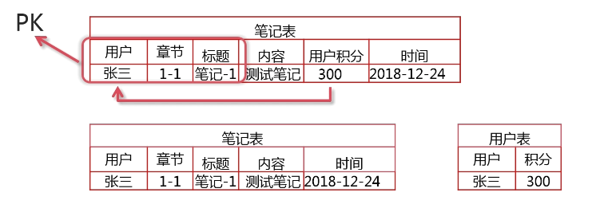
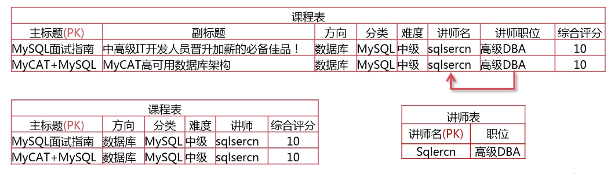
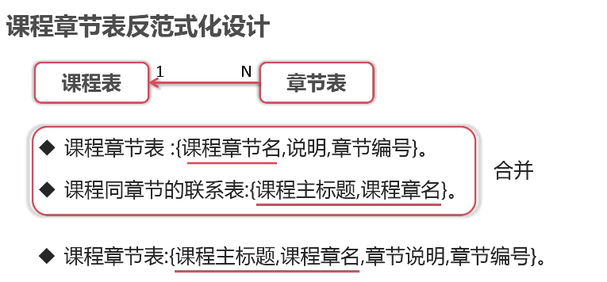
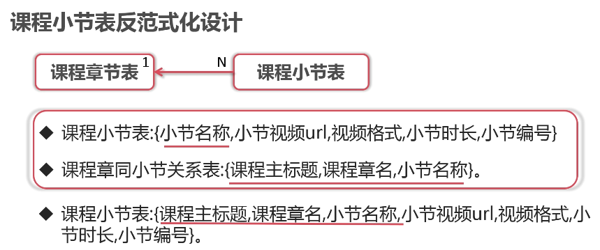
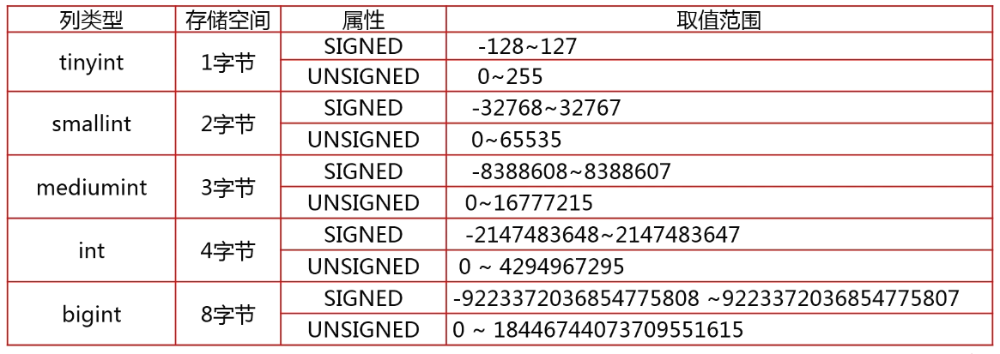
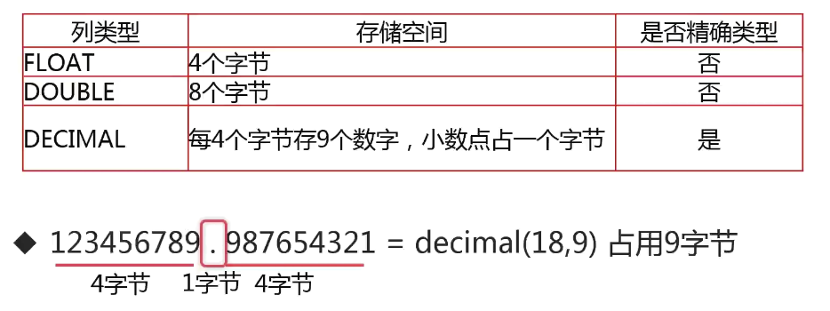
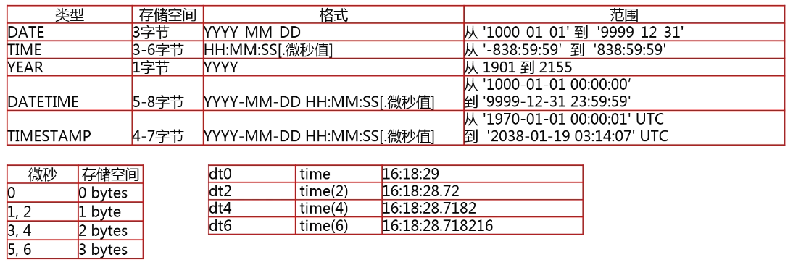
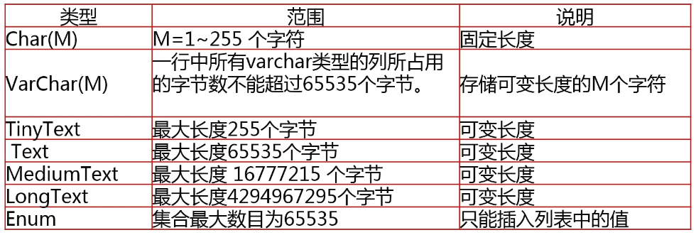

# 数据库设计

## 总体步骤

业务分析 -> 逻辑设计 -> 数据类型 -> 对象命名 -> 建立库表

## 宽表模式

宽表模式就是将一个对象的所有属性都存储在一个表中。

### 例子

例如，课程的属性：{ 主标题, 副标题, 方向, 分类, 难度, 最新, 最热, 时长, 简介, 人数, 需知, 收获, 讲师名, 讲师职位, 课程图片, 综合评分, 内容实用评分, 简洁易懂评分, 逻辑清晰评分 }，共 19 个属性

### 存在的问题

- 数据**冗余**：相同的数据在一个表中出现多次（存储变大）
- 数据**更新**异常（由数据冗余引起）：修改一行中某一列的值时，同时修改多行数据
  - UPDATE 课程表 SET 讲师职位 = ‘MySQL 架构师’ WHERE 讲师名=‘sqlercn’ AND 主标题 = ‘MySQL 面试指南’
  - 这会导致第一门课显示讲师的信息为“MySQL 架构师”，其他课程的信息依旧是“高级 DBA”，**信息不一致**
- 数据**插入**异常：部分数据由于缺失主键信息而无法写入表中
  - INSERT INTO 课程表(方向) VALUES('后端开发')
  - 主键为主标题，此时想单独增加一个方向是不可能的，必然需要新增加一门课，不然就会违反主键非空的约束
- 数据**删除**异常：删除某一数据时，不得不删除另一数据
  - DELETE FROM 课程表 WHERE 方向 = ‘数据库’
  - 也会删掉所有“数据库”方向的课程

### 应用场景

- 配合列存储的数据报表应用（不需要关联多个表）

## 第一范式

第一范式要求表中的所有字段都是不可再分的（很好达到的）。

如下例子，可以看到联系方式可再分，解决方法也是将其再分。

## 第二范式

第二范式要求表中必须存在业务主键，并且非主键依赖于**全部**业务主键。

**如果一张表的业务主键只由一个字段组成，那这张表天生就符合第二范式**；如果多个字段组合撑业务主键，需要进一步考察。

如下例子，可以看到前三个字段组合可以为主键，而用户积分并没有依赖全部主键（只依赖用户），需要将其拆分。

## 第三范式

第三范式要求表中的非主键列之间**不能相互依赖**。

可以看到之前的宽表模式的课程例子，主键只有主标题一列，所以符合第二范式（第一范式也符合，字段不可再分）

如下例子，可以看到“讲师职位”依赖“讲师名”，非主键之间存在依赖，所以单独提取出一张表。

## 逻辑设计

### 课程对象

课程的属性：{ 主标题, 副标题, 方向, 分类, 难度, **最新**, **最热**, 时长, 简介, 人数, 需知, 收获, 讲师名, 讲师职位, 课程图片, 综合评分, 内容实用评分, 简洁易懂评分, 逻辑清晰评分 }

拆分为：

- 课程表：{ 主标题, 副标题, ~~方向, 分类, 难度,~~ **上线时间**, **学习人数**, 时长, 简介, 人数, 需知, 收获, ~~讲师名, 讲师职位~~, 课程图片, 综合评分, 内容实用评分, 简洁易懂评分, 逻辑清晰评分 }（业务逻辑规定上线时间范围为最新，学习人数按从高到低排序表示热度）
- 讲师表：{ 讲师昵称, 讲师职位 }，讲师不依赖主键课程表的主键（主标题），同时讲师职位依赖讲师昵称
- 课程方向表：{ 课程方向名称, 添加时间 }
- 课程分类表：{ 分类名称, 添加时间 }
- 课程难度表：{ 课程难度, 添加时间 }

### 课程内容列表对象

课程内容列表的属性：{ 章节名, 小节名, 说明, 小节时长, 章节 URL, 视频格式 }

拆分为：

- 课程章节表：{ 课程章节名, 说明, 章节编号 }
- 课程-课程章节的关系表：{ 课程主标题, 课程章节名 }
- 课程小节表：{ 小节名称, 小节视频 URL, 视频格式, 小节时长, 小节编号 }
- 课程章节-课程小节的关系表：{ 课程主标题, 课程章节名, 小节名称 }

### 用户对象

**讲师**的属性：{ 讲师昵称, 密码, 性别, 省, 市, 职位, 说明, 经验, 积分, 关注人数, 粉丝人数 }

直接设置为讲师表，不需要拆分

**用户**的属性：{ 用户昵称, 密码, 性别, 省, 市, 职位, 说明, 经验, 积分, 关注人数, 粉丝人数 }

直接设置为用户表，不需要拆分

（**融合**）讲师表和用户表二者字段相似，会造成数据冗余（一个用户既是学生又是讲师，就需要两张表维护同一份数据）

用户表：{ 用户昵称, 密码, 性别, 省, 市, 职位, 说明, 经验, 积分, 关注人数, 粉丝人数, **讲师标识** }

### 问答评论对象

问答评论属性：{ 类型, 标题, 内容, 关联章节（课程主标题, 课程章名, 小节名称）, 浏览量, 发布时间, 用户昵称 }

问答评论表：{ 标题, 课程主标题, 课程章名, 小节名称, 用户昵称, **父评论**, 标题, 内容, 类型, 浏览量, 发布时间 }

### 评价对象

评价的属性：{ 用户昵称, 课程主标题, 内容, 综合评分, 内容实用, 简洁易懂, 逻辑清晰, 发布时间 }

拆分为：

- 评价表：{ 用户昵称, 课程主标题, 内容, 综合评分, 内容实用, 简洁易懂, 逻辑清晰, 发布时间 }
- 用户选课表：{ 用户昵称, 课程主标题, 选课时间, 累计听课时长 }（只有选择课程的用户才可以评价）

### 思考：如何取出一门课程的所有章节和小节的信息？

查一个内容要联动五张表的内容；连表查询，性能一定是低效的。

## 反范式化设计

使用空间来换取时间（数据冗余）

## 物理设计（概念）

物理设计包括表中每一列的数据类型选择、如何对库表进行命名。对于 MySQL 来说，还需要选择存储引擎。

### 存储引擎

|  引擎名称  | 事务  |                        说明                        |
| :--------: | :---: | :------------------------------------------------: |
|   MYISAM   |   N   | MySQL 5.6 之前的默认引擎，最常用的非事务型存储引擎 |
|    CSV     |   N   |         以 CSV 格式存储的非事务型存储引擎          |
|  Archive   |   N   | 只允许查询和新增数据而不允许修改的非事务型存储引擎 |
|   Memory   |   N   |            是一种易失性非事务型存储引擎            |
| **INNODB** | **Y** |             **最常用的事务型存储引擎**             |

### InnoDB 存储引擎的特点

- 事务型存储引擎支持 ACID（不要混合使用事务型引擎和非事务型引擎，因为一旦出现回滚，非事务型引擎的表无法回滚）
- 数据按主键聚集存储（底层是按主键进行查找的，所以最好使用自增 ID）
- 支持行级锁以及 MVCC（只锁正在更改的行，不会锁整张表，增强了并发能力）
- 支持 Btree 和自适应 Hash 索引
- 支持全文和空间索引

### 整数类型的特点

### 实数类型的特点

### 时间类型的特点

### 字符串类型的特点

注意 Char(M) 是 M 个**字符**（一个中文字符占四个字节）；VarChar(M) 是可变长的，只会占用实际需要的大小；

### 如何选择合适的数据类型

- 优先选择**符合存储数据需求**的**最小**数据类型
- 谨慎使用 ENUM、TEXT 字符串类型
- 和财务相关的数值型数据，必须使用 decimal 类型

例如：

- 3147483647，选择 unsigned int，而不是 bigint
- 字符串转整数存储，比如将 IP 地址转换为整数 INET_ATON('255.255.255.255') = 4294967295
- 排序的时候，因为内存临时表不支持 TEXT 大数据的，所以就会转而使用磁盘内存表，会二次读表，IO 开销变大
- TEXT 只能做前缀索引

### 如何为表和列选择适合的名字

- 名称必须使用小写字母，可选用下划线分割
- 名称定义禁止使用 MySQL 保留关键字
- 命名要做到见名识义，并且最好不要超过 32 个字
- 建议：表的名称中最好能包括数据库的名称，这样操作多个数据库的时候就知道当前的表是属于哪个数据库
- 临时库表必须以 tmp 为前缀，同时以日期为后缀
- 用于备份的库，表必须以 bak 为前缀并以日期为后缀

## 物理设计（实现）

### 课程表（imc_course）进一步设计

|       列名        |     代码      |               数据类型                |
| :---------------: | :-----------: | :-----------------------------------: |
| **课程 ID（PK）** |   course_id   |      **int unsigned**（非负数）       |
| **主标题（UK）**  |     title     |              varchar(20)              |
|      副标题       |  title_desc   |              varchar(50)              |
|  **课程方向 ID**  |    type_id    | **smallint unsigned**（因为数据量少） |
|  **课程分类 ID**  |   class_id    |         **smallint unsigned**         |
|  **课程难度 ID**  |   level_id    |         **smallint unsigned**         |
|     上线时间      |  online_time  |               datetime                |
|     学习人数      |   study_cnt   |             int unsigned              |
|     课程时长      |  course_time  |      **time**（多少小时、分钟）       |
|     课程简介      |     intro     |             varchar(200)              |
|     学习需知      |     info      |             varchar(200)              |
|     课程收获      |    harvest    |             varchar(200)              |
|    **讲师 ID**    |    user_id    |           **int unsigned**            |
|    课程主图片     |   main_pic    |             varchar(200)              |
|     内容评分      | content_score |             decimal(3, 1)             |
|     简单易懂      |  level_score  |             decimal(3, 1)             |
|     逻辑清晰      |  logic_score  |             decimal(3, 1)             |
|     综合评分      |     score     |             decimal(3, 1)             |

### 章节表（imc_chapter）进一步设计

|       列名        |     代码     |                           数据类型                           |
| :---------------: | :----------: | :----------------------------------------------------------: |
|   章节 ID（PK）   |  chapter_id  |                         int unsigned                         |
| **课程 ID（UK）** |  course_id   |                       **int unsigned**                       |
|  章节名称（UK）   | chapter_name |                         varchar(50)                          |
|     章节说明      | chapter_info |                         varchar(200)                         |
|     章节编号      |  chapter_no  | **tinyint(2) unsigned ZEROFILL （两位，前面补零！例如 01、67）** |

课程 ID 类型要与课程表的**保持一致**，关系到关联查询的性能。

### 课程小节表（imc_subsection）进一步设计

|       列名        |    代码    |             数据类型             |
| :---------------: | :--------: | :------------------------------: |
|   小节 ID（PK）   |   sub_id   |           int unsigned           |
| **章节 ID（UK）** | chapter_id |         **int unsigned**         |
| **课程 ID（UK）** | course_id  |         **int unsigned**         |
|  小节名称（UK）   |  sub_name  |           varchar(50)            |
|     小节 URL      |  sub_url   |           varchar(200)           |
|     视频格式      | video_type |    enum('avi', 'mp4', 'mpeg')    |
|     小节时长      |  sub_time  |               time               |
|     小节编号      |   sub_no   | **tinyint(2) unsigned ZEROFILL** |

### 课程分类表（imc_class）、课程方向表（imc_type）、课程难度表（imc_level）进一步设计

|       列名        |    代码    |     数据类型      |
| :---------------: | :--------: | :---------------: |
| 课程分类 ID（PK） |  class_id  | smallint unsigned |
|  分类名称（UK）   | class_name |    varchar(10)    |
|     添加时间      |  add_time  |     timestamp     |

|       列名        |   代码    |     数据类型      |
| :---------------: | :-------: | :---------------: |
| 课程方向 ID（PK） |  type_id  | smallint unsigned |
|  方向名称（UK）   | type_name |    varchar(10)    |
|     添加时间      | add_time  |     timestamp     |

|       列名        |    代码    |     数据类型      |
| :---------------: | :--------: | :---------------: |
| 课程难度 ID（PK） |  level_id  | smallint unsigned |
|  难度名称（UK）   | level_name |    varchar(10)    |
|     添加时间      |  add_time  |     timestamp     |

### 用户表（imc_user）进一步设计

|      列名      |    代码     |                数据类型                |
| :------------: | :---------: | :------------------------------------: |
| 用户 ID（PK）  |   user_id   |              int unsigned              |
| 用户昵称（UK） |  user_nick  |              varchar(20)               |
|      密码      |  user_pwd   | **char(32) （MD5 加密为 32 位）** |
|      性别      |     sex     |                char(2)                 |
|       省       |  province   |              varchar(20)               |
|       市       |    city     |              varchar(20)               |
|      职位      |  position   |              varchar(10)               |
|      说明      |     mem     |              varchar(100)              |
|     经验值     |   exp_cnt   |           mediumint unsigned           |
|      积分      |    score    |              int unsigned              |
|    关注人数    | follow_cnt  |              int unsigned              |
|    粉丝人数    |  fans_cnt   |              int unsigned              |
|    讲师标识    | is_teacher  |            tinyint unsigned            |
|    注册时间    |  reg_time   |                datetime                |
|    用户状态    | user_status |            tinyint unsigned            |

### 问答评论表（imc_question）进一步设计

|     列名      |     代码      |       数据类型       |
| :-----------: | :-----------: | :------------------: |
| 评论 ID（PK） |   quest_id    |     int unsigned     |
|    用户 ID    |    user_id    |     int unsigned     |
|    课程 ID    |   course_id   |     int unsigned     |
|    章节 ID    |  chapter_id   |     int unsigned     |
|    小节 ID    |    sub_id     |     int unsigned     |
|   父评论 ID   |   reply_id    |     int unsigned     |
|   评论标题    |  quest_title  |     varchar(50)      |
|   评论内容    | quest_content |         text         |
|   评论类型    |  quest_type   | enum(’问答‘, '评论') |
|    浏览量     |   view_cnt    |     int unsigned     |
|   发布时间    |   add_time    |       datetime       |

### 课程评价表（imc_classvalue）进一步设计

|     列名      |     代码      |   数据类型    |
| :-----------: | :-----------: | :-----------: |
| 评价 ID（PK） |   value_id    | int unsigned  |
|    用户 ID    |    user_id    | int unsigned  |
|    课程 ID    |   course_id   | int unsigned  |
|   内容评分    | content_score | decimal(3, 1) |
|   简单易懂    |  level_score  | decimal(3, 1) |
|   逻辑清晰    |  logic_score  | decimal(3, 1) |
|   综合评分    |     score     | decimal(3, 1) |
|   发布时间    |   add_time    |   datetime    |

### 用户选课表（imc_selectcourse）进一步设计

|     列名      |    代码     |   数据类型   |
| :-----------: | :---------: | :----------: |
| 选课 ID（PK） |  select_id  | int unsigned |
|    用户 ID    |   user_id   | int unsigned |
|    课程 ID    |  course_id  | int unsigned |
|   选课时间    | select_time |   datetime   |
| 累计听课时间  | study_time  |     time     |
