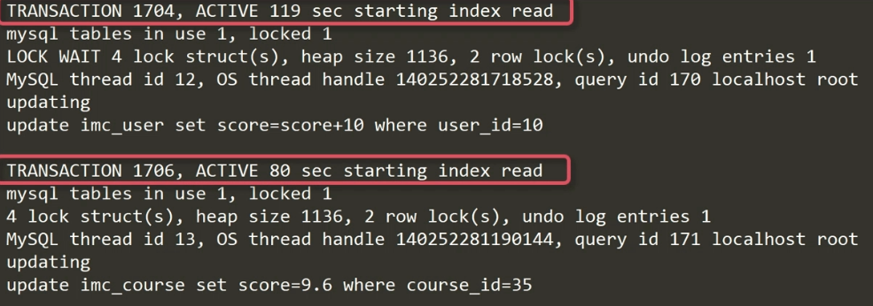

# 搞定并发高压

## 什么是事务

- 事务是数据库执行操作的最小逻辑单元
- 事务可以由一个 SQL 组成，也可以由多个 SQL 组成
- 组成事务的 SQL 要么全执行成功，要么全执行失败 

```mysql
START TRANSACTION / BEGIN; -- 事务开始标志

-- 中间部分则是这次事务操作（DML）
SELECT ...
UPDATE ...
INSERT ...

COMMIT / ROLLBACK; -- 提交事务 / 回滚事务
```

## 事务的特性

|    特性     |                             说明                             |
| :---------: | :----------------------------------------------------------: |
| 原子性（A） | 一个事务中的所有操作，要么全部完成，要么全部不完成，不会结束在中间某个环节。 |
| 一致性（C） |   在事务开始之前和事务结束之后，数据库的完整性没有被破坏。   |
| 隔离性（I） | 事务的隔离性要求每个读写事务的对象与其他事务的操作对象能相互分离，即该事务提交前对其他事务都不可见。 |
| 持久性（D） | 事务一旦提交了，其结果就是永久性的，就算发生了宕机等事故，数据库也能将数据恢复。 |

## 并发带来的问题（为什么需要隔离性）

**脏读**：一个事务读取了另一个事务未提交的数据（事务 2 回滚了，所以读到是无效数据）

|                            事务 1                            |                       事务 2                        |
| :----------------------------------------------------------: | :-------------------------------------------------: |
|                      start transaction                       |                                                     |
| select score from imc_course where cours_id=59;（结果 score = 9.2） |                                                     |
|                                                              |                  start transaction                  |
|                                                              | update imc_course set score=9.6 where course_id=59; |
| select score from imc_course where cours_id=59;（结果 score = 9.6）（如果没有隔离性，读取了事务 2 的中间结果） |                                                     |
|                                                              |                      rollback                       |

**不可重复读**：一个事务前后两次读取的同一数据不一致（事务 2 提交了，读到的是有效数据）

|                            事务 1                            |                       事务 2                        |
| :----------------------------------------------------------: | :-------------------------------------------------: |
|                      start transaction                       |                                                     |
| select score from imc_course where cours_id=59;（结果 score = 9.2） |                                                     |
|                                                              |                  start transaction                  |
|                                                              | update imc_course set score=9.6 where course_id=59; |
|                                                              |                       commit                        |
| select score from imc_course where cours_id=59;（结果 score = 9.6）（如果没有隔离性，读取了事务 2 操作后的结果） |                                                     |
|                            commit                            |                                                     |

**幻读**：指一个事务两次查询的结果集记录数不一致（与不可重复读类似，一个是两次查询返回单条数据不一致，一个是两次查询返回满足条件的多条数据条数不一致）

## INNODB 的隔离级别

|                      隔离级别                       | 脏读 | 不可重复读 | 幻读 | 隔离性 | 并发性 |
| :-------------------------------------------------: | :--: | :--------: | :--: | :----: | :----: |
|               顺序读（SERIALIZABLE）                |  N   |     N      |  N   |  最高  |  最低  |
|     可重复读（REPEATABLE READ）（INNODB 默认）      |  N   |     N      |  N   |        |        |
| 读以提交（READ COMMITTED）（其他关系型数据库 默认） |  N   |     Y      |  Y   |        |        |
|            读未提交（READ UNCOMMITTED）             |  Y   |     Y      |  Y   |  最低  |  最高  |

```mysql
-- 设置事务的隔离级别
SET [PERSIST|GLOBAL|SESSION]
	TRANSACTION ISOLATION LEVEL
	{
	SERIALIZABLE
	| REPEATABLE READ
	| READ COMMITTED
	| READ UNCOMMITTED
	}
```

```mysql
-- 例如：设置隔离级别为 SERIALIZABLE
SET SESSION TRANSACTION ISOLATION LEVEL SERIALIZABLE;
SHOW VARIABLES LIKE '%iso%';
```

### SERIALIZABLE 事务隔离级别

当打开两个 MySQL 连接

```mysql
-- 当第一个窗口先开启一个事务，可以立即获得结果
BEGIN;
SELECT course_id,title
FROM imc_course
WHERE score>9.6
;
-- | course_id |  title  |
-- | 63        | 课程 63  |
-- | 72        | 课程 72  |
```

```mysql
-- 第二个窗口之后也开启一个事务，必须要等到第一个窗口提交事务之后才可以获得结果
BEGIN;
UPDATE imc_course
SET score=9.8
WHERE course_id=34
;
-- 会一直转圈等待，该 UPDATE 不会被执行
-- 一直等到第一个事务 commit/rollback 之后
```

### REPEATABLE READ 事务隔离级别

1. 当第一个窗口开启一个事务，执行查询，执行成功
2. 之后，第二个窗口开启一个事务，更新数据，**执行成功（不同点）**！COMMIT
3. 再回到第一个窗口，再次执行相同查询，执行成功，**但是并没有读取到第二个窗口更新的数据！**

### READ COMMITTED 事务隔离级别

1. 当第一个窗口开启一个事务，执行查询，执行成功
2. 之后，第二个窗口开启一个事务，更新数据，执行成功！COMMIT
3. 再回到第一个窗口，再次执行相同查询，执行成功，**读到了刚刚事务修改的数据（不同点）**！

### READ UNCOMMITTED 事务隔离级别

1. 当第一个窗口开启一个事务，执行查询，执行成功
2. 之后，第二个窗口开启一个事务，更新数据，执行成功！**（此时还没有 COMMIT！）**
3. 再回到第一个窗口，再次执行相同查询，执行成功，读到了刚刚事务修改的数据（不同点）！

## REPEATABLE READ 同样会产生阻塞

### 例子

```mysql
-- 第一个窗口开启事务
BEGIN;
UPDATE imc_course
SET score=score+0.1
WHERE score>9.6 AND score<9.8
;
-- 此时未提交
```

```mysql
-- 第二个窗口开启事务
BEGIN;
UPDATE imc_course
SET score=score-0.1
WHERE score>9.6 AND score<9.8
;
-- 该语句并没有被执行，而是被阻塞了，等待第一个窗口的事务 COMMIT/ROLLBACK 结束
```

### 原因：INNODB 中的锁

- 查询需要对资源加共享锁（S）
- 数据修改需要对资源加排它锁（X）

|        | 排它锁 | 共享锁 |
| :----: | :----: | :----: |
| 排它锁 | 不兼容 | 不兼容 |
| 共享锁 | 不兼容 |  兼容  |

例子解释：第一个事务是修改操作，加了排它锁

### 什么是阻塞？

由于不同锁之间的兼容关系，造成的一事务需要等待另一个事务实放其所占用的资源的现象

### 如何发现阻塞？

```mysql
SELECT CONNECTION_ID(); -- 可以查看当前连接进程

SELECT waiting_pid AS '被阻塞的线程',
	waiting_query AS '被阻塞的 SQL',
	blocking_pid AS '阻塞线程',
	blocking_query AS '阻塞的 SQL',
	wait_age AS '阻塞时间',
	sql_kill_blocking_query AS '建议操作'
FROM sys.innodb_lock_waits
WHERE
(UNIX_TIMESTAMP()-UNIX_TIMESTAMP(wait_started))>30
;
```

### 如何处理阻塞？

- 终止占用资源的事务`KILL 20`
- 优化占用资源事务的 SQL，使其尽快实放资源

## 死锁

### 什么是死锁？

并行执行的多个事务相互之间占有了对方所需要的资源

### 死锁产生的例子

```mysql
-- 窗口一
begin;
update imc_course set score=9.7 where course_id=35; -- 执行成功

-- 窗口二
begin;
update imc_user set score=score+10 where user_id=10; -- 执行成功

-- 回到窗口一
update imc_user set score=score+10 where user_id=10; -- 阻塞

-- 回到窗口二
update imc_course set score=9.7 where course_id=35; -- 阻塞

-- 直接报错终止
-- 因为都没有提交，相互占用了对方进程的资源，死锁产生
```

### 如何发现死锁？

```mysql
-- 开启死锁日志（自动记录）
SET GLOBAL INNODB_PRINT_ALL_DEADLOCKS=ON;
```

```bash
# 查看错误日志
cd /usr/local/mysql/sql_log
more mysql-error.log
```



### 如何处理死锁？

- 数据库自行回滚占用资源少的事务（治标不治本）
- 并发事务按相同顺序占有资源（将死锁转换为阻塞）（赶快提交窗口一的事务？）