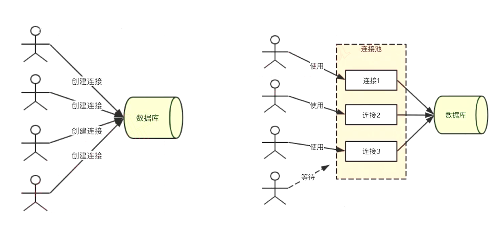

## 总览

- 框架选型：koa2
- 数据库选型：mysql
- 登录技术：session / jwt
- 前端页面技术：ejs 后端模板引擎
- 缓存数据库：redis
- 单元测试：jest

## 所有依赖罗列

### koa-generator

```bash
npm i -g koa-generator # 安装 Koa2 脚手架工具
koa2 -e koa2-weibo-code # 使用 koa2 命令行创建项目, -e add ejs engine support (defaults to jade)

# 进入目录，下载依赖
cd koa2-weibo-code
npm i –registry=https://registry.npm.taobao.org
```

### cross-env

```bash
npm i cross-env -D # 安装设置环境变量工具
```

在`package.json`中的`scripts`底下添加以下代码，分别为"生产环境"下和"开发环境"下的项目启动脚本：

```json
“dev”: “cross-env NODE_ENV=dev ./node_modules/.bin/nodemon bin/www”,
“prd”: “cross-env NODE_ENV=production pm2 start bin/www”,
```

### mysql2

略过

### sequelize

略过

## Koa2 介绍

通过 koa-generator 创建项目，讲解了代码目录结构，讲解路由的使用。

易忘记的点：

- `/loadMore/:username/:pageIndex`获取 get 请求中的对应位置的 url 参数
- `const { username, password } = ctx.request.body` 获取 post 请求参数
- `ctx.body = { username, password}`返回 JSON 格式

## ejs 介绍

### 变量 <%= xx

- ctx.render('index', {})
  - 第一个参数就是 ejs 的文件名（对应）
  - 第二个参数表示一堆变量（在 ejs 中使用相同的属性名）
  - 如果没有传递（ejs 中写了 title，但是我没有传递 title），则会报错（app.js 中的 onerror(app) 处理的）. 可以在 ejs 中改为 locals.title 避免报错。

```js
// src/routes/index.js
router.get(‘/’, async (ctx, next) => {
    await ctx.render(‘index’, {
        tittle: ‘Hello Koa 2!’
    })
})
```

```ejs
// views/index.ejs

<h1><%= title %></h1>

```

### 判断 <% if (xx)

```ejs
<% if (isMe) { %>
<a href=”#”>@ 提到我的(3)</a>
<% } else { %>
    <button>关注</button>
<% } %>
```

### 循环 <% xxList.forEach( xx => {

```ejs
<ul>
    <% blogList.forEach(blog => { %>
        <li><%= blog.title %></li>
    <% }) %>
</ul>
```

### 引用组件 <%- include(‘相对目录’, 参数对象)

```ejs
// views/weidgets/user-info.ejs     

// 代码同“判断”小节
```

 ```ejs
// views/index.ejs 

<%- include(‘widgets/user-info’, {
	isMe
}) %>
 ```

## mysql

- 下载安装 mysql
- 下载安装 mysql workbench
- 打开 workbench 连接到 mysql 服务
  - 显示 ER 图: Database -> Reverse Engineer -> 选择相应的数据库
- 介绍了 mysql 的基础 sql 语句
  - 增删改查
  - 查询总数, 分页
  - 外键
  - 连表查询: `select * from blogs inner join users on users.id=blogs.userid;`

### 外键

- 创建外键
  - 先保证 users 表中的 id 和 blogs 表中的 userid 数据类型一致!
  - 通过 workbench, 选中 blogs 表, alter table, 有一个 foreign key 选项
  - 新建 foreign key 的名称, 关联到 users 表中的 id
  - foreign key details 选择当前这张表的字段, 即一个 userid
  - 设置 On Update CASCADE, On Delete CASCADE
- 更新限制: 就是不能再随便设置外键的字段了, 例如 userid 需要和 user 表中的 id 对应, 否则就会报错组织插入
- 删除级联: 删掉了用户, 那他底下的微博就应该全部删掉

## sequelize

- ORM---Object Relational Mapping, 对象关系映射
  - 数据表, 用 JS 中的模型(class 或对象)代替
  - 一条或多条记录, 用 JS 中一个对象或数组代替
  - sql 语句, 用对象方法代替
- 建模(外键) & 同步到数据库
- 增删改查 & 连表查询

### 创建连接

```js
// src/seq.js
const Sequelize = require('sequelize');

const conf = {
    host: 'localhost',
    dialect: 'mysql',
};

// 创建, 参数分别为: 数据库名称, 数据库账号, 密码, 配置
const seq = new Sequelize('koa2_weibo_db', 'root', 'Mysql_2018', conf);

module.exports = seq;
```

```js
// src/sync.js
const seq = require('./seq');

// 引入即执行内部代码 seq.define
require('./model');

// 测试连接
seq.authenticate().then(() => {
    console.log('ok');
}).catch(() => {
    console.log('err');
});

// 执行同步
// forc: true, 如果存在表, 就删掉之前的
seq.sync({ force: true}).then(() => {
    process.exit();
});

// node /src/sync.js, 如果不退出 exit 就会一直占用命令行, 保持连接
```

### 创建模型

```js
// src/model.js
const Sequelize = require('sequelize'); // 仅仅只是为了拿到它的静态类型, 例如 Sequelize.STRING
const seq = require('./seq');

// 创建 User 模型, 数据表的名字是 users, 自动加 s
const User = seq.define('user', {
    userName: {
        type: Sequelize.STRING, // VARCHAR(255), 并不会多占空间; 设置小一点只是为了做限制报错
        allowNull: false,
    },
    password: {
        type: Sequelize.STRING,
        allowNull: false,
    },
    nickName: {
        type: Sequelize.STRING,
        comment: '昵称',
    },
    // 自动创建: createAt 和 updateAt
});

const Blog = seq.define('blog', {
    title: {
        type: Sequelize.STRING,
        allowNull: false,
    },
    content: {
        type: Sequelize.TEXT, // TEXT
        allowNull: false,
    },
    userId: {
        type: Sequelize.STRING,
        allowNull: false,
    }
});

module.exports = {
    User,
    Blog,
};
```

### 创建外键

```js
// src/model.js 补充

// 创建多对一的关系
Blog.belongsTo(User, {
    // 创建外键 Blog.userId -> User.id
    foreignKey: 'userId',
});

// 也可以使用下面这种语法, 与上面的方法等同
// 两个方式都写, 也可以, 是为了连表查询先查 User, 连查 Blog (双向)
User.hasMany(Blog, {
    foreignKey: 'userId',
});

// 可以注释掉 Blog.userId 的定义, 使用下面这种方式会自动帮忙创建 userId 作为外键
// Blog.belongsTo(User);
```

### 插入数据

```js
// src/create.js
// insert 语句
const { Blog, User } = require('./model');

// 立即执行函数
!(async function() {
    // 创建用户 1
    const user1 = await User.create({
        userName: 'zhangsan',
        password: '123',
        nickName: '张三',
    });
    
    const user1Id = user1.dataValues.id;
    // 相当于 insert into users (...) values (...)
    // user1.dataValues 一个对象, 表示插入表后的数据(在上面的基础上, 添加了 id, updateAt, createAt 三个字段)
    
    const user2 = await User.create({
        userName: 'lisi',
        password: '123',
        nickName: '李四',
    });
    const user2Id = user2.dataValues.id;
    
    const blog1 = await Blog.create({
        title: '标题1',
        content: '内容1',
        userId: user1Id // 这里乱写的话, 应该会报错
    })
})();

// node src/create.js, 若是表之前存在, 则可运行成功
```

###  查询数据

```js
// src/select.js
const { Blog, User } = require('./model');

// 查询特定的列
!(async function() {
    // SELECT ... LIMIT 1
    const zhangsanNames = await User.findOne({
        attributes: ['userName', 'nickName'],
        where: {
            userName: 'zhangsan',
        }
    });
    // 都是存储在 dataValues
    console.log('zhangsanNames', zhangsanNames.dataValues);
})();

// 查询一个列表(分页)
!(async function() {
    const zhangsanBlogList = await Blog.findAll({
        limit: 2,  // 限制本次查询条数
        offset: 4, // 每页 2 条, 跳过 4 条(2*2), 就是第 3 页
        where: {
            userId: 1,
        },
        order: [
            ['id', 'desc']
        ]
    });
    // 取出每个查询结果的 dataVlaues
    console.log('zhangsanBlogList', zhangsanBlogList.map(blog => blog.dataValues))
})();

// 查询总数
!(async function() {
    // 这条语句实质是执行了两条 sql 语句:
    // SELECT count(*) AS `count` FROM `blogs` AS `blog`;
    // SELECT `id`, `title`, `content`, `userId`, `createAt`, `updateAt` FROM `blogs` AS `blog` ORDER BY `blog`.`id` DESC LIMIT 0, 2;
    const blogListAndCount = await Blog.findAndCountAll({
        limit: 2,
        offset: 0,
        order: [
            ['id', 'desc']
        ]
    });
	
    // blogListAndCount 是一个更复合的对象
	console.log(blogListAndCount.count); // 所有的总数, 不考虑分页
    console.log(blogListAndCount.rows.map(blog => blog.dataValues));  // blogListAndCount.rows 同上面的 zhangsanBlogList
})();
```

### 连表查询

```js
// src/select.js
// 查询 blog 顺带查出 user 的信息(注意是 Blog.find, 中间 include)
// 前提: Blog.belongsTo(User), 不写就不能执行
!(async function() {
    // 同样是执行了两条语句, 其中一条: 
    // SELECT count(`blog`.`id`) AS `count`
    // FROM `blogs` AS `blog` INNER JOIN `users` AS `user`
    // ON `blog`.`userId`=`user`.`id` AND `user`.`userName` = `zhangsan`;
    const blogListWithUser = await Blog.findAndCountAll({
        order: [
            ['id', 'desc']
        ],
        include: [
            {
                model: User,
                attributes: ['userName', 'nickName'],
                // 只查张三
                where: {
                    userName: 'zhangsan'
                }
            }
        ]
    });
    
    // 理清楚 blogListWithUser 中的内容
    console.log(
    	'blogListWithUser',
    	blogListWithUser.count,
        blogListWithUser.rows.map(blog => {
            const blogVal = blog.dataValues;
            blogVal.user = blogVal.user.dataValues;	// 这里的 user 是在 define 中定义的
            return blogVal
        })
    )
})();
```

```js
// 查询 user, 并列出他所有的 blog
// 前提: User.hasMany(Blog), 不写就不能执行
!(async function() {
    const userListWithBlog = await User.findAndCountAll({
        attributes: ['userName', 'nickName'],
        include: [
            {
                model: Blog,
            }
        ]
    });
    
    // 与前一个例子对象结构不同
    console.log(
    	'userListWithBlog',
    	userListWithBlog.count,
        userListWithBlog.rows.map(user => {
            const userVal = user.dataValues;
            userVal.blogs = userVal.blogs.map(blog => blog.dataValues);
            return userVal;
        })
    )
})();
```

### 修改数据

```js
// src/update.js
const { User } = require('./model')

!(async function() {
    const updateRes = await User.update({
        nickName: '张三'
    }, {
        where: {
            userName: 'zhangsan'
        }
    });
    
    console.log(updateRes[0] > 0); // 返回的是一个数组 [1],  表示有多少个元素受到了影响; 1 表示修改成功
})();
```

### 删除数据

```js
// src/delete.js
const { User, Blog } = require('./model');

!(async function() {
    // 删除一篇博客
    const delBlogRes = await Blog.destroy({
        where: {
            id: 4,
        }
    });
    console.log(delBlogRes > 0) // 1 表示删除成功
    
    // 删除一个用户, 观察所属的博客是否会被级联删除
    const delUserRes = await User.destroy({
        where: {
            id: 1,
        }
    });
    // sequelize 创建的外键在 On Delete 的部分是 RESTRICT, 表示严格, 即不能直接删除用户, 要先删除这个用户底下所有的 Blog 才行
})();
```

### 连接池

- **现状**: 每进来一个用户, 就会创建一个连接. 然后一个连接是有时间限制的, 大概是半小时后 MySQL 就会把连接关掉.
- 概念: 生成了一堆连接等着来用; MySQL 和 Node 是两个进程通信
- 暂时未介绍到实现: 开发环境下单连接, 生产环境下连接池



## redis

- 内存数据库
- 下载, 安装和使用
  - `redis-server`: 启动 server 服务器, 端口是 6379
  - `redis-cli`: 命令行启动客户端
  - `set name 'yqb'`: 设置 name 为 'yqb'
  - `get name`: 得到 'yqb'
  - `keys *`: 获得所有键值 "name"
- `npm i redis`:  安装依赖

### src/utils/env.js

```js
/**
* 环境变量
**/
const ENV = process.env.NODE_ENV; // 命令行 cross-env 设置

module.exports = {
    isDev: ENV === 'dev',
    notDev: ENV !== 'dev',
    isProd: ENV === 'production',
    notProd: ENV !== 'production',
};
```

### src/conf/db.js

```js
/**
* 存储配置
**/

const { isProd } = require('../utils/env');

let REDIS_CONF = {
    port: 6379,
    host: '127.0.0.1'
};

if (isProd) {
    REDIS_CONF = {
        // 线上 redis 配置
        port: 6379,
        host: '127.0.0.1'
    }
}

module.exports = {
    REDIS_CONF,
}
```

### src/cache/_redis.js

这个文件"_"起头, 应该是口头约定这个文件不会出 cache 文件夹, 只在这个文件夹内部被引入.

```js

/**
* 连接 redis 的方法 get set
**/
const redis = require('redis');
const { REDIS_CONF } = require('../conf/db');

// 创建客户端
const redisClient =redis.createClient(REDIS_CONF.port, REDIS_CONF.host);

// 监听报错
redisClient.on('error', err => {
    console.error('redis error', err);
});

// redis set 封装
function set(key, val, timeout = 60 * 60) {
    if (typeof val === 'object') {
        val = JSON.stringify(val);
    }
    redisClient.set(key, val);
    redisClient.expire(key, timeout) // 设置过期时间, 单位是 s
}

// redis get 封装
function get(key) {
    const promise = new Promise((resolve, reject) => {
        redisClient.get(key, (err, val) => {
            if (err) {
                reject(err);
                return;
            }
            if (val == null) { // 可能过期, 或者压根没存
                resolve(null);
                return;
            }
            
            try {
                resolve(JSON.parse(val)); // 尝试解析一下, 出错了那就是普通的 string
            } catch(ex) {
                resolve(val);
            }
        })
    });
    
    return promise;
}
```

## cookie 和 session

使用 JS 对象存储 session 的弊端, 或者说使用 redis 存储 session 的好处:

- 减少一个 Node 进程内存使用(一个 Node 进程的内存有限制)(否则, JS 对象存储占用内存)
- 多个 Node 进程共用 session(否则, 命中其他 Node 进程, 可能提示未登录)
- 详细参考 [原生再到框架，搭建简易博客项目过程](../原生再到框架，搭建简易博客项目过程.md) 关于 redis 部分的介绍

接下来, 介绍在登录功能中 koa2 的 session 配置:

```bash
# 安装依赖
npm i koa-redis koa-generic-session --save
```

```js
// src/app.js
const session = require('koa-generic-session'); // koa 使用 session
const redisStore = require('koa-redis'); // 存储在 redis
const Koa = require('koa');
const { REDIS_CONF } = require('./conf/db');

const app = new Koa();

// session 配置
app.keys = ['UIsdf_7865#%$s']; // 盐
app.use(session({ // 第 2 行的引用
    key: 'weibo.sid', // cookie name 默认是 `koa.sid`(客户端的键值)
    prefix: 'weibo:sess:', // redis key 的前缀, 默认是 `koa:sess:`(redis 的键值前缀)(再加上客户端传递过来的 value 值, 共同组成 redis 的键值)
    cookie: {
        path: '/',					 // 整个域都可以使用
        httpOnly: true,				 // 不允许客户端修改
        maxAge: 24 * 60 * 60 * 1000, // 过期时间(ms), 设置了 cookie 的过期时间, 默认 redis 过期时间保持一致
    },
    store: redisStore({
        all: `${REDIS_CONF.host}:${REDIS_CONF.port}`, // 127.0.0.1:6379
    }), // 第 3 行的引用
}))

// 当运行程序时, 没有使用到 ctx.session, 服务端的响应就不会 Set-Cookie, 自然 redis 也不会使用;
```

## jwt 登录验证

```bash
# 安装依赖
npm i koa-jwt # jwt 拦截中间件
npm i jsonwebtoken # 加密
```

- jwt---json web token
- 用户认证成功之后, server 端返回一个加密的 token 给客户端
- 客户端后续每次都带 token, 以示当前的用户身份

```js
/**
* src/app.js
* 启用 jwt 中间件, 拦截所有请求, 查看用户是否携带 token
* 只要携带了就准许通过, 至于 token 对错由下一步业务逻辑判断, 这里不管!!!
**/
const jwtKoa = require('koa-jwt');

app.use(jwtKoa({
    secret: 'YqB_1996*', // 密匙
}).unless({
    path: [/^\/users\/login/], // 自定义哪些路径忽略 jwt 验证
}));
```

```js
/**
* src/routes/users.js
* 模拟登录校验账号密码的逻辑
**/
const router = require("koa-router")();
const jwt = require("jsonwebtoken"); // 用于加密

router.prefix("/users");

router.post("/login", async (ctx, next) => {
  const { username, password } = ctx.request.body;

  let userInfo;
  if (username === "yqb" && password === "abc") {
    userInfo = {
      userId: 1,
      username: "yqb",
      nickName: "yuqingbo",
      gender: 1,
    };
  }

  if (userInfo == null) {
    ctx.body = {
      errno: -1,
      msg: "登录失败",
    };
    return;
  }

  // 将 userInfo 加密成 token (密钥必须与 app.js 相同)
  // 存储在客户端, 过期时间为 1h
  let token = jwt.sign(userInfo, "YqB_1996*", { expiresIn: "1h" });

  ctx.body = {
    errno: 0,
    data: token,
  };
});

module.exports = router;


```

```js
/**
* src/routes/users.js
* 验证 token, 获取用户信息
**/

const util = require("util");
const verify = util.promisify(jwt.verify); // 将 callback 形式, 变成 promise 形式

router.get("/getUserInfo", async (ctx, next) => {
  const authorization = ctx.header.authorization;
  const token = authorization.split(" ")[1]; // 去掉 Bearer 只取 token

  try {
    const payload = await verify(token, "YqB_1996*"); // 尝试解密 token 取值
    ctx.body = {
      errno: 0,
      userInfo: payload, // 解析出来就是之前的 userInfo
    };
  } catch (ex) {
    ctx.body = {
      errno: -1,
      msg: "verify token failed",
    };
  }
});

// 在 postman 的 Headers 中添加 Authorization: Bearer token
// token 就是之前登录过返回的 token, 整一大串复制过来
// "Bearer "起头, 持票人的意思
// 必须是 jwt 生成的 token, 否则会被中间件拦下来, 401 报错
```

## jest

```bash
# 安装依赖
npm i jest -D
npm i supertest -D
```

```json
/**
* package.json
* 添加 test 运行脚本
**/
{
    "script": {
        "test": "cross-env NODE_ENV=test jest --runInBand --forceExit --color"
    }
}

// --runInBand: 表示顺序执行
```

```js
/**
* test/server.js
* 定义 jest server
**/

const request = require('supertest');
const server = require('../src/app').callback(); // 不清楚 callback 的作用

module.exports = require(server);
```

```js
/**
* test/json.test.js
* json test(注意文件后缀)
**/
const server = require('./server')

// test 函数无需引入
// 注意这里是异步 async
test('json 接口返回数据格式正确', async () => {
    const res = await server.get('/json');
//    const res = await server.post('/test').send({
//        username: 'xxx',
//        password: 'xxx',
//    });
    expect(res.body).toEqual({ // 引用判断是否相等用 Equal
        title: '接口返回'
    });
    
    expect(res.body.title).toBe('接口返回'); // 值用 toBe
});
```

## 最后完善 koa2 开发环境搭建

- 以上代码, 也是环境搭建的一部分
- 配置 eslint, 以及 pre-commit
- inspect 调试
- 404 页面和错误页

### 之前过程的补充

```js
/**
* conf/db.js
* 补充 MySQL 的配置(之前是只有 redis)
**/

let MYSQL_CONF = {
    host: 'localhost',
    user: 'root',
    password: 'xxxx',
    port: '3306',
    database: 'koa2_weibo_db',
};

if (isProd) {
    // 线上环境 mysql 配置
    MYSQL_CONF = {
        // ...,
        pool: {
            max: 5,
            min: 0,
            idle: 10000,
        }
    }
}

module.exports = {
    MYSQL_CONF,
    REDIS_CONF,
};

// 在 db/seq.js 中进行变量替换
```

```js
/**
* utils/env.js
* 补充 test 环境变量判断
**/

module.exports = {
    isTest: ENV === 'test',
    notTest: ENV !== 'test',
}
```

```js
/**
* src/db/seq.js
* 测试环境下, 关闭 sql 日志打印
* 生产环境下, 使用连接池
**/

if (isTest) {
    conf.logging = () => {}; // 空函数替代
}

if (isProd) {
    conf.pool = MYSQL_CONF.pool;
}
```

### 配置 eslint, 以及 pre-commit

1. `npm i eslint babel-eslint -D`
2. 项目根目录下添加`.eslintignore`和`.eslintrc`两个文件
3. 在`package.json`中添加`"scripts"`: `"lint": "eslint --ext .JS ./src"`
4. `npm run lint`


1. `npm i pre-commit -D`
2. 在`package.json`中添加: `"pre-commit": ["lint"]`,即在提交前运行`npm run lint`命令, 如果测试不通过则无法提交

### chrome debug Node 程序

1. 在`package.json`中修改`"scripts"`: `"dev": "cross-env NODE_ENV=dev ./node_modules/.bin/nodemon --inspect=9228 bin/www"`, 添加`--inspect=9228`
2. `npm run dev`, 就会建立一个端口为 9228 的 websocket 连接
3. 在 chrome 中输入"chrome//inspect/#devices", 在 Target 中选择 Node 程序
4. chrome 的 console 控制台和命令行 的 console 打印是一致的
5. 打断点只能回到程序中手写"debugger"?

### 404 页和错误页

```js
/**
* src/routes/view/error.js
* 404 页和错误页的页面渲染
* 此时将 src/routes 文件再分为 api 和 view 两个文件夹
**/
const router = require('koa-router')();

// error
router.get('/error', async (ctx, next) => {
    await ctx.render('error'); // src/views/error.ejs
});

// 404
router.get('*', async (ctx, next) => {
    await ctx.render('404'); // src/views/404.ejs
});

module.exports = router
```

```js
/**
* src/app.js
* 注册 errorRoute, 并将添加发生错误时的跳转
**/
const errorViewRouter = require('./routes/view/error');

let onerrorConf = {};
if (isProd) { // 希望在其他环境下直接报错
    onerrorConf = {
        redirect: '/error',
    };
}
onerror(app, onerrorConf); // throw Error() 即可触发

app.use(errorViewRouter.routes(), errorViewRouter.allowedMethods());
```

