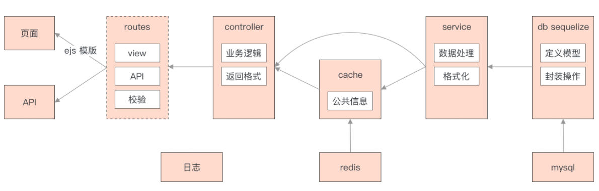
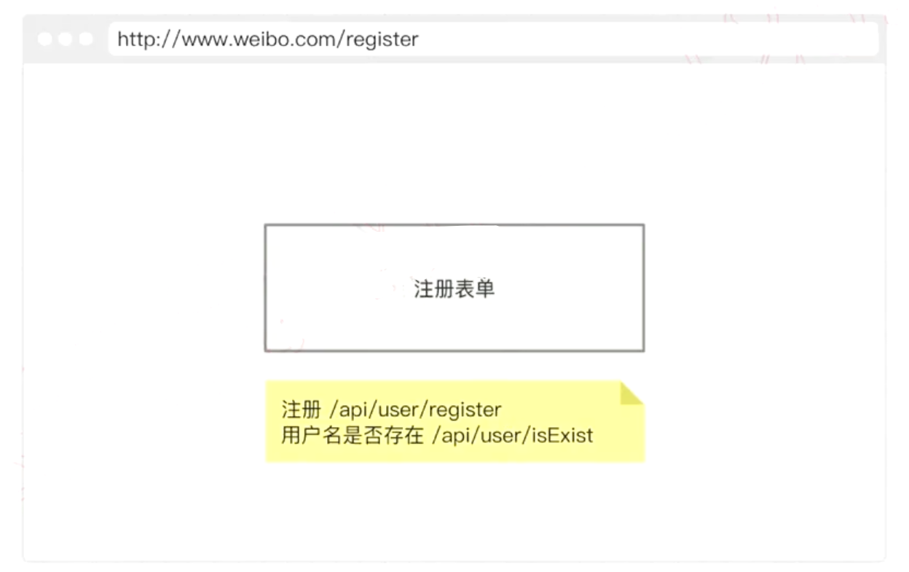
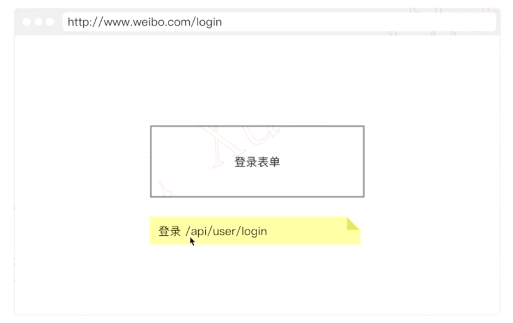
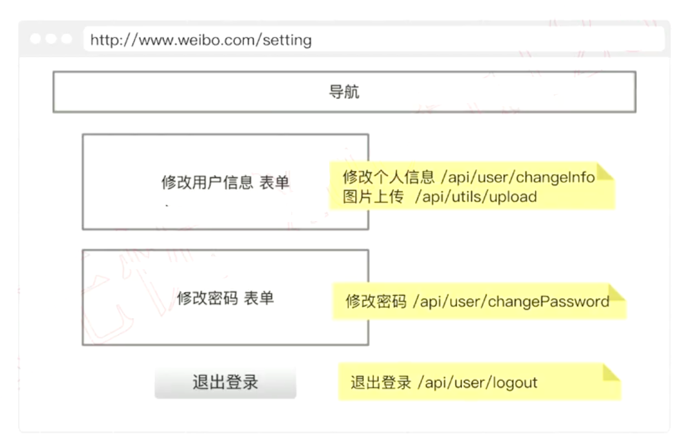
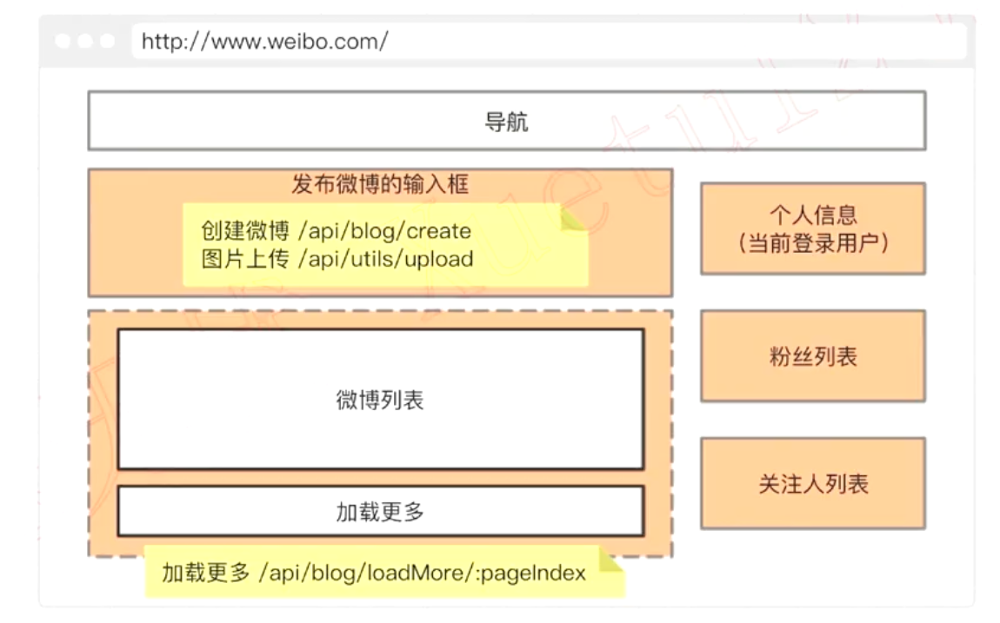
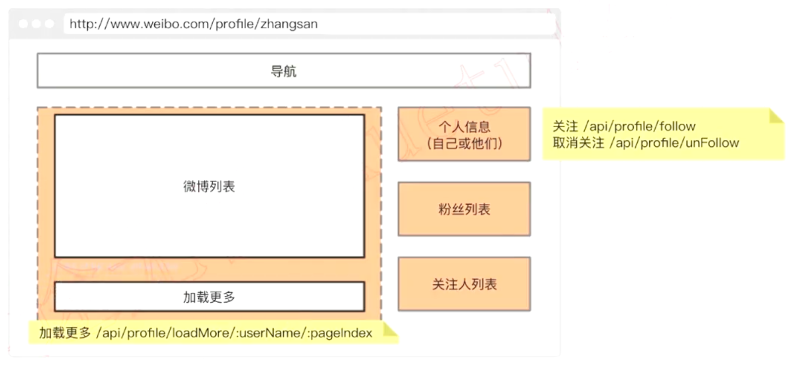
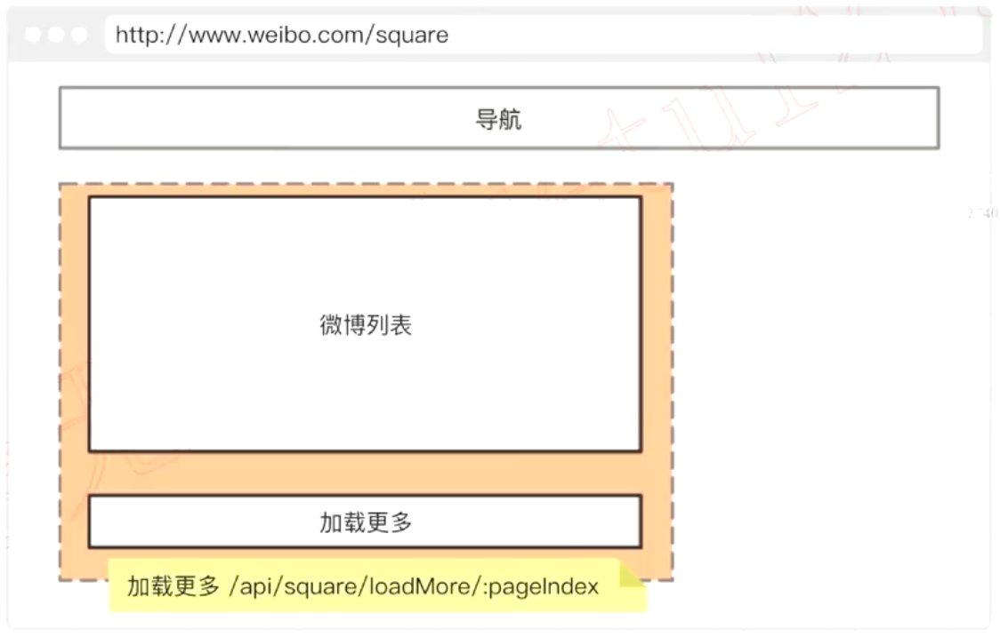
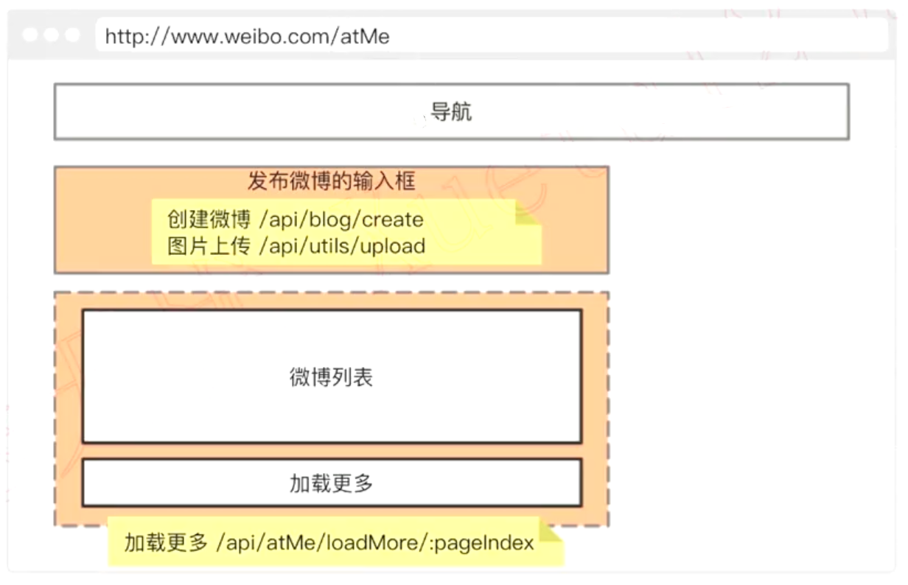
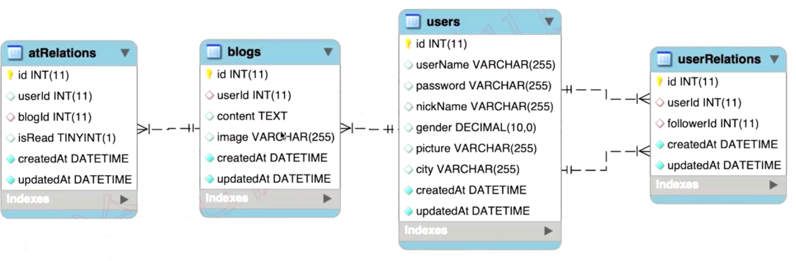

## 系统架构设计

## 页面和 API 设计

### 页面总览

- 页面的路由
  - 注册 /register
  - 登录 /login
  - 首页 /
  - 个人主页 /profile/:userName
  - at 页 /atMe
  - 广场 /square
  - 设置 /setting
  - 错误页 /error
  - 404 /*
- ejs 组件
  - 发布博客输入框
  - 博客列表
  - 加载更多
  - 个人信息
  - 粉丝列表
  - 关注人列表
- 其他
  - 统一的 header 和 footer

### API 总览

- 用户
  - 登录
    - 登录 /api/user/login
  - 注册
    - 注册 /api/user/register
    - 用户名是否存在 /api/user/isExist
  - 设置
    - 修改个人信息 /api/user/changeInfo
    - 图片上传 /api/utils/upload
    - 修改密码 /api/user/changePassword
    - 退出登录 /api/user/logout
- 微博
  - 首页
    - 创建微博 /api/blog/create
    - 图片上传 /api/utils/upload
    - 加载更多 /api/blog/loadMore/:pageIndex
  - 个人主页
    - 加载更多 /api/profile/loadMore/:userName/:pageIndex
    - 关注 /api/profile/follow
    - 取消关注 /api/profile/unFollow
  - 广场页
    - 加载更多 /api/square/loadMore/:pageIndex
  - at 页
    - 创建微博 /api/blog/create
    - 图片上传 /api/utils/upload
    - 加载更多 /api/blog/loadMore/:pageIndex

### 注册

### 登录

### 设置

### 首页

### 个人主页

### 广场

### @ 我的

## 数据模型设计

- 通过 atRelations 表, 表示在一条微博中 @ 了一个用户
- 通过 userRelations 表, 表示一个用户关注了另一个用户

