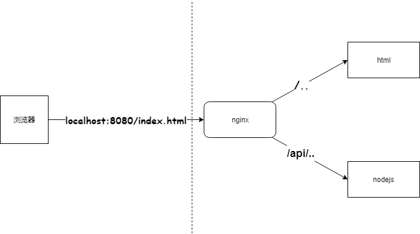

# 原生再框架搭建简易博客项目过程

## 1 nodejs 介绍

### 1.1 nodejs 和 js 的区别

#### 1.1.1 ECMAScript

- 不能操作 DOM ，不能监听 click 事件，不能发送 ajax 请求
- 不能处理 http 请求，不能操作文件

即，只有 ECMAScript ，几乎做不了任何实际的项目

#### 1.1.2 javascript

- 使用 ECMAScript 语法规范，外加 Web API ，缺一不可
- DOM 操作， BOM 操作，事件绑定， Ajax 等

两者结合，即可完成浏览器端的任何操作

#### 1.1.3 nodejs

- 使用 ECMAScript 语法规范，外加 nodejs API ，缺一不可
- 处理 http ，处理文件等，具体 参考 [Node.js v10.16.0 文档](http://nodejs.cn/api/)

二者结合，即可完成 server 端的任何操作

### 1.2 nodejs 处理 http 请求

#### 1.2.1 http 请求概述

从你在浏览器中输入域名，敲击回车，显示页面中，都经历了什么？

1. DNS 解析，TCP 三次握手建立连接，发送 HTTP 请求
2. server 接收到 http 请求，处理，并返回
3. 客户端接收到返回数据，处理数据（如渲染页面，执行 js）

#### 1.2.2 nodejs 处理 get 请求

```js
const http = require('http');
const querystring = require('querystring');             // !!处理 url 传递的参数

const server = http.createServer((req, res) => {
    console.log('method: ', req.method);                // 请求的方式
    console.log('url: ', req.url);                      // 请求的地址

    req.query = querystring.parse(req.url.split('?')[1]);   // localhost:8000?username=123&password=456 // querystring 解析的是问号后的([1])，即 username=123&password=456
    console.log('query: ', req.query);
    
    res.setHeader('Content-type', 'application/json');

    res.end(                                            // 返回写入
        JSON.stringify(req.query);                      // 返回的永远是字符串（但可以通过设置 res 的 Header 来设置浏览器解析的格式
    );
});

server.listen(8000);
console.log('OK');
```

#### 1.2.3 nodejs 处理 post 请求

```js
const http = require('http');

const server = http.createServer((req, res) => {
    if(req.method === 'POST') {
        console.log('content-type', req.headers['content-type']);   // 数据格式

        // 接收数据（一部分一部分接收）（数据流）
        let postData = "";
        req.on('data', chunk => {       // 每次来数据，都会被触发
            postData += chunk.toString()
        });
        req.on('end', () => {           // 结束后，触发 end 事件
            console.log(postData);
            res.end('hello world!');    // 在这里返回，因为是异步的
        });
    }
});

server.listen(8000);
console.log('OK');
```

## 2 搭建开发环境

1. 使用 nodemon 检测文件变化，自动重启 node
2. 使用 cross-env 设置环境变量
3. 修改 package.json 中的 scrpits
```js
//package.json
"scripts": {
    "test": "echo \"Error: no test specified\" && exit 1",
    "dev": "cross-env NODE_ENV=dev nodemon ./bin/www.js",
    "prd": "cross-env NODE_ENV=production nodemon ./bin/www.js"
}
```

4. 启动项目
```
npm run dev
```

## 3 登录

### 3.1 cookie 介绍

#### 3.1.1 什么是 cookie

- 存储在浏览器的一段字符串（最大 5kb）（最好只存放关键信息）
- 跨域不共享
- 格式如 k1=v1;k2=v2;k3=v3; 因此可以存储结构化数据
- **每次发送 http 请求，会将请求域的 cookie 一起发送给 server**
- server 可以修改 cookie 并返回给浏览器
- 浏览器也可以通过 javascript 修改 cookie （有限制）

#### 3.1.2 客户端查看 cookie 的三种方式

- Console -> Network -> Headers -> Request Headers
- Console -> Application -> Storage -> Cookies
- Console 输入 `document.cookie` ，也可以使用 `document.cookie = "k1=v1;k2=v2"` 在 cookie 中累加键值对。

### 3.2 session 介绍

单用 cookie 确实可以完成标识用户操作，但是有诸多不利之处。例如不能存放明文的用户信息（危险），大小限制。

所以，可以通过 cookie 中存储 userid，server 端对应 username ，即使用 session ，server 端存储用户信息。（多了一层在服务器的代理人）

#### 3.2.1 使用 `SESSION_DATA = {}` 用作 session 的问题

目前 session 直接是 js 变量，放在 nodejs 进程*内存*中
1. 进程内存有限，访问量过大，内存暴增怎么办？
2. 正式线上运行的是多进程，进程之间内存无法共享。（请求先被统一拦截，再被随机分配给其中一个比较空闲的进程处理）

操作系统会限制一个进程的最大可用内存。nodejs 在 32 位操作系统中内存限制为 1.6g ，在 64位中也不会超过 3g 。

所以，例如在一个内存为 8g 的服务器中，跑一个 nodejs 进程（占 2 g ，其他没用上）太浪费内存了，所以一台服务器上跑 3 个 nodejs （多核处理器可以并行处理多个进程），充分利用内存。（但是各自的内存不共享）

### 3.3 redis 介绍

- web server 最常用的缓存数据库，数据存放在内存中
- 相比于 mysql ，访问速度快（内存和硬盘不是一个数量级的）
- 但是成本更高，可存储的数据量更小（内存的硬伤）

#### 3.3.1 解决方案

- 将 web server 和 redis 拆分为两个单独的服务
- 双方都是独立的，都是可扩展的（例如都扩展成集群）
- （包括 mysql ，也是一个单独的服务，也可以扩展）

上小节中，js对象存储 session 的弊端由 redis 解决。

已经被拆出来了，session 不再存储在 nodejs 进程中，挤爆 nodejs 进程已经不存在了。并可以多个 nodejs 进程访问一个 redis 进程，就像访问 mysql 一样，数据存储在一个地方。

#### 3.3.2 为何 session 适合用 redis

- session 访问频率高，对性能的要求极高
- 可以不考虑断电丢失 session 的问题
- session 的数据量不会太大

#### 3.3.3 docker 内安装 redis

参考 [使用Docker安装Redis](https://www.jianshu.com/p/fef5e1a7bd0e)

#### 3.3.4 redis 的基本命令

- `redis-server` 启动 redis
- `redis-cli` 进入 redis 的命令行
- `set myname kiyonami` 设置键值对
- `get myname` 获得该 key 对应的 value
- `keys *` 获得所有的 key
- `del myname` 删除该 key value

### 3.4 启动前端服务器

```
npm install http-server -g

cd html-test

http-server -p 8001
```

### 3.5 nginx 介绍

[nginx: download](http://nginx.org/en/download.html)

- 高性能的 web 服务器，开源免费
- 一般用于做静态服务（图片之类）、负载均衡（均摊流量）
- 反向代理

（正向代理：一般是在客户端，用户可控请求。反向代理，一般在服务器，对于用户来说是个黑盒。）

#### 3.5.1 nginx 命令

- `nginx -t` 测试配置文件格式是否正确
- `nginx` 启动
- `nginx -s load` 重启
- `niginx -s stop` 停止

#### 3.5.2 nginx 配置

修改 nginx-1.16.0\conf\nginx.conf 文件。

访问 localhost:8080 ，会根据 location 访问不同的地址。

如果 访问 localhost:8080 则转发至 http://localhost:8001

如果 访问 localhost:80880/api/ 则转发至 http://localhost:8000 ，此时设置了`proxy_set_header Host $host` ，即**允许重新定义或添加字段传递给代理服务器的请求头**。



```
# 注意键值对 没有冒号

    #keepalive_timeout  0;
    keepalive_timeout  65;

    #gzip  on;

    server {
        listen       8080;
        server_name  localhost;

        #charset koi8-r;

        #access_log  logs/host.access.log  main;

        # location / {
        #     root   html;
        #     index  index.html index.htm;
        # }

        # 新增两个代理
        location / {
            proxy_pass http://localhost:8001;
        }
        location /api/ {
            proxy_pass http://localhost:8000;
            proxy_set_header Host $host;
        }
```

### 3.6 登录流程

1. 输入账号密码，使用 POST 方式发送至服务器。
2. 服务器核验账号密码通过后，通过 `res.setHeader('Set-Cookie', \`username=${data.username};path=/; httpOnly; expires=${getCookieExpires()}\`)` 设置 cookie 。（第一个为 cookie key value 值，后三个为设置 cookie 属性）
3. 访问域名下的其他页面，会自动发送 cookie

path 用于设置该 cookie 的作用域。

httpOnly 限制前端修改 cookie ，只允许后端修改。（虽然可以继续操作 document.cookie ，但是无法覆盖之前的值 例如：k1=v2;k1=v1 服务器读取，依旧只会用后者覆盖前者）

过期时间 Expires 1969 年就是没有设置浏览器的过期时间。（项目中，只控制了浏览器的 cookie 过期。即使浏览器过期，并没有把服务器中 redis 中旧的 session 删除（所以可能不断堆积废旧的 session））


### 3.7 文件分层介绍

src/router 确定路由，根据 request 不同的 path 和 method ，处理基本的参数，进行不同的处理。这里分别处理 blogRouter 和 userRouter ，再被 app.js 引入，传入 req 和 res 处理，直到有一个 router 可以处理并返回信息。

src/controller 新建 blog.js 和 user.js ，拿到 router 传递的参数，分别处理不同路由下的业务逻辑。

src/model/resModel 创建两个model，用于固定返回 success 和返回 error 的 response 格式。

src/config 新建 db.js 放置数据库的连接信息，根据不同的环境选择不同的配置。 `const env = process.env.NODE_ENV;`

## 4 日志

### 4.1 nodjs 基本文件操作

```js
const fs = require('fs');
const path = require('path');

const fileName = path.resolve(__dirname, 'data.txt');   // __dirname 表示当前目录
```


#### 4.1.1 读取文件

```js
// 读取文件
fs.readFile(fileName, (err, data) => {
    if(err) {
        console.error(err);
        return;
    }
    // !!!问题：想象极端情况，如果一个文本 5g ，那这个是一次性读取， data 就是 5g 。撑爆内存。
    console.log(data.toString());          
})
// data === <Buffer 31 32 33 0d 0a 34 35 36 0d 0a 37 38 39>
// 分别对应           1  2  3    \n  4  5  6    \n  7  8  9
// typeof data === object
// data 是一个 二进制类型，需要转换为字符串 
```

#### 4.1.2 写入文件

```js
// 写入文件
const content = "这是新写入的内容\n";
const opt = {
    flag: 'a'       // 追加写入
}
// 问题：每次都写入一行，这是一个很费时的操作。
// 问题：如果一次性写入的 content 达到 5 个 g 。内存依旧撑爆。
fs.writeFile(fileName, content, opt, (err) => {
    if(err) {
        console.error(err);
        return;
    }
});
```

#### 4.1.3 判断文件是否存在

```js
// 判断文件是否存在
fs.exists(fileName, exist => {
    console.log('exist', exist);
})
```

### 4.2 stream 介绍

参考 [Exercise-Project/nodejs/stream-test/](https://github.com/514723273/Exercise-Project/tree/master/nodejs/stream-test)

### 4.2 写日志

```js
const fs = require('fs');
const path = require('path');

const ACCESS_FILE_NAME = 'access.log';

// 写日志（关键）
const writeLog = (writeStream, log) => {
    writeStream.write(log + '\n');
}

const createWriteStream = fileName => {
    const fullFileName = path.resolve(__dirname, '../', '../', 'log', fileName);
    return fs.createWriteStream(fullFileName);  // !!!创建写入该文件的流
}

const accessWriteStream = createWriteStream(ACCESS_FILE_NAME);
const access = log => {
    writeLog(accessWriteStream, log);
}

module.exports = {
    access,
}
```

### 4.3 拆分日志

原因：日志内容慢慢积累，放在一个文件中不好处理

做法：按时间划分日志文件，如 2019-02-10.access

实现方式：linux 的 `crontab` 命令，即定时任务。

#### 4.3.1 crontab

1. 设置定时任务，格式 ***** command
2. 将 access.log 拷贝并重命名为 2019-02-10.access.log
3. 清空 access.log 文件，继续积累日志

#### 4.3.2 copy.sh

```
#!/bin/sh

cd 绝对路径
cp access.log $(date +%Y-%m-%d).access.log # 复制
echo "" > access.log #清空
```

### 4.4 分析日志

#### 4.4.1 realine.js

```js
const fs = require('fs')
const path = require('path')
const readline = require('readline')

const fullName = path.join(__dirname, '../', '../', 'logs', 'access.log')

const readStream = fs.createReadStream(fullName)

// 连接 readStream
const rl = readline.createInterface({
    input: readStream
})

let chromeNum = 0
let sum = 0

rl.on('line', (lineData) => {
    if (!lineData) {
        return
    }

    sum++

    let arr = lineData.split('--')
    // 统计 chrome 访问数量
    if (arr[2] && arr[2].indexOf('Chrome') != -1) {
        chromeNum++
    }
})

rl.on('close', () => {
    console.log('占比', chromeNum/sum)
})
```

需要类似脚本，单独运行，而不是在整个程序中运行。
```
node src/utils/readline.js
```

## 5 安全

- sql 注入：窃取数据库内容
- XSS 攻击：窃取前端的 cookie 内容
- 密码加密：保障用户信息安全（重要！）

### 5.1 sql 注入

攻击方式：输入一个 sql 片段，最终拼接成一段攻击代码

预防措施：使用 mysql 的 escape 函数处理输入内容即可

#### 5.1.1 实例

原来 js 代码中是这样的，通过传入的 username 和 password 组装成 sql 语句，进行数据库查询。
```js
let sql = `select username, realname from users where username='${username}' and password='${password}'`
```
但是，如果账号输入为 `zhangsan'--`，密码随便输入。这样就相当于注释了后面的密码！所以可以直接登录！

#### 5.1.2 mysql.escape

使用该函数将所有需要组装的变量包起来。

这个函数会将变量内的特殊字符转义，再加单引号。

```js
username = escape(username);
password = escape(password);
```

### 5.2 XSS 攻击

攻击方式：在页面展示内容中掺杂 js 代码，以获取网页信息

预防措施：转换成 js 的特殊字符

最需要被转换的字符（主要是防止生成 `<script>` 标签）：
- `&` -> `&amp`;
- `<` -> `&lt`;
- `>` -> `&gt`;
- `"` -> `&quot`;
- `/` -> `&#x2F`;

#### 5.2.1 例子

如在新建博客中，写入标题的时候，输入 `<script>alert(document.cookie)</script>`

```
npm install xss --save
```
```js
const title = xss(blogData.title);
const content = xss(blogData.content);
```

### 5.3 密码加密

```js
// cryp.js
const crypto = require('crypto');

const SECRET_KEY = 'Kiyonami_1234%';

// md5 加密
const md5 = content => {
    let md5 = crypto.createHash('md5');
    return md5.update(content).digest('hex');
}

// 加密函数
const genPassword = password => {
    const str = `password=${password}&key=${SECRET_KEY}`;
    return md5(str);
}
```

## 6 express

### 6.1 安装 express

1. npm install express-generator -g
2. express express-test
3. npm install
4. npm start

### 6.2 express 中间件

参考 [Exercise-Project/nodejs/express-test/app.js](https://github.com/514723273/Exercise-Project/blob/master/nodejs/express-test/app.js)

```js
/**
 * 如果第一个参数不是路由，即默认根路由，等价于 app.use('/', (req, res, next) => ...)
 *
 * next 参数是一个函数，表示会执行下一个路由匹配的中间件
 * 第二个函数参数(req, res, next) => {} 就是一个中间件，它符合 express 的一些规则而实现
 */
app.use('/', (req, res, next) => {});
```

### 6.3 express 处理登录

使用 express-session 和 connect-redis ，简单方便。

req.session 保存登录信息，登录校验做成 express 中间件

#### 6.3.1 app.js 配置

```js
// app.js

const session = require('express-session'); // 是一个函数
const RedisStore = require('connect-redis')(session);   // 执行该函数，返回一个函数 （和 session 做连接

const redisClient = require('./db/redis');
const sessionStore = new RedisStore({
    client: redisClient
})  // （和 redis 做连接

// 自动分配 cookie 存储 session
// 取到的 session 自动赋值给 req.session
// 所有的 session 默认存储在内存中
app.use(session({
    secret: 'Kiyonami_$#6743',      //密匙
    cookie: {
        // path: '/',          // 默认配置
        // httpOnly: true,     // 默认配置
        maxAge: 24 * 60 * 60 * 1000
    }，
    store：sessionStore         // 做配置 将 session 存储在 redis 中
}))
```

#### 6.3.2 routes/user.js 基本不变

```js
// routes/user.js
router.post('/login', (req, res, next) => {
    const { username, password } = req.body;
    const result = login(username, password);   // !!!因为内部执行 mysql 操作，所以需要异步
    // 这里的 promise 不需要返回
    return result.then(data => {
        if(data.username) {
            req.session.username = data.username;
            req.session.realname = data.realname;
            // redis.set(req.sessionId, req.session);  // 不需要这条语句，即自动赋值到 redis 中对应的 session
            res.json(new SuccessModel());
            return;
        }
        res.json(new ErrorModel('登录失败'));
    })
})
```

#### 6.3.3 middleware/loginCheck.js 判断是否已登录中间件

```js
const { ErrorModel } = require('../model/resModel');

module.exports = (req, res, next) => {
    if(req.session.username) {
        next();
        return;
    }
    res.json(new ErrorModel('未登录'));
}
```

### 6.4 express morgan 日志

```js
const ENV = process.env.NODE_ENV;
if(ENV !== 'production') {
    // 开发环境 or 测试环境
    app.use(logger('dev'));
} else {
    // 线上环境
    const logFileName = path.join(__dirname, 'log', 'access.log');
    const writeStream = fs.createWriteStream(logFileName, {
        flag: 'a'
    });
    app.use(logger('combined', {
        stream: writeStream     // !!! 关键。切换 stream ，默认为 process.stdout
    }))
}
```

### 6.5 express 内部原理

参考 [514723273/my-express](https://github.com/514723273/my-express)


## 7 koa2

### 7.1 async-await 语法介绍

```js
// async await 要点：
// 相当于一个 promise 的语法糖
// 1. await 后面可以追加 promise 对象，获取 resolve 的值
// 2. await 必须包裹在 async 函数里
// 3. async 函数执行返回的也是一个 promise 对象
// 4. try-catch 获取 reject 的值
async function readFileData() {
    // 同步写法
    try {
        const aData = await getContentFile('a.json');
        console.log('a data', aData);
        const bData = await getContentFile(aData.next);
        console.log('b data', bData);
        const cData = await getContentFile(bData.next);
        console.log('c data', cData);
    } catch(err) {
        console.log(err);
    }
}
```

### 7.2 介绍 koa2

express 中间件是异步回调，koa2 原生支持 async/await 。

express 虽然未过时，但是 koa2 肯定是未来趋势，现在有很多新开发的框架都是基于 koa2 。

#### 7.2.1 koa2 脚手架

- npm install koa-generator -g
- koa2 koa2-test
- npm install & npm run dev

### 7.3 koa2 实现登录

#### 7.3.1 实现 session

安装依赖
```
npm i koa-generic-session koa-redis
```

#### 7.3.2 日志

```
npm i koa-morgan
```

## 8 上线与配置

### 8.1 PM2 介绍

安装 pm2
```
npm install pm2 -g
pm2 --version
```

修改 package.json
```
"prd": "cross-env NODE_ENV=production pm2 start bin/www"
```

启动
```
npm run prd
```

### 8.2 常用命令

- pm2 start ...
- pm2 list
- pm2 restart <AppName>
- pm2 stop <AppName>
- pm2 delete <AppName>
- pm2 info <AppName>
- pm2 log <AppName>
- pm2 monit 监控 cpu 内存等信息

### 8.3 进程守护

node app.js 和 nodemon app.js 进程崩溃则不能访问

pm2 遇到进程崩溃，会自动重启


### 8.4 常用配置

- 新建 PM2 配置文件
- 修改 PM2 启动命令，重启
- 访问 server ，检查日志文件的内容（日志记录是否生效）

```json
// pm2.conf.json

{
    "app": {
        "name": "pm2-test-server",
        "script": "app.js",
        "watch": true,      // 修改代码后重启 最好 false
        "ignore_watch": [
            "node_modules",
            "logs"
        ],
        "instances": 4,     // 进程数
        "error_file": "logs/err.log",   // 错误日志输出目录
        "out_file": "logs/out.log",     // 普通日志输出目录
        "log_date_format": "YYYY-MM-DD HH:mm:ss”
    }
}
```

修改 package.json

```
"prd": "cross-env NODE_ENV=production pm2 start pm2.conf.json"
```

### 8.5 多进程

多进程之间，内存无法共享

多进程访问一个 redis ，实现数据共享

## 临时笔记

数据库的使用

varchar(10) 可以存储 10个数字 10个英文字母 10个汉字 没有问题！已统一！

当使用修改操作的时候可能会报错 SET SQL_SAFE_UPDATES = 0

数据库中无法使用汉字，首先先查询数据库的字符设置，再查询列的字符设置。

promise 防止回调地狱（不断嵌套）（同时分配线程处理？
