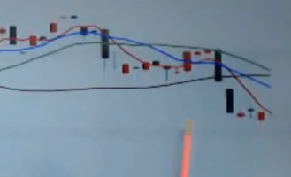
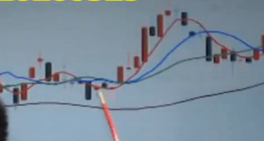

# 均线

## 上证指数的日线图

- **K 线**：红色的、黑色的**柱状**的
- **均线**：不同颜色**曲**线
  - 5 日均线：红色，表示近五天的收盘价的平均值
  - 10 日均线：蓝色
  - 20 日均线：绿色
  - 60 日均线：黑色

- **空投排列**：小级别的均线在大级别的均线下方（均线方向要相同，即同朝下）（比如这里的红色 5 日均线在最下面）（从大到小）
- **多投排列**：（反之）小级别在大级别之上（均线向上）（都有获得利益的空间）
- 强势背景：周线或者 月线严格多投排列（五日在最上、再是十日、二十日）

## 均线纠缠

当有强势背景的一般会“出水芙蓉”（向上）；否则就是“九阴白骨爪”（纠结过后向下）。上图为“出水芙蓉”。建议**等**快结束纠结的时候（向上伸爪）入股。

- 黄金交叉：五日均线（小级别）上穿十日均线（大级别）（且两条线都是向上）（买入）

- 死亡交叉：五日均线（小级别）下穿十日均线（大级别）
- 共振效果：交叉之后