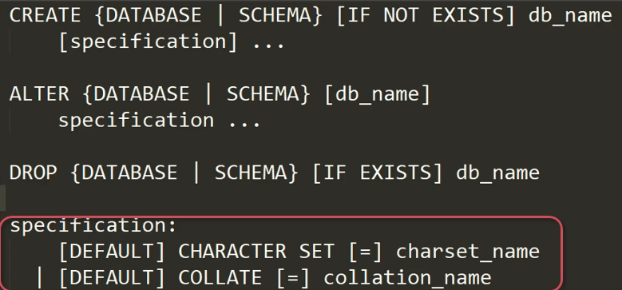
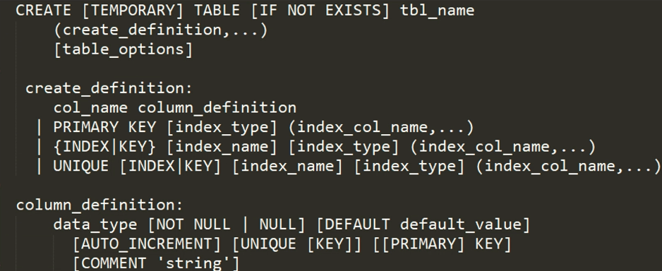
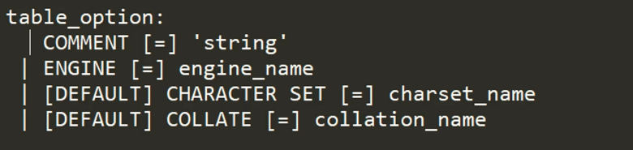
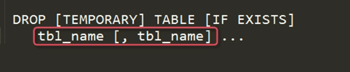

# 玩转 SQL

## 初识 SQL

- 什么是 SQL：一种描述性语言
- SQL 语言的作用：对存储再 RDBMS 中的数据进行增删改查等操作
- 常用的 SQL 语言的种类：DCL、DDL、DML、TCL
  - 数据库管理语句（Data Control Language，DCL）：管理数据库访问的，包括授权、建立用户等
  - 数据定义语句（Data Definition Language，DDL）：建立数据库对象，包括建表语句、修改表语句
  - **数据操作语句**（Data Manipulation Language，DML）：增删改查
  - 事务控制语句（TCL）：开启事务、提交事务、回滚事务
- 查看命令使用例子：`help create database`查看`create database`命令详细的使用信息

## DCL

- **create user**：建立数据库账号
- **grant**：对用户授权（只能授权当前用户下已有的权限）
- **revoke**：收回用户权限——revoke

**简单的使用例子**

- *CREATE USER* mc_class@'192.168.1.%' *IDENTIFIED WITH* 'mysql_native_password' by '1234567'
- *GRANT* select, delete, insert, update ON mysql.* *TO* mc_class@'192.168.1.%'
- *REVOKE* delete, insert, update ON mysql.* *FROM* mc_class@'192.168.1.%'

## DDL

- **create/alter/drop database**：建立/修改/删除数据库
- **create/alter/drop table**：建立/修改/删除表
- **create/drop index**：建立/删除索引
- **truncate table**：清空表（相当于 drop table 再 create table，并不会记录数据的删除日志，所以也无法通过日志进行数据的回复）
- **rename table**：重命名表
- **create/alter/drop view**：建立/修改/删除视图

### CREATE/ALTER/DROP DATABASE

- 删除的话，只能通过之前的备份恢复（如果做了备份的话）
- 可选的参数只有字符集和排序规则
- 例子：*CREATE DATABASE* imc_db



### CREATE TABLE

- TEMPORARY：表示要建立临时表，只有在当前线程可以使用，用户结束线程就删除（一般不不使用） 
- 表列定义部分，可以定义列的名称、列的数据类型、表的主键和索引
- 还可以定义列的属性（第三部分）：数据类型、是否可为空、是否有默认值、是否自增、是否唯一索引、是否主键、备注
- 还可以定义表的字符集和排序规则，如果没有定义，则使用数据库默认的字符集和排序规则





- auto_increment 只能运用在主键上
- 都定义为 NOT NULL 是为了优化表的查询性能
  - B 树索引中并不能使用空值来进行索
  - 设置默认值，为了使“不带有该字段的插入的数据”也可以被成功插入，该字段设置为默认值
  - 不设置默认值也是可以，但是“不带有该字段的插入的数据”插入将会失败报错
- time 的默认值为 ’0:00‘
- TIMESTAMP、datetime 的默认值为 'CURRENT_TIMESTAMP'
- enum('问答', '评论') 的默认值为 ‘评论’
- text 不需要 not null 或者 default
- 联合唯一索引`UNIQUE KEY udx_courseid_chaptername(course_id, chapter_name)`，表示只有这两列的组合是不能重复的

```mysql
DROP TABLE IF EXISTS `imc_subsection`;
/*!40101 SET @saved_cs_client     = @@character_set_client */;
 SET character_set_client = utf8mb4 ;
CREATE TABLE `imc_subsection` (
  `sub_id` int(10) unsigned NOT NULL AUTO_INCREMENT COMMENT '小节ID',
  `chapter_id` int(10) unsigned NOT NULL DEFAULT '0' COMMENT '章节ID',
  `course_id` int(10) unsigned NOT NULL DEFAULT '0' COMMENT '课程ID',
  `sub_name` varchar(50) NOT NULL DEFAULT '' COMMENT '小节名称',
  `sub_url` varchar(200) NOT NULL DEFAULT '' COMMENT '小节URL',
  `video_type` enum('avi','mp4','mpeg') NOT NULL DEFAULT 'mp4' COMMENT '视频格式',
  `sub_time` time NOT NULL DEFAULT '00:00:00' COMMENT '小节时长',
  `sub_no` tinyint(2) unsigned zerofill NOT NULL DEFAULT '00' COMMENT '章节编号',
  PRIMARY KEY (`sub_id`),
  UNIQUE KEY `udx_chapterid_courseid_subname` (`chapter_id`,`course_id`,`sub_name`)
) ENGINE=InnoDB AUTO_INCREMENT=9834 DEFAULT CHARSET=utf8 COMMENT='课程小节表';
/*!40101 SET character_set_client = @saved_cs_client */;
```

### ALTER TABLE


举个例子：

```mysql
-- -
-- 增加一个字段 is_recommand 是否推荐
-- -

ALTER TABLE imc_course
ADD is_recommand TINYINT DEFAULT 0 COMMENT '是否推荐，0 不推荐，1 推荐';
```

### DROP TABLE

可以一次性删除多个表：



### CREATE INDEX

详细语法：

```mysql
##
# 创建索引
##
CREATE [UNIQUE] INDEX index_name
    ON tbl_name (index_col_name, ...)
# [UNIQUE]：使用的列是否允许有重复数据
# index_name：索引名
# ON tbl_name：表示在哪张表上建立索引
# index_col_name：表示索引的列表（可配置升序降序））（具体如下）

index_col_name:
    col_name [(length)][ASC | DESC]
```

### DROP INDEX

```mysql
##
# 删除索引
##
DROP INDEX index_name ON tbl_name
```

杂记：

- 目的是提高数据的查询效率（主要目的是限制存储在表中的数据，包括主键索引、唯一索引，可以建立其他索引）（并不是越多越好）
- `CREATE/DROP INDEX`最后都会转换为`ALTER TABLE`来执行
- `DROP INDEX`并不会对表中的数据造成影响，但是会影响之前 MySQL 的执行计划

举个例子：

```mysql
-- -
-- 创建唯一索引
-- -
CREATE UNIQUE INDEX uqx_classname ON imc_class(class_name)

-- 如果之前表中的 class_name 包含相同的数据，则会创建失败
-- 创建成功后，如果插入该字段相同的数据，则会报错，插入失败
```

### CREATE VIEW

“视图”是一个逻辑存储结构，可以看作是一个虚拟的表，可以像操作表一样操作视图，但是视图中并**不存在任何数据**，所有的数据都是在查询的原表中。

详细语法：

```mysql
CREATE VIEW view_name
AS
	SELECT
		[ALL | DISTINCT | DISTINCTROW ]
		select_expr [, select_expr ...]
		[FROM table_references
         [WHERE where_condition]
```

举个例子：

```mysql
-- 定义一个包括课程 ID，课程名称，（课程分类，课程方向，课程难度）的视图（就是替换掉之前的 id）

CREATE VIEW vm_course
AS
SELECT a.course_id,a.title,b.class_name,c.type_name,d.level_name
FROM imc_course a
JOIN imc_class b ON b.class_id=a.class_id
JOIN imc_type c ON c.type_id=a.type_id
JOIN imc_level d ON d.level_id=a.level_id
;

SELECT * FROM vm_course;
```

## DML

- **insert into**：新增表中的数据
- **delete**：删除表中的数据
- **update**：修改表中的数据
- **select**：查询表中的数据

### INSERT INTO

详细语法：

```bash
INSERT
	[INTO] tbl_name[(col_name, ...)]
	{VALUES | VALUE}({expr | DEFAULT}, ...),(...),...
	[ ON DUPLICATE KEY UPDATE
	  col_name=expr
	  [, col_name=expr]
	  ...
	]
```

编写思路：

- 确定要把数据插入到哪张表中
- 确定表的数据结构，哪些列可以为 NULL，哪些列不可以为 NULL，对于不能为 NULL 的列是否有默认值
- 确定对应插入列的插入值的清单

举个例子：

```mysql
-- -
-- 查看 imc_class 表结构
-- -
SHOW CREATE TABLE imc_class

-- 从中可以看出，虽然每一个字段都不为空且有默认值，但`class_name`要修改
```

```mysql
-- -
-- 增加课程分类表的数据
-- -
INSERT INTO imc_class(class_name)
VALUES('MySQL')
ON DUPLICATE KEY UPDATE
add_time=CURRENT_TIME;
-- imc_class 设置 class_name 为 UNIQUE，则无法重复插入 'MySQL'（对应 create index）
-- ON DUPLICATE 表示如果出现重复插入，则更新 add_time
-- MySQL 提示 2 行受到影响是因为，先删除原来行，再补充新行，总共两次操作
```

### SELECT

包括以下子句：

- WHERE
- GROUP BY、HAVING
- ORDER BY
- LIMIT
- 比较运算符、逻辑运算符、聚合函数

详细语法：

```bash
SELECT
	[ALL | DEISTINCT | DISTINCTROW ]
	select_expr [, select_expr ...]
	[From table_references
	[WHERE where_condition]
	[GROUP BY {col_name | expr | position}]
	[HAVING where_condition]
	[ORDER BY {col_name | expr | position}
		[ASC | DESC], ...]
	[LIMIT {[offset,] row_count | row_count OFFSET offset}]
```

举个例子：

```mysql
-- 相当于其他语言的命令行语句，输出常量变量的值
SELECT 'HLLO ','MYSQL',2018+1;
-- | HELLO | MYSQL | 2018+1 |
-- | HELLO | MYSQL |  2019  |

SELECT 'XXXXMySQL' LIKE '_ysql';
-- | 'XXXXMySQL' like '_ysql' |
-- |                        0 |
```

```mysql
-- 基础用法
SELECT class_id,class_name
FROM imc_db.`imc_class`;
```

```mysql
-- 查询出所有课程名中包括 MySQL 的课程的课程名称
SELECT tile
FROM imc_course
WHERE title LIKE '%MYSQL%' -- 通配符，允许左右出现任意字符
```

```mysql
-- 学习人数大于等于 1000 人并且下雨等于 2000 人的课程都有哪一些？
-- 列出他们的课程标题和学习人数
SELECT title,study_cnt
FROM imc_course
WHERE study_cnt BETWEEN 1000 AND 2000
;
```

```mysql
-- NOT IN 的使用
-- 列出课程 id 不是 1, 3, 5, 7 的课程名称
SELECT title
FROM imc_course
WHERE course_id NOT IN (1, 3, 5, 7)
```

注意事项：

- 列出查询的字段：使用 * 号是爽，但是如果其中有不需要的字段，会影响 IO 性能，如果其中有 text 类型的，那就更不好了

### DELETE

详细语法：

```mysql
DELETE
	FROM table_name
	[WHERE where_condition]
	[ORDER BY ...]
	[LIMIT row_count]
```

编写思路：

- 确定要删除的数据存储在哪张表中 FROM、JOIN
- 确认删除数据的过滤条件               WHERE
- 确认是否只删除有限条数据           ORDER BY、LIMIT 子句

举个例子：

```mysql
-- 删除课程中没有章节信息的课程

-- SELECT a.course_id,a.title
DELETE a -- 因为是连表查询，所以要告诉 MySQL 要删除哪个表
FROM imc_course a
LEFT JOIN imc_chapter b ON b.course_id=a.course_id
WHERE b.course_id IS NULL

-- SELECT 的结果：
-- | course_id |     title     |
-- |       101 | MySQL 关联测试 |
```

```mysql
-- -
-- 删除课程方向表中重复的课程方向，
-- 对于存在重复的课程，保留方向 ID 最小的一条
-- 并在方向名称上增加唯一索引
-- -

DELETE a
FROM imc_type a
JOIN ( -- 使用 SELECT 结果作为虚拟表，
    SELECT type_name,MIN(type_id) AS min_type_id,COUNt(*) -- 列的别名需要 AS，表不需要
	FROM imc_type
	GROUP BY type_name HAVING COUNT(*) > 1; -- > 1 即有重复
	) b 
ON a.type_name=b.type_name AND a.type_id > min_type_id

-- 使用 SELECT 查出有重复的方向
-- | type_name | min_type_id |count(*) |
-- |  后端开发  |          2  |       2 |
-- |  前沿技术  |          5  |       2 |
-- |  数据库    |          8  |       2 |

CREATE UNIQUE INDEX uqx_typename ON imc_type(type_name) -- 创建唯一索引
```

### UPDATE

详细语法：

```mysql
UPDATE table_name
SET col_name1={expr1|DEFAULT}
	[, col_name2={expr2|DEFAULT}] ...
[WHERE where_condition]
[ORDER BY ...] -- 不常用
[LIMIT row_count] -- 不常用
```

编写思路：

- 确定要更新的数据在哪张表 UPDATE 子句
- 确定要更新的列和值            SET 子句
- 确定更新数据的条件            WHERE 子句

最好先 SELECT  确定无误之后，再 UPDATE

举个例子：

```mysql
-- -
-- 随机推荐 10 门课程
-- -

SELECT course_id
FROM imc_course
ORDER BY RAND() -- 随机排序
LIMIT 10;

-- 改写成 UPDATE
UPDATE imc_course
SET is_recommand = 1
ORDER BY RAND()
LIMIT 10;
```

```mysql
-- 利用课程评价表中的评分，更新课程表中课程的评分
UPDATE imc_course a
JOIN
(SELECT course_id -- course_id 用来连接
 	   ,AVG(content_score) AS avg_content
 	   ,AVG(level_score) AS avg_level
 	   ,AVG(logic_score) AS avg_logic
 FROM imc_classvalue
 GROUP BY course_id
) b ON a.course_id=b.course_id -- 先计算每门课的平均评分
SET a.content_score = b.avg_content
,a.level_score=b.avg_level
,a.logic_score=b.avg_logic
,a.score=b.avg_score
;
```

### JOIN 子句

使用 JOIN 关联多个表，包括：

- INNER JOIN（同时存在两张表的数据）
- OUTER JOIN：LEFT JOIN 或者 RIGHT JOIN


举个例子：

```mysql
-- -
-- INNER JOIN
-- -
-- 查询出每一门课程的课程 ID，课程名称和章节名称
SELECT a.course_id,a.title,b.chapter_name
FROM imc_course a
JOIN imc_chapter b ON b.course_id=a.course_id;

-- 如果有一门新课程，但是它没有任何章节，即 b 中的任何一条数据的 course_id 都不等于 a.course_id，所以查出来的数据为空（可以使用外关联）
```

```mysql
-- -
-- LEFT JOIN
-- -
SELECT a.course_id,a.title,b.chapter_name
FROM imc_course a
LEFT JOIN imc_chapter b ON b.course_id=a.course_id
;
-- | course_id |     title     | chapter_name |
-- |       101 | MySQL 关联测试 |    (NULL)    |
-- a left join，说明 a 在左边，a 中存在 b 中不存在的也显示
-- 即使在 imc_chapter 定义为 NOT NULL，但是查出来就是 NULL，没关系
-- 如果想 right join，就只改操作符，其他表的顺序不需要变化

-- -
-- 查询出只存在于课程表中，但是不存在于章节表中的课程（课程 ID、课程名）
-- 即查询出所有未录入章节的课程
-- -
-- 方式一
SELECT a.course_id a.tile
FROM imc_course a
WHERE a.course_id NOT IN (SELECT b.course_id from imc_chapter b)
;
-- 方式二
SELECT a.course_id a.title
FROM imc_course a
LEFT JOIN imc_chapter b ON b.course_id=a.course_id
WHERE b.course_id IS NULL -- 即使没有 SELECT 该字段，但还是可以取到
;
```

### GROUP BY 和 HAVING 子句

作用：

把结果集按照某些列分成不同的组，并对分组后的数据进行聚合操作。

注意点：

- SELECT 中出现的字段必须要在 GROUP BY 中出现，不然会聚合不正确（不报错）（受 sql_mode 影响）
- SELECT 可以带一个或者多个聚合函数
- WHERE 中不能使用聚合函数，所以只能使用 HAVING

举个例子：

```mysql
-- -
-- 统计每个分类下不同难度的课程的数量（还需要 > 3）
-- -
SHOW VARIABLES LIKE 'sql_mode'
;
-- | Variable_name | Value                                       |
-- |   sql_mode    | STRICT_TRANS_TABLES, NO_ENGINE_SUBSTITUTION |
-- 比较宽松的模式

-- 设置之后，GROUP BY level_name 会报错
SET SESSION sql='ONLY_FULL_GROUP_BY';

SELECT class_name,level_name,COUNT(*)
FROM imc_course a
JOIN imc_class b ON b.class_id=a.class_id
JOIN imc_level c ON c.level_id=a.level_id
GROUP BY class_name,level_name
-- GROUP BY level_name
HAVING COUNT(*) > 3 
;

-- GROUP BY level_name 执行结果（错误）：
-- | level_name | class_name | count(*) |
-- |    入门     |   大数据   |       22 |
-- |    初级     |   Hbase    |       28 |
-- |    高级     |   大数据    |       24 |
-- |    中级     |   MySQL    |       27 |
-- 可以看出只按照了 level_name 进行分组，class_name 不止这么几个

-- GROUP BY class_name,level_name 执行结果（正确）（共 n * m 列）：
-- | level_name | class_name | count(*) |
-- |    入门     |   大数据   |       4 |
-- |    初级     |   Hbase    |      4 |
-- |    高级     |   大数据    |      5 |
-- |    中级     |   MySQL    |       6 |
-- |    入门     |   MySQL   |       4 |
-- |    中级     |  安全测试  |       5 |
-- |    高级     |   安全测试   |      3 |
-- |    高级     |    Hbase    |      5 |
-- |    高级     |   MongoDB  |      5 |
```

### ORDER BY 子句

```mysql
-- 查询出每一门课程的学习人数，并按学习人数从高到低排列
SELECT titlt, study_cnt
FROM imc_course
ORDER BY study_cnt DESC -- 降序
;
```

### LIMIT 子句

- 常用于数据列表分页
- 一定要和 ORDER BY 子句配合使用（为了保证每次都是按照相同的顺序排列）
- LIMIT 需要两个参数：起始偏移量、结果集的行数

```mysql
-- 分页返回课程 ID 和课程名称，每页返回 10 行记录（按学习人数从高到低排列）
SELECT course_id, title
FROM imc_course
ORDER BY study_cnt DESC -- 降序
LIMIT 0,10 -- 偏移量、结果集行数
;
```

### MySQL 的比较运算符

|      比较运算符      |                     说明                      |
| :------------------: | :-------------------------------------------: |
|  = > < >= <= < > !=  |             <> 和 != 都表示不等于             |
| BETWEEN min AND max  |     列的值大于等于最小值，小俞等于最大值      |
| IS NULL、IS NOT NULL | 判断列的值是否为 NULL（=NULL 是查询不出来的） |
|    LIKE、NOT LIKE    |    % 代表任何数量的字符 _代表任何一个字符     |
|      IN、NOT IN      |         判断列的值是否在指定的范围内          |

### MySQL 的逻辑运算符

| 逻辑运算符 |                        说明                        |
| :--------: | :------------------------------------------------: |
|  AND, &&   |      AND 两边的表达式都为真时，返回的结果为真      |
|  OR, \|\|  |    OR 两边的表达式有一条为真时，返回的结果为真     |
|    XOR     | XOR 量表的表达式一真一假时返回真，两真两假时返回假 |

任何运算符和 NULL 值运算结果都为 NULL

### MySQL 常用的聚合函数

|        逻辑运算符        |               说明               |
| :----------------------: | :------------------------------: |
| COUNT(*)/COUNT(col_name) |      计算符合条件的数据行数      |
|      SUM(col_name)       | 计算表中符合条件的数值列的合计值 |
|      AVG(col_name)       | 计算表中符合条件的数值列的平均值 |
|      MAX(col_name)       |                                  |
|      MIN(col_name)       |                                  |

举个例子：

```mysql
-- 统计课程表的总课程数
-- SELECT COUNT(*)
SELECT COUNT(course_id), COUNT(DISTINCT user_id) -- 去重，共有几个讲师
FROM imc_course
;

-- 二者效果相同
-- | count(course_id) | count(distinct user_id) |
-- |              101 |                       5 |
```

```mysql
-- -
-- 查询出学习人数最多的课程
-- -

SELECT title, study_cnt
FROM imc_course
WHERE study_cnt = ( SELECT MAX(study_count) FROM imc_course )
;
-- 子查询的结果：         最后查询结果：
-- | max(study_cnt) |   | title | study_cnt |
-- |           9939 |   | MySQL |      9939 |
```

### MySQL 的系统函数

#### 时间函数

|              函数名               |                             说明                             |
| :-------------------------------: | :----------------------------------------------------------: |
|        CURDATE()/CURTIME()        |                  返回当前日期/返回当前时间                   |
|               NOW()               |                     返回当前的日期和时间                     |
|       DATE_FORMAT(date,fmt)       |             按照fmt的格式，对日期date进行格式化              |
|       SEC_TO_TIME(seconds)        |                 把秒数转换为（小时：分：秒）                 |
|         TIME_TO_SEC(time)         |               把时间（小时：分：秒）转换为秒数               |
|       DATEDIFF(date1,date2)       |              返回date1和date2两个日期相差的天数              |
| DATE_ADD(date,INTERVAL expr unit) | 对给定的日期增加或减少指定的时间单元（unit：DAY/HOUR/MINUTES/SECOND） |
|      EXTRACT(unit FROM date)      |                   返回日期 date 的指定部分                   |
|         UNIX_TIMESTAMP()          |                   返回 unix 时间戳（秒数）                   |
|          FROM_UNIXTIME()          |                 把 unix 时间戳转换为日期时间                 |

- 将时间类型保存为字符串的缺点：占用更多的存储空间；无法对时间做有效的检测、运算
- **不建议将时间类型保存为时间戳整型**：因为中间多了一步转换过程，不方便（所以最后两个恨少用了）

举个例子：

```mysql
-- -
-- CURDATE/CURTIME/NOW/DATE_FORMAT
-- -
SELECT CURDATE(),CURTIME(),NOW(),DATE_FORMAT(NOW(),'%Y%m%d %H:%i:%s');
-- | curdate()  | curtime() |             now() | date_format(now(), '%Y%m%d %H:%i:%s') |
-- | 2019-03-02 |  03:23:01 |2019-03-02 03:23:01| 20190302 03:23:01                     |
```

```mysql
-- -
-- SEC_TO_TIME/TIME_TO_SEC
-- -
SELECT SEC_TO_TIME(60),TIME_TO_SEC('1:00:00')
-- | sec_to_time(60) | time_to_sec('1:00:00') |
-- | 00:01:00        | 3600                   |
```

```mysql
-- -
-- DATEDIFF
-- -
SELECT title, DATEDIFF(NOW(), online_time)
FROM imc_course
ORDER BY 2 DESC -- 根据天数，降序排序
-- | title | datediff(now(), online_time) |
-- | mysql |                           43 |
-- | redis |                           36 |
```

```mysql
-- -
-- DATE_ADD
-- -
SELECT NOW(),DATE_ADD(NOW(),INTERVAL 1 DAY) -- 当前时间 +1 天
SELECT NOW(),DATE_ADD(NOW, INTERVAL -1 YEAR) -- 当前时间 -1 年
SELECT NOW(),DATE_ADD(NOW, INTERVAL '-1:30' HOUR_MINUTE) -- 当前时间减 1:30
```

```mysql
-- -
-- EXTRACT
-- -
SELECT NOW(),EXTRACT(YEAR FROM NOW()),EXTRACT(DAY FROM NOW()) -- 提取当前时间的年份

```

#### 字符串函数

|              函数名              |                          说明                          |
| :------------------------------: | :----------------------------------------------------: |
|      CONCAT(str1,str2,...)       |           把字符串str1,str2连接成一个字符串            |
|   CONCAT_WS(sep,str1,str2,...)   |             用指定的分隔符 sep 连接字符串              |
|         CHAR_LENGTH(str)         |               返回字符串 str 的字符个数                |
|           LENGTH(str)            |               返回字符串 str 的字节个数                |
|       FORMAT(X,D[,locale])       |   将数字 X 格式化，“#,###,###.##”，并舍入到 D 位小数   |
|   LEFT(str,len)/RIGHT(str,len)   |          从字符串的左/右起返回 len 长度的子串          |
|     SUBSTRING(str,pos,[len])     |    从字符串 str 的 pos 位置起返回长度为 len 的子串     |
| SUBSTRING_INDEX(str,delim,count) | 返回字符串 str 按 delim（分隔符）分割的前 count 个子串 |
|        LOCATE(substr,str)        |    在字符串 str 钟返回子串 substr 第一次出现的位置     |
|     TRIM([remstr FROM] str)      |        从字符串 str 两端删除不需要的字符 remstr        |

举个例子：

```mysql
-- -
-- CONCAT_WS
-- 出于 SEO 优化的目的，需要合并显示课程分类名称和课程标题
-- -

SELECT CONCAT_WS('||',class_name,title)
FROM imc_course a
JOIN imc_class b ON b.class_id=a.class_id
-- | concat_ws('||',class_name,title) |
-- | docker||课程-324234              |
-- | docker||课程-324212              |
```

```mysql
-- -
-- LENGTH/CHAR_LENGTH
-- -

SELECT class_name,LENGTH(class_name),CHAR_LENGTH(class_name)
FROM imc_class
-- | class_name | length(class_name) | char_length(class_name) |
-- | AI         |                 2  |                      2  |
-- | Docker     |                 6  |                      6  | -- 一个字母，一个字节
-- | 大数据      |                 9  |                      3  |
-- | 运维        |                 6  |                      2  | -- 一个汉字，三个字节

```

#### 其他函数

|                            函数名                            |                          说明                           |
| :----------------------------------------------------------: | :-----------------------------------------------------: |
|                          ROUND(X,D)                          |           对数值 X 进行四舍五入保留 D 位小数            |
|                            RAND()                            |             返回一个在 0 和 1 之间的随机数              |
| CASE WHEN [condition]<br />THEN result<br />[WHEN [condition] THEN result...] [ELSE result] END | 用于实现其他语言钟的 case...when 功能，提供数据流控制。 |
|                           MD5(str)                           |                   返回 str 的 MD5 值                    |

```mysql
SELECT user_nick,
	CASE WHEN sex = 1 THEN '男'
		 WHEN sex = 0 THEN '女'
		 ELSE '未知'
	END AS '性别'
FROM imc_user
WHERE CASE WHEN sex = 1 THEN '男'
		 WHEN sex = 0 THEN '女'
		 ELSE '未知'
	END = '男'
;
```

## SQL 高级特性——公用表表达式

在上面的例子中，都使用到“子查询”这一功能（存在于查询中的查询），然后在 MySQL 有更好的选择。

公用表表达式 CTE（Common Table Expressions）：

- MySQL 8.0 之后的版本才可以使用
- CTE 生成一个命名临时表，并且**只在查询期间有效**
- CTE 临时表在一个查询中**可以多次引用**及自引用

详细语法：

```mysql
WITH [RECURSIVE] -- [RECURSIVE] 可以用于递归回复评论 replyid
cte_name [(column_list)] AS (
	query
)
[, cte_name [(column_list)] AS (
	query
)]

SELECT * FROM cte_name;
```

举个例子：

```mysql
WITH cte AS (
	SELECT title,study_cnt,class_id
    FROM imc_course
    WHERE study_cnt>2000
)

SELECT * FROM cte
UNION ALL
SELCT * FROM cte
ORDER BY title
```

## SQL 高级特性——窗口函数

窗口函数指的是一组记录所执行的函数，符合条件的每一个窗口都会执行这个函数。

详细语法：

```mysql
function_name([exp])
OVER(
	[PARTITION BY exp [, ...]]
    [ORDER BY exp [ASC|DESC][,...]]
)
```

|    函数名    |                             说明                             |
| :----------: | :----------------------------------------------------------: |
|   聚合函数   |                聚合函数都可以作为窗口函数使用                |
| ROW_NUMBER() |                   返回窗口分区内数据的行号                   |
|    RANK()    | 类似于 row_number，只是对于相同数据会产生重复的行号，之后的数据行号会产生间隔 |
| DENSE_RANK() | 类似于 rank 区别在于当组内某行数据重复时，虽然行号会重复，但后续杭后不会产生间隔 |

举个例子：

```mysql
-- -
-- 按学习人数对课程进行排名，并
-- 列出每类课程学习人数排名前 3 的课程名称，学习人数以及名次。
-- -

WITH tmp AS (
SELECT class_name,title,score
	,RANK() OVER(PARTITION BY class_name ORDER BY score DESC) AS cnt
FROM imc_course a
JOIN imc_class b ON b.class_id=a.class_id;
)
;
SELECT *
FROM tmp
WHERE cnt <=3
;

-- | class_name | title                 | score | cnt |
-- | Docker     | PostgreSQL 课程-85484 | 9.1    | 1   |
-- | Docker     | PostgreSQL 课程-85584 | 9.1    | 1   |
-- | Docker     | PostgreSQL 课程-85884 | 9.1    | 1   |
-- | Docker     | PostgreSQL 课程-12334 | 9.1    | 1   |
-- | Hbase      | PostgreSQL 课程-44334 | 9.8    | 1   |
-- | Hbase      | PostgreSQL 课程-44335 | 9.3    | 2   |
-- | Hbase      | PostgreSQL 课程-44337 | 9.3    | 2   |
```

## SQL 开发中易犯的错误

- :x:使用`COUNT(*)`判断是否存在符合条件的数据（存在一个就行）
- :white_check_mark:使用 SELECT ... LIMIT 1（只返回一条，因为这样可以使用上 LIMIT 优化）（对上）
- :x:在执行一个更新语句后，使用查询方式判断此更新语句是否有执行成功
- :white_check_mark:使用 ROW_COUNT() 函数判断修改行数（对上）
- :x:试图在 ON 条件中过滤不满足条件的记录
- :white_check_mark:要在 WHERE​（对上）
- :x:对于表中定义的具有 NOT NULL 和 DEFAULT 值的列，在插入数据时候直接插入 NULL 值（报错的）