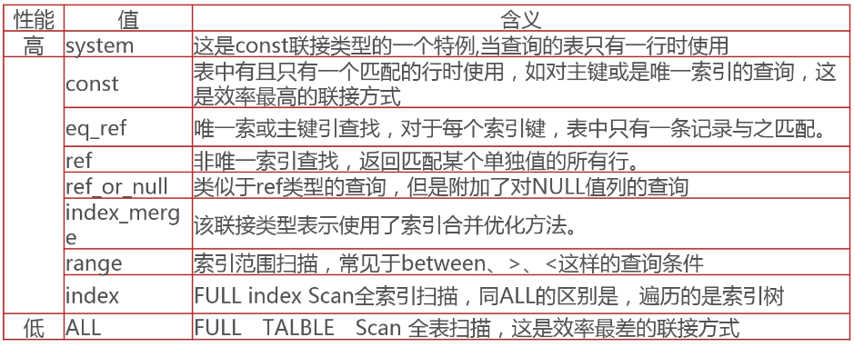
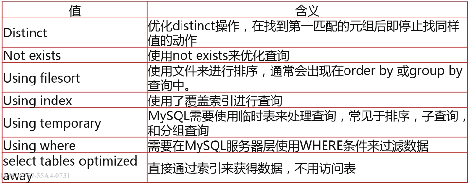

# SQL 优化步骤

一般步骤：发现问题 -> 分析执行计划（MySQL 处理 SQL 的方式） -> 优化索引（是否能正确使用索引） -> 改写 SQL（是否可以分解为几个简单的 SQL）

如果以上方式不行，还可以数据库垂直切分、数据库水平切分

## 常见问题发现渠道

- 用户主动上报应用性能问题（被动）（最好不要）
- 分析慢查询日志发现存在问题的 SQL（可以指定时间阈值，当执行时间超过该阈值，就会被记录）（慢查询日志记录还是存在延迟的）
- 数据库实时监控长时间运行的 SQL

## 慢查询日志

### 配置

- 打开开关：set global slow_query_log = [ ON | OFF ]
- 日志输出文件：set global slow_query_log_file = /sql_log/slowlog.log
- 设置时间阈值：set global long_query_time = xx.xxx 秒（工作中一般设置为 0.001）
- 记录所有未使用索引的 SQL：set global log_queries_not_using_indexes = [ ON | OFF ]

### 分析工具

如果将阈值设置得很小，那每天就会产生大量的日志，人工很难分析。

- mysqldumpslow [OPTS...] [LOGS...]（mysql 自带）
- pt-query-digest [OPTIONS] [FILES] [DSN]（下载 [percona](https://www.percona.com/)）

主要关注运行次数特别多的 SQL、扫描行远远大于输出行的 SQL

## 实时监控

```mysql
SELECT id,`user`,`host`,DB,command,`time`,state,info
FROM information_schema.PROCESSLIST
WHERE TIME>=60
;
```

## SQL 的执行计划

### 为什么要关注 SQL 的执行计划

- 了解 SQL 如何访问表中的数据（是全盘扫描，还是索引扫描，还是索引查找）
- 了解 SQL 如何使用表中的索引（是否使用了正确的索引）
- 了解 SQL 所使用的查询类型（是否使用到了子查询、关联查询）

### 获取 SQL 的执行计划

就是在之前的 SQL 的语句前加入`EXPLAIN`关键词即可，详细语法如下：

```mysql
EXPLAIN
	{explainable_stmt | FOR CONNECTION connection_id}

explainable_stmt: {
	SELECT statement
	| DELETE statement
	| INSERT statement
	| REPLACE statement
	| UPDATE statement
}
```

举个例子：

```mysql
EXPLAIN
SELECT course_id,class_name,level_name,title,study_cnt
FROM imc_course a
JOIN imc_class b ON b.class_id=a.class_id
JOIN imc_level c ON c.level_id=level_id
WHERE study_cnt > 3000
;
-- EXPLAIN + 其他语句
-- | id | select_type | table | partitions | type | possible_keys | key | key_len | ref |
-- | 1  | SIMPLE      | C     | (...0K     | ALL  | PRIMARY       | NULL| NULL    | NULL|
-- | 1  | SIMPLE      | a     | (...0K     | ALL  | idx_classid   | NULL| NULL    | NULL|
-- | 1  | SIMPLE      | b     | (...0K     | eq_ref| PRIMARY      | PRIMARY| 2    | NULL|
```

### 分析 SQL 的执行计划（例中结果的字段）

#### id 

表示查询执行的顺序。ID 相同时由上到下执行；ID 不同时由大到小执行。

#### select_type

|         值         |                             含义                             |
| :----------------: | :----------------------------------------------------------: |
|       SIMPLE       |              不包含子查询或是 UNION 操作的查询               |
|      PRIMARY       | 查询中如果包含任何子查询，那么最外层的查询则被标记为 PRIMARY |
|      SUBQUERY      |                    SELECT 列表中的子查询                     |
| DEPENDENT SUBQUERY |                     依赖外部结果的子查询                     |
|       UNION        |                                                              |
|  DEPENDENT UNION   |                                                              |
|    UNION RESULT    |                                                              |
|      DERIVED       |                                                              |

#### table

指明是从哪个表中获取数据，取值可能入下：

- 表名
- `<union M,N>` 由 id 为 M, N 查询 union 产生的结果集
- `<derived N> / <subquery N>` 由 id 为 N 的查询产生的结果

#### partitions

对于分区表，显示查询的分区 id；对于非分区表，显示 NULL

#### type



####  filtered

表示返回结果的行数占需读行数的百分比（越高越好）

#### rows

根据统计信息预估的扫描行的数量

#### extra

