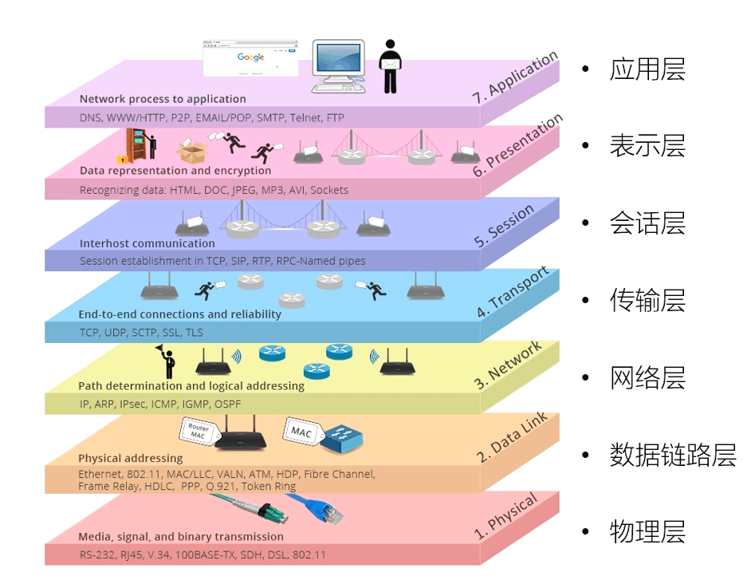
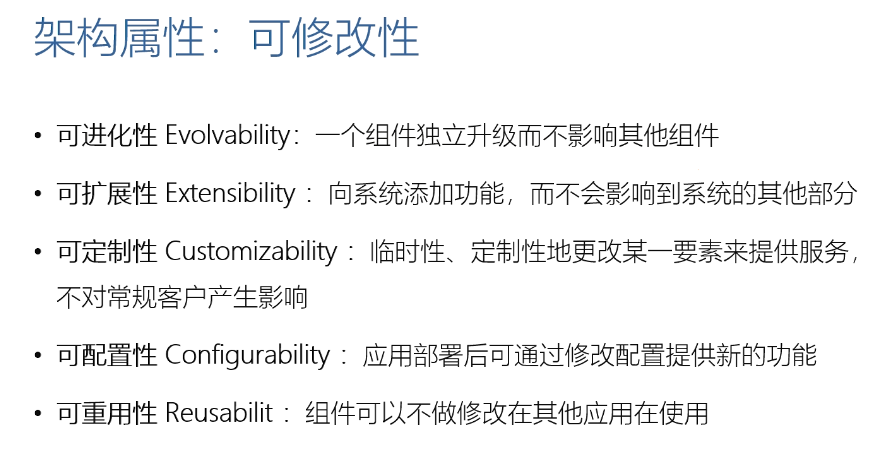

# HTTP 1.1 协议

## [03 | 浏览器发起HTTP请求的典型场景](https://time.geekbang.org/column/article/93588)

典型过程如下所示，可以看到是先建立 TCP 连接，再发起 HTTP 请求

## [04 | 基于ABNF语义定义的HTTP消息格式](https://time.geekbang.org/column/article/93589)

### ABNF（扩充巴科斯-瑙尔范式）操作符

- 空白字符：用来分隔定义中的各个元素，例如：
  - method SP request-target SP HTTP-version CRLF（中间的空格就是空白字符，SP 是 ABNF 中的核心规则）
- 选择 /：表示多个规则都是可供选择的规则
  - start-line = request-line / status-line
- 值范围 %c##-##：
  - OCTAL = "0"/"1"/"2"/"3"/"4"/"5"/"6"/"7" 与 OCTAL=%x30-37 等价（OCTAL 表示八进制）（%x30-37 表示对应的十六进制，比较方便）
- 序列组合 ()：将规则组合起来，视为单个元素
- 不定量重复 m*n：要表示一个元素的重复，就要使用`<m>*<n>元素`形式。可选的`<m>`给出要包含的元素的最小数目，默认为0；可选的`<n>`给出要包含的元素的最大数目，默认为无穷大。例如：
  - `*元素`表示零个或更多元素
  - `1*元素`表示一个或更多元素
  - `2*4元素`表示两个至四个元素
- 可选序列 []，例如：
  - [ message-body ]

### 核心规则

核心规则定义于ABNF标准中。

|   规则    |                 形式定义                  |                  意义                   |
| :-------: | :---------------------------------------: | :-------------------------------------: |
|   ALPHA   |             %x41-5A / %x61-7A             |     大写和小写ASCII字母（A-Z, a-z）     |
|   DIGIT   |                  %x30-39                  |               数字（0-9）               |
|  HEXDIG   | DIGIT / "A" / "B" / "C" / "D" / "E" / "F" |      十六进制数字（0-9, A-F, a-f）      |
|  DQUOTE   |                   %x22                    |                 双引号                  |
|  **SP**   |                   %x20                    |                  空格                   |
| **HTAB**  |                   %x09                    |               横向制表符                |
|    WSP    |                 SP / HTAB                 |            空格或横向制表符             |
|   LWSP    |             *(WSP / CRLF WSP)             |          直线空白（晚于换行）           |
|   VCHAR   |                  %x21-7E                  |            可见（打印）字符             |
|   CHAR    |                  %x01-7F                  | 任何7-位US-ASCII字符，不包括NUL（%x00） |
| **OCTET** |                  %x00-FF                  |                 8位数据                 |
|    CTL    |              %x00-1F / %x7F               |                控制字符                 |
|    CR     |                   %x0D                    |                  回车                   |
|    LF     |                   %x0A                    |                  换行                   |
| **CRLF**  |                   CR LF                   |             互联网标准换行              |
|    BIT    |                 "0" / "1"                 |               二进制数字                |

### 基于 ABNF 描述的 HTTP 协议格式

主体：**HTTP-message = start-line *(header-field CRLF) CRLF [ message-body ]**

可以看出 HTTP-message 中，一定有 start-line、一个空行，可能有零个多个 header-field。message-body 是可选的。

将主体拆分为三部分，分别为 start-line、header-field、message-body：

**start-line = request-line / status-line**

- request-line = method SP request-target SP HTTP-version CRLF
- status-line = HTTP-version SP status-code SP reason-phrase CRLF

**header-field = field-name ":" OWS field-value OWS**

- OWS = *(SP / HTAB)，表示在 field-name: 和 field-value 之间可以存在任意数量的空格或者是制表符
- field-name = token
- field-value = *（field-content / obs-fold）

**message-body = *OCTET**，表示以二进制的方式来传递

### 举个例子

上部分 GET 为请求，下部分 HTTP/1.1 为响应，可以观察 ABNF 语法对应表示。

## [05 | 网络为什么要分层：OSI模型与TCP/IP模型](https://time.geekbang.org/column/article/93590)

### OSI 模型

### OSI 模型与 TCP/IP 对照

### 报文头部

## [07 | 评估Web架构的七大关键属性](https://time.geekbang.org/column/article/93592)

总共有以下七大关键属性：

再细看其中的两个属性：

## [08 | 从五种架构风格推导出HTTP的REST架构](https://time.geekbang.org/column/article/93593)

在每种架构风格下，有多种相应的架构实现。这里太过抽象复杂，可以先跳过。

## [09 | 如何用Chrome的Network面板分析HTTP报文](https://time.geekbang.org/column/article/93594)

## [10 | URI的基本格式以及与URL的区别](https://time.geekbang.org/column/article/93595)

没有 URI 如果想分享一部电影，需要完成以下 5 个步骤；当有了 URI 一串字符就表达了以下步骤。

URI 想取代 URL 和 URN 的概念

## [11 | 为什么要对URI进行编码？](https://time.geekbang.org/column/article/93824)

## [12 | 详解HTTP的请求行](https://time.geekbang.org/column/article/94392)

请求行的 ABNF 定义为 request-line = method SP request-target SP HTTP HTTP-version CRLF。

例如 GET / HTTP/1.1 Host:

## [13 | HTTP的正确响应码](https://time.geekbang.org/column/article/94633)

## [14 | HTTP的错误响应码](https://time.geekbang.org/column/article/94634)

## [15 | 如何管理跨代理服务器的长短连接？](https://time.geekbang.org/column/article/94635)

## [16 | HTTP消息在服务器端的路由](https://time.geekbang.org/column/article/95789)

## [17 | 代理服务器转发消息时的相关头部](https://time.geekbang.org/column/article/95790)

## [18 | 请求与响应的上下文](https://time.geekbang.org/column/article/96974)

## [19 | 内容协商与资源表述](https://time.geekbang.org/column/article/96975)

## [20 | HTTP包体的传输方式（1）：定长包体](https://time.geekbang.org/column/article/96976)

## [21 | HTTP包体的传输方式（2）：不定长包体](https://time.geekbang.org/column/article/96977)

## [22 | HTML form表单提交时的协议格式](https://time.geekbang.org/column/article/98316)

## [23 | 断点续传与多线程下载是如何做到的？](https://time.geekbang.org/column/article/98398)

## [24 | Cookie的格式与约束](https://time.geekbang.org/column/article/98407)

## [25 | Session及第三方Cookie的工作原理](https://time.geekbang.org/column/article/98408)

## [26 | 浏览器为什么要有同源策略？](https://time.geekbang.org/column/article/98912)

## [27 | 如何“合法”地跨域访问？](https://time.geekbang.org/column/article/98913)

## [28 | 条件请求的作用](https://time.geekbang.org/column/article/98914)

## [29 | 缓存的工作原理](https://time.geekbang.org/column/article/99532)

## [30 | 缓存新鲜度的四种计算方式](https://time.geekbang.org/column/article/99533)

## [31 | 复杂的Cache-Control头部](https://time.geekbang.org/column/article/99534)

## [32 | 什么样的响应才会被缓存](https://time.geekbang.org/column/article/99543)

## [33 | 多种重定向跳转方式的差异](https://time.geekbang.org/column/article/99551)

## [34 | 如何通过HTTP隧道访问被限制的网络](https://time.geekbang.org/column/article/99552)

## [35 | 网络爬虫的工作原理与应对方式](https://time.geekbang.org/column/article/99555)

## [36 | HTTP协议的基本认证](https://time.geekbang.org/column/article/100972)

## [37 | Wireshark的基本用法](https://time.geekbang.org/column/article/100973)

## [38 | 如何通过DNS协议解析域名？](https://time.geekbang.org/column/article/100974)