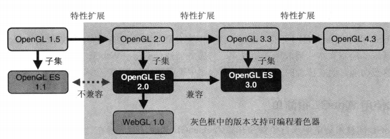
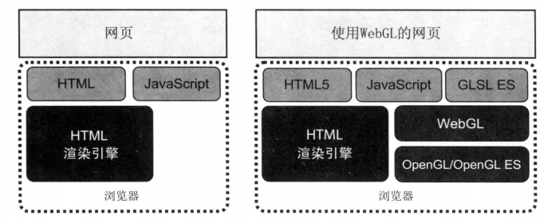
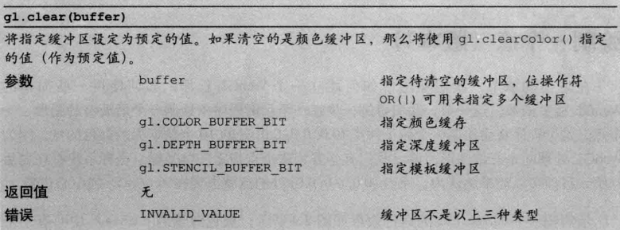
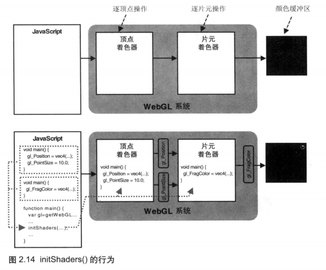
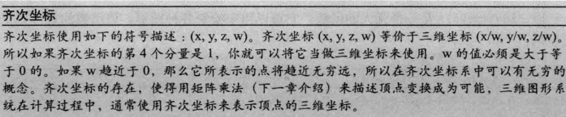
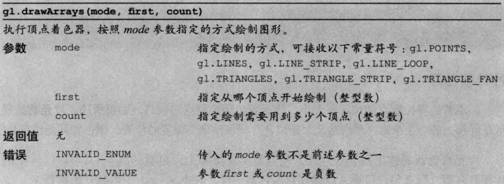
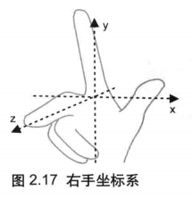
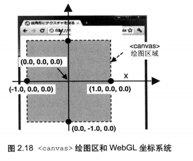

# WebGL 入门

WebGL 是一项用来在网页上绘制和渲染复杂三维图形，并允许用户与之进行交互的**技术**。

## WebGL 的优势

- 使用文本编辑器开发三维应用（同前端）
- 轻松发布三维图形程序（同前端）
- 轻松发布三维图形程序（同前端）
- 充分利用浏览器的功能（只是网页的一部分）
- 学习和使用 WebGL 很简单（技术规范继承自免费和开源的 OpenGL 标准）

## WebGL 的起源

在个人计算机使用最广泛的两种三维图形渲染技术是 **Direct 3D** 和 **OpenGL**。

Direct 3D 是微软 DirectX 技术的一部分，主要用于 Windows 平台；OpenGL 在多种平台上有广泛使用（因为免费、开源）。

WebGL 是从 OpenGL 的一个特殊版本 OpenGL ES （2.0）中派生出来：

- OpenGL 对三维图形开发、软件产品开发，甚至点应制作产生了深远的影响
- OpenGL ES 专用于嵌入式计算机、之恩那个手机、家用游戏机等设备；大火的原因是添加新特性的同时从 OpenGL 中移除了很多无用的旧特性，保持轻量同时能力强大
- OpenGL ES 被标准化为特定版本 OpenGL（OpenGL 1.5 和 OpenGL 2.0）的子集
- OpenGL ES 2.0 基于 OpenGL 着色器语言（GLSL），因此又被称为 OpenGL ES 着色器语言（GLSL ES）



## WebGL 程序的结构



因为通常 GLSL ES 是（以字符串的形式）在 JavaScript 中编写，所以和传统的动态网页是相同的结构。

## Canvas 是什么？

绘制了一个正方形：获取一个 canvas 对象，从中拿到 `getContext('2d')`（绘图环境），设置 fillStyle，最后绘制 ctx.fillRect。

绘制二维图形的三个步骤：获取 canvas 元素、获取绘图上下文、开始绘图。

## 最短的 WebGL 程序：清空绘图区

```javascript
var  gl = canvas.getContext('webgl'); // 命名为 gl 是为了和 OpenGL ES 的函数名对应起来（gl.clearColor() 对应 glClearColor()） 

gl.clearColor(1, 0, 0, 1); // 设置 canvas 的背景色（红色）// 范围是 [0, 1] // 设置之后，后面就记住了

gl.clear(gl.COLOR_BUFFER_BIT);
// gl.COLOR_BUFFER_BIT = 16384
// 清空绘图区域，实际上是清空颜色缓冲区（color buffer），传递参数 gl.COLOR_BUFFER_BIT 告诉 WebGL 清空颜色缓冲区（还有 深度缓冲区、模板缓冲区等）
```



**清空缓冲区的默认颜色及其相关函数**

| 缓冲区名称 |        默认值         |                相关函数                |
| :--------: | :-------------------: | :------------------------------------: |
| 颜色缓存区 | (0.0, 0.0., 0.0, 0.0) | gl.clearColor(red, green, blue, alpha) |
| 深度缓冲区 |          1.0          |          gl.clearDepth(depth)          |
| 模板缓冲区 |           0           |           gl.clearStencil(s)           |

## 着色器是什么？

在代码中，着色器程序是以字符串的形式“嵌入”在 JavaScript 文件中，在程序真正运行前就已经设置好了（例如第 7 行和第 14 行）。

```javascript
//Chapter 2
//Temp 02

//绘制一个点
// 接触着色器语法

// 1*. 顶点着色器程序*
var VSHADER_SOURCE = 
`void main() {
	gl_Position = vec4(0.5, 0.5, 0, 1);
	gl_PointSize = 10.0;
}`;

// 2*. 片元着色器程序*
var FSHADER_SOURCE = 
`void main() {
	gl_FragColor = vec4(1, 0, 0, 1);
}`;

ready(() => {
	var canvas = document.getElementById('webgl');

	if ( !canvas ) {
		console.error('Failed to retrieve the <canvas> element!');
		return ;
	}

	var  webgl = canvas.getContext('webgl'); //标准还未实施

	// 3*. 初始化着色器*
	if ( !initShaders( webgl, VSHADER_SOURCE, FSHADER_SOURCE) ) {
		console.error('Failed to initialize shaders!');
	}

	webgl.clearColor(0, 0, 0, 0.6);
	webgl.clear(webgl.COLOR_BUFFER_BIT);

	// 4*. 画点*
	webgl.drawArrays(webgl.POINTS, 0, 1);
});
```

WebGL 需要两种着色器：

- **顶点着色器**（Vertex shader）：描述**顶点特性**的程序（如位置、颜色等）。
- **片元着色器**（Fragment shader）：进行**逐片元处理过程**的程序（如光照）（片元理解为像素）。

## 初始化着色器

大部分 WebGL 程序都遵循这样的流程：

1. 获取 canvas 元素
2. 获取 WebGL 绘图上下文 context
3. **初始化着色器**
4. 设置 canvas 背景颜色
5. 清除 canvas
6. **绘图**

第三步“初始化着色器”调用了函数`initShaders()`对字符串形式着色器进行了初始化。这个函数是专门为本书编写的，定义在其他文件中被引用（使用见代码 3*）。

WebGL 不需要交换颜色缓冲区。

图 2.14 显示了辅助函数`initShaders()`的执行效果（简单表示，暂未研究内部细节）。只需要知道该函数在 WebGL 系统中初始化了着色器，供我们接下来使用。



## 顶点着色器

```javascript
var VSHADER_SOURCE = 
`void main() {
	gl_Position = vec4(0.5, 0.5, 0, 1);
	gl_PointSize = 10.0;
}`;
```

| 类型  |  内置变量名  |          描述          |
| :---: | :----------: | :--------------------: |
| vec4  | gl_Position  |      表示顶点位置      |
| float | gl_PointSize | 表示点的尺寸（像素数） |

- 必须包含一个没有返回值的 main() 函数（不能为 main 指定参数）（类似 C 语言程序）
- `gl_Position`、`gl_PointSize`为**内置变量**，为其赋值
- `gl_Position`变量必须被赋值（不然着色器无法正常工作）；`gl_PointSize`变量有默认值 1.0
- 类型赋值错误，就会出错，连 10.0 改为 10 都会错（一个浮点数，一个整数）（**GLSL ES** 是一种强类型的编程语言）

注意，复制给`gl_Position`的矢量中，添加了第 4 个分量（除了 XYZ）。由 4 个分量组成的矢量被称为**齐次坐标**，因为能够提高处理三维数据的效率。



## 片元着色器

顶点着色器控制点的位置和大小，片元着色器控制点的颜色。如前所述，片元就是显示在屏幕上的一个**像素**（严格意义上来说，片元包括这个像素的位置、颜色和其他信息）。

```javascript
var FSHADER_SOURCE = 
`void main() {
	gl_FragColor = vec4(1, 0, 0, 1); // 同样是内置变量
}`;
```

| 类型 |  内置变量名  |           描述            |
| :--: | :----------: | :-----------------------: |
| vec4 | gl_FragColor | 指定片元颜色（RGBA 格式） |

## 绘制操作



```javascript
webgl.drawArrays(webgl.POINTS, 0, 1);
// 设置第一个参数为 gl.POINTS，表示绘制单独的点
// 设置第二个参数为 0，表示从第 1 个顶点开始画起（虽然只有 1 个顶点）
// 设置第三个参数为 1，表示仅绘制 1 个点

// 当调用 gl.drawArrays() 时，顶点着色器将被执行 count 次，每次处理一个顶点。
```

## WebGL 坐标系统

三维坐标系统（笛卡尔坐标系）（右手坐标系）。面向计算机屏幕时，X 轴是水平的（正方向为右），Y 轴是垂直的（正方向为上?），Z 轴垂直于屏幕（正方向为外）。



如下图所示，WebGL 的坐标系和 canvas 绘图区的坐标系不同，需要将前者映射到后者（三维到二维），对应关系如下：

- canvas 中心点：对应 WebGL (0.0, 0.0, 0.0)
- canvas 左边缘和右边缘：对应 WebGL (-1.0, 0.0, 0.0) 和 (1.0, 0.0, 0.0)
- canvas 上边缘和下边缘：对应 WebGL (0.0, -1.0, 0.0) 和 (0.0, 1.0, 0.0)



**暂停到 37 页**