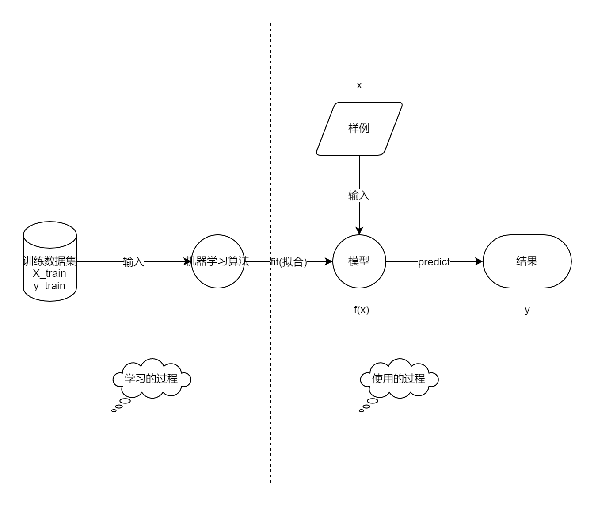
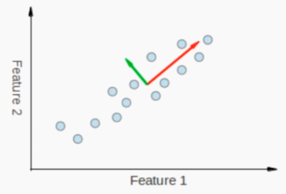
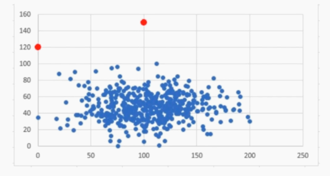
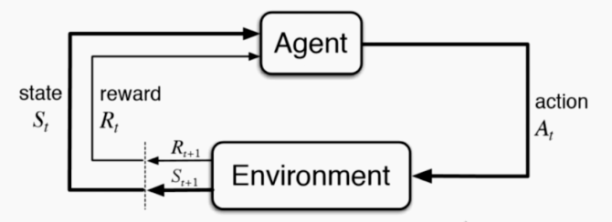
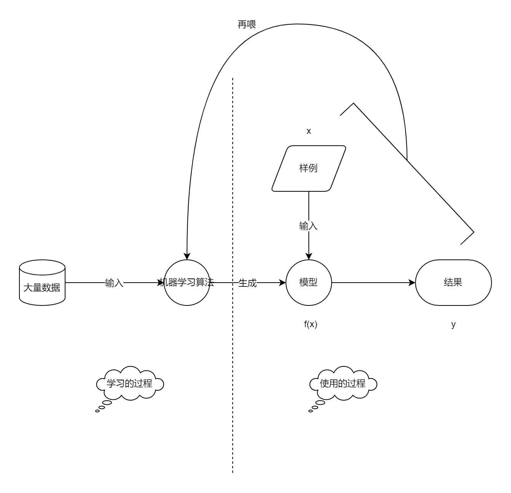

# 基础概念

- 逻辑回归是使用最多的机器学习算法（63.5%）
- 决策树 49.9%
- 随机森林 46.3%
- 神经网络 37.6%
- ……
- CNNs（18.9%）
- RNNs（12.3%）
- Other（8.3%）

## 机器学习世界的数据

| 萼片长度（sepal length） | 萼片宽度（sepal width） | 花瓣长度（petal length） | 花瓣宽度（petal width） | 种类（class）       |
| ------------------------ | ----------------------- | ------------------------ | ----------------------- | ------------------- |
| 5.1                      | 3.5                     | 1.4                      | 0.2                     | Iris-Setosa(0)      |
| 7.0                      | 3.2                     | 4.7                      | 1.4                     | Iris-Versicolour(1) |
| 6.3                      | 3.3                     | 6                        | 2.5                     | Iris-Virginica(2)   |

### 术语

- 数据整体——数据集（data set）
- 每一行数据——样本（sample）
- 除最后一列，每一列表——样本特征（feature）
- 最后一列——标记（label）

### 标记

- $ \begin{pmatrix} 5.1 & 3.5 & 1.4 & 0.2 \\ 7.0 & 3.2 & 4.7 & 1.4 \\ 6.3 & 3.3 & 6 & 2.5 \end{pmatrix} $ 记作 $X$（大写字母——矩阵），也表示为 $ \begin{pmatrix} (X^{(1)})^{T} \\ (X^{(2)})^{T} \\ (X^{(3)})^{T} \\ \cdots \end{pmatrix} $
- 第 $i$ 个样本（行）记为 $X^{(i)}$，也叫特征向量，一般是**列向量**，比如第一行竖着写 $ \begin{pmatrix} 5.1 \\ 3.5 \\ 1.4 \\ 0.2 \end{pmatrix} $
- 第 $i$ 个样本第 $j$ 个特征值记为 $X^{(i)}_{j}$，比如第一个样本的萼片长度是 5.1

- $ \begin{pmatrix} Iris-Setosa(0) \\ Iris-Versicolour(1) \\ Iris-Virginica(2) \end{pmatrix} $ 记作 $ y $（小写字母——向量），第 $ i $ 个样本记为 $ y^{(i)} $

### 特征空间

- 将上面四个特征降维至两个特征（利于可视化），这个称为特征空间（feature space）
- 分类任务本质——在特征空间切分（这里只是简单的一刀切）
- 在高维空间同理

最后，特征也可以很抽象，“图像”每一个像素点都是特征（彩色图像特征更多）

## 机器学习的任务分类

这是从“机器学习可以解决的问题”的角度分类的，分为“分类任务”和“回归任务”。

### 分类任务

- 二分类
- 多分类
- 多标签分类

### 回归任务

结果是一个连续数字的值，而非一个类别。比如房屋价格、市场分析、学生成绩、股票价格。一些情况下，回归任务可以简化成分类任务。

## 机器学习的算法分类

这是从“机器学习算法自身”的角度分类的，分为“监督学习”、“非监督学习”、“半监督学习”、“增强学习”。

### 监督学习

定义：给机器的**训练数据**拥有“标记”或者“答案”。

属于监督学习的算法有：

- K 近邻
- 线性回归和多项式回归
- 逻辑回归
- SVM
- 决策树和随机森林

### 非监督学习

定义：给机器的训练数据没有任何“标记”或者“答案”。

意义：

- 对没有“标记”的数据进行分类——聚类分析
- 对数据进行降维处理
  - 降维处理的意义：方便可视化（人不能理解四维以上的空间）
  - 特征提取。一个事物有很多特征，但是有一些特征对我们将要预测的结果的影响是没有信用的，比如：信用卡的信用评级和人的胖瘦无关
  - 特征压缩。主要手段 PCA。我们并不扔掉任何特征，而是有的特征关联性特别强（例如等比例增长，如图），可以将其作为一个特征
  - 异常检测（如图）

### 半监督学习

定义：给机器的训练数据，一部分有“标记”或者“答案”，另一部分数据没有。（各种原因导致标记缺失）（常见）。

过程：通常是先使用无监督学习手段对数据做处理，之后使用监督学习手段做模型的训练和预测。

### 增强学习

定义：根据周围环境的情况，采取行动，根据采取行动的结果（奖励/惩罚），学习行动。

Agent，代理，这里表示模型

## 机器学习的其他分类

### 批量学习（离线学习）

就是前期给算法喂了很多数据，产生一个模型，然后一直使用这个模型，输入样例产生结果，**不再变化**。（前期喂数据，后期不再变化）

- 优点：简单
- 问题：如何适应环境变化
- 解决方案：定时重新批量学习
- 方案缺陷：每次重新批量学习，运算量巨大；在某些环境变化非常快的情况下（比如股市），甚至不可能

### 在线学习

在“批量学习”的基础上，每次拿到“输入样例”和“对应的模型输出的正确结果”，再次训练，以改进模型。

- 优点：及时反映新的环境变化
- 问题：新的数据带来不好的变化
- 解决方案：需要加强对数据进行监控
- 其他：也适用于数据量巨大，完全无法批量学习的环境

### 参数学习

基于现有的数据（如图），我假设二者的关系是线性关系，即 f(x) = a * x + b，那我剩下要做的是根据数据求 a 和 b。

一旦学到了参数，就不再需要原有的数据集。

#### 非参数学习

不对模型进行过多假设（非参数不等于没有参数！）

## 机器学习的哲学思考

### 数据即算法？

曾经一度认为只要有足够多且准确的数据就不需要算法了。

数据确实非常重要，我们需要做：

- 收集更多的数据
- 提高数据质量
- 提高数据的代表性
- 研究更重要的特征

### 算法为王？

AlphaGo Zero，没有喂任何数据，所有的数据都是算法产生的。

### 如何选择机器学习算法？

- 奥卡姆的剃刀原则：简单的就是好的
- 没有免费的午餐定理：
  - 任意两个算法，他们的**期望**性能是相同的。没有一种算法，绝对比另一种算法好
  - 具体到某个特定问题，有些算法可能更好，脱离具体问题，谈哪个算法好事没有意义的
  - 在面对一个具体问题的时候，尝试使用多种算法进行对比试验是有必要的