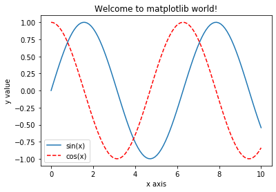
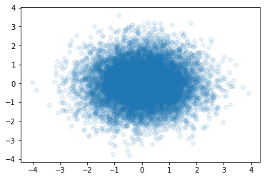

# numpy 和 matplotlib

## Jupyter-Notebook 魔法命令

### %run 运行外部脚本

```python
%run myscript/hello.py
```

### import 运行外部模块

```python
import mymodule.FirstML
```

```python
from mymodule import FirstML
```

### %timeit 计时（多次取平均）

```python
'''
单行
'''
%timeit L = [i ** 2 for i in range(1000)]
# 1000 loops, best of 3: 440 µs per loop # 多次执行，取最好的三次平均
%timeit L = [i**2 for i in range(1000000)]
# 1 loop, best of 3: 473 ms per loop # 耗时的操作，只执行一次
    
'''
多行
'''
%%timeit
L = []
for n in range(1000):
    L.append(n ** 2)
# 1000 loops, best of 3: 709 µs per loop
```

### %time 计时（一次）

```python
'''
单行
'''
%time L = [i**2 for i in range(1000)]
# CPU times: user 5.1 ms, sys: 99 µs, total: 5.2 ms
# Wall time: 5.13 ms

'''
多行
'''
%%time
L = []
for n in range(1000):
    L.append(n ** 2) 
# CPU times: user 753 µs, sys: 1 µs, total: 754 µs
# Wall time: 758 µs
```

有些时候我们不希望多次执行，使用`%time`，因为多次执行命令可能产生计时上的问题，比如对一个数组排序，一开始无序，所以排序时间较长，但是多次执行是在有序数组的前提下执行，此时排序时间很短。

### %lsmagic 列举其他魔法命令

```python
%lsmagic
# 加问号可查阅文档
%run?
```

### numpy 数据基础

```python
import numpy as np
np.__version__
# '1.12.1'

nparr = np.array([i for i in range(10)])
# array([0, 1, 2, 3, 4, 5, 6, 7, 8, 9])

npaar[5] = 100
# array([0, 1, 2, 3, 4, 100, 6, 7, 8, 9])
nparr[5] = "machine learning"
# 类型报错

nparr.dtype
# dtype('int64') // 整型

nparr[5] = 3.14
# array([0, 1, 2, 3, 4, 5, 6, 7, 8, 9]) // 还是整型

nparr2 = np.array([1, 2, 3.0])
nparr.dtype
# dtype('float64')
```

## 创建 numpy 数组（和矩阵）

使用 `numpy.array`创建

```python
numpy.array([i for i in range(10)])
# array([0, 1, 2, 3, 4, 5, 6, 7, 8, 9])
```

使用`numpy.zeros`创建

```python
numpy.zeros(10)
# array([ 0.,  0.,  0.,  0.,  0.,  0.,  0.,  0.,  0.,  0.])

numpy.zeros(10, dtype=float)
# array([ 0.,  0.,  0.,  0.,  0.,  0.,  0.,  0.,  0.,  0.])

numpy.zeros((3, 5))
'''
array([[ 0.,  0.,  0.,  0.,  0.],
       [ 0.,  0.,  0.,  0.,  0.],
       [ 0.,  0.,  0.,  0.,  0.]])
注意小数点
'''

numpy.zeros(shape=(3, 5), dtype=int)
'''
array([[0, 0, 0, 0, 0],
       [0, 0, 0, 0, 0],
       [0, 0, 0, 0, 0]])
'''
```

使用`numpy.ones`创建

```python
numpy.ones(10)
# array([ 1.,  1.,  1.,  1.,  1.,  1.,  1.,  1.,  1.,  1.])

numpy.ones((3, 5))
'''
array([[ 1.,  1.,  1.,  1.,  1.],
       [ 1.,  1.,  1.,  1.,  1.],
       [ 1.,  1.,  1.,  1.,  1.]])
'''
```

使用`numpy.full`创建

```python
numpy.full(shape=(3, 5), fill_value=666)
'''
array([[666, 666, 666, 666, 666],
       [666, 666, 666, 666, 666],
       [666, 666, 666, 666, 666]])
'''
```

使用`numpy.arange`创建（以步长创建）

```python
[i for i in range(0, 20, 2)]
# [0, 2, 4, 6, 8, 10, 12, 14, 16, 18]
numpy.arange(0, 20, 2)
# array([ 0,  2,  4,  6,  8, 10, 12, 14, 16, 18]) # 一样不包括 20

[i for i in range(0 , 1, 0.2)]
# 报错，步长不能用小数
numpy.arange(0, 1, 0.2)
# array([ 0. ,  0.2,  0.4,  0.6,  0.8])
```

使用`numpy.linspace`创建（等分多少份）

```python
numpy.linspace(0, 20, 11)
# array([  0.,   2.,   4.,   6.,   8.,  10.,  12.,  14.,  16.,  18.,  20.]) # 等分 11 份
```

使用`numpy.random.randint`创建（随机整数）

```python
numpy.random.randint(0, 10)    # [0, 10) 之间的随机数
# 5

numpy.random.randint(0, 10, size=10)
# array([2, 6, 1, 8, 1, 6, 8, 0, 1, 4])

numpy.random.randint(0, 10, size=(3, 5))
'''
array([[1, 5, 3, 8, 5],
       [2, 7, 9, 6, 0],
       [0, 9, 9, 9, 7]])
'''
numpy.random.randint(10, size=(3,5))
'''
array([[4, 8, 3, 7, 2],
       [9, 9, 2, 4, 4],
       [1, 5, 1, 7, 7]])
'''
```

使用`numpy.random.seed`创建一样的矩阵（多用于调试）

```python
numpy.random.seed(666)
numpy.random.randint(0, 10, size=(3, 5))
'''
array([[2, 6, 9, 4, 3],
       [1, 0, 8, 7, 5],
       [2, 5, 5, 4, 8]])
'''
np.random.seed(666)
np.random.randint(0, 10, size=(3,5))
'''
array([[2, 6, 9, 4, 3],
       [1, 0, 8, 7, 5],
       [2, 5, 5, 4, 8]])
'''
```

使用`numpy.random.random`创建（随机 [0, 1) 浮点数）

```python
numpy.random.random()
# 0.7315955468480113

numpy.random.random((3, 5))
'''
array([[ 0.8578588 ,  0.76741234,  0.95323137,  0.29097383,  0.84778197],
       [ 0.3497619 ,  0.92389692,  0.29489453,  0.52438061,  0.94253896],
       [ 0.07473949,  0.27646251,  0.4675855 ,  0.31581532,  0.39016259]])
'''
```

使用`numpy.random.normal`创建（符合正态分布的浮点数）（均值为 0，方差为 1）

```python
numpy.random.normal()
# 0.9047266176428719
numpy.random.normal(10, 100) # 指定均值为 10，方差为 100
# -72.62832650185376
numpy.random.normal(0, 1, (3, 5))
'''
array([[ 0.82101369,  0.36712592,  1.65399586,  0.13946473, -1.21715355],
       [-0.99494737, -1.56448586, -1.62879004,  1.23174866, -0.91360034],
       [-0.27084407,  1.42024914, -0.98226439,  0.80976498,  1.85205227]])
'''
```

## numpy.array 基本操作

```python
numpy.random.seed(0)
x = numpy.arange(10)
'''
array([0, 1, 2, 3, 4, 5, 6, 7, 8, 9])
'''
X = numpy.arange(15).reshape((3, 5))
'''
array([[ 0,  1,  2,  3,  4],
       [ 5,  6,  7,  8,  9],
       [10, 11, 12, 13, 14]])
'''
```

### numpy.array 的基本属性

```python
'''
维度
形状
元素个数
'''
x.ndim # 1
x.shape # (10,)
x.size # 10

X.ndim # 2
X.shape # (3, 5)
X.size # 15
```

### numpy.array 的数据访问

```python
'''
array([0, 1, 2, 3, 4, 5, 6, 7, 8, 9])
'''
x[0] # 0
x[-1] # 9
x[0:5] # array([0, 1, 2, 3, 4])
x[:5] # array([0, 1, 2, 3, 4])
x[5:] # array([5, 6, 7, 8, 9])
x[4:7] # array([4, 5, 6])
x[::2] # array([0, 2, 4, 6, 8]) # 步长为 2 取数
x[1::2] # array([1, 3, 5, 7, 9]) # 从 1 开始，步长为 2 取数
x[::-1] # array([9, 8, 7, 6, 5, 4, 3, 2, 1, 0]) # 倒序
'''
array([[ 0,  1,  2,  3,  4],
       [ 5,  6,  7,  8,  9],
       [10, 11, 12, 13, 14]])
'''
X[0][0] # 0 # 不建议！理由见 X[:2][:1]
X[0, 0] # 0 # 任意无符号的对象，以逗号隔开，默认为元组
X[0, -1] # 4
X[:2, :3] # array([[0, 1, 2], [5, 6, 7]])
X[:2][:3] # array([[0, 1, 2, 3, 4], [5, 6, 7, 8, 9]]) # 结果不一样，在 numpy 中使用","做多维索引（[:2] 先取了前两行，[:3] 再取前三行，此时只有两行，两次都是对行进行操作！）
X[:2, ::2] # array([0, 2, 4], [5, 7, 9])
X[::-1, ::-1] # array([[14, 13, 12, 11, 10], [9, 8, 7, 6, 5], [4, 3, 2, 1, 0]]) # 整个颠倒
X[0, :] # array([0, 1, 2, 3, 4]) # 取其中一行
X[:, 0] # array([0, 5, 10]) # 取其中一列
```

### subarray of numpy.array

直接修改`X[:a, :b]`的数值，会影响原矩阵`X`的数值（因为引用）。为了不影响，需要使用`X[:a, :b].copy()`

```python
X
'''
array([[ 0,  1,  2,  3,  4],
       [ 5,  6,  7,  8,  9],
       [10, 11, 12, 13, 14]])
'''
subX = X[:2, :3]
'''
array([[0, 1, 2],
       [5, 6, 7]])
'''
sub[0, 0] = 100 # 影响了 X
'''
array([[100, 1, 2],
       [5, 6, 7]])
'''
X
'''
array([[ 100,  1,  2,  3,  4],
       [ 5,  6,  7,  8,  9],
       [10, 11, 12, 13, 14]])
'''
subX = X[:2, :3].copy() # 不影响 X
```

### reshape

```python
x.shape # (10,)
x.ndim # 1

A = x.reshape(2, 5) # array([[0, 1, 2, 3, 4], [5, 6, 7, 8, 9]]) # 此时是新建对象，不是再引用原数组
B = x.reshape(1, 10) # array([[0, 1, 2, 3, 4, 5, 6, 7, 8, 9]]) # 还是矩阵，而不是向量，只不过只有一行
B.ndim # 2
B.shape # (1, 10) # 对比 (10,)

x.reshape(-1, 10) # array([[0, 1, 2, 3, 4, 5, 6, 7, 8, 9]]) # 要求 10 列，有几行系统分配
x.reshape(10, -1) #array([[0], [1], [2], [3], [4], [5], [6], [7], [8], [9]]) # 要求 10 行，有几列系统分配
x.reshape(3, -1) # 报错，10 个元素不能被 3 整除
```

## numpy.array 合并和分割

### numpy.array 的合并

一维连接

```python
x = numpy.array([1, 2, 3])
y = numpy.array([3, 2, 1])

numpy.concatenate([x, y]) # 默认垂直连接，和 JS 的 concat 类似
# array([1, 2, 3, 3, 2, 1])
z = numpy.array([666, 666, 666])
numpy.concatenate([x, y, z])
# array([1, 2, 3, 3, 2, 1, 666, 666, 666])
```

二维连接

```python
A = numpy.array([1, 2, 3], [4, 5, 6])
numpy.concatenate([A, A])
'''
一样也是垂直，只不过人工换行写
array([[1, 2, 3],
       [4, 5, 6],
       [1, 2, 3],
       [4, 5, 6]])
'''
```

水平连接（上面默认——垂直连接）

```python
numpy.concatenate([A, A], axis=1)
'''
array([[1, 2, 3, 1, 2, 3],
       [4, 5, 6, 4, 5, 6]])
'''
```

直接将矩阵（二维）连接向量（一维）是不可行的

```python
numpy.concatenate([A, z]) # 报错
numpy.concatenate([A, z.reshape(1, -1)]) # 把向量变为矩阵
'''
array([[  1,   2,   3],
       [  4,   5,   6],
       [666, 666, 666]])
'''

numpy.vstack([A, z]) # vertical 垂直叠放
'''
array([[  1,   2,   3],
       [  4,   5,   6],
       [666, 666, 666]])
'''

B = numpy.full((2, 2), 100)
numpy.hstack([A, B]) # horizontal 水平叠放
'''
array([[  1,   2,   3, 100, 100],
       [  4,   5,   6, 100, 100]])
'''

numpy.hstack([A, z]) # 报错，要求维数
```

### numpy.array 的分割

向量（一维）分割

```python
x = numpy.arange(10)
x1, x2, x3 = numpy.split(x, [3, 7]) # 传入分割 index（不包括） # 传入两个点，分割成三段 # 传入一个点，分割成两段
# x1 = array([0, 1, 2])
# x2 = array([3, 4, 5, 6])
# x3 = array([7, 8, 9])
```

矩阵（二维）分割

```python
A = numpy.arange(16).reshape((4, 4))
A1, A2 = numpy.split(A, [2]) # 默认垂直分割
'''
A1 = array([[0, 1, 2, 3],
            [4, 5, 6, 7]])

A2 = array([[ 8,  9, 10, 11],
            [12, 13, 14, 15]])
'''
```

水平分割

```python
A1, A2 = numpy.split(A, [2], axis=1)
'''
A1 = 
array([[ 0,  1],
       [ 4,  5],
       [ 8,  9],
       [12, 13]])
       
A2 =
array([[ 2,  3],
       [ 6,  7],
       [10, 11],
       [14, 15]])
'''
```

vsplit 和 hsplit（前两个参数和 split 一致）

```python
upper, lower = numpy.vsplit(A, [2]) # 垂直分割，和 numpy.split(A, [2]) 等效
left, right = numpy.hsplit(A, [2]) # 水平分割，和 numpy.split(A, [2], axis=1) 等效
```

实际使用场景，分离 feature 和最后一列 label

```python
data = numpy.arange(16).reshape((4, 4))
X, y = numpy.split(data, [-1])
'''
X =
array([[ 0,  1,  2],
       [ 4,  5,  6],
       [ 8,  9, 10],
       [12, 13, 14]])
       
y =
array([[ 3],
       [ 7],
       [11],
       [15]])
'''

y[:, 0] # 再转换为向量（取第一列）
'''
array([ 3,  7, 11, 15])
'''
```

## numpy.array 中的运算

### 与 python 原生的乘法（L * 2）比较

numpy 中运算效率比原生 python 快一个数量级

```python
# 原生 python 是不支持向量 * 数字（只是复制了一遍）
n = 10
L = [i for i in range(n)]
'''
[0, 1, 2, 3, 4, 5, 6, 7, 8, 9]
'''
2 * L
'''
[0, 1, 2, 3, 4, 5, 6, 7, 8, 9, 0, 1, 2, 3, 4, 5, 6, 7, 8, 9]
可以看到只是循环了一遍，并不是对每一项 * 2，二维数组也同理

[[1, 2]] * 2 = [[1, 2], [1, 2]]

'''

# 解决方法 1：一个一个 * 2，再 append 新数组
A = []
for i in L:
    A.append(2 * i)

# 解决方法 2：语法
A = [2 * i for i in L]

L = np.arange(n)
2 * L
'''
array([ 0,  2,  4,  6,  8, 10, 12, 14, 16, 18])
'''
```

### 矩阵与数字的运算

```python
X = numpy.arange(1, 16).reshape((3, 5))
'''
array([[ 1,  2,  3,  4,  5],
       [ 6,  7,  8,  9, 10],
       [11, 12, 13, 14, 15]])
'''

# 矩阵 + 数字 = 矩阵每一项 + 数字
X + 1
'''
array([[ 2,  3,  4,  5,  6],
       [ 7,  8,  9, 10, 11],
       [12, 13, 14, 15, 16]])
'''

# 矩阵 - 数字，数字 - 矩阵，同理
X - 1
'''
array([[ 0,  1,  2,  3,  4],
       [ 5,  6,  7,  8,  9],
       [10, 11, 12, 13, 14]])
'''
1 - X
'''
array([[  0,  -1,  -2,  -3,  -4],
       [ -5,  -6,  -7,  -8,  -9],
       [-10, -11, -12, -13, -14]])
'''

# 矩阵 * 数字
X * 2
'''
array([[ 2,  4,  6,  8, 10],
       [12, 14, 16, 18, 20],
       [22, 24, 26, 28, 30]])
'''

# 矩阵 / 数字（浮点数除法）
X / 2
'''
array([[ 0.5,  1. ,  1.5,  2. ,  2.5],
       [ 3. ,  3.5,  4. ,  4.5,  5. ],
       [ 5.5,  6. ,  6.5,  7. ,  7.5]])
'''

# 矩阵 // 数字（整除）
X // 2
'''
array([[0, 1, 1, 2, 2],
       [3, 3, 4, 4, 5],
       [5, 6, 6, 7, 7]])
'''

# 数字 / 矩阵 = 矩阵取逆 * 数字
1 / X
'''
array([[ 1.        ,  0.5       ,  0.33333333,  0.25      ,  0.2       ],
       [ 0.16666667,  0.14285714,  0.125     ,  0.11111111,  0.1       ],
       [ 0.09090909,  0.08333333,  0.07692308,  0.07142857,  0.06666667]])
'''

# 矩阵 ** 数字（多少次方）
X ** 2
'''
array([[  1,   4,   9,  16,  25],
       [ 36,  49,  64,  81, 100],
       [121, 144, 169, 196, 225]])
'''

# 矩阵 % 数字（取余）
X % 2
'''
array([[1, 0, 1, 0, 1],
       [0, 1, 0, 1, 0],
       [1, 0, 1, 0, 1]])
'''

# 矩阵绝对值
numpy.abs(X)
'''
array([[ 1,  2,  3,  4,  5],
       [ 6,  7,  8,  9, 10],
       [11, 12, 13, 14, 15]])
'''

# 矩阵三角函数
numpy.tan(X)
'''
array([[ 0.84147098,  0.90929743,  0.14112001, -0.7568025 , -0.95892427],
       [-0.2794155 ,  0.6569866 ,  0.98935825,  0.41211849, -0.54402111],
       [-0.99999021, -0.53657292,  0.42016704,  0.99060736,  0.65028784]])
'''
numpy.arctan(X)
'''
array([[ 0.78539816,  1.10714872,  1.24904577,  1.32581766,  1.37340077],
       [ 1.40564765,  1.42889927,  1.44644133,  1.46013911,  1.47112767],
       [ 1.48013644,  1.48765509,  1.49402444,  1.49948886,  1.50422816]])
'''

# 矩阵每个值 e^x
numpy.exp(X)
'''
array([[  2.71828183e+00,   7.38905610e+00,   2.00855369e+01,
          5.45981500e+01,   1.48413159e+02],
       [  4.03428793e+02,   1.09663316e+03,   2.98095799e+03,
          8.10308393e+03,   2.20264658e+04],
       [  5.98741417e+04,   1.62754791e+05,   4.42413392e+05,
          1.20260428e+06,   3.26901737e+06]])
'''

# 矩阵每个值 a^x
numpy.power(3, X) # 3 ** X 等价
'''
array([[       3,        9,       27,       81,      243],
       [     729,     2187,     6561,    19683,    59049],
       [  177147,   531441,  1594323,  4782969, 14348907]])
'''

# 矩阵每个值 log(x)
numpy.log(X) # e 为底
'''
array([[ 0.        ,  0.69314718,  1.09861229,  1.38629436,  1.60943791],
       [ 1.79175947,  1.94591015,  2.07944154,  2.19722458,  2.30258509],
       [ 2.39789527,  2.48490665,  2.56494936,  2.63905733,  2.7080502 ]])
'''
numpy.log2(X) # 2 为底
numpy.log10(X) # 10 为底
```

### 矩阵与矩阵的运算

```python
A = numpy.arange(4).reshape(2, 2)
'''
array([[0, 1],
       [2, 3]])
'''
B = numpy.full((2, 2), 10) # (3, 3) + - * / 报错，必须保证形状相同
'''
array([[10, 10],
       [10, 10]])
'''

A + B
'''
array([[10, 11],
       [12, 13]])
'''

A - B
'''
array([[-10,  -9],
       [ -8,  -7]])
'''

# 矩阵对应项相乘（numpy 都是对应项做运算）
A * B
'''
array([[ 0, 10],
       [20, 30]])
'''

# 矩阵乘法
A.dot(B)
'''
array([[10, 10],
       [50, 50]])
'''

# 矩阵转置
A.T
'''
array([[0, 2],
       [1, 3]])
'''
```

### 矩阵与向量的运算

```python
v = numpy.array([1, 2])
'''
array([1, 2])
'''
A = numpy.arange(4).reshape(2, 2)
'''
array([[0, 1],
       [2, 3]])
'''
# 每一行相加（但其实不符合数学（不能向量和矩阵相加））
v + A
'''
v + A 是可以的，但是在这个课程中，我们不研究其中的计算法则。有兴趣的同学可以查询资料自学 numpy.array 的 broadcast
array([[1, 3],
       [3, 5]])
'''

# 加法相当于如下
numpy.vstack([v] * A.shape[0]) + A
'''
[v] * 2 = [v, v]，参考“与 python 原生的乘法（L * 2）比较”
numpy.vstack([v] * A.shape[0]) =
array([[1, 2],
       [1, 2]])

最后等于
array([[1, 3],
       [3, 5]])
'''

# tile
numpy.tile(v, (2, 1))
'''
垂直堆叠 2 次，水平堆叠 1 次
array([[1, 2],
       [1, 2]])
'''
numpy.tile(v, (2, 2))
'''
垂直堆叠 2 次，水平堆叠 2 次
array([[1, 2, 1, 2],
       [1, 2, 1, 2]])
'''

# 乘法（对应项相乘）
v * A
'''
array([[0, 2],
       [2, 6]])
'''

# 矩阵乘法（自动转换行向量、列向量）
v.dot(A)
'''
array([4, 7])
'''
A.dot(v)
'''
array([2, 8])
'''
```

### 矩阵的逆

```python
invA = numpy.linalg.inv(A)
'''
array([[-1.5,  0.5],
       [ 1. ,  0. ]])
'''
# 矩阵 dot 逆矩阵 = 单位矩阵（性质）
A.dot(invA)
invA.dot(A)
'''
array([[ 1.,  0.],
       [ 0.,  1.]])
'''

# A 必须为方阵，报错
X = np.arange(16).reshape((2, 8))
invX = np.linalg.inv(X)

# 伪逆
pinvX = np.linalg.pinv(X)
pinvX
'''
array([[ -1.35416667e-01,   5.20833333e-02],
       [ -1.01190476e-01,   4.16666667e-02],
       [ -6.69642857e-02,   3.12500000e-02],
       [ -3.27380952e-02,   2.08333333e-02],
       [  1.48809524e-03,   1.04166667e-02],
       [  3.57142857e-02,   8.67361738e-18],
       [  6.99404762e-02,  -1.04166667e-02],
       [  1.04166667e-01,  -2.08333333e-02]])
'''
X.dot(pinvX)
'''
array([[  1.00000000e+00,  -9.71445147e-17],
       [ -1.33226763e-15,   1.00000000e+00]])
'''
'''
矩阵的伪逆又被称为“广义逆矩阵”，有兴趣的同学可以翻看线性教材课本查看更多额广义逆矩阵相关的性质。中文wiki链接: https://zh.wikipedia.org/wiki/%E5%B9%BF%E4%B9%89%E9%80%86%E9%98%B5
'''
```

## numpy 的聚合操作

### numpy.sum 求和

```python
L = numpy.random.random(100)
numpy.sum(L)
'''
52.675554310672098
'''

# 适用于多维度
X = numpy.arange(16).reshape((4, -1))
'''
array([[ 0,  1,  2,  3],
       [ 4,  5,  6,  7],
       [ 8,  9, 10, 11],
       [12, 13, 14, 15]])
'''
# 全累加
numpy.sum(X)
'''
120
'''

# 垂直方向上累加（压缩）
numpy.sum(X, axis=0)
'''
array([24, 28, 32, 36])
'''

# 水平方向上累加（压缩）
numpy.sum(X, axis=1)
'''
array([ 6, 22, 38, 54])
'''
```

### numpy.max numpy.min 最大值 最小值

```python
numpy.min(L)
numpy.max(L)

# 也可以对象调用（但肯定是 numpy 中方法更全面）
L.min()
L.max()
L.sum()
```

### 其他聚合操作

```python
# 计算所有项的乘积
numpy.prod(X + 1)
'''
20922789888000
'''

# 计算所有项的平均值
numpy.mean(X)
'''
7.5
'''

# 计算所有项的中位数
numpy.median(X)
'''
7.5
'''

# 百分位点
numpy.percentile(X, q=50)
'''
这里 50%，同中位数 7.5
'''
for percent in [0, 25, 50, 75, 100]:
    print(numpy.percentile(X, q=percent))
'''
常用的四个点
'''

# 方差
numpy.var(X)

# 标准差
numpy.std(X)
```

## numpy 的 arg 操作

### 排序

```python
x = numpy.arange(16)
numpy.random.shuffle(x) # 影响原 x，无返回值
'''
x = array([13,  2,  6,  7, 11, 10,  3,  4,  8,  0,  5,  1,  9, 14, 12, 15])
'''
numpy.sort(x) # 此时不影响原 x，而是生成副本
x.sort() # 影响原 x

# 多维排序（每次只对其中一个维度排序）
X = numpy.random.randint(10, size=(4, 4))
'''
array([[8, 8, 5, 8],
       [1, 2, 2, 4],
       [5, 5, 9, 9],
       [3, 9, 3, 4]])
'''

# 垂直方向排序
numpy.sort(X, axis=0)
'''
array([[1, 2, 2, 4],
       [3, 5, 3, 4],
       [5, 8, 5, 8],
       [8, 9, 9, 9]])
'''

# 水平方向排序
numpy.sort(X, axis=1)
'''
array([[5, 8, 8, 8],
       [1, 2, 2, 4],
       [5, 5, 9, 9],
       [3, 3, 4, 9]])
'''
```

### 索引

```python
# 最小值的索引（同理 max）
x = np.random.normal(0, 1, 1000000)
numpy.argmin(x)
x[886266]
numpy.min(x)
'''
886266
-4.8354963762015108
-4.8354963762015108
'''

# 索引排序
x = numpy.arange(16)
'''
array([ 0,  1,  2,  3,  4,  5,  6,  7,  8,  9, 10, 11, 12, 13, 14, 15])
'''
numpy.random.shuffle(x)
'''
array([14, 15,  8,  7, 10,  4,  9,  1,  6,  5,  3, 12,  2, 11,  0, 13])
'''

numpy.argsort(x)
'''
array([14,  7, 12, 10,  5,  9,  8,  3,  2,  6,  4, 13, 11, 15,  0,  1])
相当于
array([x[14], x[7], x[12], x[10], ..., x[0], x[1]])
'''

# 索引 partition
numpy.partition(x, 3)
'''
将 3 放回原来的位置，左边比 3 小，右边比 3 大
array([ 1,  0,  2,  3,  4,  5,  7,  8,  6,  9, 10, 12, 11, 13, 15, 14])
'''
numpy.argpartition(x, 3)
'''
索引
array([ 7, 14, 12, 10,  5,  9,  3,  2,  8,  6,  4, 11, 13, 15,  1,  0])
'''

# 多维同样适用
X
'''
array([[8, 8, 5, 8],
       [1, 2, 2, 4],
       [5, 5, 9, 9],
       [3, 9, 3, 4]])
'''
numpy.argsort(X, axis=1)
'''
array([[2, 0, 1, 3],
       [0, 1, 2, 3],
       [0, 1, 2, 3],
       [0, 2, 3, 1]])
'''
numpy.argpartition(X, 2, axis=1)
'''
array([[2, 1, 0, 3],
       [0, 1, 2, 3],
       [0, 1, 2, 3],
       [0, 2, 3, 1]])
'''
```

## numpy 的比较和 Fancy Indexing

### 一维数组的 Fancy Indexing

```python
x = numpy.arange(16)
'''
array([ 0,  1,  2,  3,  4,  5,  6,  7,  8,  9, 10, 11, 12, 13, 14, 15])
'''

# 复习
x[3]
x[3:9]
x[3:9:2]
'''
3
array([3, 4, 5, 6, 7, 8])
array([3, 5, 7])
'''

# Fancy Indexing 根据索引数组取数
[x[3], x[5], x[7]]

ind = [3, 5, 7]
x[ind] # 达到和上面同样的效果
'''
[3, 5, 7]
array([3, 5, 7])
'''

# 可以二维数组取数（每一项是原数组的索引）
ind = numpy.array([[0, 2], [1, 3]])
x[ind]
'''
array([[0, 2],
       [1, 3]])
'''
```

### 二维数组的 Fancy Indexing

```python
X = x.reshape(4, -1)
'''
array([[ 0,  1,  2,  3],
       [ 4,  5,  6,  7],
       [ 8,  9, 10, 11],
       [12, 13, 14, 15]])
'''

row = numpy.array([0, 1, 2])
col = numpy.array([1, 2, 3])
X[row, col]
'''
取 (0, 1)、(1, 2)、(2, 3) 矩阵项
array([ 1,  6, 11])
'''
X[0, col]
'''
取 (0, 1)、(0, 2)、(0, 3) 矩阵项
array([1, 2, 3])
'''
X[:2, col]
'''
取 (0, 1)、(0, 2)、(0, 3)
   (1, 1)、(1, 2)、(1, 3) 矩阵项

array([[1, 2, 3],
       [5, 6, 7]])
'''
col = [True, False, True, True]
x[0, col]
'''
array([0, 2, 3])
'''
```

### numpy.array 的比较（每一项比较）

```python
x
'''
array([ 0,  1,  2,  3,  4,  5,  6,  7,  8,  9, 10, 11, 12, 13, 14, 15])
'''
x < 3
'''
每一项比较
array([ True,  True,  True, False, False, False, False, False, False,
       False, False, False, False, False, False, False], dtype=bool)
'''
x <= 3
'''
array([ True,  True,  True,  True, False, False, False, False, False,
       False, False, False, False, False, False, False], dtype=bool)
'''
x == 3
'''
array([False, False, False,  True, False, False, False, False, False,
       False, False, False, False, False, False, False], dtype=bool)
'''
2 * x == 24 - 4 * x
'''
array([False, False, False, False,  True, False, False, False, False,
       False, False, False, False, False, False, False], dtype=bool)
'''

# 二维比较
X < 6
'''
array([[ True,  True,  True,  True],
       [ True,  True, False, False],
       [False, False, False, False],
       [False, False, False, False]], dtype=bool)
'''
```

### numpy.array 的比较结果使用

```python
numpy.count_nonZero(X <= 3)
numpy.sum(X <= 3)
'''
x <=3 产生一个 boolean 矩阵，计算 True 个数
4
4
'''
numpy.sum(X % 2 == 0, axis=0)
'''
1. X % 2 产生一个 01 数字矩阵 X1
2. X1 == 0 产生一个 boolean 矩阵 X2
3. numpy.sun(X2, axis=0)
array([4, 0, 4, 0]) 第一列有 4 个偶数，第二列没有偶数，第三列有 4 个偶数，第四列没有偶数
'''

# any
numpy.any(x > 0)
'''
存在一个大于 0，则返回 True
'''

# all
numpy.all(x > 0)
'''
必须所有的 x 都要大于 0，返回 True
True
'''
numpy.all(X > 0, axis=1)
'''
每行判断，都要大于 0 才返回 True
array([False,  True,  True,  True], dtype=bool)
'''

# &
numpy.sum((x > 3) & (x < 10))
'''
注意是一个 &，而不是 &&
因为这并不是一个 boolean 条件语句，而是一个 boolean 矩阵，这是一个“逻辑与”操作
6
'''

# |
np.sum((x % 2 == 0) | (x > 10))
'''
大于 10 的偶数个数
'''

# ~
np.sum(~(x == 0))
'''
不等于 0 的个数
'''

# 比较结果和 Fancy Indexing 结合使用
x < 5
'''
array([ True,  True,  True,  True,  True, False, False, False, False,
       False, False, False, False, False, False, False], dtype=bool)
'''
x[x < 5]
'''
array([0, 1, 2, 3, 4])
'''

X[X[:, 3] % 3 == 0, :]
'''
拿出所有满足条件行：最后一个数字能被 3 整除
1. X[:, 3] 拿到最后一列 x1：array([ 3,  7, 11, 15])
2. x1 % 3，拿到余数向量 x2：array([0, 1, 2, 0])
3. x2 == 0, 拿到 boolean 向量 x3：array([ True, False, False,  True])
4. X[x3, :]：取第一行、第四行，列全取

array([[ 0,  1,  2,  3],
       [12, 13, 14, 15]])
'''
```

## `matplotlib` 基础

```python
# plot v 绘制
x = numpy.linspace(0, 10, 100) # [0, 10] 区间切分 100 段
siny = numpy.sin(x)
cosy = numpy.cos(x)

import matplotlib as mpl
import matplotlib.pyplot as plt

plt.plot(x, siny, label="sin(x)")
plt.plot(x, cosy, color="red", linestyle="--", label="cos(x)") # x 轴数据，y 轴数据，颜色，线条样式，标签
plt.xlabel("x axis") # legend 说明
plt.ylabel("y value") # legend 说明
plt.legend()
plt.title("Welcome to matplotlib world!") # 标题
'''
plt.xlim(-1, 11) # x 轴左右边界
plt.ylim(-2, 2) # y 轴下上边界
等效于
plt.axis([-1, 11, -2, 2]) 左右下上
'''
plt.show()

# scatter plot 散点图绘制
x = numpy.random.normal(0, 1, 10000)
y = numpy.random.normal(0, 1, 10000)

plt.scatter(x, y, alpha=0.1)
plt.show()
```



