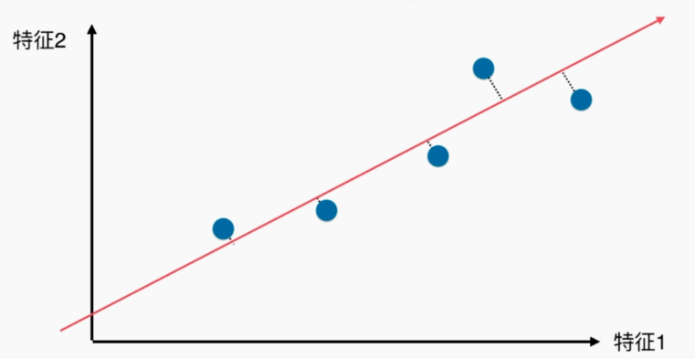
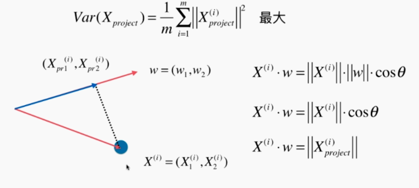
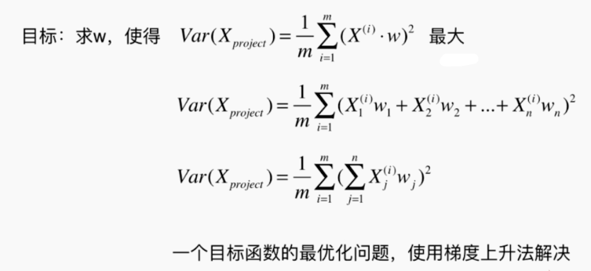
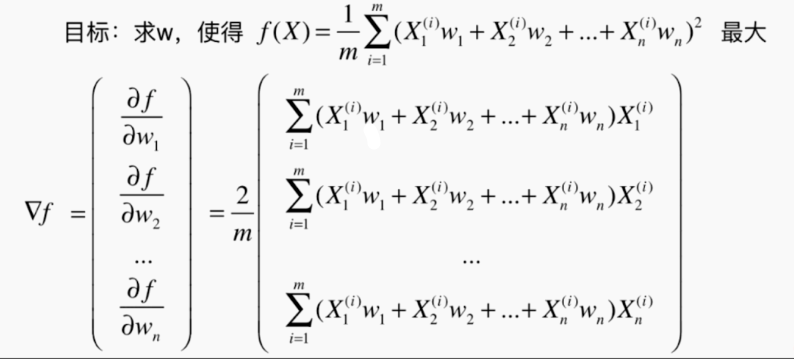
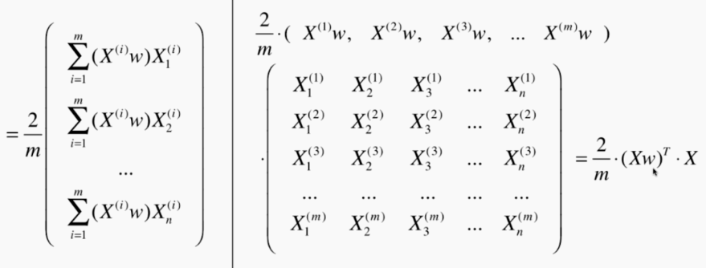
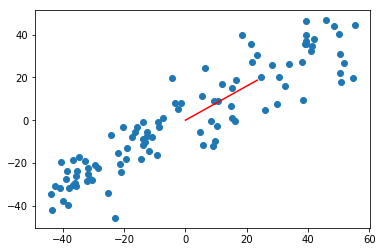
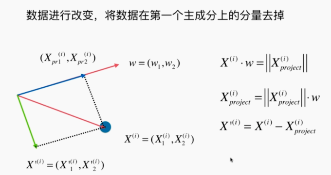
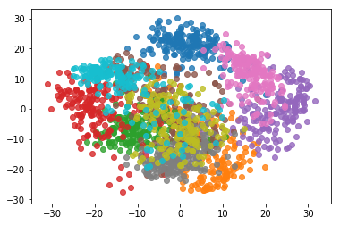
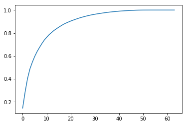

# PCA（Principal Component Analysis，主成分分析）

## 定义

PCA 是一种常用的数据分析方法（我概括：预处理数据）。PCA 通过线性变换将原始数据变换为一组各维度线性无关的表示，可用于提取数据的主要特征分量，常用于高维数据的**降维**（可视化、去噪：虽然丢失信息，但是又消除噪音，反而准确度提高了）（但还是存在 n 个轴）。



虽然也可以隐射到 X 轴和 Y 轴，但此时这根直线，是更能反应各个点的分布（距离）（距离越大越好，区分度更加明显）

接下来的问题就转换为：如何找到这个让样本间间距最大的轴？如何定义样本间间距？

统计学中，可以直接使用“方差” $Var(x)= \frac{1}{m}\sum^{m}_{i = 1}(x_i - \bar{x})^2 $ 来表示。

我们进一步转换问题，找到一个轴，使得样本空间的所有点映射到这个轴后，方差最大。

找到这个轴的步骤：

1. 将样本的均值归为 0（demean）（相当于这条轴线过原点）
2. 根据上面均值为 0 转换公式：$Var(x)= \frac{1}{m}\sum^{m}_{i = 1}(x_i - 0)^2 = \frac{1}{m}\sum^{m}_{i = 1}x_i^2 $
3. 想求一个轴的方向 w = (w1, w2)，使得我们所有的样本映射到 w 以后，有 $Var(X_{project})= \frac{1}{m}\sum^{m}_{i = 1}(X_{project}^{(i)} - \bar{X}_{project})^2= \frac{1}{m}\sum^{m}_{i = 1}||X_{project}^{(i)}||^2$ 最大。其中 $ X_{project}^{(i)} $ 是一个向量 $(X_{project1}^{(i)}, X_{project2}^{(i)})$



进一步转换目标：



最后我们就是要求 $\frac{1}{m}\sum^{m}_{i=1}(\sum^{n}_{j=1}X^{(i)}_jw_j)^2$ 的最优化问题（越大越好），我们使用梯度上升法来解决。

## 使用梯度上升法求解 PCA 问题





经过一系列转换后，得效用函数的偏导数为 $ \nabla{f} = \frac{2}{m}(Xw)^TX $。

```python
import numpy as np
import matplotlib.pyplot as plt

# 模拟数据（第一个特征和第二个特征是有一定的线性关系 y = 0.75x + 3）
X = np.empty((100, 2))
X[:,0] = np.random.uniform(0., 100., size=100)
X[:,1] = 0.75 * X[:,0] + 3. + np.random.normal(0, 10., size=100)

# demean（样本每个特征均值为 0）
def demean(X):
    return X - np.mean(X, axis=0)

X_demean = demean(X)
```

```python
# 效用函数
def f(w, X):
    return np.sum((X.dot(w)**2)) / len(X)

# 刚刚上面数学推导求得的偏导数
def df_math(w, X):
    return X.T.dot(X.dot(w)) * 2. / len(X)

# 偏导数
def df_debug(w, X, epsilon=0.0001):
    res = np.empty(len(w))
    for i in range(len(w)):
        w_1 = w.copy()
        w_1[i] += epsilon
        w_2 = w.copy()
        w_2[i] -= epsilon
        res[i] = (f(w_1, X) - f(w_2, X)) / (2 * epsilon)
    return res

# 向量单位化
def direction(w):
    return w / np.linalg.norm(w)

# 梯度上升法求 w 方向向量
def gradient_ascent(df, X, initial_w, eta, n_iters = 1e4, epsilon=1e-8):
    
    w = direction(initial_w) 
    cur_iter = 0

    while cur_iter < n_iters:
        gradient = df(w, X)
        last_w = w
        w = w + eta * gradient # 上升，所以 +
        w = direction(w) # 注意1：每次求一个单位方向（与之前的梯度下降法不同，但是这个不同是因为我们推导求解的问题不同而导致的，不是因为上升下降这两个名词）
        if(abs(f(w, X) - f(last_w, X)) < epsilon):
            break
            
        cur_iter += 1

    return w
```

```python
# 调用

eta = 0.001
'''注意3： 不能使用 StandardScaler 标准化数据（我们要方差尽量大，而标准化会让方差为 1）'''

w = gradient_ascent(df_math, X_demean, initial_w, eta)
'''array([ 0.78121351,  0.62426392])'''

plt.scatter(X_demean[:,0], X_demean[:,1])
plt.plot([0, w[0]*30], [0, w[1]*30], color='r')
plt.show()
```



## 求数据的前 n 个主成分

之前我们只是将数据映射到一个轴，但是它还是二维的数据，它还是有另一个轴（相当于所有的点不动，将坐标轴旋转了）。n 个维度（特征）同理，是有 n 个轴的，只不过我们用了主成分分析法重新将其排列，使得第一个轴保持方差是最大的，第二个轴次之，第三个轴再次之，以此类推。也就是主成分分析的**本质**是**将一组坐标系转换为另外一组坐标系的过程**。

那我们之前求出第一主成分方向以后，如何求出下一个主成分的方向呢？答案是：将数据进行改变，将数据在第一个主成分的分量去掉。再下一主成分以此类推（已知第二主成分，求第三主成分，循环）。

“蓝色的向量”是第一主成分，“红色的向量”减去“蓝色的向量”得到“绿色的向量”，就是第二主成分。可以看出“绿色”垂直“蓝色”（向量减法）。



## 封装我们自己的 PCA，降维

根据上一小节的公式和结论，我们完成我们能求“前 n 个主成分”的 PCA （数据转换工具，用于降维）：

```python
import numpy as np

# 类似 scaler，有 fit 和 transform 的操作
class PCA:

    def __init__(self, n_components):
        """初始化PCA"""
        assert n_components >= 1, "n_components must be valid"
        self.n_components = n_components
        self.components_ = None

    def fit(self, X, eta=0.01, n_iters=1e4):
        """获得数据集X的前n个主成分"""
        assert self.n_components <= X.shape[1], \
            "n_components must not be greater than the feature number of X"

        def demean(X):
            return X - np.mean(X, axis=0)

        def f(w, X):
            return np.sum((X.dot(w) ** 2)) / len(X)

        def df(w, X):
            return X.T.dot(X.dot(w)) * 2. / len(X)

        def direction(w):
            return w / np.linalg.norm(w)

        def first_component(X, initial_w, eta=0.01, n_iters=1e4, epsilon=1e-8):

            w = direction(initial_w)
            cur_iter = 0

            while cur_iter < n_iters:
                gradient = df(w, X)
                last_w = w
                w = w + eta * gradient
                w = direction(w)
                if (abs(f(w, X) - f(last_w, X)) < epsilon):
                    break

                cur_iter += 1

            return w

        X_pca = demean(X)
        self.components_ = np.empty(shape=(self.n_components, X.shape[1]))
        for i in range(self.n_components):
            initial_w = np.random.random(X_pca.shape[1])
            w = first_component(X_pca, initial_w, eta, n_iters)
            self.components_[i,:] = w

            X_pca = X_pca - X_pca.dot(w).reshape(-1, 1) * w # 将数据在上一个主成分的分量去掉

        return self

    def transform(self, X):
        """将给定的X，映射到各个主成分分量中"""
        assert X.shape[1] == self.components_.shape[1]

        return X.dot(self.components_.T)

    def inverse_transform(self, X):
        """将给定的X，反向映射回原来的特征空间"""
        assert X.shape[1] == self.components_.shape[0]

        return X.dot(self.components_)

    def __repr__(self):
        return "PCA(n_components=%d)" % self.n_components
```

调用我们写的 PCA 方法将高维数据映射成低维数据：

```python
import numpy as np
import matplotlib.pyplot as plt
from playML.PCA import PCA

# mock 数据
X = np.empty((100, 2))
X[:,0] = np.random.uniform(0., 100., size=100)
X[:,1] = 0.75 * X[:,0] + 3. + np.random.normal(0, 10., size=100)

# fit
pca = PCA(n_components=1)
pca.fit(X)
'''
fit 之后，已经得出我们前一个（第一个）主成分
pca.components_
array([[ 0.76676948,  0.64192256]])
'''

# transform
X_reduction = pca.transform(X)
X_reduction.shape
'''
(100, 1)
可以看出，我们的数据从二维转换为一维
'''

# 还原操作（但是会丢失信息）
X_restore = pca.inverse_transform(X_reduction)
X_restore.shape
'''
(100, 2)
'''
```

## scikit-learn 中的 PCA

```python
import numpy as np
import matplotlib.pyplot as plt
from sklearn import datasets
from sklearn.model_selection import train_test_split
from sklearn.neighbors import KNeighborsClassifier
from sklearn.decomposition import PCA

# 手写数字集
digits = datasets.load_digits()
X = digits.data
y = digits.target

# 拆分训练数据集和测试数据集
X_train, X_test, y_train, y_test = train_test_split(X, y, random_state=666)


# kNN 算法直接训练
%%time
knn_clf = KNeighborsClassifier()
knn_clf.fit(X_train, y_train)
knn_clf.score(X_test, y_test)
'''
注意运行时间和准确度
CPU times: user 19.9 ms, sys: 7.47 ms, total: 27.4 ms
Wall time: 64.5 ms
0.98666666666666669
'''

# PCA 预处理数据（前两个主成分），再用 kNN 算法训练
pca = PCA(n_components=2)
pca.fit(X_train)
X_train_reduction = pca.transform(X_train)
X_test_reduction = pca.transform(X_test)

%%time 
knn_clf = KNeighborsClassifier()
knn_clf.fit(X_train_reduction, y_train)
knn_clf.score(X_test_reduction, y_test)
'''
CPU times: user 2.13 ms, sys: 767 µs, total: 2.9 ms
Wall time: 2.93 ms # 耗时大幅减少
0.60666666666666669 # 算法准确度太低了
'''
# 虽然准确度低，但是转换为二维还是有意义的，用于可视化，如图一
for i in range(10):
    plt.scatter(X_reduction[y==i,0], X_reduction[y==i,1], alpha=0.8)
plt.show()

# 主成分所解释的方差
pca.explained_variance_ratio_
'''
array([ 0.14566817,  0.13735469])
表示解释了这个主成分能解释百分之几的数据
'''

# 我们将数据重新训练，64 维主成分，拿到所有的主成分所解释方差
pca = PCA(n_components=X_train.shape[1])
pca.fit(X_train)
pca.explained_variance_ratio_
'''
array([  1.45668166e-01,   1.37354688e-01,   1.17777287e-01,
         8.49968861e-02,   5.86018996e-02,   5.11542945e-02,
         ...
         7.15189459e-34])
'''
# 查看随着训练主成分的数量增多，可解释总占比变化（图二）
plt.plot([i for i in range(X_train.shape[1])], 
         [np.sum(pca.explained_variance_ratio_[:i+1]) for i in range(X_train.shape[1])])
plt.show()

# 查看可解释总占比 95%（自动计算 n 的个数）
pca = PCA(0.95)
pca.fit(X_train)
pca.n_components_
'''
28
从图二，可以看出 28 趋近于 95%
'''

# 重新转换数据，重新训练，重新评价
X_train_reduction = pca.transform(X_train)
X_test_reduction = pca.transform(X_test)
%%time 
knn_clf = KNeighborsClassifier()
knn_clf.fit(X_train_reduction, y_train)
knn_clf.score(X_test_reduction, y_test)
'''
CPU times: user 4.21 ms, sys: 1.28 ms, total: 5.49 ms
Wall time: 19.7 ms # 耗时是普通的 0.1 倍
0.97999999999999998 # 精度损失一点
'''
```



