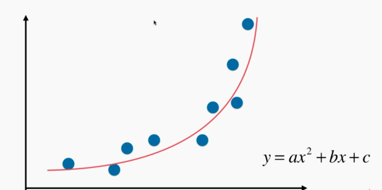
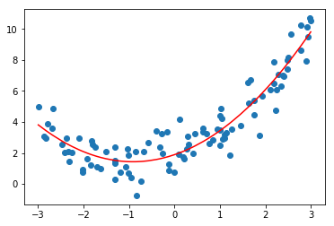

# 数据处理——多项式回归

## 定义

之前介绍的线性回归法有很大的局限性，它假设数据是存在线性关系的。在现实生活中，存在线性关系的数据是非常少的，更多的是存在非线性的关系。

比如下图，$y = ax^2 + bx + c$，如果把 $x$ 当作一个特征，把 $ x^2 $ 当作另一个特征，则这个式子又变为线性的了，这个方法叫做多项式回归（添加一个特征——**升维**）**（数据预处理的过程，而不是新算法）**。



```python
import numpy as np 
import matplotlib.pyplot as plt
from sklearn.linear_model import LinearRegression

# mock 数据 y = 0.5x^2 + x + 2
x = np.random.uniform(-3, 3, size=100)
X = x.reshape(-1, 1) '''(100, 1)'''
y = 0.5 * x**2 + x + 2 + np.random.normal(0, 1, 100)

# 直接使用线性回归：画出直线（对照）
# 不能很好的反应数据的分布
lin_reg = LinearRegression()
lin_reg.fit(X, y)
y_predict = lin_reg.predict(X)

plt.scatter(x, y)
plt.plot(x, y_predict, color='r')
plt.show()

# 解决方案：添加一个特征 x^2，再线性回归（此时有特征 x、x^2）
X2 = np.hstack([X, X**2])
X2.shape '''(100, 2)'''
lin_reg2 = LinearRegression()
lin_reg2.fit(X2, y)
'''
lin_reg2.coef_  # 系数和 y = 0.5x^2 + x + 2 一一对应
array([ 0.99870163,  0.54939125])

lin_reg2.intercept_ # 截距也对应 2
1.8855236786516001
'''
y_predict2 = lin_reg2.predict(X2)

plt.scatter(x, y)
plt.plot(np.sort(x), y_predict2[np.argsort(x)], color='r') '''因为数据不是按顺序的，绘制直线混乱'''
plt.show()
```




 ## scikit-learn 中的多项式回归、 Pipline

scikit-learn 中提供了`PolynomialFeatures(degree=i)`来为我们的数据添加新的高幂次的特征，使用方式和`StandardScaler`方式相同，先`fit`再`transform`。比如我们为两个特征 $x_1$，$x_2$ 中使用`degree=3`，得到的特征是：

-  $1$（0 次幂）
- $x_1$，$x_2$（1 次幂）
- $x_1^2$，$x_2^2$，$x_1x_2$（2 次幂）
- $x_1^3$，$x_2^3$，$x_1^2x_2$，$x_1x_2^2$（3 次幂）

```python
import numpy as np 
import matplotlib.pyplot as plt
from sklearn.preprocessing import PolynomialFeatures 

# mock 数据（同上小节）
x = np.random.uniform(-3, 3, size=100)
X = x.reshape(-1, 1)
y = 0.5 * x**2 + x + 2 + np.random.normal(0, 1, 100)

# 提供了 PolynomialFeatures 添加几次幂的特征
poly = PolynomialFeatures(degree=2)
poly.fit(X)
X2 = poly.transform(X)
'''
X2.shape
(100, 3)
3 个特征分别是 1，x，x^2

X2[:5,:]
array([[ 1.        ,  0.14960154,  0.02238062],
       [ 1.        ,  0.49319423,  0.24324055],
       [ 1.        , -0.87176575,  0.75997552],
       [ 1.        , -1.33024477,  1.76955114],
       [ 1.        ,  0.47383199,  0.22451675]])
'''
```

接下来是 Pipeline 的使用，主要是为了简化重复调用数据处理再训练的流程，将这一流程绑定，后面可以直接调用这一流程。

```python
from sklearn.pipeline import Pipeline
from sklearn.preprocessing import StandardScaler

# 绑定三个过程：多项式回归、归一化、线性回归
poly_reg = Pipeline([
    ("poly", PolynomialFeatures(degree=2)),
    ("std_scaler", StandardScaler()),
    ("lin_reg", LinearRegression())
])

poly_reg.fit(X, y)
y_predict = poly_reg.predict(X)
```

