# 逻辑回归（Logistic Regression）

## 什么是逻辑回归

逻辑回归既可以看作是回归算法（只考虑概率 p），也可以看做是分类算法（再做一次 0.5 上下判断求得分类 y）。通常作为分类算法用，而且**只可以解决二分类问题**（通过其他方式，可以解决多分类）。

问：回归问题是怎么解决分类问题？

答：将样本的特征和样本发生的概率联系起来，概率是一个数。


比如我们之前学的线性回归，可以对比，它的值域是负无穷到正无穷，而我们需要的概率的值域是[0, 1]，所以我们需要另一个函数来转换值域。

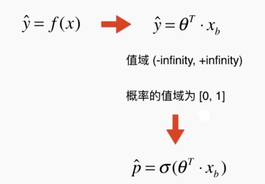

这个函数我们选择 **Sigmoid 函数**：

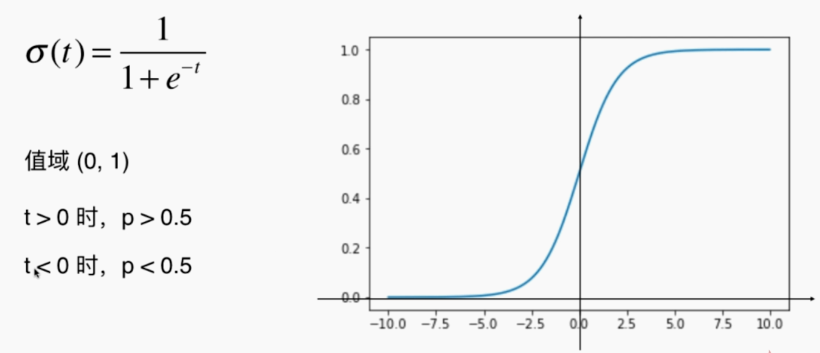

那我们的函数就转换为：

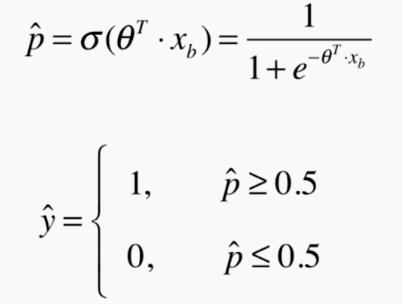

最后我们有一个问题：对于给定的样本数据集 X 和 y，我们如何找到参数 $\theta$，使得这样的方式可以最大程度获得样本数据集 X 对应的分类输出 y？（先拟合训练数据）（之前我们的目标函数就是我们的损失函数尽可能小，那这个需要怎么表示我们的目标呢）

## 逻辑回归的损失函数

我们要开始慢慢推导我们的逻辑回归的损失函数。

首先我们来计算一下我们的损失，如果当前分类真值为 1 的时候，我们要求概率 p 应该要大于 50%（越接近 100% 越好），所以可以反过来说，我们的概率 p 越小，我们损失 cost 越大。同理，也适用于分类真值为 0 的时候。

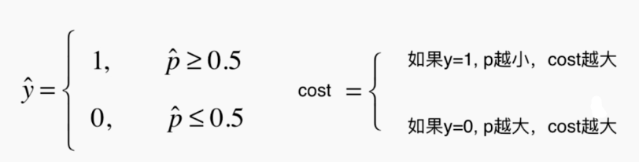

所以我们将上面文字形式的损失函数，转换为底下的函数代替（概率的值域为[0, 1]，对于函数是作用域[0, 1]）。当分类真值为 1 的时候，概率 p 越大，损失越小（p 趋于 1，损失趋于 0）；当分类真值为 0 时，概率 p 越小，损失越小（x 趋于 0，损失趋于 0）。**简记：p 取向 y（0 或者 1），损失越小。**

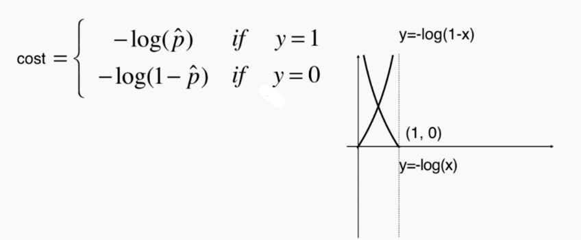

上面的分段函数可以进一步转换为如下的函数（因为 y 取值为 0 或者 1，可以带进去试一试，两个其中一个必为 0）（巧妙）：

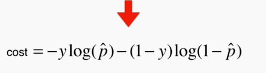

考虑 m 个样本，损失累加，那损失函数就转化为：

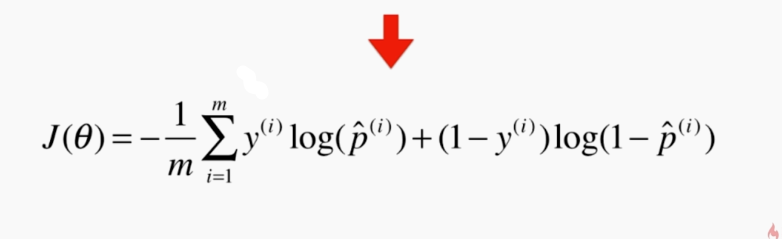

最后将 Sigmoid 概率函数代入，得到**最后的损失函数**：

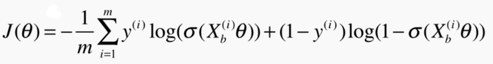

总结一下就是，将概率函数 Sigmoid 代入分段损失函数 cost（这两个函数都是突然冒出来的，能表示就行），使用巧妙地方式，使其一个式子表达，不分段。

然后这个损失函数，没有公式解，只能使用梯度下降法求解（求导推导过程略）：

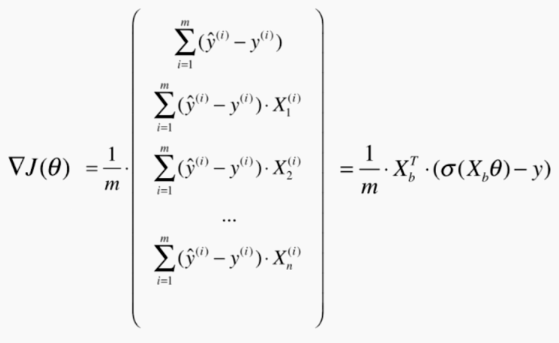

## 实现逻辑回归算法

可以基于线性回归的代码，修改成逻辑回归，主要修改的部分是将损失函数和损失函数求导的部分替换掉，梯度下降的部分完全不变，predict 部分和 score 部分稍有修改，只是因为是处理分类问题，而不是回归问题。

```python
import numpy as np
from .metrics import accuracy_score

class LogisticRegression:

    def __init__(self):
        """初始化Logistic Regression模型"""
        self.coef_ = None
        self.intercept_ = None
        self._theta = None

    def _sigmoid(self, t):
        return 1. / (1. + np.exp(-t))

    def fit(self, X_train, y_train, eta=0.01, n_iters=1e4):
        """根据训练数据集X_train, y_train, 使用梯度下降法训练Logistic Regression模型"""
        assert X_train.shape[0] == y_train.shape[0], \
            "the size of X_train must be equal to the size of y_train"
		# 损失函数替换
        def J(theta, X_b, y):
            y_hat = self._sigmoid(X_b.dot(theta))
            try:
                return - np.sum(y*np.log(y_hat) + (1-y)*np.log(1-y_hat)) / len(y)
            except:
                return float('inf')
		# 损失函数导数替换
        def dJ(theta, X_b, y):
            return X_b.T.dot(self._sigmoid(X_b.dot(theta)) - y) / len(y)

        def gradient_descent(X_b, y, initial_theta, eta, n_iters=1e4, epsilon=1e-8):

            theta = initial_theta
            cur_iter = 0

            while cur_iter < n_iters:
                gradient = dJ(theta, X_b, y)
                last_theta = theta
                theta = theta - eta * gradient
                if (abs(J(theta, X_b, y) - J(last_theta, X_b, y)) < epsilon):
                    break

                cur_iter += 1

            return theta

        X_b = np.hstack([np.ones((len(X_train), 1)), X_train])
        initial_theta = np.zeros(X_b.shape[1])
        self._theta = gradient_descent(X_b, y_train, initial_theta, eta, n_iters)

        self.intercept_ = self._theta[0]
        self.coef_ = self._theta[1:]

        return self

    # 预测概率 p
    def predict_proba(self, X_predict):
        """给定待预测数据集X_predict，返回表示X_predict的结果概率向量"""
        assert self.intercept_ is not None and self.coef_ is not None, \
            "must fit before predict!"
        assert X_predict.shape[1] == len(self.coef_), \
            "the feature number of X_predict must be equal to X_train"

        X_b = np.hstack([np.ones((len(X_predict), 1)), X_predict])
        return self._sigmoid(X_b.dot(self._theta))

    # 转化为分类问题 >= 0.5
    def predict(self, X_predict):
        """给定待预测数据集X_predict，返回表示X_predict的结果向量"""
        assert self.intercept_ is not None and self.coef_ is not None, \
            "must fit before predict!"
        assert X_predict.shape[1] == len(self.coef_), \
            "the feature number of X_predict must be equal to X_train"

        proba = self.predict_proba(X_predict)
        return np.array(proba >= 0.5, dtype='int')

    def score(self, X_test, y_test):
        """根据测试数据集 X_test 和 y_test 确定当前模型的准确度"""

        y_predict = self.predict(X_test)
        return accuracy_score(y_test, y_predict)

    def __repr__(self):
        return "LogisticRegression()"
```

## 决策边界

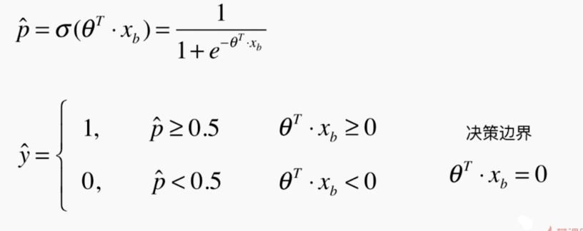

$\theta^Tx_b = 0$ 是决策边界， 也代表着一条直线，如果 X 有两个特征，则 $\theta_0 + \theta_1x_1 + \theta_2x_2 = 0$（一条直线）

不规则的决策边界的绘制方法：我们将平面上所有的点（密集）都用我们的模型跑一遍，然后就在平面上涂上了不同的颜色。

下面是两个特征的鸢尾花数据集使用“逻辑回归”绘制的结果，粉色和蓝色背景色的绘制，就是平面每个点都被预测了一遍。

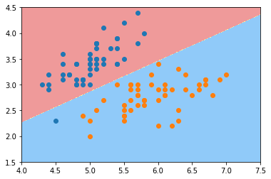

## 在逻辑回归中使用多项式特征

在上一小节中，我们可以看到逻辑回归的决策边界只能是一条直线（太过简单，连圆都不行）。所以我们可以引入“多项式回归”（增加特征）（scikit-learn 中的逻辑回归还使用了正则化）。

```python
from sklearn.preprocessing import PolynomialFeatures
from sklearn.pipeline import Pipeline
from sklearn.preprocessing import StandardScaler
import numpy as np
import matplotlib.pyplot as plt

# mock 数据：x1^2 + x2^2 = 1.5
np.random.seed(666)
X = np.random.normal(0, 1, size=(200, 2))
y = np.array((X[:,0]**2+X[:,1]**2)<1.5, dtype='int')

def PolynomialLogisticRegression(degree):
    return Pipeline([
        ('poly', PolynomialFeatures(degree=degree)),
        ('std_scaler', StandardScaler()),
        ('log_reg', LogisticRegression())
    ])


poly_log_reg = PolynomialLogisticRegression(degree=2)
poly_log_reg.fit(X, y)
```

第一张是未使用多项式回归，只能画直线，分类肯定出现很多错误。第二张是使用多项式回归，可以画更多曲线。

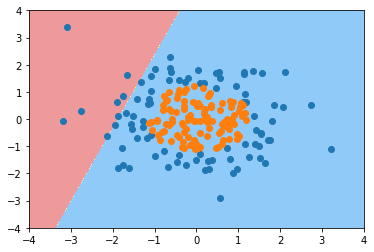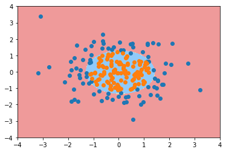

## OvR（One vs Rest）、OvO（One vs One）

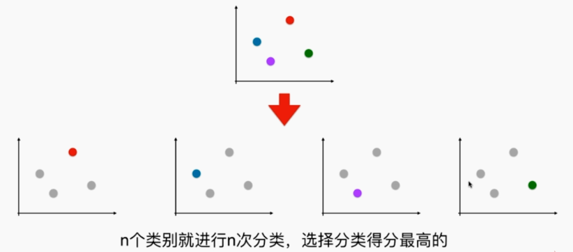

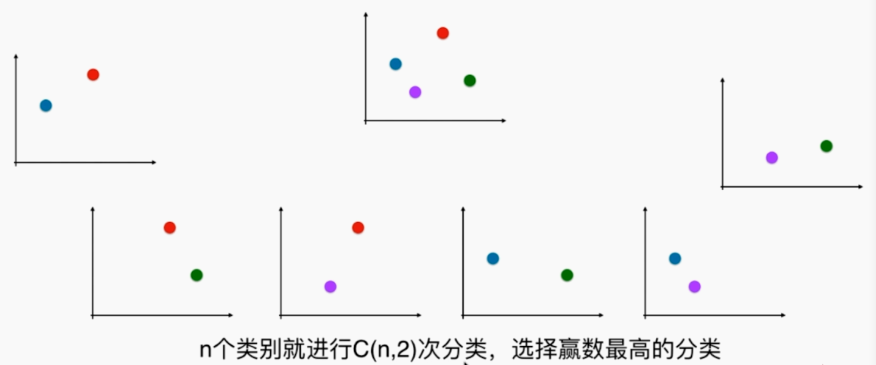

```python
import numpy as np
import matplotlib.pyplot as plt
from sklearn import datasets
from sklearn.model_selection import train_test_split
from sklearn.linear_model import LogisticRegression

# 鸢尾花数据集
iris = datasets.load_iris()
'''X = iris.data[:,:2] 可以使用所有数据集的特征'''
y = iris.target

X_train, X_test, y_train, y_test = train_test_split(X, y, random_state=666)

# sklearn 逻辑回归默认支持多分类（ovr）
log_reg = LogisticRegression()
log_reg.fit(X_train, y_train)
log_reg.score(X_test, y_test)
'''
0.65789473684210531

C=1.0 表示正则化的大小，multi_class='ovr'，solver='liblinear'
LogisticRegression(C=1.0, class_weight=None, dual=False, fit_intercept=True,
          intercept_scaling=1, max_iter=100, multi_class='ovr', n_jobs=1,
          penalty='l2', random_state=None, solver='liblinear', tol=0.0001,
          verbose=0, warm_start=False)
'''

# sklearn 逻辑回归 ovo（效果更好一些）
log_reg2 = LogisticRegression(multi_class="multinomial", solver="newton-cg")
log_reg2.fit(X_train, y_train)
log_reg2.score(X_test, y_test)

# ------------scikit-learn 中支持 ovr ovo 的其他方式--------------
from sklearn.multiclass import OneVsRestClassifier
ovr = OneVsRestClassifier(log_reg)
ovr.fit(X_train, y_train)
ovr.score(X_test, y_test)

from sklearn.multiclass import OneVsOneClassifier
ovo = OneVsOneClassifier(log_reg)
ovo.fit(X_train, y_train)
ovo.score(X_test, y_test)
```

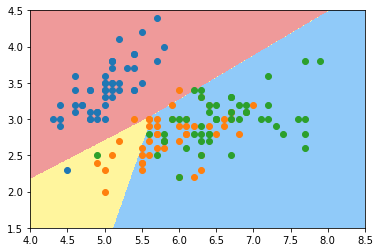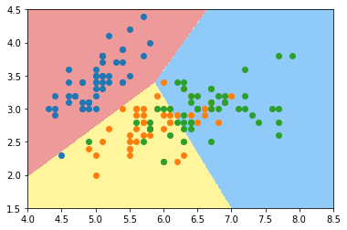

