# 更全面地评价分类算法

## 准确度的陷阱

我们之前评价分类结果是使用准确度，这其中会存在什么问题？

举个例子，我们有一个癌症预测系统，输入体检信息，可以判断是否有癌症，我们说预测准确度为 99.9%。但是如果癌症产生的概率本来就只有 0.01%，那我们的系统预测所有人都是健康的，那可以达到 99.99% 的准确度（这么直接的预测全部都是健康的，反而比用算法预测更优？）。

所以，**对于极度偏斜（Skewed Data）的数据**，只使用分类准确度是远远不够的。

我们可以使用混淆矩阵进一步分析。

## 混淆矩阵（Confusion Matrix）

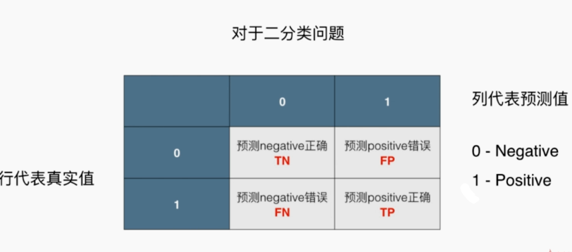

TN（True Negative）、FP（False Positive）、FN（False Negative）、TP（True Positive）

斜对角线是正确预测结果

## 精准率、召回率

为什么这个叫精准率？因为在有偏的数据中，我们将分类 1 作为更加关注的对象（比如患病，我们每做 100 次预测，有 40 次是正确的）。

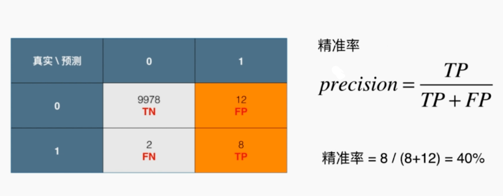

召回率：在真实患病的 10 个人中，我们成功预测了 8 个人患病，召回率达到 80%。

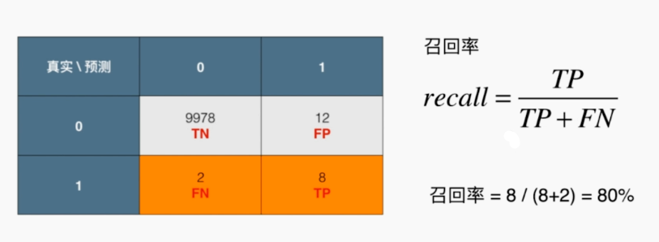

如果上面的混淆矩阵无法理解，那可以看下面的图，左边的是患病的人，右边的是健康的人，然后我们预测了圈出来的人都是患病的（关键点是我们现在预测或者关心的是患病）。那精准率和召回率分别如右图所示：

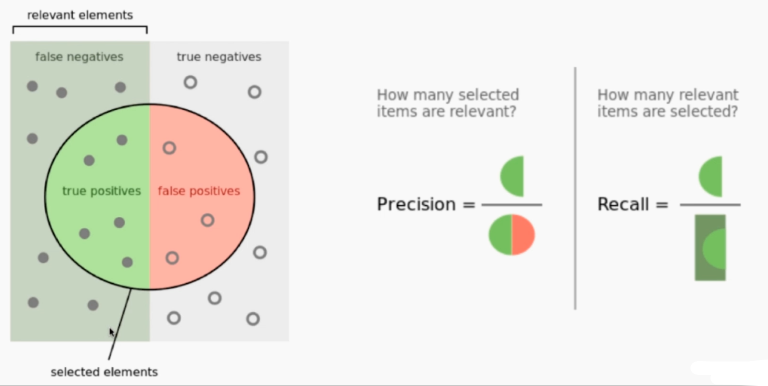

再把之前的例子代入其中，可以得到如下：

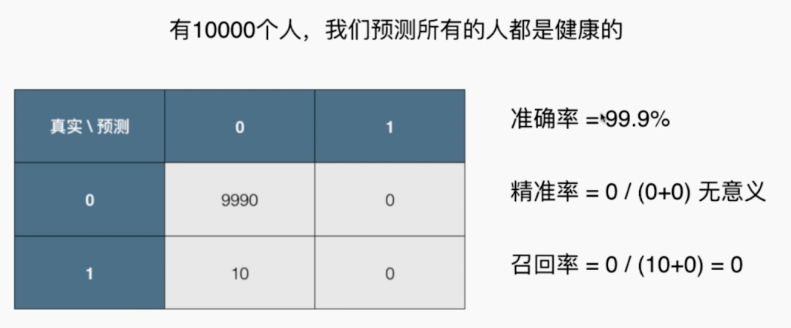

 ## 实现混淆矩阵、精准率、召回率

```python
import numpy as np
from sklearn import datasets
from sklearn.model_selection import train_test_split
from sklearn.linear_model import LogisticRegression

# 手写数字数据集（所有的 9 取 1，其他取 0）（1：9 的数据量）
digits = datasets.load_digits()
X = digits.data
y = digits.target.copy()

y[digits.target==9] = 1
y[digits.target!=9] = 0

X_train, X_test, y_train, y_test = train_test_split(X, y, random_state=666)

# 使用逻辑回归算法分类
log_reg = LogisticRegression()
log_reg.fit(X_train, y_train)
log_reg.score(X_test, y_test)
'''0.97555555555555551'''
y_log_predict = log_reg.predict(X_test)


# TN
def TN(y_true, y_predict):
    assert len(y_true) == len(y_predict)
    return np.sum((y_true == 0) & (y_predict == 0))

# FP
def FP(y_true, y_predict):
    assert len(y_true) == len(y_predict)
    return np.sum((y_true == 0) & (y_predict == 1))

# FN
def FN(y_true, y_predict):
    assert len(y_true) == len(y_predict)
    return np.sum((y_true == 1) & (y_predict == 0))

# TP
def TP(y_true, y_predict):
    assert len(y_true) == len(y_predict)
    return np.sum((y_true == 1) & (y_predict == 1))

# 混淆矩阵
def confusion_matrix(y_true, y_predict):
    return np.array([
        [TN(y_true, y_predict), FP(y_true, y_predict)],
        [FN(y_true, y_predict), TP(y_true, y_predict)]
    ])

# 精准率
def precision_score(y_true, y_predict):
    tp = TP(y_true, y_predict)
    fp = FP(y_true, y_predict)
    try:
        return tp / (tp + fp)
    except:
        return 0.0
    
# 召回率
def recall_score(y_true, y_predict):
    tp = TP(y_true, y_predict)
    fn = FN(y_true, y_predict)
    try:
        return tp / (tp + fn)
    except:
        return 0.0

confusion_matrix(y_test, y_log_predict)
precision_score(y_test, y_log_predict)
recall_score(y_test, y_log_predict)
'''
array([[403,   2],
       [  9,  36]])
0.94736842105263153
0.80000000000000004
'''
```

sklearn 中的实现：

```python
from sklearn.metrics import confusion_matrix
from sklearn.metrics import precision_score
from sklearn.metrics import recall_score

confusion_matrix(y_test, y_log_predict)
precision_score(y_test, y_log_predict)
recall_score(y_test, y_log_predict)
'''
array([[403,   2],
       [  9,  36]])
0.94736842105263153
0.80000000000000004
'''

# 但是这两个指标该如何取舍（精准率高，召回率却低了；精准率低了，召回率却高了）呢？
```

## F1 Score

有时候我们注重精准率，如股票预测。本来要下降的股票，我们却判断它要升了，那我们投钱就亏钱了，这是很严重的事情，所以我们要求此时精准率高。此时我们也并不需要召回率，我们预测了很多支股票，我们落下了一些上升的股票也没有关系，我们只要我们选的股票一定是涨的就行。

有时候我们注重召回率。如病人诊断。我们最好一个不落地把所有患病的病人找到。如果此时精准率不高，则可能将健康的人判断成生病，那其实也没有关系，通过进一步的医学诊断发现没有病就好。

还有时候我们希望获得两个指标的平衡，那就需要 F1 Score，它是 precision 和 recall 的调和平均值（与平均值不同，其中有一个值很大，如果另一个值很小，也会大大拉低结果）（同时二者越大越好）。
$$
F1 = \frac{2·precision·recall}{precision + recall}
$$

## 精准率和召回率的平衡

二者是互相矛盾的，不可能同时两个值都很大。

比如在逻辑回归中，我们的决策边界是 $\theta^T·x_b = 0$，我们可以将其改为 $\theta^T·x_b = threshold$，就相当于我们在逻辑回归中引入新的超参数 $threshold$，当  $\theta^T·x_b >= threshold $，我们将其分类为 1， 当  $\theta^T·x_b < threshold $，我们将其分类为 0，相当于平移了我们的边界。

如下图所示，我们升高（平移）阈值，使精准率逐渐上升，但是召回率逐渐下降；当我们降低阈值，使召回率逐渐上升，但是精准率逐渐下降。

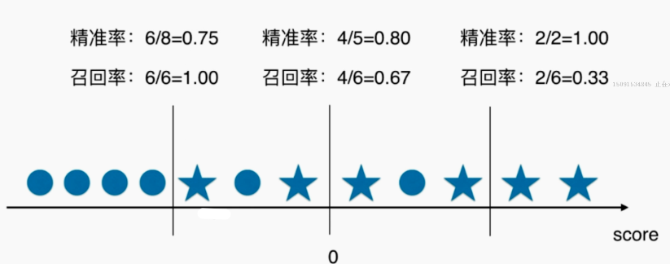

下面的`decision_function(X_test)`是求得每一个测试样例 $\theta^T·x_b$ 的值，再手动将阈值 $threshold$ 设置为 5。

```python
#...省略前面

log_reg = LogisticRegression()
log_reg.fit(X_train, y_train)
decision_scores = log_reg.decision_function(X_test) #
'''
array([-22.05700185, -33.02943631, -16.21335414, -80.37912074,
       -48.25121102, -24.54004847, -44.39161228, -25.0429358 ,
        -0.97827574, -19.71740779])

log_reg.predict(X_test)[:10]       
array([0, 0, 0, 0, 0, 0, 0, 0, 0, 0])
可以看到前十个一一对应，原来的 threshold 为 0，那小于 0 的都分类为 0
'''
y_predict_2 = np.array(decision_scores >= 5, dtype='int') # threshold = 5

# 新的混淆矩阵
confusion_matrix(y_test, y_predict_2)
'''
array([[404,   1],
       [ 21,  24]])
'''
# 新的精准率
precision_score(y_test, y_predict_2)
'''
0.95999999999999996
'''
# 新的召回率
recall_score(y_test, y_predict_2)
'''
0.53333333333333333
'''

# 重复上面步骤，调整 threshold，得到不同的精准率和召回率，即可绘制底下的曲线
```

下图是精准率（橙色）和召回率（蓝色）随着阈值（x 轴）的变化（也称 PR 曲线）：

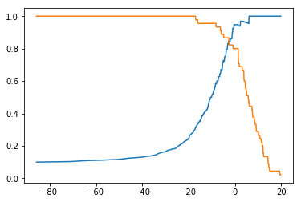

## ROC 曲线

Receiver Operation Characteristic Curve，描述 TPR（正确预测为 1 的比例）和 FPR（错误预测为 1 的比例） 之间的关系，**主要是为了比较两个算法孰优孰劣**。（“正确预测为 1 的数量”除以“真实为 1 的总数”，“错误预测为 1 的数量”除以“真实为 0 的总数”）

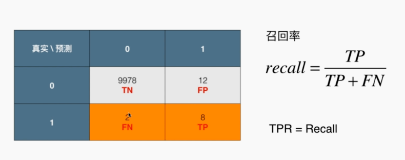

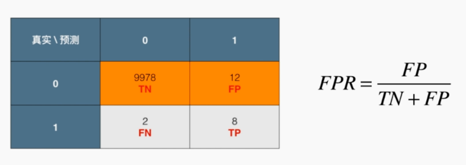

可以看到二者是同向增大减小的：

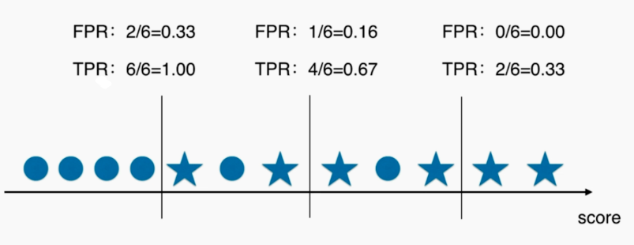

选哪个模型？选择曲线围起来面积大的：

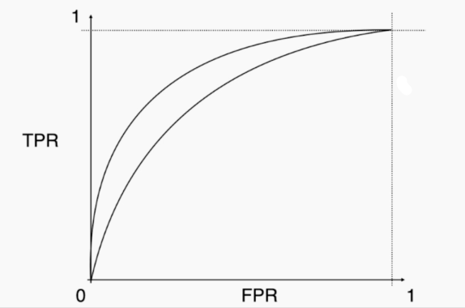

## 多分类问题中的混淆矩阵

略