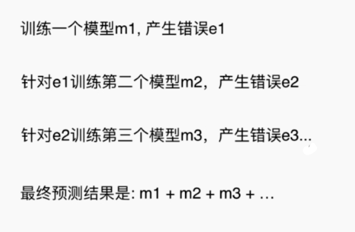

## 集成学习和随机森林

## 什么是集成学习

就是**多个算法模型**同时预测一个结果，肯定会存在预测结果不同的情况，那就**少数服从多数**（类似买东西找人推荐，问了 10 个人，7 个人都说挺好的，那就买了）。

```python
from sklearn.ensemble import VotingClassifier

# 使用逻辑回归、svm、决策树三个算法的模型进行预测，少数服从多数
voting_clf = VotingClassifier(estimators=[
    ('log_clf', LogisticRegression()), 
    ('svm_clf', SVC()),
    ('dt_clf', DecisionTreeClassifier(random_state=666))],
                             voting='hard')

voting_clf.fit(X_train, y_train)
voting_clf.score(X_test, y_test)
```

## Soft Voting Classifier

“一人一票”可能不是很好的投票方式，更合理的投票应该是有**权值**。

如果是按照一人一票（hard）的话，“A”获得“模型 1”、“模型 4”两票，“B”获得“模型 2”、“模型 3”、“模型 5”三票，那最终结果会选择"B"。但是，此时“模型 1”、“模型 4”非常确认是"A"，且达到 90% 以上，而其他几个模型则模模糊糊的，所以我们以其中的**概率作为权值**，重新选择（**要求集合的每一个模型都能估计概率**）。


## Bagging 和 Pasting

虽然有很多机器学习方法，但是从投票的角度看，仍然是不够的。我们需要创建更多的子模型！集成更多子模型的意见。

子模型之间不能一致，比如一共有 500 个样本数据，每个子模型只看 100 个，每个子模型不需要太高的准确率，但是整体合在一起就很强了。


取样的方式：**放回取样**（Bagging）（更常用）和**不放回取样**（Pasting）。

```python
from sklearn.tree import DecisionTreeClassifier
from sklearn.ensemble import BaggingClassifier

bagging_clf = BaggingClassifier(DecisionTreeClassifier(),
                           n_estimators=5000, max_samples=100,
                           bootstrap=True)

bagging_clf.fit(X_train, y_train)
bagging_clf.score(X_test, y_test)
'''
0.92000000000000004
'''
```

Bagging 的其他细节：

- OOB（Out of Bag）：放回取样导致一部分样本很有可能没有取到，平均大约有 37% 的样本没有取到。所以我们可以不使用测试数据集，而使用这部分没有取到的样本做测试/验证，sk-learn 中 oob_score_ 支持
- Bagging 的思路极易并行化处理（n_jobs）

## 随机森林和 Extra Trees（极其随机）

就如上面的 Bagging 中，用到分类算法是决策树，那很多决策树就组成了随机森林。sk-learn 中封装了随机森林。

```python
from sklearn.ensemble import RandomForestClassifier

# 随机森林
rf_clf = RandomForestClassifier(n_estimators=500, oob_score=True, random_state=666, n_jobs=-1)
rf_clf.fit(X, y)

# Extra Trees
from sklearn.ensemble import ExtraTreesClassifier

et_clf = ExtraTreesClassifier(n_estimators=500, bootstrap=True, oob_score=True, random_state=666, n_jobs=-1)
et_clf.fit(X, y)
```

## Ada Boosting 和 Gradient Boosting

集成多个模型，每个模型都在尝试增强（Boosting）整体的效果。

Ada Boosting 每次训练后，一些样本点（图二下浅色的点）已经被很好地拟合住了，下次训练增大这一次没有被成功预测的点（图二深色的点）的权值，重新训练预测。


```python
from sklearn.tree import DecisionTreeClassifier
from sklearn.ensemble import AdaBoostClassifier

# Ada Boosting
ada_clf = AdaBoostClassifier(
    DecisionTreeClassifier(max_depth=2), n_estimators=500)
ada_clf.fit(X_train, y_train)
```



```python
from sklearn.ensemble import GradientBoostingClassifier

# Gradient Boosting
gb_clf = GradientBoostingClassifier(max_depth=2, n_estimators=30)
gb_clf.fit(X_train, y_train)
```

## Stacking


