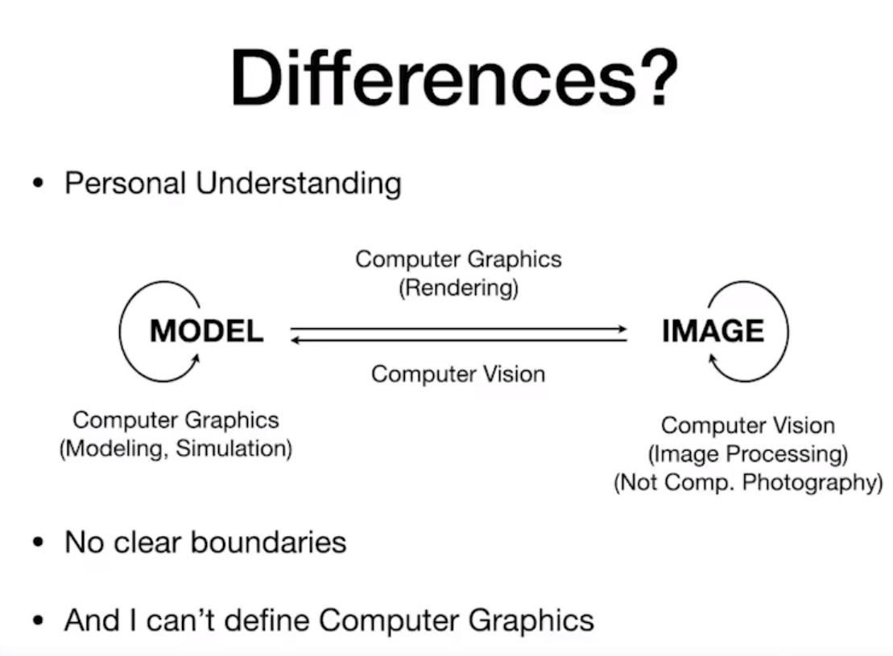

## Course Topics (mainly 4 parts)

- Rasterization（光栅化）：三维空间的几何形体显示在屏幕上
- Curves and Meshes（曲线和曲面）：如何表示曲线和曲面；如何用简单的曲面通过细分的方法得到更复杂的曲面；变化；保持拓扑结构
- Ray Tracing（光线追踪）：有方法做到两全其美（快、好）——实时光线追踪
- Animation / Simulation（动画/模拟）

## 随意记录

- 图形学 != OpenGL（OpenGL 只是图形学里的一个 API）
- 计算机视觉和计算机图形学的差别
  - 前者是人工智能

