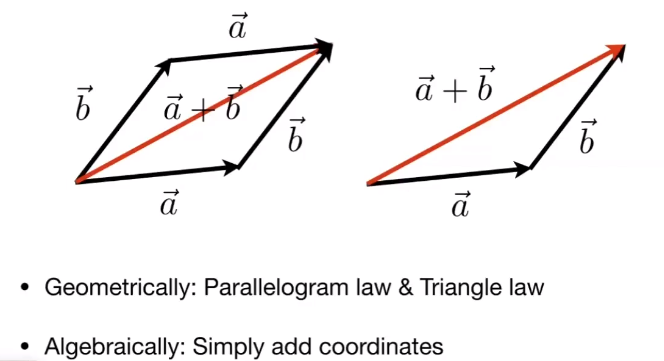
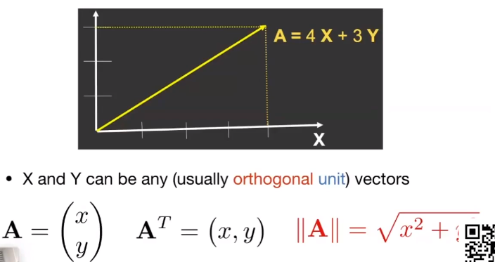
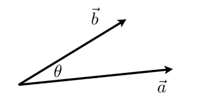
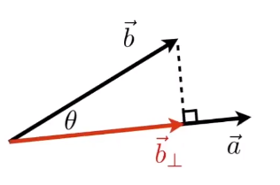
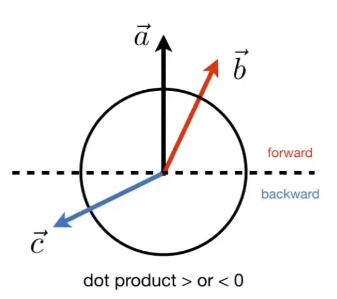
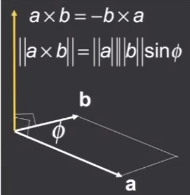
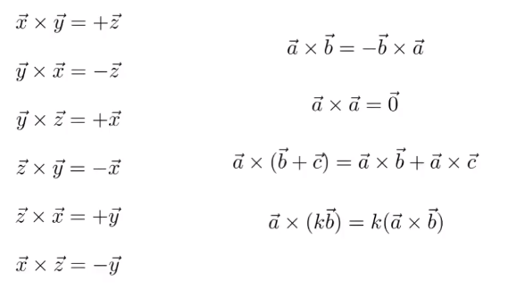
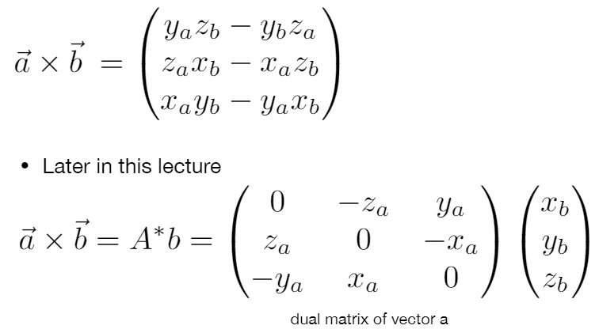
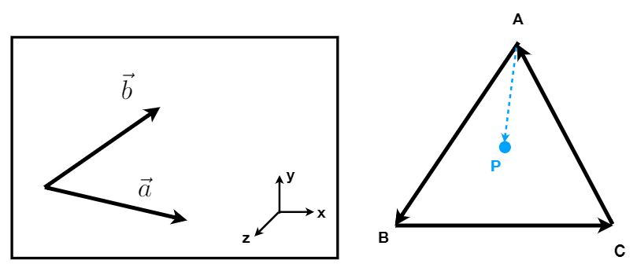
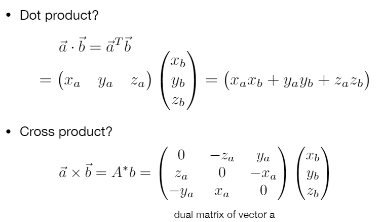

## 向量基础

### 概念

- 通常写作 $\vec{a}$，或者是加粗的 $\bold{a}$；或者使用终点和起点表示 $\vec{AB}=B-A$
- 拥有**方向**和**长度**，但是没有绝对的起始点（移动也表示同一个向量）
- $||\vec{a}||$：表示向量的长度

### 单位向量

- 长度为 1 的向量
- 任意方向的单位向量的表示：$ \hat{a} = \frac{\vec{a}}{||\vec{a}||} $
- 一般用来表示方向

### 向量加法

### 笛卡尔坐标系

一个向量默认为**列向量**。

### 点乘（dot product）

- $\vec{a}·\vec{b}=||\vec{a}||||\vec{b}||cos\theta$
- 更多的应用，就是知道两个向量求其夹角 $ cos\theta = \frac{\vec{a}·\vec{b}}{||\vec{a}||||\vec{b}||}  $
- 再放到单位向量中，可以进一步变成 $cos\theta=\hat{a}·\hat{b}$
- 满足交换律、分配律、结合律
- 在 3D 中（2D 同理）：$\vec{a}·\vec{b}=\begin{pmatrix} x_a \\ y_a \\ z_a \end{pmatrix}·\begin{pmatrix} x_b \\ y_b \\ z_b \end{pmatrix}=x_ax_b+y_ay_b+z_az_b$

### 点乘求投影

- $\vec{b_\perp}$：表示 $\vec{b}$ 在 $\vec{a}$ 上的投影
- 与 $\vec{a}$ 在同一方向上，所以可以表示为：$\vec{b_\perp}=k\hat{a}$
- k也就是 $\vec{b_\perp}$ 的长度，即  $k=||\vec{b_\perp}||=||\vec{b}||cos\theta$

### 点乘作用

- 计算两个向量的接近程度
- 分解一个向量
- 告诉一个前与后的信息（如图，相对于 a，c 向后，b 向前）

### 叉乘

- 叉乘的结果是一个向量！
- 方向：假设 $\vec{c} = \vec{a}\times\vec{b}$，则 $\vec{c}$ 垂直与 $\vec{a}$ 和 $\vec{b}$ 所在的平面（升维）（**右手螺旋定则**确定方向！从 a 绕到 b）
- 长度：$||\vec{c}|| = ||\vec{a}\times\vec{b}||=||\vec{a}||||\vec{b}||sin\theta$
- 这门课都是右手坐标系，OpenGL 使用的是右手坐标系，Direct 3D 使用的是左手坐标系，Unity 是左手坐标系

### 叉乘的运算

- 不满足交换律
- 一般用于计算 z 轴

也可以使用笛卡尔坐标计算：

### 叉乘的作用

- 判断左/右（$\vec{a}\vec{b}$ 叉乘结果如果是正向量，就是右侧）
- 判断内/外（PA、PB、PC 连线都在对应边的左边）

## 矩阵

- 介绍了简单的矩阵相乘：(M * N)(N * P)=(M * P)
- 不满足交换律，但是满足结合律和分配律（顺序不能对调）

### 矩阵的特性

- $(AB)^T=B^TA^T$
- $I_{3\times3}=\begin{pmatrix} 1 & 0 & 0 \\ 0 & 1 & 0 \\ 0 & 0 & 1\end{pmatrix}$
- $AA^{-1}=A^{-1}A=I$
- $(AB)^{-1}=B^{-1}A^{-1}$

### 向量的乘积可以用矩阵表示

