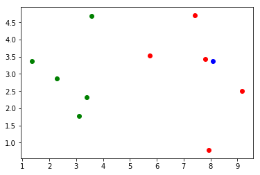
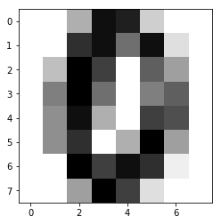
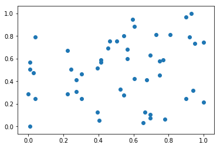
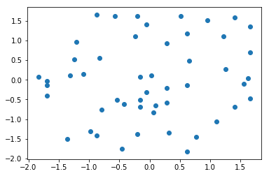
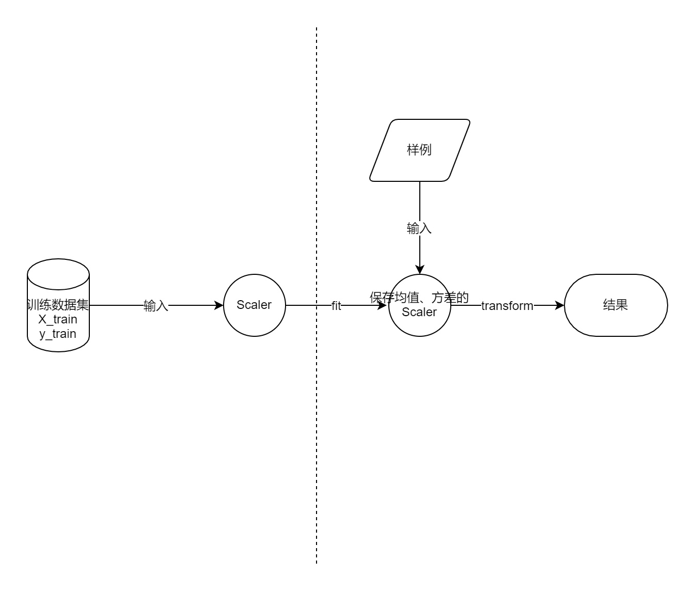

# 最基础的分类算法——k 近邻算法（k-Nearest Neighbor）（kNN）

## 实现我们自己的 kNN

### 初始数据

```python
# 初始数据（mock）
raw_data_X = [[3.393533211, 2.331273381],
              [3.110073483, 1.781539638],
              [1.343808831, 3.368360954],
              [3.582294042, 4.679179110],
              [2.280362439, 2.866990263],
              [7.423436942, 4.696522875],
              [5.745051997, 3.533989803],
              [9.172168622, 2.511101045],
              [7.792783481, 3.424088941],
              [7.939820817, 0.791637231]
             ]
raw_data_y = [0, 0, 0, 0, 0, 1, 1, 1, 1, 1]
# 训练数据（转换为 numpy）
X_train = numpy.array(raw_data_X)
y_train = numpy.array(raw_data_y)
'''
array([[ 3.39353321,  2.33127338], 特征
       [ 3.11007348,  1.78153964],
       [ 1.34380883,  3.36836095],
       [ 3.58229404,  4.67917911],
       [ 2.28036244,  2.86699026],
       [ 7.42343694,  4.69652288],
       [ 5.745052  ,  3.5339898 ],
       [ 9.17216862,  2.51110105],
       [ 7.79278348,  3.42408894],
       [ 7.93982082,  0.79163723]])
array([0, 0, 0, 0, 0, 1, 1, 1, 1, 1]) 标签
'''

# 预测数据
x = numpy.array([8.093607318, 3.365731514])

# 展示数据：以训练数据的两个特征 feature1、feature2 分别做 x 坐标、y 坐标，以颜色（绿色、红色）做分布结果；再绘制预测点（蓝色），观察分布情况
plt.scatter(X_train[y_train == 0, 0], X_train[y_train == 0, 1], color='g') 
plt.scatter(X_train[y_train == 1, 0], X_train[y_train == 1, 1], color='r')
plt.scatter(x[0], x[1], color='b')
plt.show()
```



### 算法过程

```python
from math import sqrt

# 计算“预测点”到所有“训练点”的欧拉距离
distances = []
for train_sample in X_train:
    d = sqrt(numpy.sum((train_sample - x) ** 2))
    distances.append(d)
'''
[4.812566907609877,
 5.229270827235305,
 6.749798999160064,
 4.6986266144110695,
 5.83460014556857,
 1.4900114024329525,
 2.354574897431513,
 1.3761132675144652,
 0.3064319992975,
 2.5786840957478887]

等价于 distances = [sqrt(np.sum((x_train - x)**2)) for x_train in X_train]

计算过程（更高维度同理）：
x (x, y)
train_sample1 (x1, y1)

1. train_sample1 - x = (x1 - x, y1 - y)
2. (train_sample - x) ** 2 = ((x1 - x)^2, (y1 - y)^2)
3. numpy.sum((train_sample - x) ** 2) = (x1 - x)^2 + (y1 - y)^2
4. d = sqrt((x1 - x)^2 + (y1 - y)^2)
'''

# 欧拉距离从近到远排序（越近越相似）
nearest = np.argsort(distances)
'''
array([8, 7, 5, 6, 9, 3, 0, 1, 4, 2])
'''

# kNN 的 k 值（自己随意设置的一个参数值）（查看前 k 个结果）
k = 6
topK_y = [y_train[index] for index in nearest[:k]]
'''
topK_y = [1, 1, 1, 1, 1, 0]
'''

# 分类统计，最后预测结果
from collections import Counter
votes = Counter(topK_y)
predict_y = votes.most_common(1)[0][0]
'''
1
votes = Counter({0: 1, 1: 5}) # 0 有 1 个，1 有 5 个
votes.most_common(1) = [(1, 5)] # 最前面 1 个的投票结果（由键值对组合成的元组）
votes.most_common(2) = [(1, 5), (0, 1)]
votes.most_common(1)[0][0] 取第一个元组的键值
'''
```

### 封装成 scikit-learn 调用方式

```python
import numpy as np
from math import sqrt
from collections import Counter

class KNNClassifier:

    def __init__(self, k):
        """初始化kNN分类器"""
        assert k >= 1, "k must be valid"
        self.k = k
        self._X_train = None
        self._y_train = None

    # 拟合过程
    def fit(self, X_train, y_train):
        """根据训练数据集X_train和y_train训练kNN分类器"""
        assert X_train.shape[0] == y_train.shape[0], \
            "the size of X_train must be equal to the size of y_train"
        assert self.k <= X_train.shape[0], \
            "the size of X_train must be at least k."
        self._X_train = X_train
        self._y_train = y_train
        return self # 遵守 scikit-learn 设置原则，返回自身（现在其实也可以不用返回）

    def predict(self, X_predict): # 传入矩阵，一次性预测 n 个样本
        """给定待预测数据集X_predict，返回表示X_predict的结果向量"""
        assert self._X_train is not None and self._y_train is not None, \
                "must fit before predict!"
        assert X_predict.shape[1] == self._X_train.shape[1], \
                "the feature number of X_predict must be equal to X_train"

        y_predict = [self._predict(x) for x in X_predict]
        return np.array(y_predict)

    # 预测核心
    def _predict(self, x):
        """给定单个待预测数据x，返回x的预测结果值"""
        assert x.shape[0] == self._X_train.shape[1], \
            "the feature number of x must be equal to X_train"

        distances = [sqrt(np.sum((x_train - x) ** 2))
                     for x_train in self._X_train]
        nearest = np.argsort(distances)

        topK_y = [self._y_train[i] for i in nearest[:self.k]]
        votes = Counter(topK_y)

        return votes.most_common(1)[0][0]

    def __repr__(self):
        return "KNN(k=%d)" % self.k
```

调用方式与 scikit-learn 一致：

```python
# 实例化 kNN 对象
knn_clf = KNNClassifier(k=6)
# 拟合（喂数据）
knn_clf.fit(X_train, y_train)
# 预测
y_predict = knn_clf.predict(X_predict)
'''
1
'''
```

## 训练数据集，测试数据集

### 判断机器学习算法的性能

将所有的原始数据，作为训练数据，得到模型，直接在真实环境中使用（没有机会调整），这种方式是不恰当的，存在的问题是：模型如果很差，会造成真实损失；真实环境难以拿到真实 label，很难改进模型

较为恰当的方式是，将原始数据分为两部分——训练数据（70%-80%）和测试数据（20%-30%），使用“测试数据”直接判断“训练数据得到的模型”好坏（在模型进入真实环境前改进模型）

 ### train_test_split 训练测试样本分离方法编写

```python
import numpy as np
from sklearn import datasets

# 原始数据
iris = datasets.load_iris()
X = iris.data
y = iris.target

# 使用 np.random.permutation 根据传入的 150 生成从 0-150 的随机排列
shuffled_indexes = np.random.permutation(len(X))
'''
因为原数据是有序的，所以必须先乱序
这种方法乱序索引方便快捷；
也可以使用将 X 和 y 组合起来再乱序，保证 X 和 y 一一对应
array([ 69,  11,   5,   9,  12, 148, 111,  34,  73, 104, 108,  47,  60,
       102,  95,  75, 139, 110,  55,  77,  49,   6,  92,  32, 124,  21,
       127, 130,  66,  58,  63,   0,  80, 144,  97,   1,   8,  79, 123,
       101,  50,  23,  90,  56,  19, 149, 142,  57,  72, 147,  86, 145,
        15,  91,   4,  62,  41,  39, 135, 112, 115,  38, 138,  33, 125,
       134,  35,  87,  26, 114,  61, 143, 103,  43,  82, 140, 141,  30,
        78, 146,  10,  22,  51, 122,  18,  31, 113, 131, 129,   7,  65,
        59,  36,  85,  81,  28, 116, 118,  83,  67,  52, 109, 119,  16,
        25,   2, 136,  94,  93,  45, 132,  76,  71,  99,  54,  20,  96,
         3, 117,  64, 128, 120,  48,  46,  13, 126,  88,  53,  68, 107,
       121,  40,  29, 133,  89,  44,  42,  98, 137,  17, 100,  84,  24,
        27,  74, 106,  37,  14,  70, 105])
'''

# 确定测试数据大小
test_ratio = 0.2
test_size = int(len(X) * test_ratio)

# 获得测试数据的索引和训练数据的索引
test_indexes = shuffled_indexes[:test_size]
train_indexes = shuffled_indexes[test_size:]

# 根据测试数据的索引获得测试数据；根据训练数据的索引获得训练数据（完成分离）
X_train = X[train_indexes]
y_train = y[train_indexes]

X_test = X[test_indexes]
y_test = y[test_indexes]
```

### sklearn 中的 train_test_split

```python
from sklearn.model_selection import train_test_split

X_train, X_test, y_train, y_test = train_test_split(X, y, test_size=0.2, random_state=666)

print(X_train.shape)
print(y_train.shape)
'''
(120, 4)
(120,)
'''

print(X_test.shape)
print(y_test.shape)
'''
(30, 4)
(30,)
'''
```

### 测试算法

```python
from playML.kNN import KNNClassifier

# 实例化
my_knn_clf = KNNClassifier(k=3)
# 喂训练数据，拟合
my_knn_clf.fit(X_train, y_train)
# 输入测试数据，预测
y_predict = my_knn_clf.predict(X_test)

# 统计算法性能（预测准确率）（与测试数据结果集比对）
sum(y_predict == y_test) / len(y_test)
'''
29 / 30 = 0.96666666666666667
'''
```

## 分类的准确度

### 这次使用的数据集（digits）

```python
import numpy
from sklearn import datasets

# 手写数字数据集
digits = datasets.load_digits()

X = digits.data
y = digits.target
'''
(1797, 64)
(1797,)
'''

# 查看数据集的样子
X[:5]
y[:100]
'''
每一个样本，64 个 feature，每一个 feature 为 0~16，分别表示像素值
array([[  0.,   0.,   5.,  13.,   9.,   1.,   0.,   0.,   0.,   0.,  13.,
         15.,  10.,  15.,   5.,   0.,   0.,   3.,  15.,   2.,   0.,  11.,
          8.,   0.,   0.,   4.,  12.,   0.,   0.,   8.,   8.,   0.,   0.,
          5.,   8.,   0.,   0.,   9.,   8.,   0.,   0.,   4.,  11.,   0.,
          1.,  12.,   7.,   0.,   0.,   2.,  14.,   5.,  10.,  12.,   0.,
          0.,   0.,   0.,   6.,  13.,  10.,   0.,   0.,   0.],
       [  0.,   0.,   0.,  12.,  13.,   5.,   0.,   0.,   0.,   0.,   0.,
         11.,  16.,   9.,   0.,   0.,   0.,   0.,   3.,  15.,  16.,   6.,
          0.,   0.,   0.,   7.,  15.,  16.,  16.,   2.,   0.,   0.,   0.,
          0.,   1.,  16.,  16.,   3.,   0.,   0.,   0.,   0.,   1.,  16.,
         16.,   6.,   0.,   0.,   0.,   0.,   1.,  16.,  16.,   6.,   0.,
          0.,   0.,   0.,   0.,  11.,  16.,  10.,   0.,   0.],
       [  0.,   0.,   0.,   4.,  15.,  12.,   0.,   0.,   0.,   0.,   3.,
         16.,  15.,  14.,   0.,   0.,   0.,   0.,   8.,  13.,   8.,  16.,
          0.,   0.,   0.,   0.,   1.,   6.,  15.,  11.,   0.,   0.,   0.,
          1.,   8.,  13.,  15.,   1.,   0.,   0.,   0.,   9.,  16.,  16.,
          5.,   0.,   0.,   0.,   0.,   3.,  13.,  16.,  16.,  11.,   5.,
          0.,   0.,   0.,   0.,   3.,  11.,  16.,   9.,   0.],
       [  0.,   0.,   7.,  15.,  13.,   1.,   0.,   0.,   0.,   8.,  13.,
          6.,  15.,   4.,   0.,   0.,   0.,   2.,   1.,  13.,  13.,   0.,
          0.,   0.,   0.,   0.,   2.,  15.,  11.,   1.,   0.,   0.,   0.,
          0.,   0.,   1.,  12.,  12.,   1.,   0.,   0.,   0.,   0.,   0.,
          1.,  10.,   8.,   0.,   0.,   0.,   8.,   4.,   5.,  14.,   9.,
          0.,   0.,   0.,   7.,  13.,  13.,   9.,   0.,   0.],
       [  0.,   0.,   0.,   1.,  11.,   0.,   0.,   0.,   0.,   0.,   0.,
          7.,   8.,   0.,   0.,   0.,   0.,   0.,   1.,  13.,   6.,   2.,
          2.,   0.,   0.,   0.,   7.,  15.,   0.,   9.,   8.,   0.,   0.,
          5.,  16.,  10.,   0.,  16.,   6.,   0.,   0.,   4.,  15.,  16.,
         13.,  16.,   1.,   0.,   0.,   0.,   0.,   3.,  15.,  10.,   0.,
          0.,   0.,   0.,   0.,   2.,  16.,   4.,   0.,   0.]])

标签分别为 0~9 的数字
array([0, 1, 2, 3, 4, 5, 6, 7, 8, 9, 0, 1, 2, 3, 4, 5, 6, 7, 8, 9, 0, 1, 2,
       3, 4, 5, 6, 7, 8, 9, 0, 9, 5, 5, 6, 5, 0, 9, 8, 9, 8, 4, 1, 7, 7, 3,
       5, 1, 0, 0, 2, 2, 7, 8, 2, 0, 1, 2, 6, 3, 3, 7, 3, 3, 4, 6, 6, 6, 4,
       9, 1, 5, 0, 9, 5, 2, 8, 2, 0, 0, 1, 7, 6, 3, 2, 1, 7, 4, 6, 3, 1, 3,
       9, 1, 7, 6, 8, 4, 3, 1]
'''

# 查看其中一个样本的表现
some_digit = X[666]
some_digit_image = some_digit.reshape(8, 8)

import matplotlib
import matplotlib.pyplot as plt
plt.imshow(some_digit_image, cmap = matplotlib.cm.binary)
plt.show()
```



### 自己封装的 accuracy_scrore

```python
import numpy

def accuracy_score(y_true, y_predict):
    '''计算y_true和y_predict之间的准确率'''
    assert y_true.shape[0] == y_predict.shape[0], \
        "the size of y_true must be equal to the size of y_predict"
        
    return numpy.sum(y_true == y_predict) / lne(y_true) # 就是将上一小节的最后的“统计算法性能”封装成函数
```

### 在 KNN 类中定义 score 函数

与上面的函数作用相同，只不过是，我们不需要显式调用`myknn.predict(X_predict)`求出预测结果再对比（不关心此时的预测结果）（对样例数组求出结果数组），而**只是关心准确度**，则直接调用（函数内部同样是拿到了预测结果，并调用了 metrics.accuracy_score，只是做了一层封装）。

```python
from .metrics import accuracy_score

class KNNClassifier:
    '''
    def __init__(self, k):
    def fit(self, X_train, y_train):
    def predict(self, X_predict):
    '''
	def score(self, X_test, y_test):
        """根据测试数据集 X_test 和 y_test 确定当前模型的准确度"""

        y_predict = self.predict(X_test)
        return accuracy_score(y_test, y_predict)
```

### scikit-learn 中的 accuracy_score

```python
# 分离训练集和测试集
from sklearn.model_selection import train_test_split
X_train, X_test, y_train, y_test = train_test_split(X, y, test_size=0.2, random_state=666)

# 训练模型
from sklearn.neighbors import KNeighborsClassifier
knn_clf = KNeighborsClassifier(n_neighbors=3)
knn_clf.fit(X_train, y_train)

# 得到准确度 1
knn_clf.score(X_test, y_test)

# 得到准确度 2：使用度量库多做一步
from sklearn.metrics import accuracy_score
y_predict = knn_clf.predict(X_test)
accuracy_score(y_test, y_predict)
```

## 超参数

- 超参数定义：在**算法运行前（初始化的时候）**需要确定的参数
- 模型参数定义：算法过程中学习的参数

超参数之间存在依赖，比如使用 p 的前提使 wights=”distance“

KNN 算法没有模型参数，有 k、method、p 等超参数

### 寻找最好的 K（对比的相邻节点数）

```python
import numpy
from sklearn import datasets

best_score = 0.0 '''最好的准确度'''
best_k = -1 '''最好的相邻节点 K 数目'''

# 遍历寻找“最好的 k”，使准确度最高
for k in range(1, 11):
    knn_clf = KNeighborsClassifier(n_neighbors=k)
    knn_clf.fit(X_train, y_train)
    score = knn_clf.score(X_test, y_test)
    if score > best_score:
        best_k = k
        best_score score
        
print('best_k =', best_k)
print('best_score = ', best_score)
'''
best_k = 4
best_score = 0.991666666667
'''
```

### 寻找最好的 权重 wights（是否考虑距离）

```python
best_score = 0.0
best_k = -1
best_method = ""
for method in ["uniform", "distance"]:
    for k in range(1, 11):
        knn_clf = KNeighborsClassifier(n_neighbors=k, wights=method)
        knn_clf.fit(X_train, y_train)
        score = knn_clf.score(X_test, y_test)
        if score > best_score:
            best_k = k
            best_score = score
            best_method = method
            
print("best_method =", best_method)
print("best_k =", best_k)
print("best_score =", best_score)
'''
best_method = uniform
best_k = 4
best_score = 0.991666666667
'''
```

### 寻找最好的明可夫斯基距离相应的 p

曼哈顿距离 $\sum_{i=1}^n|X_i^a - X_i^a| = (\sum_{i=1}^n |X_i^{a} - X_i^{b}|)^{\frac{1}{1}} $：每个维度距离的和

欧拉距离$ \sqrt{\sum_{i=1}^n(X_i^a - X_i^b)^2}=(\sum_{i=1}^n |X_i^{a} - X_i^{b}|^{2})^{\frac{1}{2}} $：两点直线距离

明可夫斯基距离$ (\sum_{i=1}^n |X_i^{a} - X_i^{b}|^{p})^{\frac{1}{p}} $：再上一层抽象

```python
best_score = 0.0
best_k = -1
best_p = -1

for k in range(1, 11):
    for p in range(1, 6):
        knn_clf = KNeighborsClassifier(n_neighbors=4, weights="distance", p=1)
        knn_clf.fit(X_train, y_train)
        score = knn_clf.score(X_test, y_test)
        if score > best_score:
            best_score = score
            best_p = p
            best_k = k
            
print("best_k =", best_k)
print("best_p =", best_p)
print("best_score =", best_score)
'''
best_k = 3
best_p = 2
best_score = 0.988888888889
'''
```

## 网格搜索 K 近邻算法中更多地超参数

之前寻找最好的超参数，是自己写的 for 循环； sklearn 为了更方便地让我们寻找最好的超参数，提供了网格搜索——Grid Search。

```python
from sklearn.model_selection import GridSearchCV '''CV: Cross Validation 交叉验证'''

# 列出所有超参数组合的可能（所有 for 循环的范围）
param_grid = [
    {
        'weights': ['uniform'], 
        'n_neighbors': [i for i in range(1, 11)]
    },
    {
        'weights': ['distance'],
        'n_neighbors': [i for i in range(1, 11)], 
        'p': [i for i in range(1, 6)]
    }
]
# 实例化一个 KNN 算法对象
knn_clf = KNeighborsClassifier()

# 用 param_grid 和 knn_clf 实例化网格搜索的对象
grid_search = GridSearchCV(knn_clf, param_grid, n_jobs=-1, verbose=2) '''n_jobs=-1：用全部的 CPU；verbose=2：搜索的过程中打印输出过程，2 表示输出的详细程度'''

# 用训练数据集拟合
grid_search.fit(X_train, y_train)
'''
此时可以发现，它只使用了“训练数据”，不需要“测试数据”，就可以判断最好的超参数的数值
我们上小节用到了使用 score = knn_clf.score(X_test, y_test) 来进行判断的
因为其中它运用了更为复杂的交叉验证，这里不做深究
'''

# 获得结果
grid_search.best_estimator_
grid_search.best_score_
'''
获得使用最好的超参数的模型
KNeighborsClassifier(algorithm='auto', leaf_size=30, metric='minkowski',
           metric_params=None, n_jobs=1, n_neighbors=3, p=3,
           weights='distance')

获得最好模型的准确度
0.98538622129436326
'''
```

## 数据归一化 Feature Scaling

|        | 肿瘤大小 | 发现时间         |
| ------ | -------- | ---------------- |
| 样本 1 | 1 cm     | 0.55 年 = 200 天 |
| 样本 2 | 5 cm     | 0.27 年 = 100 天 |

以上面表格为例，如果直接使用两个 feature 来画图，那是不公平的，如果发现时间以“天”计，则发现时间的轴特别长，影响极大，如果发现时间以“年”计，则肿瘤大小影响极大。因此数据必须归一化，将所有的数据映射到同一尺度（类似统一单位）。

- 最值归一化 normalization $ x_{scale} = \frac{x - x_{min}}{x_{max} - x_{min}} $：把所有数据映射到 0-1 之间。适用于分布有明显边界的情况，但是受 outlier 影响比较大
- 均值方差归一化 standardization $ x_{scale} = \frac{x - x_{mean}}{s} $：把所有数据归一到均值为 0 方差为 1 的分布。适用于数据分布没有明显的边界，有可能存在极端数据值的情况
- 只转化数据，对应标签无变化

### 最值归一化

```python
import numpy

# mock 数据（初始化 50 个样例，每个样例 2 个特征）
X = numpy.random.randint(0, 100, (50, 2))
X = numpy.array(X, dtype=float)

# 最值归一化（对两个特征分别归一化）
X[:, 0] = (X[:, 0] - numpy.min(X[:, 0])) / (numpy.max(X[:, 0]) - numpy.min(X[:, 0]))
X[:, 1] = (X[:, 1] - numpy.min(X[:, 1])) / (numpy.max(X[:, 1]) - numpy.min(X[:, 1]))

# 查看归一化结果（散点图绘制）
plt.scatter(X[:,0], X[:,1])
plt.show()

'''
X 前后对比

归一化之前 X[:10,:]
array([[  1.,   1.],
       [ 89.,  95.],
       [ 40.,   6.],
       [ 24.,  50.],
       [ 93.,  32.],
       [ 46.,  74.],
       [ 50.,  74.],
       [ 89.,  25.],
       [ 39.,  51.],
       [ 54.,  79.]])
       
归一化之后 X[:10,:]
array([[ 0.01010101,  0.        ],
       [ 0.8989899 ,  0.96907216],
       [ 0.4040404 ,  0.05154639],
       [ 0.24242424,  0.50515464],
       [ 0.93939394,  0.31958763],
       [ 0.46464646,  0.75257732],
       [ 0.50505051,  0.75257732],
       [ 0.8989899 ,  0.24742268],
       [ 0.39393939,  0.51546392],
       [ 0.54545455,  0.80412371]])
'''

```



### 均值方差归一化

```python
import numpy

# mock 数据（与上例相同）
X2 = np.random.randint(0, 100, (50, 2))
X2 = np.array(X2, dtype=float)

# 均值方差归一化（对两个特征分别归一化）
X2[:,0] = (X2[:,0] - np.mean(X2[:,0])) / np.std(X2[:,0])
X2[:,1] = (X2[:,1] - np.mean(X2[:,1])) / np.std(X2[:,1])

# 查看归一化结果（散点图绘制）（注意此时的横纵坐标的取值）
plt.scatter(X[:,0], X[:,1])
plt.show()

'''
均值
np.mean(X2[:,0]) = -1.1990408665951691e-16 = 0
np.mean(X2[:,1]) = -1.1546319456101628e-16 = 0

方差
np.std(X2[:,0]) = 1.0
np.std(X2[:,1]) = 0.99999999999999989 = 1.0
'''
```



### 对测试数据归一化

以上都实现了对训练数据的归一化，那对测试数据如何做归一化？

是 (x_test - mean_train) / std_train，而不是 (x_test - mean_test) / std_test，不需要再次计算测试数据的平均值和标准差，而是使用之前使用训练数据得来的。因为测试数据是**模拟真实环境**，真实环境很有可能无法得到所有数据的均值和方差。

### scikit-learn 的 scaler



```python
import numpy as np
from sklearn import datasets
from sklearn.model_selection import train_test_split
from sklearn.preprocessing import StandardScaler

# 前期工作：初始数据
iris = datasets.load_iris()
X = iris.data
y = iris.target

# 前期工作：拆分训练数据集和测试数据集
X_train, X_test, y_train, y_test = train_test_split(iris.data, iris.target, test_size=0.2, random_state=666)

# 实例化 StandardScaler
standardScalar = StandardScaler()
# 喂数据（此时并没有转换 X_train）
standardScalar.fit(X_train)
'''
内部实际得到训练数据的每个特征的均值和方差
standardScalar.mean_ = array([ 5.83416667,  3.0825    ,  3.70916667,  1.16916667])
standardScalar.scale_ = array([ 0.81019502,  0.44076874,  1.76295187,  0.75429833])
'''

# 训练数据均值方差归一化
X_train = standardScalar.transform(X_train)
# 测试数据均值方差归一化
X_test_standard = standardScalar.transform(X_test)

'''
归一化前 X_train[:10,:]
array([[ 5.1,  3.5,  1.4,  0.2],
       [ 4.9,  3. ,  1.4,  0.2],
       [ 5.7,  2.8,  4.1,  1.3],
       [ 6.2,  3.4,  5.4,  2.3],
       [ 5.1,  2.5,  3. ,  1.1],
       [ 7. ,  3.2,  4.7,  1.4],
       [ 6.1,  2.6,  5.6,  1.4],
       [ 7.6,  3. ,  6.6,  2.1],
       [ 5.2,  4.1,  1.5,  0.1],
       [ 6.2,  2.2,  4.5,  1.5]])
       
归一化后 X_train[:10,:]
array([[-0.90616043,  0.94720873, -1.30982967, -1.28485856],
       [-1.15301457, -0.18717298, -1.30982967, -1.28485856],
       [-0.16559799, -0.64092567,  0.22169257,  0.17345038],
       [ 0.45153738,  0.72033239,  0.95909217,  1.49918578],
       [-0.90616043, -1.3215547 , -0.40226093, -0.0916967 ],
       [ 1.43895396,  0.2665797 ,  0.56203085,  0.30602392],
       [ 0.3281103 , -1.09467835,  1.07253826,  0.30602392],
       [ 2.1795164 , -0.18717298,  1.63976872,  1.2340387 ],
       [-0.78273335,  2.30846679, -1.25310662, -1.4174321 ],
       [ 0.45153738, -2.00218372,  0.44858475,  0.43859746]])
'''

# 使用归一化后的数据进行 KNN 分类
from sklearn.neighbors import KNeighborsClassifier
knn_clf = KNeighborsClassifier(n_neighbors=3)
knn_clf.fit(X_train, y_train) # 喂数据
knn_clf.score(X_test_standard, y_test) # 1.0 准确度
# knn_clf.score(X_test, y_test) # 0.33 注意，此时不能传入没有归一化的数据！（转化后的命名为 x_test_standard）
```

### 实现我们自己的 standardScaler

主要过程：

- fit 根据训练数据集 X 获得数据的每个特征的**均值**和**方差**
- transform 传入样例，根据之前的均值和方差，遍历计算 $ x_{scale} = \frac{x - x_{mean}}{s} $，返回新矩阵

```python
import numpy as np

class StandardScaler:

    def __init__(self):
        self.mean_ = None
        self.scale_ = None

    def fit(self, X):
        """根据训练数据集X获得数据的均值和方差"""
        assert X.ndim == 2, "The dimension of X must be 2"

        self.mean_ = np.array([np.mean(X[:,i]) for i in range(X.shape[1])])
        self.scale_ = np.array([np.std(X[:,i]) for i in range(X.shape[1])])

        return self

    def transform(self, X):
        """将X根据这个StandardScaler进行均值方差归一化处理"""
        assert X.ndim == 2, "The dimension of X must be 2"
        assert self.mean_ is not None and self.scale_ is not None, \
               "must fit before transform!"
        assert X.shape[1] == len(self.mean_), \
               "the feature number of X must be equal to mean_ and std_"

        resX = np.empty(shape=X.shape, dtype=float)
        for col in range(X.shape[1]):
            resX[:,col] = (X[:,col] - self.mean_[col]) / self.scale_[col]
        return resX
```

## 小结

- k 近邻算法天然解决多分类问题（三种 iris）
- k 近邻算法可以解决回归问题（使用权值的时候，可以对其取平均获得当前节点的值）
- k 近邻算法的缺点：
  - 效率低下（最大）：如果训练集有 m 个样本，n 个特征，则预测每一个新的数据，需要 O(m*n) 时间复杂度（可以使用树结构 KD-Tree、Ball-Tree 优化）
  - 高度数据相关：比如 k=3，旁边有两个错误的节点，那接下来的判断就会出错
  - 预测结果不具有可解释性：只能知道算法预测的结果，但是这样的结果只是因为距离，但具体原因无法做出解释
  - 维数灾难：随着维数的增加，“看似相近”的两个点之间的距离越来越远了（(0, 0) 到 (1, 1) 的距离 1.414；(0, 0, 0) 到 (1, 1, 1) 的距离 1.73；64 维 (0, 0, ...0) 到 (1, 1, ...1) 的距离 8）
- k 近邻算法的流程：
  - 将**数据拆分**成“训练数据”和“测试数据”
  - 用“训练数据”生成 Scaler，将“训练数据”和“测试数据”分别用 Scaler **归一化**
  - 使用归一化后的“训练数据”进行网格搜索，**获得最好的超参数**
  - 使用归一化后的“训练数据”**训练**，得到模型
  - 使用“测试数据”测试得到模型的**准确度**

