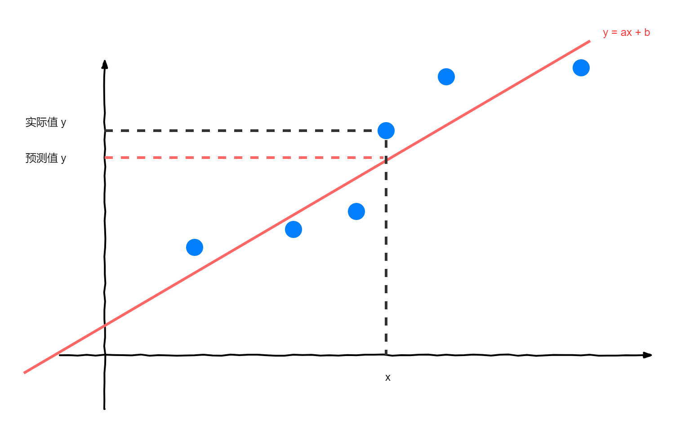

# 线性回归法（Linear Regression）

## 简单线性回归

线性回归：例如图中第二个图例，寻找一条直线，最大程度“拟合”样本特征和样本输出标记之间的关系。

分类问题的横纵坐标都是 feature（两个），它的 label 是由坐标点颜色表示的。而在线性回归问题，横轴是 feature（面积），纵轴是 label（房价），只有一个特征。

### 确定求解目标

假设我们找到了最佳拟合直线方程：$ y = ax + b $（a 和 b 未知），则对于每一个样本点 $ x^{(i)} $（已知）：

- 真值（实际值）为：$ y^{(i)} $（已知）
- 根据我们的直线方程，预测值为：$ \hat{y}^{(i)} = ax^{(i)} + b$（a 和 b 未知）

我们根据上述条件，一步一步确定我们的目标：

- 我们希望 $ y^{(i)} $ 和 $\hat{y}^{(i)}$ 的**差距尽量小**（差值越小，说明“点”越在直线上，拟合程度高）（要考虑所有样本的差距和，而不是只考虑一个样本的差距），表达两个值的差距方式有：
  - 不选择 $ y^{(i)} - \hat{y}^{(i)} $ ，因为多个样本点累加，存在正负抵消的情况
  - 不选择 $ |y^{(i)} - \hat{y}^{(i)}| $ ，因为这种方式求和不好求导
  - 选择 $ (y^{(i)} - \hat{y}^{(i)})^2 $ ，因为既能反应距离差距，又方便求导
- 最后考虑所有样本，得差距和：$ \sum_{i=1}^{m}(y^{(i)} - \hat{y}^{(i)})^2 $，我们的目标就是使“差距和”尽可能小
- 带入 $ \hat{y}^{(i)} = ax^{(i)} + b$，我们的目就成为：**找到 a 和 b，使得距离差  $ \sum_{i=1}^{m}(y^{(i)} - ax^{(i)} - b)^2 $ 尽可能小**
- 以上目标，是典型的最小二乘法问题——最小化误差的平方，求得 $ a=\frac{\sum_{i=1}^{m}(x^{(i)} - \bar{x})(y^{(i)} - \bar{y})}{\sum_{i=1}^{m}(x^{(i)} - \bar{x})^2} $，$ b = \bar{y} - a\bar{x} $

上面的距离差 $ \sum_{i=1}^{m}(y^{(i)} - ax^{(i)} - b)^2 $ ，又称为损失函数（loss function）（要损失尽可能小）。PS：还有度量拟合程度的效用函数（utility function）（尽可能大）

最后我们推得**一类机器学习算法的基本思路**：通过分析问题，确定问题的损失函数或者效用函数，通过最优化损失函数或者效用函数，获得机器学习的模型。（不是特指某个算法！而是一大类！近乎所有的参数学习算法都是这样的套路）

