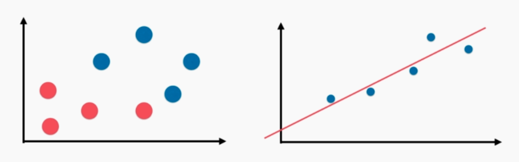
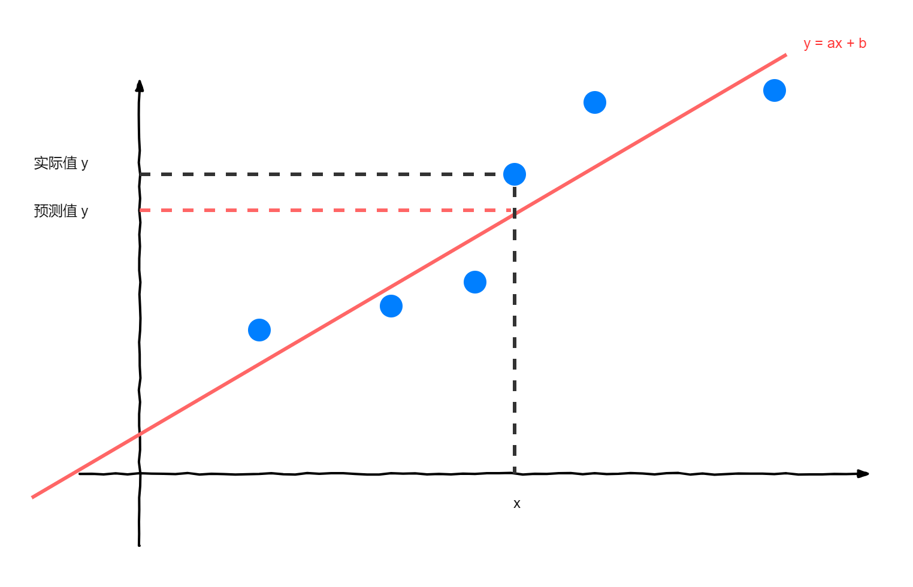
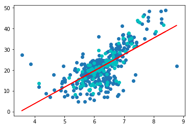
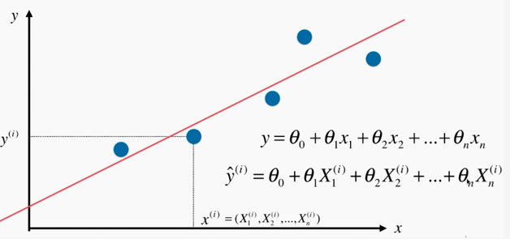
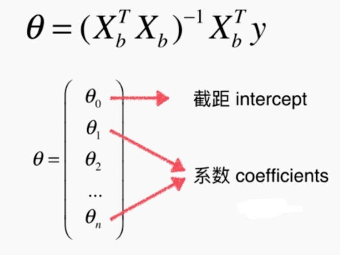

# 线性回归算法（Linear Regression）

线性回归定义：例如图中第二个图例，寻找一条直线，最大程度“拟合”样本特征和样本输出标记之间的关系。

分类问题的横纵坐标都是 feature（两个），它的 label 是由坐标点颜色表示的。而在线性回归问题，横轴是 feature（面积），纵轴是 label（房价），只有一个特征。



## 简单线性回归

### 确定求解目标



假设我们找到了最佳拟合直线方程：$ y = ax + b $（a 和 b 未知），则对于每一个样本点 $ x^{(i)} $（已知）：

- 真值（实际值）为：$ y^{(i)} $（已知）
- 根据我们的直线方程，预测值为：$ \hat{y}^{(i)} = ax^{(i)} + b$（a 和 b 未知）

我们根据上述条件，一步一步确定我们的目标：

- 我们希望 $ y^{(i)} $ 和 $\hat{y}^{(i)}$ 的**差距尽量小**（差值越小，说明“点”越在直线上，拟合程度高）（要考虑所有样本的差距和，而不是只考虑一个样本的差距），表达两个值的差距方式有：
  - 不选择 $ y^{(i)} - \hat{y}^{(i)} $ ，因为多个样本点累加，存在正负抵消的情况
  - 不选择 $ |y^{(i)} - \hat{y}^{(i)}| $ ，因为这种方式求和不好求导
  - 选择 $ (y^{(i)} - \hat{y}^{(i)})^2 $ ，因为既能反应距离差距，又方便求导
- 最后考虑所有样本，得差距和：$ \sum_{i=1}^{m}(y^{(i)} - \hat{y}^{(i)})^2 $，我们的目标就是使“差距和”尽可能小
- 带入 $ \hat{y}^{(i)} = ax^{(i)} + b$，我们的目就成为：**找到 a 和 b，使得距离差  $ \sum_{i=1}^{m}(y^{(i)} - ax^{(i)} - b)^2 $ 尽可能小**
- 以上目标，是典型的最小二乘法问题——最小化误差的平方，求得 $ a=\frac{\sum_{i=1}^{m}(x^{(i)} - \bar{x})(y^{(i)} - \bar{y})}{\sum_{i=1}^{m}(x^{(i)} - \bar{x})^2} $，$ b = \bar{y} - a\bar{x} $

### a 和 b 的求解过程——最小二乘法问题

略

### 推出一类算法套路

上面的距离差 $ \sum_{i=1}^{m}(y^{(i)} - ax^{(i)} - b)^2 $ ，又称为损失函数（loss function）（要损失尽可能小）。PS：还有度量拟合程度的效用函数（utility function）（尽可能大）

最后我们推得**一类机器学习算法的基本思路**：通过分析问题，确定问题的损失函数或者效用函数，通过最优化损失函数或者效用函数，获得机器学习的模型。（不是特指某个算法！而是一大类！近乎所有的参数学习算法都是这样的套路）

### 简单线性回归的实现

根据上面的分析，可以具体实现算法的 fit 和 predict：

- fit 过程，只为求得 a 和 b
  - 根据公式 $ a=\frac{\sum_{i=1}^{m}(x^{(i)} - \bar{x})(y^{(i)} - \bar{y})}{\sum_{i=1}^{m}(x^{(i)} - \bar{x})^2} $
    - 求得训练数据一维特征数组 x 的平均值 x_mean
    - 求得训练数据一维结果数组 y 的平均值 y_mean
    - 遍历训练数据，分别求得 a 的分子和分母（可以使用两种方式：迭代累加、**向量化运算（更快！）**）
  - 根据公式 $ b = \bar{y} - a\bar{x} $，此时 a 已知，代入求得 b
- predict 过程，根据输入的 x 带入$ y = ax + b $，此时 a 和 b 已知，求得预测结果 y

```python
import numpy as np

class SimpleLinearRegression1:

    def __init__(self):
        """初始化Simple Linear Regression 模型"""
        self.a_ = None
        self.b_ = None

    def fit(self, x_train, y_train):
        """根据训练数据集 x_train, y_train 训练 Simple Linear Regression 模型"""
        assert x_train.ndim == 1, \
            "Simple Linear Regressor can only solve single feature training data."
        assert len(x_train) == len(y_train), \
            "the size of x_train must be equal to the size of y_train"

        x_mean = np.mean(x_train)
        y_mean = np.mean(y_train)

        # 遍历累加
        '''
        num = 0.0
        d = 0.0
        for x, y in zip(x_train, y_train):
            num += (x - x_mean) * (y - y_mean)
            d += (x - x_mean) ** 2
        '''
        
        # 向量运算
        num = (x_train - x_mean).dot(y_train - y_mean)
        d = (x_train - x_mean).dot(x_train - x_mean)

        self.a_ = num / d
        self.b_ = y_mean - self.a_ * x_mean

        return self

    def predict(self, x_predict):
        """给定待预测数据集 x_predict，返回表示 x_predict 的结果向量"""
        assert x_predict.ndim == 1, \
            "Simple Linear Regressor can only solve single feature training data."
        assert self.a_ is not None and self.b_ is not None, \
            "must fit before predict!"

        return np.array([self._predict(x) for x in x_predict])

    def _predict(self, x_single):
        """给定单个待预测数据x，返回x的预测结果值"""
        return self.a_ * x_single + self.b_

    def __repr__(self):
        return "SimpleLinearRegression1()"
```

## 衡量线性回归法的指标 MSE、RMSE、MAE

### 初始想法

在简单线性回归中，我们的目标是找到 a 和 b，使得 $ \sum_{i=1}^{m}(y^{(i)} - ax^{(i)} - b)^2 $ 损失函数最小。我们再还原一下这个式子，也就是每个训练样本的真值和预测值的差的平方的和，即 $ \sum_{i=1}^{m}(y^{(i)}_{train} - \hat{y}^{(i)}_{train})^2 $。

衡量这个模型的好坏，同样是用测试数据，我们代入 $ x^{(i)}_{test} $，得到相应得预测值 $ \hat{y}^{(i)}_{test} = ax^{(i)}_{test} + b$，最后观察$ \sum_{i=1}^{m}(y^{(i)}_{test} - \hat{y}^{(i)}_{test})^2 $，数值越小，说明模型越好。

但此时，有一个问题，这个数值是在 m 相同得情况下，才可以比较的。如果 100 个测试数据得到的数值 100，10 个数据得到的数值是 90，总不能说第二个只用 10 个数据测试的模型好吧？

### 均方误差 MSE（Mean Squared Error）

基于以上的问题，很容易就能想到的是取平均，解决因测试数据数量带来的问题，即 $ \frac{1}{m}\sum_{i=1}^{m}(y^{(i)}_{test} - \hat{y}^{(i)}_{test})^2 $。

但此时，还有一个问题，量纲上的问题。比如 y 以“万元”做单位，最后的结果就是“万元”的平方。我们更想从这个数据中直接反应每个样本真值和预测值的大致误差，相差多少万元。

### 均方根误差 RMSE（Root Mean Squared Error）

基于以上的问题，很容易就能想到的是开根号，即 $ \sqrt{\frac{1}{m}\sum_{i=1}^{m}(y^{(i)}_{test} - \hat{y}^{(i)}_{test})^2} $。

### 平均绝对误差 MAE（Mean Absolute Error）

上面没什么问题了，但是还有一种方式，对每个样本的真值和预测值的差求和再平均，即 $ \frac{1}{m}\sum_{i=1}^{m}|y^{(i)}_{test} - \hat{y}^{(i)}_{test}| $。但还是均方根误差效果好，因为它能放大多个样本中最大误差的大小。

### 三种指标的实现

```python
import numpy as np
import matplotlib.pyplot as plt
from sklearn import datasets

# 使用波士顿房产数据
boston = datasets.load_boston()
boston.feature_names '''array(['CRIM', 'ZN', 'INDUS', 'CHAS', 'NOX', 'RM', 'AGE', 'DIS', 'RAD', 'TAX', 'PTRATIO', 'B', 'LSTAT'], dtype='<U7')'''
x = boston.data[:,5] '''有很多特征，但是为了二维平面画图（或者简单线性回归只支持一维），只使用房间数量这个特征'''
y = boston.target
'''
(506,)
(506,)
'''
x = x[y < 50.0]
y = y[y < 50.0]
'''
剔除数据
就是填写问卷类似，其中有一项封顶的数值，50 万及 50 万以上
(490,)
(490,)
'''
plt.scatter(x, y)
plt.show()

# 拆分训练数据和测试数据
x_train, x_test, y_train, y_test = train_test_split(x, y, seed=666)

# 模型
reg = SimpleLinearRegression()
reg.fit(x_train, y_train)
y_train_predict = reg.predict(x_train)

# 绘制结果
plt.scatter(x_train, y_train) '''训练数据'''
plt.scatter(x_test, y_test, color="c") '''测试数据'''
plt.plot(x_train, y_predict, color='r') '''y = ax + b'''
plt.show()

y_predict = reg.predict(x_test)
# MSE
mse_test = np.sum((y_predict - y_test)**2) / len(y_test)
mse_test
'''
24.156602134387438
'''

# RMSE
rmse_test = sqrt(mse_test)
rmse_test
'''
4.914936635846635
'''

# MAE
mae_test = np.sum(np.absolute(y_predict - y_test)) / len(y_test)
mae_test
'''
3.5430974409463873
'''
```



## R Squared——最好的衡量线性回归法的指标

现在又有一个问题，算法运用的领域问题。假设我这个算法在房价的预测的均方差的值为 5 万，在成绩的预测的均方差的值为 6 分，那该把这个算法用到哪个领域合适呢？（稍微看看就好，描述不清，这个 R Squared 的解释也不清楚）

分类问题就很简单，准确度 100% 最好， 0% 最差。线性回归这时候引入 R Squared。
$$
R^{2} = 1 - \frac{SS_{residual}}{SS_{total}}
$$

$$
R^{2} = 1 - \frac{\sum_{i=1}^{m}(\hat{y}^{(i)} - y^{(i)})^2}{\sum_{i=1}^{m}(\bar{y} - y^{(i)})^2} = 1 - \frac{\sum_{i=1}^{m}(\hat{y}^{(i)} - y^{(i)})^2 / m}{\sum_{i=1}^{m}(\bar{y} - y^{(i)})^2 / m} = 1 - \frac{MSE(\hat{y}, y)}{Var(y)}
$$

分母表示使用我们的模型预测产生的误差；分子表示使用 $y=\bar{y}$ （基准模型）预测产生的误差。可以得到以下结论：

- $ R^{2} <= 1 $
- $ R^2 $ 越大越好，当我们的预测模型不犯任何错误的时候，$ R^2 $ 得到最大值 1
- 当我们的模型等于基准模型的时候，$ R^{2} $ 为 0
- 当 $ R^2 < 0 $，说明我们学习到的模型还不如基准模型（此时很有可能我们的的数据不存在任何线性关系）。

```python
# R Squared 代码实现（使用到上面的 MSE）
1 - mean_squared_error(y_test, y_predict)/np.var(y_test)
```

## 多元线性回归



如果简单的 $ x^{(i)} $ 改写成向量 $(X_1^{(i)}, X_2^{(i)}, ..., X_n^{(i)})$ （第 i 个样本 1~n 个特征组成的向量），那 $ y = ax + b$ 也要改成 $ y = \theta_{0} + \theta_{1}x_{1} + \theta_{2}x_{2} + ... + \theta_{n}x_{n} $。

将特征向量代入，得预测值为： $ \hat{y}^{(i)} = \theta_{0} + \theta_{1}X_{1}^{(i)} + \theta_{2}X_{2}^{(i)} + ... + \theta_{n}X_{n}^{(i)} $。

在多元线性回归中，**我们的目标**就变成求 $(\theta_0, \theta_1, \theta_2, ..., \theta_n)$ 这 n 个参数，使得 $ \sum_{i = 1}^{m}(y^{(i)} - \hat{y}^{(i)})^2 $ 尽可能小。

### 推导求解目标

为了之后式子推导方便，虚构 $X_0^{(i)}$，其值恒等于 1，得 $ \hat{y}^{(i)} = \theta_{0}X_{0}^{(i)} + \theta_{1}X_{1}^{(i)} + \theta_{2}X_{2}^{(i)} + ... + \theta_{n}X_{n}^{(i)} $
$$
\theta = (\theta_0, \theta_1, \theta_2, ..., \theta_n)^T \\

X^{(i)} = (X_{0}^{(i)}, X_{1}^{(i)}, X_{2}^{(i)}, ..., X_{n}^{(i)}) \\

\hat{y}^{(i)} = X^{(i)}\theta
$$
$\theta$ 为列向量，$ X^{(i)} $ 为特征行向量（一个样本），$\hat{y}^{(i)}$ 预测值为一个数值（一个样本的预测值）。

接下来，考虑所有样本：
$$
X_b = \begin{pmatrix}
1 & X_1^{(1)} & X_2^{(1)} & \cdots & X_n^{(1)} \\
1 & X_1^{(2)} & X_2^{(2)} & \cdots & X_n^{(2)} \\
\vdots & \vdots & \vdots & \ddots & \vdots \\
1 & X_1^{(m)} & X_2^{(m)} & \cdots & X_n^{(m)}
\end{pmatrix}
\\
\theta = \begin{pmatrix} \theta_0 \\ \theta_1 \\ \theta_2 \\ \vdots \\ \theta_n  \end{pmatrix}
\\
\hat{y} = X_b\theta
$$
可以注意到 $\hat{y} $ 没有 $(i)$ 右上角标，是所有样本的预测值。

将上面的结果$ \hat{y} = X_b\theta $，代入我们初始的目标$ \sum_{i = 1}^{m}(y^{(i)} - \hat{y}^{(i)})^2 $，再根据这样“平方求和”的形式，可以写成两个向量（相同）$((y^{(1)}-\hat{y}^{(1)}), (y^{(2)}-\hat{y}^{(2)}), ..., (y^{(m)}-\hat{y}^{(m)}))$相乘，**我们的目标就变成** $ (y - X_b\theta)^T(y-X_b\theta) $ **尽可能小。**

直接给出 $ \theta $ 的推导结果：$\theta = (X_b^TX_b)^{-1}X_b^Ty$（推导过程，超出范围，不细究），称为“多元线性回归的正规方程解（Normal Equation）”。

优点是简单（像这样能直接用数学公式求出参数的机器学习很少见的），不需要对数据做归一化处理（没有量纲的问题，只是求系数，稍作了解），存在的问题是**时间复杂度高** $ O(n^3) $（因为矩阵运算）（下一章节“梯度下降法”才是更为通用的求解方法）。

### 实现多元线性回归



将得到的 $ \theta $ 分为两部分呈现给用户，分为截距和系数。

```python
import numpy as np
from .metrics import r2_score

class LinearRegression:

    def __init__(self):
        """初始化 Linear Regression 模型"""
        self.coef_ = None '''系数'''
        self.intercept_ = None '''截距'''
        self._theta = None

    def fit_normal(self, X_train, y_train):
        """根据训练数据集 X_train, y_train 训练 Linear Regression 模型"""
        assert X_train.shape[0] == y_train.shape[0], \
            "the size of X_train must be equal to the size of y_train"
	   # 虚构第一列 X0 恒等于 1
        X_b = np.hstack([np.ones((len(X_train), 1)), X_train])
        # 根据公式计算
        self._theta = np.linalg.inv(X_b.T.dot(X_b)).dot(X_b.T).dot(y_train)

        self.intercept_ = self._theta[0]
        self.coef_ = self._theta[1:]

        return self

    def predict(self, X_predict):
        """给定待预测数据集 X_predict，返回表示 X_predict 的结果向量"""
        assert self.intercept_ is not None and self.coef_ is not None, \
            "must fit before predict!"
        assert X_predict.shape[1] == len(self.coef_), \
            "the feature number of X_predict must be equal to X_train"

        X_b = np.hstack([np.ones((len(X_predict), 1)), X_predict])
        return X_b.dot(self._theta)

    def score(self, X_test, y_test):
        """根据测试数据集 X_test 和 y_test 确定当前模型的准确度"""

        y_predict = self.predict(X_test)
        return r2_score(y_test, y_predict) # 使用 r2 来评判

    def __repr__(self):
        return "LinearRegression()"
```

使用我们实现的线性回归算法，结合所有波士顿房子的特征（简单线性回归只处理一维问题），来重新处理波士顿房价：

```python
import numpy as np
import matplotlib.pyplot as plt
from sklearn import datasets
from playML.model_selection import train_test_split
from playML.LinearRegression import LinearRegression

# 原始数据
boston = datasets.load_boston()

X = boston.data
y = boston.target

X = X[y < 50.0]
y = y[y < 50.0]

# 拆分训练集和测试集
X_train, X_test, y_train, y_test = train_test_split(X, y, seed=666)

# 使用线性回归算法
reg = LinearRegression()
reg.fit_normal(X_train, y_train)

reg.coef_
'''
array([ -1.18919477e-01,   3.63991462e-02,  -3.56494193e-02,
         5.66737830e-02,  -1.16195486e+01,   3.42022185e+00,
        -2.31470282e-02,  -1.19509560e+00,   2.59339091e-01,
        -1.40112724e-02,  -8.36521175e-01,   7.92283639e-03,
        -3.81966137e-01])
'''

reg.intercept_
'''
34.161435496224712
'''

reg.score(X_test, y_test)
'''
0.81298026026584658
'''
```

## 线性回归的可解释性

线性回归学得的参数向量 $ \theta $，是具有可解释性的：正负号表示正相关和负相关，$\theta^{(i)}$ 值越大，表示影响越大。

```python
# 继续使用上面的波士顿房价

# 使用 sklearn 中的线性回归算法
from sklearn.linear_model import LinearRegression

lin_reg = LinearRegression()
lin_reg.fit(X, y)

lin_reg.coef_
'''
array([ -1.05574295e-01,   3.52748549e-02,  -4.35179251e-02,
         4.55405227e-01,  -1.24268073e+01,   3.75411229e+00,
        -2.36116881e-02,  -1.21088069e+00,   2.50740082e-01,
        -1.37702943e-02,  -8.38888137e-01,   7.93577159e-03,
        -3.50952134e-01])
'''

boston.feature_names[np.argsort(lin_reg.coef_)]
'''
# 给特征的影响级别从小到大排序
np.argsort(lin_reg.coef_) = array([ 4,  7, 10, 12,  0,  2,  6,  9, 11,  1,  8,  3,  5])

array(['NOX', 'DIS', 'PTRATIO', 'LSTAT', 'CRIM', 'INDUS', 'AGE', 'TAX',
       'B', 'ZN', 'RAD', 'CHAS', 'RM'], 
      dtype='<U7')

可以看到：
房间数量 RM 正向影响度最大，就是房间越多，房价越高，合情合理；
一氧化氮气体 NOX 反向影响度最大，就是一氧化氮浓度越高，房价越低，合情合理；

同时，我们可以根据这些做出延申，继续拓展我们的特征，比如房间多，是不是房屋面积越大，是不是大别墅。
'''

```

## 小结

- 线性回归**典型的参数学习**（$ \theta $）；对比 kNN 是非参数学习（内部保存着训练数据）
- 线性回归只能解决回归问题；对比 kNN 既能解决分类问题，又能解决回归问题
- 使用线性回归是**先对数据有假设的**，假设是线性的；对比 kNN 对数据没有假设
- **线性回归的目标**是求 $ \theta $ 参数向量，使得 $ \sum_{i = 1}^{m}(y^{(i)} - \hat{y}^{(i)})^2 $ （真值和预测值的误差）尽可能小
- 多组样本的预测值：$\hat{y} = X_b\theta$
- 多元线性回归的正规方程解：$\theta = (X_b^TX_b)^{-1}X_b^Ty$（时间复杂度高）
- 评价线性回归算法的指标：R Squared
- 优点：对数据具有强解释性