# 梯度下降法（Gradient Descent）

## 定义

梯度下降法**不是一个机器学习算法**，是一种基于搜索的最优化方法，**作用**是最小化一个损失函数。相对的还有梯度上升法，是用来最大化一个效用函数。

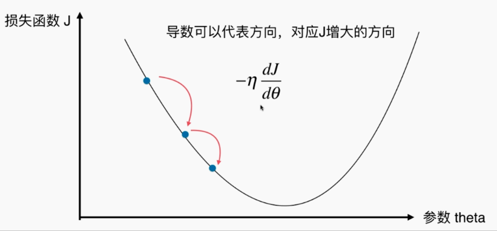

为了简单说明，在上面的图，是一个简单的二次曲线，参数 $ \theta $ 是一个数值，并不是一个向量。

在直线方程中，导数代表斜率；在曲线方程中，导数代表切线的斜率。在这幅图中，导数也可以代表 当 $ \theta $ 发生单位（移动步长 $ \eta $）变化的时候，J 相应的变化量。

梯度下降法就是寻找极值点的过程（导数为 0）。

要注意并不是所有的函数都是唯一极值点，解决的方案是：多次运行，随机化初始点。可以看出来，初始点也是梯度下降法的一个超参数。

最后介绍一下 $ \eta $：

- $ \eta $ 称为学习率
- $ \eta $ 的取值影响获得最优解的速度（接近极值点的速度）
  - $ \eta $ 太小，减慢收敛学习速度
  - $ \eta $ 太大，甚至导致不收敛（取不到最优解）
- $ \eta $ 是梯度下降法的一个**超参数**

我们接下来要最优化线性回归的损失函数 $ \sum_{i = 1}^{m}(y^{(i)} - \hat{y}^{(i)})^2 $，这是有唯一最优解的。

## 模拟实现一维的梯度下降法

以 $ y = (x - 2.5)^2 - 1 $ 二次曲线为例

```python
import numpy
import matplotlib.pyplot as plt

# 密集点连直线成平滑曲线
plot_x = numpy.linspace(-1., 6., 141)
plot_y = (plot_x - 2.5)**2 - 1

plt.plot(plot_x, plot_y)
plt.show()
```

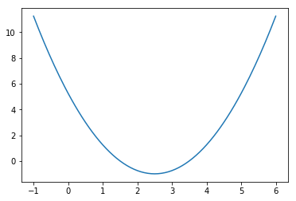

```python
epsilon = 1e-8 # 浮点数误差
eta = 0.1 # eta 越小，越密集，学习率低

theta_history = [] # 记录 theta 跳动过程

# 求 y
def J(theta):
    return (theta - 2.5) ** 2 - 1

# 求 y 导数
def dJ(theta):
    return 2*(theta - 2.5)

# 梯度下降函数（初始 theta 位置，学习率，循环最大次数（避免死循环），浮点数计算误差）
def gradient_descent(initial_theta, eta, n_iters = 1e4, epsilon=1e-8):
    theta = initial_theta
    i_iter = 0
    theta_history.append(initial_theta)

    while i_iter < n_iters:
        gradient = dJ(theta)
        last_theta = theta
        # 导数可以代表方向，代表 J 增大的方向：当导数为负数，说明 J 是朝着 x 轴负向增大；当导数为正数，说明 J 是朝着 x 轴正向增大
        # 所以为了朝着 J 减小的方向，我们只需要导数前添加负号
        # 只用到了梯度的方向！不管梯度的大小！
        # 是否能正确向 J 减小的方向移动，受超参数 eta 影响
        '''
        当斜率为负数的时候，说明 theta 增大，J 减小（我们希望的），继续增大 theta
        当斜率为正数的时候，说明 theta 增大，J 增大（我们不想的），所以我们减少 theta
        '''
        theta = theta - eta * gradient
        theta_history.append(theta)
        # 差几乎等于 0，则说明到达极值点
        if(abs(J(theta) - J(last_theta)) < epsilon):
            break
            
        i_iter += 1
        
    return theta

def plot_theta_history():
    plt.plot(plot_x, J(plot_x))
    plt.plot(numpy.array(theta_history), J(numpy.array(theta_history)), color="r", marker='+')
    plt.show()

# 调用梯度下降
theta_result = gradient_descent(0.0, 0.1)
plot_theta_history()

print(theta_result)
print(J(theta_result))
print(len(theta_history))
'''
# 从二次曲线中就可以看出极值点为 2.5，极值为 -1，theta 总共蹦跶了 46 次
2.499891109642585
-0.99999998814289
46
'''
# 当 eta = 0.01，正好如图
# 当 eta = 0.001，太密集了，学习率低
# 当 eta = 0.8，虽然左右横跳，最后还是乖乖得跳下去了
# 当 eta = 1.1，已经不能收敛了，左右横跳，逐渐往上跑了
```

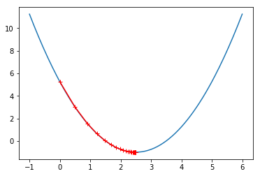

## 线性回归算法中的梯度下降

### 偏导数推导过程

如下图，此时的参数  $ \theta $ 是一个向量，导数也是一个向量。

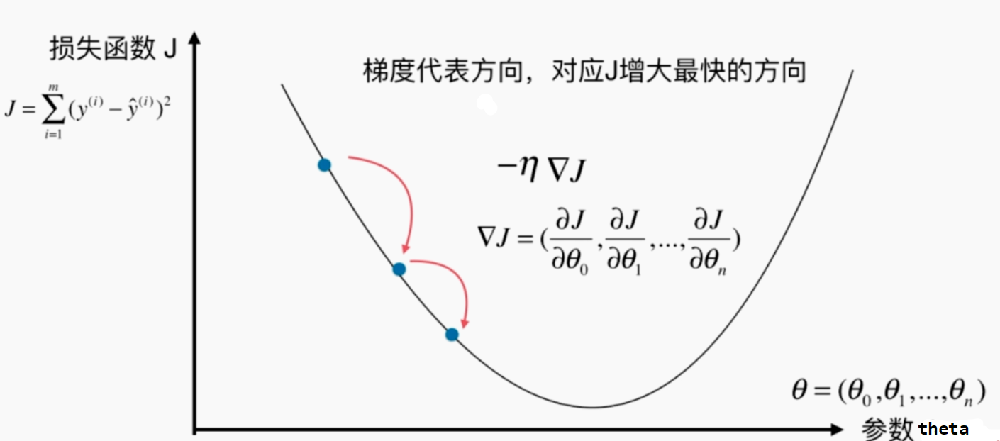

再次明确我们的目标，将预测值代入，得到目标：

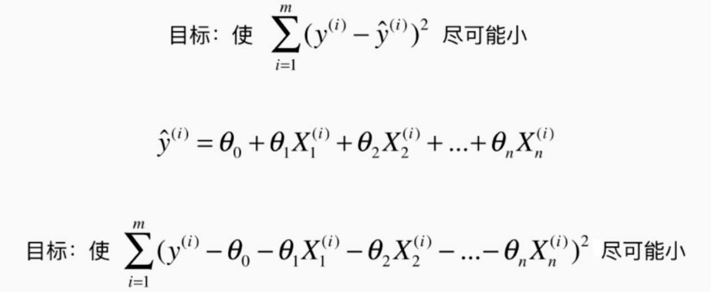

对上面的目标进行，求偏导（为了节省空间，将所有的 $X_j^{(i)}$ 和 $ \theta_j $ 写成了两个向量乘积的形式）（可以自己手写一下），得：

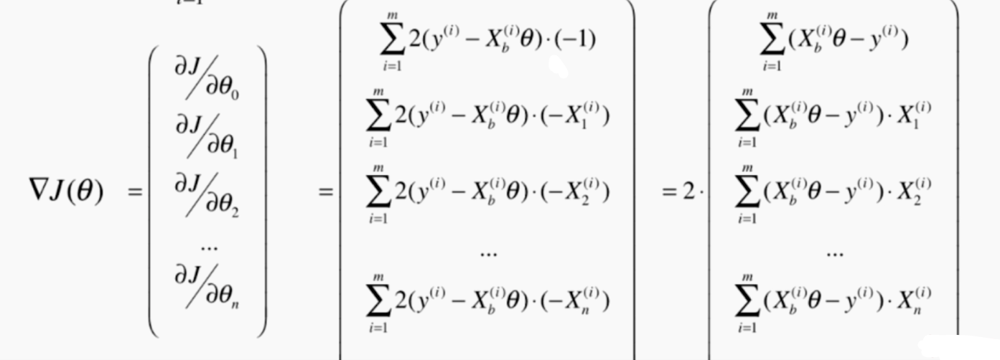

为了使结果不受 m 大小的影响，改造一下目标函数，得：

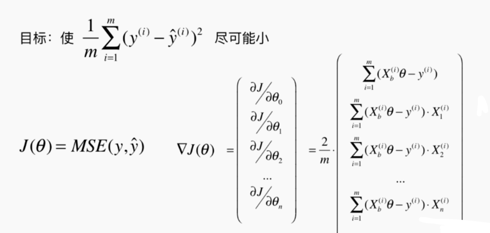

### 梯度下降法在线性回归算法中的具体实现

我们明确一下 $ X_b$、$y$ （训练数据集）是已知的，$ \theta $ （参数向量）是未值的，是我们需要求解的（循环尝试最后获得）。

```python
import numpy as np
import matplotlib.pyplot as plt

# 初始数据
np.random.seed(666)
x = 2 * np.random.random(size=100)
y = x * 3. + 4. + np.random.normal(size=100) '''y = 3x + 4'''
X = x.reshape(-1, 1) '''100 个样本，每个样本 1 个特征'''
'''
X
array([[ 1.40087424],
       [ 1.68837329],
       [ 1.35302867],
       ...
       [ 0.22571531],
       [ 0.22190734],
       [ 0.49533646]])
       
y
array([ 8.91412688,  8.89446981,  8.85921604, ..., 9.04490343,  8.75831915, 4.01914255 ])
'''

# 目标函数，用代码表示
def J(theta, X_b, y):
    try:
        return np.sum((y - X_b.dot(theta))**2) / len(X_b)
    except:
        return float('inf')

# 偏导数的值
def dJ(theta, X_b, y):
    res = np.empty(len(theta))
    res[0] = np.sum(X_b.dot(theta) - y)
    for i in range(1, len(theta)):
        res[i] = (X_b.dot(theta) - y).dot(X_b[:,i])
    return res * 2 / len(X_b)

# 梯度下降法
'''高维已经不能绘在二维平面绘制了'''
def gradient_descent(X_b, y, initial_theta, eta, n_iters = 1e4, epsilon=1e-8):
    
    theta = initial_theta
    cur_iter = 0

    while cur_iter < n_iters:
        gradient = dJ(theta, X_b, y) # 梯度向量
        last_theta = theta
        theta = theta - eta * gradient # 对应项相减，调整每一个梯度
        if(abs(J(theta, X_b, y) - J(last_theta, X_b, y)) < epsilon):
            break
            
        cur_iter += 1

    return theta

X_b = np.hstack([np.ones((len(x), 1)), x.reshape(-1,1)])
initial_theta = np.zeros(X_b.shape[1])
eta = 0.01

theta = gradient_descent(X_b, y, initial_theta, eta)
'''
theta = array([ 4.02145786,  3.00706277])
和我们假设的线性数据分布 y = 3x + 4 一致：截距为 4，系数为 3
'''

# 最后我们将“梯度下降法求得参数的过程”，改写进线性回归算法中的 fit，用梯度下降来获得参数向量

lin_reg = LinearRegression()
lin_reg.fit_gd(X, y)

lin_reg.coef_
lin_reg.intercept_
'''
array([ 3.00706277])
4.021457858204859
'''
```

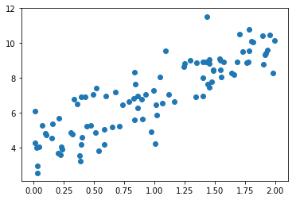

### 优化 1：偏导数“向量化相乘”提速

将`dJ`函数中“相乘累加”修改为“向量相乘”，提高运行速度。梯度式子演变过程：

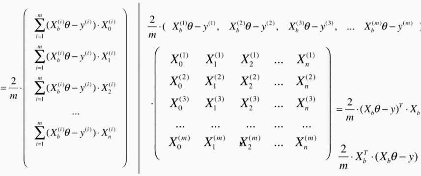

```python

'''
相乘累加
def dJ(theta, X_b, y):
    res = np.empty(len(theta))
    res[0] = np.sum(X_b.dot(theta) - y)
    for i in range(1, len(theta)):
        res[i] = (X_b.dot(theta) - y).dot(X_b[:,i])
    return res * 2 / len(X_b)
'''

# 向量相乘
def dJ(theta, X_b, y):
	return X_b.T.dot(X_b.dot(theta) - y) * 2. / len(y)
```

### 优化 2：数据归一化

数据（每一个特征）不在同一个数据规模上，有的特征收敛的快，有的特征收敛的慢（因为每一个特征都是累加同一个值 `- eta * gradient`），会导致数字溢出 `NaN`（应该是收敛慢的 $\theta$ 更容易溢出）。

## 随机梯度下降法（Stochastic Gradient Descent）

如果使用之前的梯度下降法(批量梯度下降法)，那么**每次迭代过程中都要对 m 个样本进行求梯度**，所以开销非常大，随机梯度下降的**思想**就是**随机采样一个样本来更新参数**，那么计算开销就从 O(n) 下降到 O(1)。

公式演化过程（直接扔掉 m）：

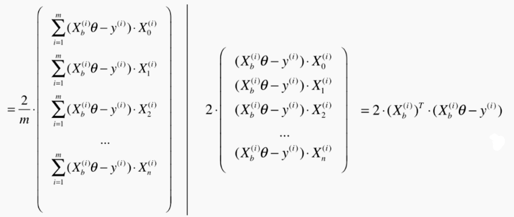

从下图中可以看出，随机梯度下降法不会沿着最好的方向向中心前进（上一节梯度下降是沿着中心前进）。

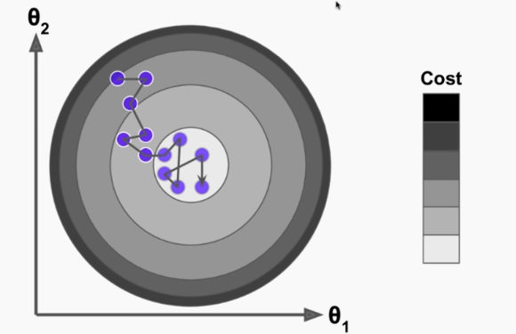

学习率是固定的，已经到中心附近了，结果又跳出去了，所以需要动态修改我们的 $\eta$ 值（逐渐递减）(很容易就能想到循环次数的倒数 ）
$$
\eta = \frac{a}{n\_iters + b}
$$
$b$ 是为了缓解初始时候 $\eta$ 下降太快（1、0.5、0.33、0.25、0.2、...），$a$ 是为了效果好（不详细）（$a$ 和 $b$ 实则是超参数，这里不做深入讨论，直接根据经验取 5 和 50）（模拟退火的思想）

```python
    def fit_sgd(self, X_train, y_train, n_iters=50, t0=5, t1=50):
        """根据训练数据集X_train, y_train, 使用梯度下降法训练Linear Regression模型"""
        assert X_train.shape[0] == y_train.shape[0], \
            "the size of X_train must be equal to the size of y_train"
        assert n_iters >= 1

        def dJ_sgd(theta, X_b_i, y_i):
            return X_b_i * (X_b_i.dot(theta) - y_i) * 2.

        def sgd(X_b, y, initial_theta, n_iters=5, t0=5, t1=50): '''n_iters=5 将所有样本看 5 遍'''

            # 学习率变化
            def learning_rate(t):
                return t0 / (t + t1)

            theta = initial_theta
            m = len(X_b)
            for i_iter in range(n_iters):
                # 每次看的时候要把所有的样本看一遍，而且是随机的，所以只要乱序就可以了
                indexes = np.random.permutation(m)
                X_b_new = X_b[indexes,:]
                y_new = y[indexes]
                for i in range(m):
                    gradient = dJ_sgd(theta, X_b_new[i], y_new[i])
                    theta = theta - learning_rate(i_iter * m + i) * gradient

            return theta

        X_b = np.hstack([np.ones((len(X_train), 1)), X_train])
        initial_theta = np.random.randn(X_b.shape[1])
        self._theta = sgd(X_b, y_train, initial_theta, n_iters, t0, t1)

        self.intercept_ = self._theta[0]
        self.coef_ = self._theta[1:]

        return self
```

## 如何确定梯度计算的准确性

推导公式困难，所以不知道有没有算错，那要怎么验证自己推导的公式是正确的？

在一维情况下，如果想了解一个点的斜率，可以取这个点**左右两边****距离很近**的两个点的连线，此时这两条线的斜率应该差不多的（平行），然后两个点的斜率又很简单就能计算出来（y 的差值 / x 的差值）。

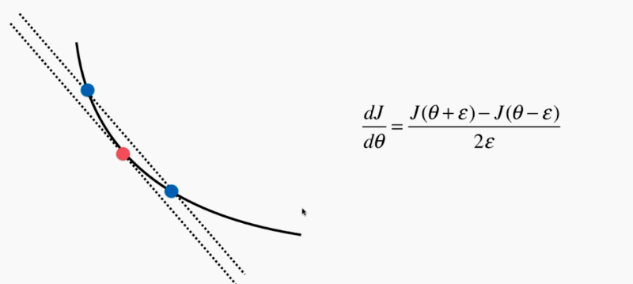

拓展到高维，也是同理，但是也可以出来效率低下，每次都要计算 n 个（所以只能用来调试）：

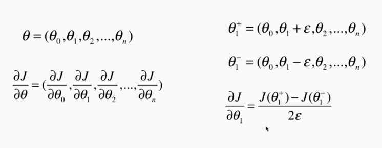

```python
import numpy as np
import matplotlib.pyplot as plt

# 模拟数据
np.random.seed(666)
X = np.random.random(size=(1000, 10))

true_theta = np.arange(1, 12, dtype=float)
'''
直接给出最好的 theta 向量
array([  1.,   2.,   3.,   4.,   5.,   6.,   7.,   8.,   9.,  10.,  11.])
'''
X_b = np.hstack([np.ones((len(X), 1)), X])
y = X_b.dot(true_theta) + np.random.normal(size=1000)


def J(theta, X_b, y):
    try:
        return np.sum((y - X_b.dot(theta))**2) / len(X_b)
    except:
        return float('inf')

# 数学推导而来的偏导数，只能适用于 J，速度快
def dJ_math(theta, X_b, y):
    return X_b.T.dot(X_b.dot(theta) - y) * 2. / len(y)

# 用于测试的，是通用的（与 J 无关），速度慢
# 求当前 theta 下的偏导数的值（算法中也只用到了这个值的方向）
def dJ_debug(theta, X_b, y, epsilon=0.01):
    res = np.empty(len(theta))
    for i in range(len(theta)):
        theta_1 = theta.copy()
        theta_1[i] += epsilon
        theta_2 = theta.copy()
        theta_2[i] -= epsilon
        res[i] = (J(theta_1, X_b, y) - J(theta_2, X_b, y)) / (2 * epsilon)
    return res

# 梯度下降
def gradient_descent(dJ, X_b, y, initial_theta, eta, n_iters = 1e4, epsilon=1e-8):
    
    theta = initial_theta
    cur_iter = 0

    while cur_iter < n_iters:
        gradient = dJ(theta, X_b, y)
        last_theta = theta
        theta = theta - eta * gradient
        if(abs(J(theta, X_b, y) - J(last_theta, X_b, y)) < epsilon):
            break
            
        cur_iter += 1

    return theta

# debug 测试
X_b = np.hstack([np.ones((len(X), 1)), X])
initial_theta = np.zeros(X_b.shape[1])
eta = 0.01

%time theta = gradient_descent(dJ_debug, X_b, y, initial_theta, eta)
theta
'''
CPU times: user 13.8 s, sys: 283 ms, total: 14.1 s
Wall time: 7.6 s 慢！！！

array([  1.1251597 ,   2.05312521,   2.91522497,   4.11895968,
         5.05002117,   5.90494046,   6.97383745,   8.00088367,
         8.86213468,   9.98608331,  10.90529198])
'''

# 数学公式测试
%time theta = gradient_descent(dJ_math, X_b, y, initial_theta, eta)
theta
'''
CPU times: user 1.57 s, sys: 30.6 ms, total: 1.6 s
Wall time: 856 ms 快！！！

array([  1.1251597 ,   2.05312521,   2.91522497,   4.11895968,
         5.05002117,   5.90494046,   6.97383745,   8.00088367,
         8.86213468,   9.98608331,  10.90529198])
'''
```

所以从这里看出，感觉之前上面几小节推导了这么多，其实只是针对一个损失函数（线性回归算法的损失函数），为了使它运算的更快，仅此而已。而这种 debug 的方式是更加通用地求任何损失函数的梯度。

## 小结

- ~~正规方程解（上一大章）~~
- 批量梯度下降法（Batch Gradient Descent）
- 随机梯度下降法（Stochastic Gradient Descent）：跳出局部最优解，得到更快的运行速度
- 小批量梯度下降法（Mini-Batch Gradient Descent）：结合上面两个方式，不要一次全看，也不要一次只看一个，而是一次看 K 个（超参数）

以上算是越来越快或者越来越优，同是针对一个损失函数（线性回归算法的损失函数）。