# 模型泛化

## 过拟合、欠拟合

就如上一章的二次曲线 $y = 0.5x^2 + x + 2$，当使用一条直线的时候，就是**欠拟合**，当`PolynomialRegression(degree=10)`就是**过拟合**（虽然很好的拟合了我们的训练数据，一条线基本串上了我们所有的训练数据的点，但是它的泛化能力很弱，给出其他数据，不能准确预测）。

- 欠拟合（underfitting）：算法所训练的模型不能完整地表述数据关系
- 过拟合（overfitting）：算法所训练的模型过多地表达了数据见地噪音关系

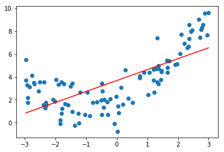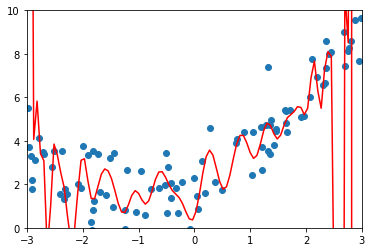

我们训练模型，不是为了最大程度拟合这些点，而是为了**获得能够预测的模型**。当有了新的样本，我们能够给出很好的解答。所以**得到拟合程度是没有意义的，我们需要的是模型的泛化能力**。我们要寻找模型泛化能力最好的地方。

可以看到当我们的模型复杂度越来越高（可以想 degree 取越高），我们的训练数据是越来越拟合的，但是我们的测试数据在某一处一定会下降。（所以模型复杂度不是越高越好）

所以我们需要**测试数据集**，来测试我们模型的准确率，而不单单用训练集。

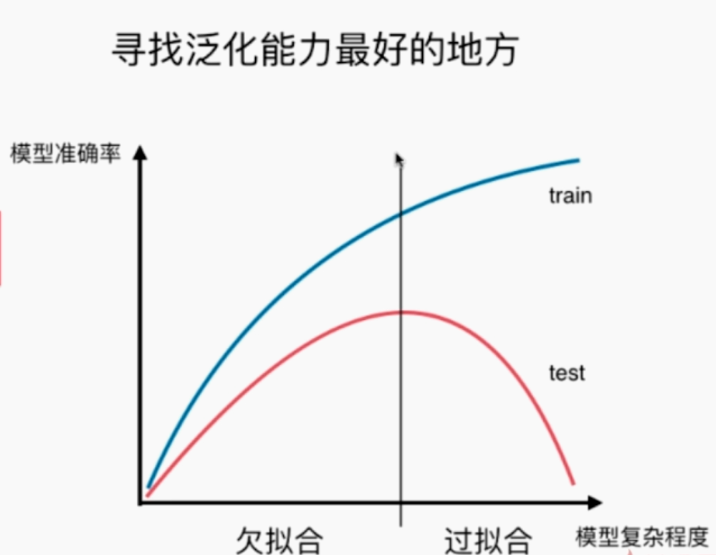

## 学习曲线

学习曲线：随着训练样本的逐渐增多，算法训练出的模型的表现能力（每一次都多一点数据训练，看在测试数据集和训练数据集的表现变化）。

- 训练数据点越多，我们的曲线很难拟合住所有的训练数据点，所以训练数据的学习曲线（均方误差）逐步上升
- 测试数据点数量是一定的，当我们的模型越来越完善（训练数据的增多），能拟合住的测试数据点越来越多，学习曲线（均方误差）逐步下降

```python
# 绘制学习曲线
def plot_learning_curve(algo, X_train, X_test, y_train, y_test):
    train_score = []
    test_score = []
    # 逐渐给数据训练（只给 1 个，到最后全给训练，训练了 n 个模型）
    for i in range(1, len(X_train)+1):
        algo.fit(X_train[:i], y_train[:i])
    
        y_train_predict = algo.predict(X_train[:i])
        train_score.append(mean_squared_error(y_train[:i], y_train_predict)) # 记录每次训练后的训练数据集的均方误差（训练数据也不是完全拟合的，也是存在误差的）
    
        y_test_predict = algo.predict(X_test)
        test_score.append(mean_squared_error(y_test, y_test_predict)) # 记录每次训练后的测试数据集的均方误差
    
    # 绘制曲线
    plt.plot([i for i in range(1, len(X_train)+1)], 
                               np.sqrt(train_score), label="train")
    plt.plot([i for i in range(1, len(X_train)+1)], 
                               np.sqrt(test_score), label="test")
    plt.legend()
    plt.axis([0, len(X_train)+1, 0, 4])
    plt.show()
```

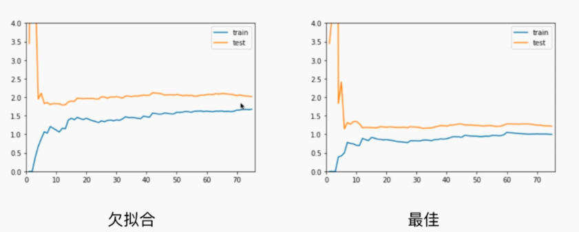

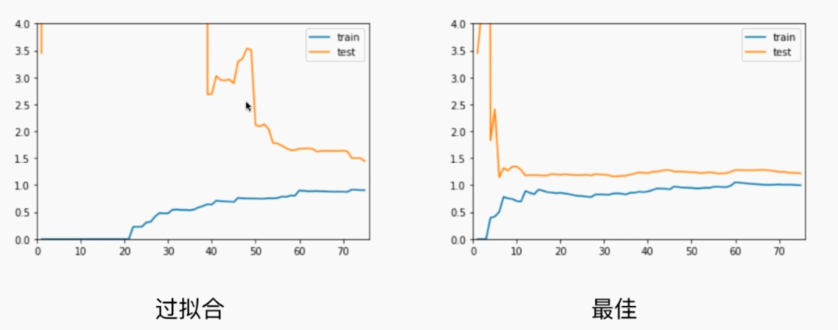

## 验证数据集

之前我们都是把数据分为两份，一份训练数据集，一份测试数据集。每次训练模型后，通过测试数据集来评判模型的准确度，如果不好的话，我们就要重新训练模型（寻找更好的超参数）。但无形之中，我们就相当于围绕着测试数据集进行调参，那可能最后只是过拟合了测试数据（因为就一份）。

所以我们将数据拆成三部分：训练数据、验证数据、测试数据。使用训练数据训练模型，使用验证数据来评判模型的准确度。这时候是验证数据和训练数据一起得到模型，最后用测试数据模拟真实的场景。

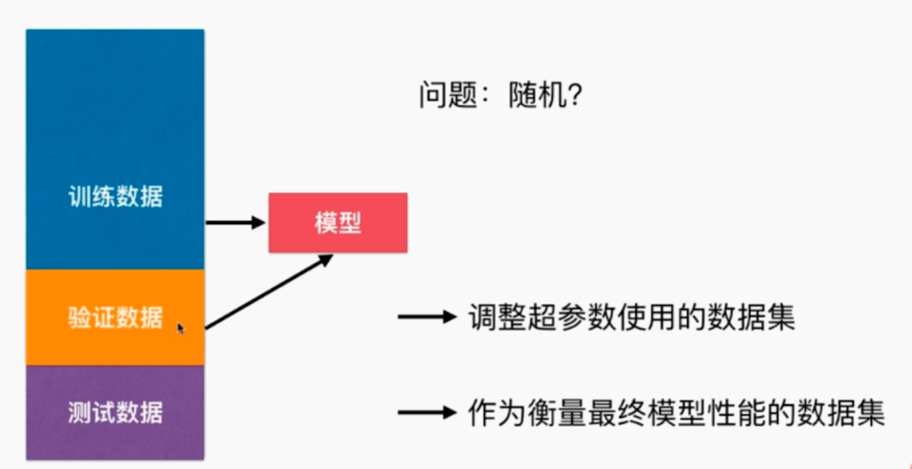

但其中还是存在问题：如果验证数据集里有比较极端的数据，我们只有一份验证数据集，那最后使模型不准确。

## 交叉验证（Cross Validation）

在基于以上问题，我们提出了交叉验证。将训练数据集继续拆分成多份，多次训练模型，用各自的验证数据集得到各自模型的准确度，最后求均值，避免一份随机的问题。

当我们把训练数据集分成 m （样本总数）份，称为**留一法**（Leave-One-Out Cross Validation）（每一个样本做一次验证集）：

- 优点：完全不受随机的影响，最接近模型真正的性能指标
- 缺点：计算量巨大


```python
from sklearn.model_selection import train_test_split
from sklearn.model_selection import cross_val_score
import numpy as np
from sklearn import datasets

digits = datasets.load_digits()
X = digits.data
y = digits.target

# 拆分训练数据和测试数据
X_train, X_test, y_train, y_test = train_test_split(X, y, test_size=0.4, random_state=666)

knn_clf = KNeighborsClassifier()
# 交叉验证（内部会将 X_train 继续拆分为训练数据和验证数据）（拆分数量 cv 默认为 3）
scores = cross_val_score(knn_clf, X_train, y_train, cv=3)
'''
得到内部分别用三份训练数据和验证数据得到的三个模型的准确度
array([ 0.98895028,  0.97777778,  0.96629213])
'''
score = np.mean(scores)
'''
使用时，我们取平均即可，即本次模型的准确度
'''
```

## 偏差方差权衡（Bias Variance Trade off）

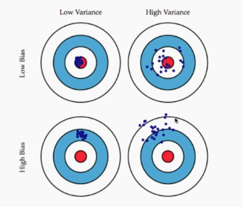

上图可以形象描述偏差和方差代表的意义：偏差就是衡量偏离中心点的距离，方差就是衡量样本间的间距。（希望低偏差，低方差）

- 像图一就是偏差很小很小（基本都打在了红心上），方差也很小很小（都聚拢在一起）
- 像图二就是偏差很小（分散地打在红心上），方差比较大（分散）
- 像图三就是偏差很大（完全偏离了红心），方差比较小（集中）
- 像图四就是偏差很大，方差很大

模型误差 = 偏差（Bias）+ 方差（variance）+ 不可避免地误差

- 导致偏差的主要原因：对问题本身的假设不正确，如非线性数据使用线性回归（欠拟合）
- 导致方差的主要原因：使用模型太复杂，数据一点点扰动都会较大地影响模型（说明没有学习到本质），如高阶多项式回归（过拟合）

- 有一些算法天生就是高偏差的算法，比如线性回归（因为对数据具有极强的假设，参数学习通常都是高偏差算法）
- 有一些算法天生就是高方差的算法，比如 kNN（因为不对数据进行任何假设，非参数学习通常是高方差的算法）

- 大多算法具有相应的参数，可以调整偏差和方差，如 kNN 中的 k，线性回归中使用多项式回归
- 偏差和方差通常是矛盾的，降低偏差，会提高方差。降低方差，会提高偏差

机器学习的主要挑战，来自于方差！解决高方差地通常手段：

- 降低模型复杂度
- 减少数据维度；降噪
- 增加样本数
- 使用验证数据集
- 模型正则化（下一节）

## 模型正则化（Regularization）——岭回归（Ridge Regression）

作用：限制参数的大小（如上面过拟合的曲线，肯定是有的参数特别大）

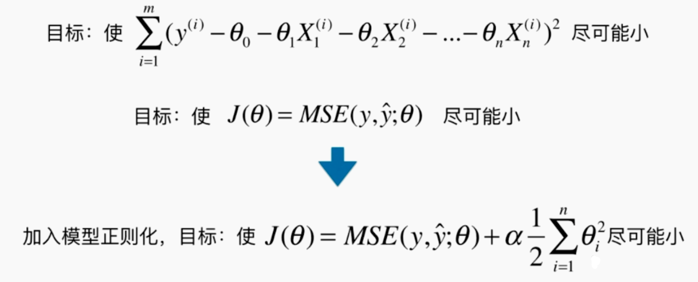

不仅要求原来的真值与预测值的差距要尽可能的小，强行加上 $\theta$ 平方的和，使这一整个目标函数尽可能的小，那我们也就不能一味地求之前地目标函数的最小了，还要考虑 $\theta$ 的大小了。

$\alpha$ 是一个超参数，觉得后面的式子尽可能小的程度占我们总共目标函数的多少（越小就是越不考虑后面的式子了）。（$\frac{1}{2}$ 只是为了求导方便）（$\theta_0$ 只是截距，不是系数，不考虑进去）

这种模型正则化的方式，称为**岭回归**（Ridge Regression）

```python
from sklearn.linear_model import Ridge

def RidgeRegression(degree, alpha):
    return Pipeline([
        ("poly", PolynomialFeatures(degree=degree)),
        ("std_scaler", StandardScaler()),
        ("ridge_reg", Ridge(alpha=alpha))
    ])

ridge1_reg = RidgeRegression(20, 0.0001)
ridge1_reg.fit(X_train, y_train)

y1_predict = ridge1_reg.predict(X_test)
mean_squared_error(y_test, y1_predict)

# 逐渐增大 alpha 的值，曲线越来越平滑（到最后 alpha 非常大，成了一条平行 x 轴的直线，因为所有的 theta 取 0，后面的目标越小，不是最佳的）
```

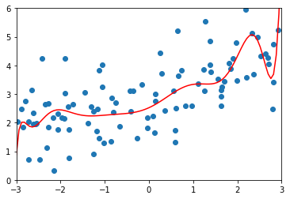

## 模型正则化（Regularization）——LASSO Regularization

LASSO——Least Absolute Shrinkage and **Selection Operator** Regression

 

原理和岭回归是一样的，只是后半部分表示 $\theta$ 大小的方式不同。

```python
from sklearn.linear_model import Lasso

def LassoRegression(degree, alpha):
    return Pipeline([
        ("poly", PolynomialFeatures(degree=degree)),
        ("std_scaler", StandardScaler()),
        ("lasso_reg", Lasso(alpha=alpha))
    ])

lasso1_reg = LassoRegression(20, 0.01)
lasso1_reg.fit(X_train, y_train)

y1_predict = lasso1_reg.predict(X_test)
mean_squared_error(y_test, y1_predict)
```

## 比较 Ridge 和 LASSO

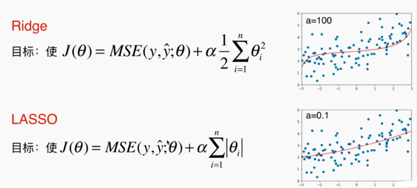

可以看到 Ridge 更偏向取一条曲线（部分 theta 值很小很小），而 LASSO 更偏向取一条直线（趋向于使得一部分 theta 值变为 0，所以可以作为**特征选择**）。

## L1 正则，L2 正则和弹性网（Elastic Net）

相通之处（只不过换了名词）：

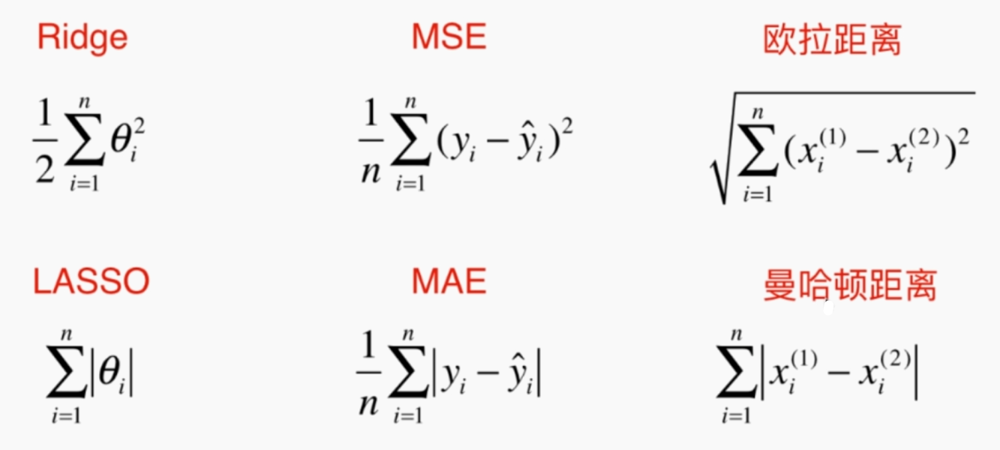

L1，L2：

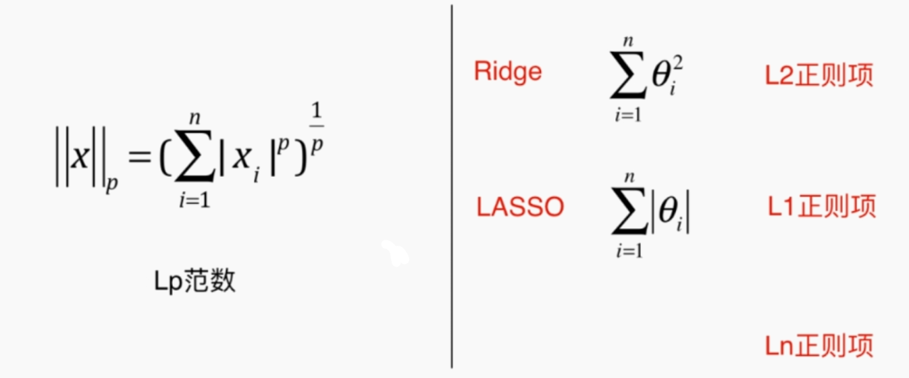

弹性网：

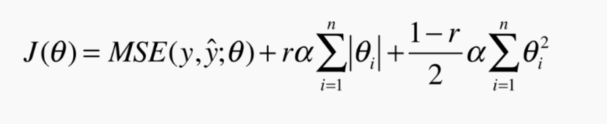

