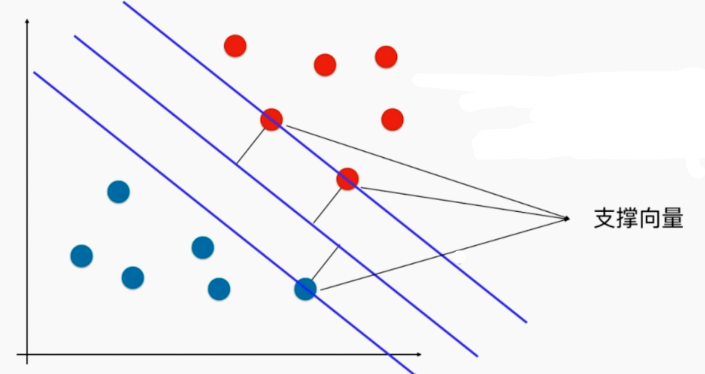
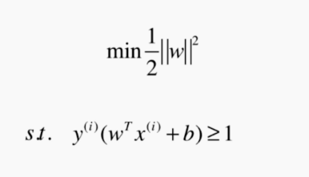
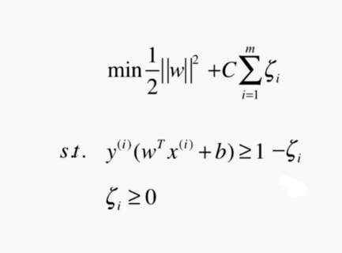
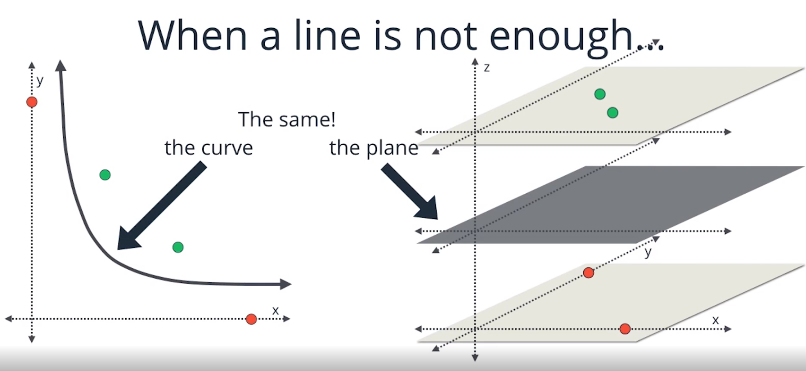
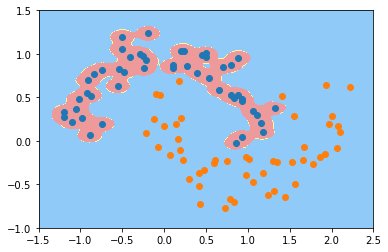
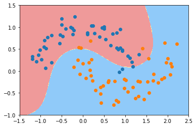
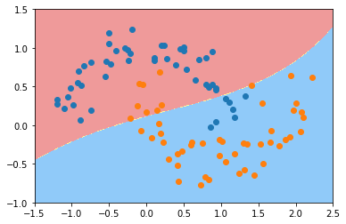
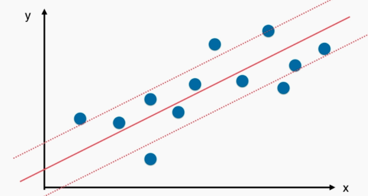

# 支撑向量机 SVM

## 什么是支撑向量机（Support Vector Machine）

决策边界不唯一，就会有“不适定”问题。比如下图的红色和蓝色两个阵营中间有很大的空隙，其中任意画一条直线都可以作为决策边界，但是真的可以任意画吗？比如这根直线偏向红色的阵营，可能泛化能力不是很好（在中间可能是最好的，不偏向任何一方）。

逻辑回归中解决这个问题是用“最小化损失函数”的方法。

在支撑向量机算法中是取两个阵营最边界的地方，分别做两条直线， 在中间取一条决策边界。**SVM 就是要最大化两条直线的距离 margin**。



## SVM 背后的最优化问题

经过推导，得 SVM 是要最小化 $\frac{1}{2}||w||^2$，在 $y^{(i)}(w^Tx^{(i)} + b) >= 1$ 的条件下。

这也是在假设数据是在线性（直线）可分的前提下（也称 Hard Margin SVM）。



## Soft Margin 和 SVM 的正则化

当有一个蓝色的点跑到红色的点那边去了，那我们就无法用一根直线来划分两个区域了（线性不可分），这时候我们就**需要一些容错机制**，让我们的决策边界不受特殊点影响泛化能力，这时候就需要 Soft Margin。



C（超参数）越小，我们的容错空间越大。

## scikit-learn 中的 SVM

因为涉及距离，和 kNN 一样，要先做数据标准化处理。

略

## SVM 中使用多项式特征和核函数

上面都是处理线性问题，不能解决非线性问题，运用老套路，引入多项式回归。

对于 SVM 算法中，scikit-learn 不需要像之前一样使用组合使用，而是封装了一个新的方式加入多项式的方法——“使用多项式核函数的 SVM”。

```python
from sklearn.preprocessing import PolynomialFeatures, StandardScaler
from sklearn.svm import LinearSVC
from sklearn.svm import SVC
from sklearn.pipeline import Pipeline

def PolynomialSVC(degree, C=1.0):
    return Pipeline([
        # 可以看到使用 SVC 来替代 LinearSVC，就可以不需要引入 PolynomialFeatures 来添加多项式（虽然训练结果不同）
        ("std_scaler", StandardScaler()),
        ("kernelSVC", SVC(kernel="poly", degree=degree, C=C))
        '''
        ("poly", PolynomialFeatures(degree=degree)),
        ("std_scaler", StandardScaler()),
        ("linearSVC", LinearSVC(C=C))
        '''
    ])
```

## 什么是核函数

**核函数和映射没有关系。**核函数只是用来计算映射到高维空间之后的内积的一种简便方法。

一般英文文献对 Kernel 有两种提法，一是 Kernel Function，二是 Kernel Trick。从 Trick 一词中就可以看出，这只是一种**运算技巧**而已，不涉及什么高深莫测的东西。

通过其他式子（xy 或者映射到高维）来进行寻找分割方式而已（下图二者是相似的寻找分界点的方式，并无很大差异）

[人话版——Kernel](http://cn-static.udacity.com/mlnd/videos/Kernel.mp4)



## 高斯核函数（RBF 核）

$$
K(x, y)=e^{-\gamma||x-y||^2}
$$


RBF 核——Radial Basis Function Kernel

将每一个样本点映射到一个无穷维的特征空间

依靠升维使得原本线性不可分的数据线性可分

 $\gamma$ 越大，就偏向过拟合；$\gamma$ 越小，就偏向欠拟合（下图分别是过拟合、正好、欠拟合三种结果）







## SVM 思路解决回归问题

之前我们用线性回归算法解决回归问题，是寻找一根直线，最大程度拟合我们所有的训练数据的点。

而 SVM 解决回归问题的思路与之类似，但是是寻找 margin 尽可能包含所有的点（使用 svm 分类是不包含任意一个点，完全相反），然后 margin 中间那条直线就是我们所要求的线。

