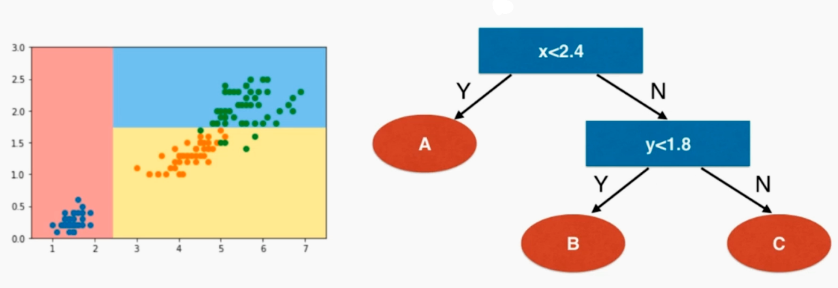

# 决策树

## 什么是决策树

决策树是非参数学习算法，可以解决分类问题，并且天然可以解决多分类问题，也可以解决回归问题。



## 使用信息熵寻找最优划分

那每个节点在哪个维度做划分？某个维度在哪个值上做划分？

熵：在信息论中代表随机变量不确定的度量。熵越大，数据的不确定性越高；殇越小，数据的不确定性越低。
$$
H = -\sum_{i=1}^{k}p_ilog(p_i)
$$
以上是熵的公式，其中 $p_i$ 是当前样本数量在样本总数量的占比。

比如三个样本，分别占比为 1/10，2/10，7/10，那它的信息熵就为 $H = -\frac{1}{10}log(\frac{1}{10})-\frac{2}{10}log(\frac{2}{10})-\frac{7}{10}log(\frac{7}{10})=0.8018$。

再比如三个样本，分别占比为 1，0，0，那它的信息熵就为 $H = -1·log(1) = 0$，比上面的例子稳定，且是最稳定（最小值）。

所以，我们的目标是想划分后，使得系统的信息熵降低。

接下来模拟使用信息熵进行划分：

```python
import numpy as np
import matplotlib.pyplot as plt
from sklearn import datasets
from sklearn.tree import DecisionTreeClassifier
from collections import Counter
from math import log

# 莺尾花数据集
iris = datasets.load_iris()
X = iris.data[:,2:]
y = iris.target

# 信息熵计算公式
def entropy(y):
    counter = Counter(y)
    res = 0.0
    for num in counter.values():
        p = num / len(y)
        res += -p * log(p)
    return res

# d 表示第几个特征，value 分割线是多少
def split(X, y, d, value):
    index_a = (X[:,d] <= value)
    index_b = (X[:,d] > value)
    return X[index_a], X[index_b], y[index_a], y[index_b]

# 不断尝试划分搜索，找到最小的信息熵（划分一次，再调用剩下的继续划分）
def try_split(X, y):
    
    best_entropy = float('inf') # 信息熵越小越好
    best_d, best_v = -1, -1
    '''遍历所有特征'''
    for d in range(X.shape[1]):
        sorted_index = np.argsort(X[:,d])
        for i in range(1, len(X)):
            if X[sorted_index[i], d] != X[sorted_index[i-1], d]:
                v = (X[sorted_index[i], d] + X[sorted_index[i-1], d]) / 2 # 候选划分值：取两个数的中间值
                X_l, X_r, y_l, y_r = split(X, y, d, v) # 划分
                p_l, p_r = len(X_l) / len(X), len(X_r) / len(X)
                e = p_l * entropy(y_l) + p_r * entropy(y_r)
                if e < best_entropy:
                    best_entropy, best_d, best_v = e, d, v
                
    return best_entropy, best_d, best_v

# sklearn 决策树
# criterion="entropy" 标准设置为“信息熵”
dt_clf = DecisionTreeClassifier(max_depth=2, criterion="entropy", random_state=42)
dt_clf.fit(X, y)
```

## 决策树的局限性

- 只能平行 x 轴或者平行 y 轴，连斜着的直线也不能表示
- 对个别数据是敏感的（可能删掉一个点就决策发生变化了）

