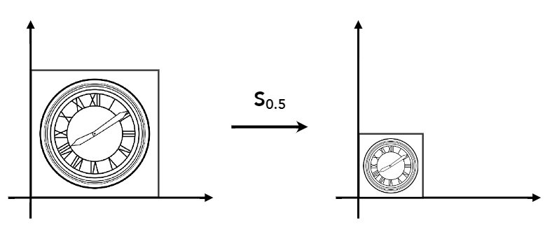
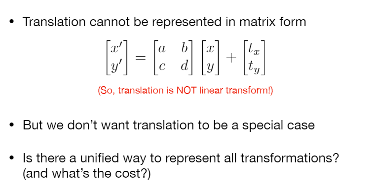
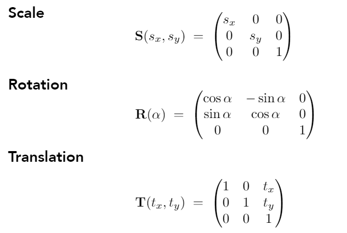
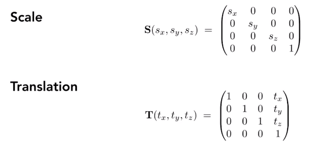
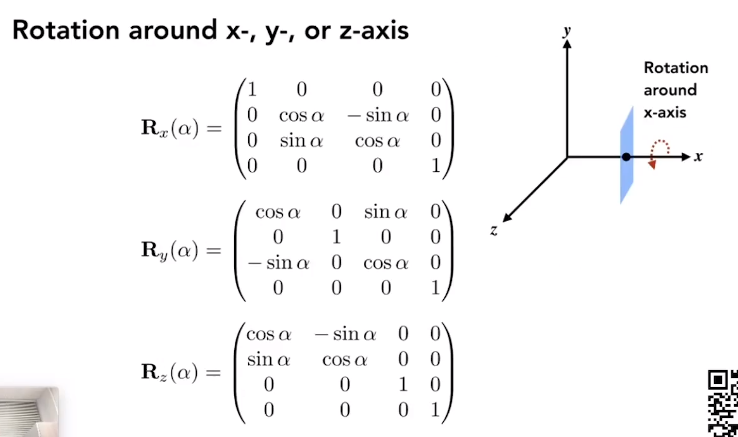
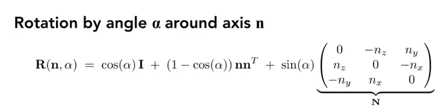

## 缩放变换（Scale）

$ \begin{cases} x\prime = sx \\ y\prime = sy \end{cases}$ 使用矩阵表示：$\begin{pmatrix} x\prime \\ y\prime \end{pmatrix} = \begin{pmatrix} s & 0 \\ 0 & s \end{pmatrix}\begin{pmatrix} x \\ y\end{pmatrix}$

## 为什么要使用齐次坐标系

不然**平移变换**就要比**线性变换**就要多一个常数项；这样就不会有特殊情况；多了一个维度算是一种牺牲。

为了结合线性变换（Linear Transform）和平移变换（Translation）可以使用**仿射变换**（affine transform），通常存储在一个 ![[公式]](https://www.zhihu.com/equation?tex=4%5Ctimes+4) 的矩阵中。仿射变换是一种变换，即先完成线性变换，然后再完成平移变换。为了表示四维向量我们使用[齐次坐标](https://zhuanlan.zhihu.com/p/73123357)，用统一的方式表示点和方向。

一个方向向量表示为 ![[公式]](https://www.zhihu.com/equation?tex=%5Cboldsymbol%7BV%7D%3D%28v_x+%5Cquad+v_y+%5Cquad+v_z+%5Cquad+0+%29%5E%5Cboldsymbol%7BT%7D) ，而一个点表示为 ![[公式]](https://www.zhihu.com/equation?tex=%5Cboldsymbol%7Bv%7D%3D%28v_x+%5Cquad+v_y+%5Cquad+v_z+%5Cquad+1%29%5E%5Cboldsymbol%7BT%7D) 。

## 2D 变换

- 这几种变换都是基于原点的？
- 不满足交换律，满足结合律（就是先平移后旋转，和先旋转后平移是不同的）（同矩阵计算）
- 是先线性变换，再加上一个平移量

## 3D 变化

旋转变化比较特殊

## Rodrigues' Rotation Formula

以任意轴旋转任意角的公式

