## 综述

- Viewing transformation（观测变换），分为：
  - View/Camera transformation（视图变换）
  - Projection transformation（投影变换），再分为：
    - Orthographic projection（正交投影）
    - Perspective projection（透视投影）

从三维空间中的物体转化为一张图片，可以想象拍照的步骤（MVP）：

- Find a good place and arrange people   (model trnasformation)
- Find a good "angle" to put the camera   (view transformation)
- Cheese!                                                        (projection transformation)

总结: 找到好地方，把人摆好，找到好的角度摆放照相机，最后拍照做投影(三维变二维)。

## View/Camera Transformation

占了前两个步骤 MV, 也称其为模型视图变换(ModelView Transformation).

### 定义相机

- Position $\vec{e}$（位置）
- Look-at / gaze direction $\hat{g}$（看的方向）
- Up direction $\hat{t}$（相机横着放，还是竖着放）（相机上插根草）

### 固定相机

We **always** transform the camera to（因为这么做有太多的好处）

- The origin, up at Y, look at -Z （放在原点，向上方向是 Y，朝着 -Z 看）
- And transform the objects along with the camera

### 调整相机位置

把相机调整到 always 的点，记转换矩阵为 $M_{view}$：

- 平移 $\vec{e}$ 到原点
- 旋转 $\hat{g}$ 到 -Z
- 旋转 $\hat{t}$ 到 Y
- 旋转 $(\hat{g}\times\hat{t})$ 到 X (理所应当)

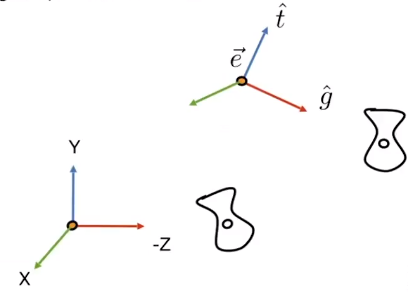

 

**那如何将其使用数学表达式来进行表示呢?**

- 将 $M_{view}$ 拆解为 $M_{view} = R_{view}T_{view}$ (先做平移(右边), 再做旋转)
- 为了将 $\vec{e}$ 旋转到原点, 得到 $T_{view} = \begin{pmatrix} 1 & 0 & 0 & -x_e \\ 0 & 1 & 0 & -y_{e} \\ 0 & 0 & 0 & -z_e \\ 0 & 0 & 0 & 1\end{pmatrix}$
- 旋转 $\hat{g}$ 到 $-Z$, 旋转 $\hat{t}$ 到 Y, 旋转 $(\hat{g}\times\hat{t})$ 到 $X$
- 考虑它的 $R_{view}^{-1}$ (将 $X$ 旋转到 $(\hat{g}\times\hat{t})$, 旋转 $Y$ 到 $\hat{t}$, 旋转 $-Z$ 到 $\hat{g}$), 得到 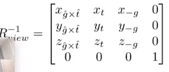
- 然后怎么对旋转矩阵求逆呢? 因为**旋转矩阵是正交矩阵, 那么正交矩阵的的逆就是它的转置**, 得到 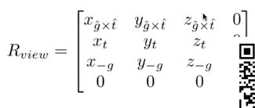

**为什么直接写 $R_{view}$ 不好写, 写 $R_{view}^{-1}$ 好写呢? 举其中一个例子:** 

- 已知 $\hat{g} = (x_{\hat{g}}, y_{\hat{g}}, z_{\hat{g}}, 0)$, $-Z=(0, 0, -1, 0)$
- 要求 $R_{view}$, 假设 $R_{view} = \begin{pmatrix} r_{11} & r_{12} & r_{13} & r_{14} \\ r_{21} & r_{22} & r_{23} & r_{24} \\ r_{31} & r_{32} & r_{33} & r_{34} \\ r_{41} & r_{42} & r_{43} & r_{44} \end{pmatrix}$
- 可以把两种形式具体写出来看一下, 可以发现直接写列出来的方程是 
  - $R_{view}\hat{g}=-Z$ 第一行相乘的情况:  $r_{11} \times x_{\hat{g}} + r_{12} \times y_{\hat{g}} + r_{13} \times z_{\hat{g}}=0$, 看过去是不是不能马上算出来?
  - $R_{view}^{-1}(-Z)=\hat{g}$ 第一行相乘的情况: $r_{13}^{-1}\times (-1)=z_{\hat{g}}$, 是不是能马上一眼看出来 $r_{13}^{-1}=z_{\hat{-g}}$?

## Projection Transformation

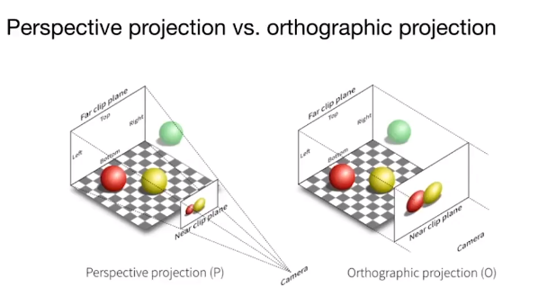

- 透视投影: 更符合人眼(近大远小)(平行线也不再平行了), 组成四棱锥
- 正交投影: 假设摄像机无限远, 近处的平面和远处的平面大小越来越接近

### 正交投影

#### 一种简单的理解

- 将相机固定到原点, 朝着 -Z 看, 向上方向是 Y
- 直接把 Z 轴扔掉
- 然后不管范围有多大, 全部移动到 $[-1, 1]^2$  这个矩形上

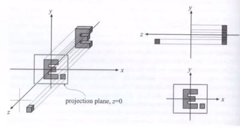

#### 正式一点的做法

先做平移, 再做缩放: 将长方体 [l, r] x [b, t] x [f, n] 转换到标准的正方体 $[-1, 1]^3$ 中.

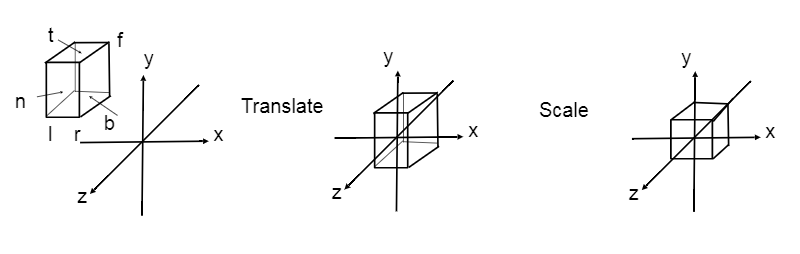

**注意点:**

- 这里的 l, r 不是向量, 而是左右平面再相机坐标系中交于 x 轴的 x 标量, btfn 同理
- 因为我们是朝着 -Z 方向看,所以"近"大于"远"(near > far)(这也是为什么 OpenGL 用左手系)
- 这个过程, 物体会被拉伸

#### 最后的变换矩阵

- 先将中心点移动到原点(右边)
- 再进行缩放(长宽高映射到长度 2)(左边)

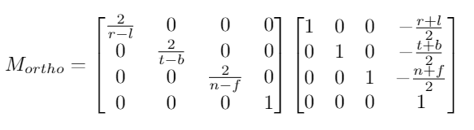

### 透视投影

#### 预备知识回顾

一个齐次坐标的性质: (x, y, z, 1), (kx, ky, kz, k), (zx, zy, z^2) 在 3D 中都表示同一个点 (x, y, z), 其中 k != 0, z !=0.

例如 (1, 0, 0, 1) 和 (2, 0, 0, 2) 都表示 (1, 0, 0).

简单, 但有用.

#### 如何做透视投影

直接做透视投影比较难, 那我们转换思想, 

- 先将"截头锥体"往里挤(将 Frustum 变成 Cuboid)($M_{persp->ortho}$)
- 再做一次正交投影($M_{ortho}$ 已知!)

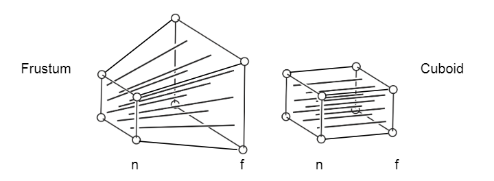

**注意点:**

- 近平面大小不变, 远平面大小变成和近平面一样
- 远平面的 z 不变(就是只把远平面四个点在原平面聚拢)(近平面, 远平面中间的点 z 还是会变化的)

#### 推导 $M_{persp->ortho}$

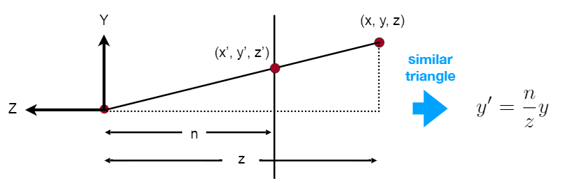

- 已知 (x, y, z), 将其转化为 (x', y', z') (注意 (x, y, z) 在 (x', y', z') 的左上角, 不在同一个平面)
- 减少未知数的个数, 使用 z 表示, 根据相似三角形, 得到 $y\prime=\frac{n}{z}y$, $x\prime=\frac{n}{z}x$
- 根据预备知识, 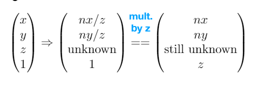
- 根据 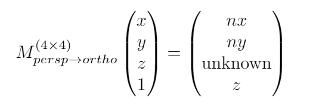, 可以先推出部分的 
- 最后就是各种观察, 代入已有的条件, 推出前两个是 0, 后两个通过解二元一次方程组求得 (略过)

#### 最后的变换矩阵

$M_{persp}=M_{ortho}M_{persp->ortho}$

$M_{persp->ortho}=\begin{pmatrix} n & 0 & 0 & 0 \\ 0 & n & 0 & 0 \\ 0 & 0 & n+f & -nf \\ 0 & 0 & 1 & 0 \end{pmatrix}$