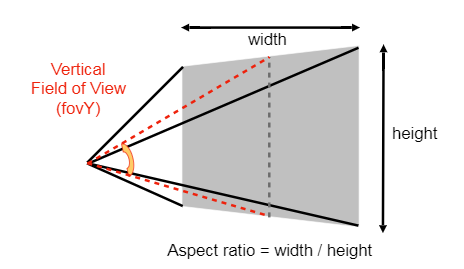
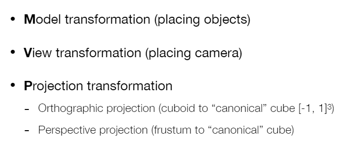
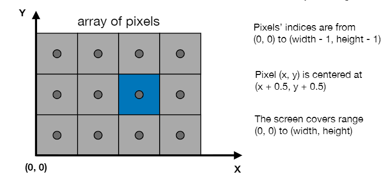
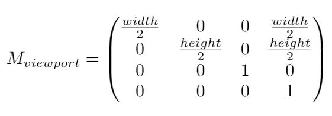
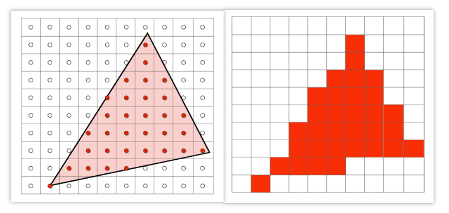

## 如何定义一个视锥

- 长宽比(aspect ratio)
- 垂直的可视角度(field of view, fovY)



## MVP 之后该做什么?



要将 $[-1, 1]^3$ 的标准立方体(Canonical Cube)要画在哪呢? 画在屏幕上

## 何为光栅化(Rasterization)

首先, 先介绍一下何为屏幕?

- 一个二维的数据, 每个元素都是一个像素 (1920 x 1080)
- 是一个典型的光栅呈像设备

那什么是光栅化呢?

- raster, 其实是德语的一个词, 表示屏幕
- rasterize, 就是将东西绘制到屏幕上

什么叫屏幕空间呢?

- pixel, picture element 的简写
- 左下角作为原点 (约定)



## 视口变换: 如何将标准立方体映射到屏幕上?

- 暂时丢掉 z
- 只在 xy 平面做平移缩放: $[-1, 1]^2$ 转换为 $[0, width]\times[0, height]$
- 先做缩放, 再做平移, 转换的矩阵如下:



## 如何给三角形上色?简单方式: 采样(Sampling)

```js
/**
* 遍历所有像素点, 判断像素点的中心是否在三角形内部, 在内部就把这个像素填上颜色
**/
for (let x = 0;  x < xmax; x ++) {
    for (let y = 0; y < ymax; y ++) {
        image[x][y] = inside(tri, x + 0.5, y + 0.5);
    }
}
```

- 如何判断一个点是否在三角形内(inside 方法), 参见 02 向量部分的介绍
- 当然有其他的遍历优化方法, 不用全部遍历



## 省略的内容

- 介绍了一堆显示设备
  - 示波器(Oscilloscope)
  - 阴极射线管(Cathode Ray Tube, CRT), 电视(逐行扫描, 隔行扫描)
  - 平板显示设备(手机)(Flat Panel Displays)
  - LCD(Liquid Crystal Display) Pixel, 原理是改变光的方向, 只允许一个方向的光通过
  - LED Array Display(Light emitting diode array)
  - 水墨屏, kindle
- 介绍了三角形作为 Fundamental Shape Primitives 的好处
  - 最基础的多边形
  - 可以分解其他多边形
  - 方便做插值
- 人眼对绿色更敏感, 所以使用更多的绿色感光元件, 使绿色得到更好的还原, 人眼更舒服