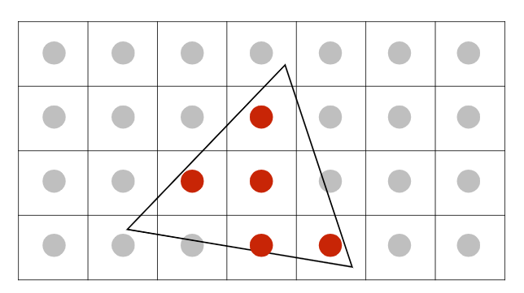
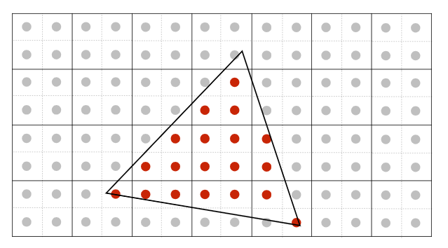
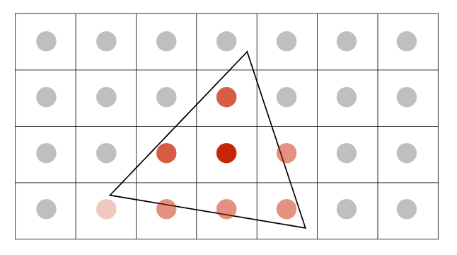
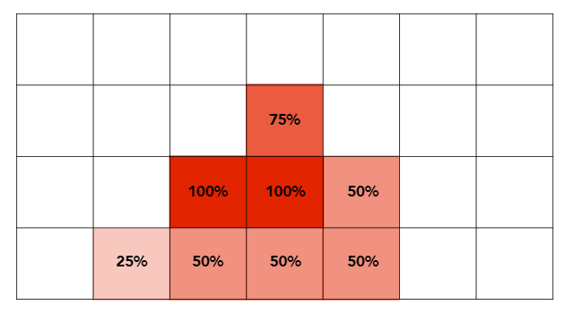
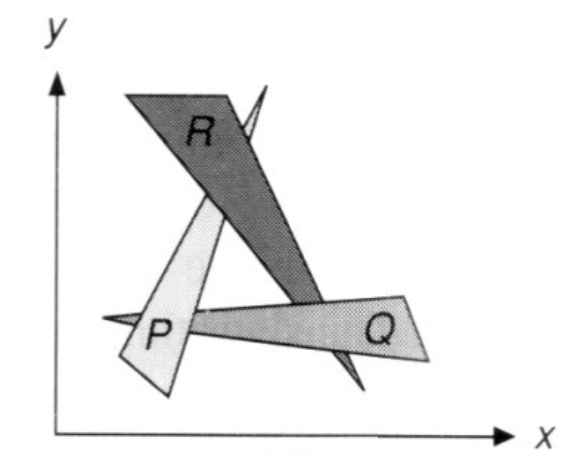
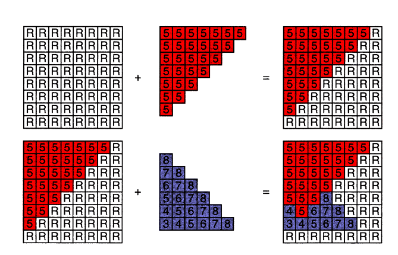

## 简记

- aliasing, 走样, 锯齿
- artifacts, 瑕疵, 看着不太对的东西
- artifacts due to sampling-"Aliasing"(锯齿, 摩尔纹, 车轮效应)
- artifacts 的背后是: 信号变化太快了, 采样跟不上
- 一个解决办法就是: 先模糊(边缘), 模糊了之后还是哪个像素块是什么颜色就是什么杨色
- 先锯齿, 再模糊, 是不行的
- 讲了一堆频率的事情, 连接了频率和图像之间
- 卷积操作, 滤波器(时域的卷积=频域的乘积)
- 采样就是重复原始信号的频谱(不清楚)
- 反走样的方式:
  - 增加采样率: wocou, 这就是为什么高分辨率的显示器图像清楚, 走样了, 但是像素小, 看起来不明显(物理上)
  - 反走样: **先做模糊, 再做采样**(对应到频率, 就是低通滤波, 过滤掉高频信息)(高频信息一般是边缘)

## 多重采样抗锯齿

多重采样抗锯齿, MultiSampling Anti-Aliasing, MSAA

问题: 以下的方式, pixel 中心在三角形内, 就直接红色, 锯齿明显.



解决办法: 那就将一个像素再细分 2x2, 再看在三角形内的点的个数, 根据点的个数, 计算颜色百分比, 达到模糊的效果







## 深度测试(可见性/遮挡)

### 画家算法

- 中心思想: 先画远的(画全), 再画近的, 不断覆盖(本来有些没必要画)
- 具体做法: 遍历所有的三角形, 计算 z 的深度, 排序, 在后面的就先画(慢)
- 存在问题: 如果三角形存在两两交叠遮挡, 形成闭环的情况, 就不能判断谁前谁后了.



### Z-Buffer

- 广泛采用
- 对每个三角形不好排序, 那就对每个像素
- 中心思想:
  - 每次像素采样, 记录当前最小的 z 值(最近)
  - frame buffer 存储最后的画面的每个 pixel 的颜色
  - depth buffer(z-buffer) 存储最后的画面的每个 pixel 的深度
- 下面图, 举例两个三角形的绘制

```js
/**
* 中心思想伪代码
**/
// 初始深度 +∞ infinite
for(each triangle T) {
    for(each sample (x, y, z) in T) {
        if(z < zbuffer[x, y]) {			// 如果更近
        	frame_buffer[x, y] = rgb;	// 更新该像素的颜色
    		z_buffer[x, y] = z;			// 更新最近深度
    	}
    }
}

```

