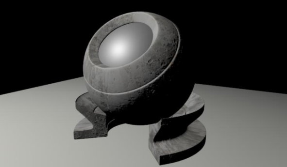
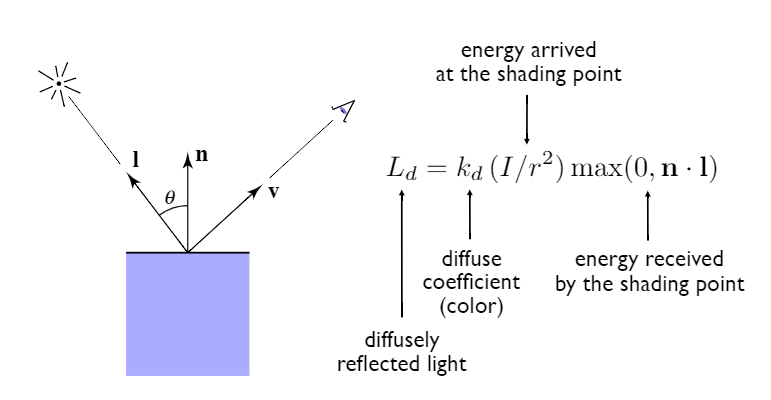
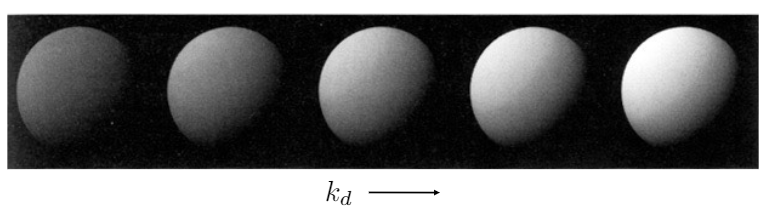
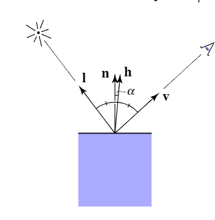
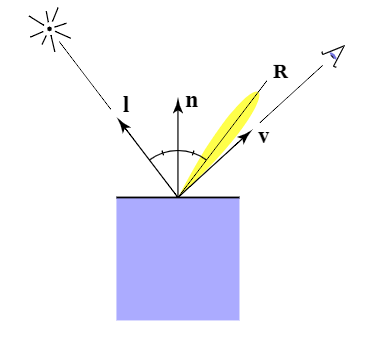
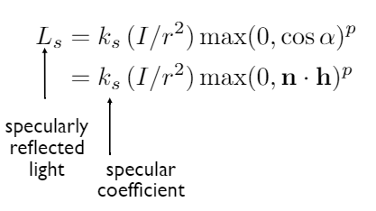
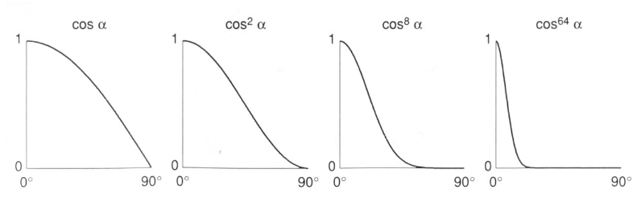
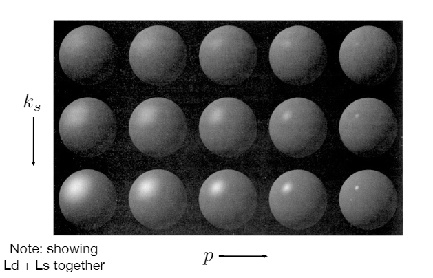

## 简记

- shading 的字典定义:
  - shad·ing, [ˈʃeɪdɪŋ], noun
  - The darkening or coloring of an illustration or diagram with parallel lines or a block of color.
  - 用平行线或色块(绘画上的方式)使插图或图表变暗或着色。
  - 字典的定义也没什么问题
- shading 在课程中的定义:
  - 对一个物体应用不同的材质的过程 
- 三种光照(将这三部分分析表示出来, 就可以做出一种材质):
  - 镜面高光, specular highlights
  - 漫反射, diffuse reflection
  - 环境光, ambient lighting
- Shading is Local
  - shading != shadow
  - 着色只考虑局部(它自己), 就是不考虑其他物体, 是不是在其他物体阴影内
  - 可以看到下面的那个球体, 没有阴影

## Shading 的输入

compute light reflected toward camera at a specific **shading point**(只考虑一个着色点)

- 观测方向, v
- 表面法线, n
- 入射方向, i
- 表面参数(颜色, 亮度(shininess))

都是单位向量

## 漫反射

- $k_d$: 表示漫反射系数
- $I/r^2$: 离光源的距离越远, 接收到的能量越少(球表面积公式: $S=4\pi r^2$)
- $\vec{n}\cdot{\vec{l}}$: 表示 $cos\theta$, 角度越大, 单位面积"吸收"到的能量越少(负数无意义)(上面能量到达还不够, 还要被"吸收")

### 举例

- 光源在球的左上角, 那光打下来
- 左上角的 $\theta$ 一定是最小的, 最亮
- 右下角的 $cos\theta$ 都是负数了, 直接取 0, 是黑的
- $k_d$ 越大, 反射的能量越多

## 镜面高光

- 材质不同, 镜面反射有不同的夹角范围(在 R 附近)
- 当 v 和 R 足够接近的时候, 看到高光
- Blinn-Phong 模型发现: 半程向量 h 和法线 n 的夹角, 等价于 v 和 R 的夹角(前者好计算, 向量相加即可)
- $\vec{h}=bisector(\vec{v}, \vec{l})=\frac{\vec{v}+\vec{l}}{||\vec{v}+\vec{l}||}$
- 
- 上面的式子和漫反射类似, 但是没有考虑到"吸收"(最后一项是高光), 因为 Blinn-Phong 模型是一个概念模型, 一切从简单考虑, 看着像就行
- 最后一个 p 参数, 就是调整"高光的容忍度", 当 p 为 1 的时候, 偏离 45° 的时候已经很偏了, 但是高光还是很高(如下图), 所以要调高 p 值, 偏太多的就不要高光了

### 举例

- 可以看到 p 越高, 高光越小